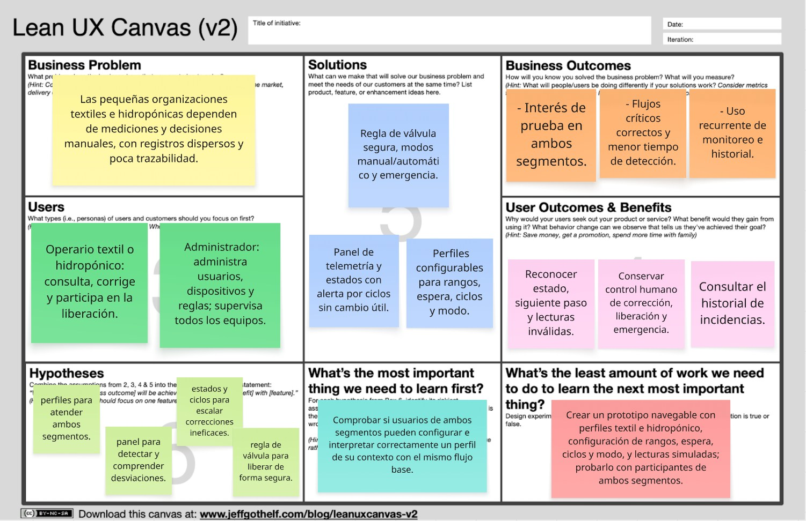

    

<h1 align="center">
    Universidad Peruana de Ciencias Aplicadas
</h1>

<h3 align="center">
    Carrera: Ingeniería de Software
       
    Curso: 1ASI0572 - Desarrollo de Soluciones IoT
       
    Sección: 8740
       
    Profesor: David Carlos Vera Olivera
       
    Ciclo: 2026-20
       
    Informe de Trabajo Final
       
    Startup: HydroLink
       
    Producto: HydroGuard
</h3>

| 
Alumno
 | 
Código
 |
|:-------------------------------------------:|:-------------------------------------------:|
|       Gomez Hurtado, Miguel Angel     |              u202220294                     |
|         Rodriguez Macedo, Sebastian       |                  u202310199                 |
|       Santur Tello, Andrea Elizabeth        |               u202310988                    |
|  Prieto Mantari, Leonardo Fabrizzio Junior  |              u202319949                     |
|         Rios Pacheco, Hector Javier         |              u20231c540                     |
|         Olivera Barzola, Eric Marlon         |            u202315032                       |

 Septiembre 2026 

## Registro de Versiones del Informe

| **Versión** | **Fecha**     | **Autor(es)**                                                                                   | **Descripción de modificación**                                                                                                                                             |
|-------------|---------------|--------------------------------------------------------------------------------------------------|-----------------------------------------------------------------------------------------------------------------------------------------------------------------------------|
| |  | | |

## Project Report Collaboration Insights

Las actividades del proyecto se planificarán, asignarán y evidenciarán progresivamente en la organización del equipo en GitHub: <https://github.com/1ASI0572-2620-8740-IOT>.

## Tabla de Contenidos

- [Student Outcome](#student-outcome)
- [Capítulo I: Introducción](#capítulo-i-introducción)
  - [1.1. Startup Profile](#11-startup-profile)
    - [1.1.1. Descripción de la startup](#111-descripción-de-la-startup)
    - [1.1.2. Perfiles de integrantes del equipo](#112-perfiles-de-integrantes-del-equipo)
  - [1.2. Solution Profile](#12-solution-profile)
    - [1.2.1. Antecedentes y problemática](#121-antecedentes-y-problemática)
    - [1.2.2. Lean UX Process](#122-lean-ux-process)
      - [1.2.2.1. Lean UX Problem Statements](#1221-lean-ux-problem-statements)
      - [1.2.2.2. Lean UX Assumptions](#1222-lean-ux-assumptions)
      - [1.2.2.3. Lean UX Hypothesis Statements](#1223-lean-ux-hypothesis-statements)
      - [1.2.2.4. Lean UX Canvas](#1224-lean-ux-canvas)
  - [1.3. Segmentos objetivo](#13-segmentos-objetivo)
    - [Segmento 1: micro y pequeñas empresas textiles](#segmento-1-micro-y-pequeñas-empresas-textiles-con-teñido-o-acabado)
    - [Segmento 2: pequeños productores y microempresas hidropónicas](#segmento-2-pequeños-productores-y-microempresas-hidropónicas)
- [Capítulo II: Requirements Elicitation & Analysis](#capítulo-ii-requirements-elicitation--analysis)
  - [2.1. Competidores](#21-competidores)
    - [2.1.1. Análisis competitivo](#211-análisis-competitivo)
    - [2.1.2. Estrategias y tácticas frente a competidores](#212-estrategias-y-tácticas-frente-a-competidores)
  - [2.2. Entrevistas](#22-entrevistas)
    - [2.2.1. Diseño de entrevistas](#221-diseño-de-entrevistas)
    - [2.2.2. Registro de entrevistas](#222-registro-de-entrevistas)
    - [2.2.3. Análisis de entrevistas](#223-análisis-de-entrevistas)
  - [2.3. Needfinding](#23-needfinding)
    - [2.3.1. User Personas](#231-user-personas)
    - [2.3.2. User Task Matrix](#232-user-task-matrix)
    - [2.3.3. User Journey Mapping](#233-user-journey-mapping)
    - [2.3.4. Empathy Mapping](#234-empathy-mapping)
  - [2.4. Big Picture EventStorming](#24-big-picture-eventstorming)
  - [2.5. Ubiquitous Language](#25-ubiquitous-language)
- [Capítulo III: Requirements Specification](#capítulo-iii-requirements-specification)
  - [3.1. User Stories](#31-user-stories)
  - [3.2. Impact Mapping](#32-impact-mapping)
  - [3.3. Product Backlog](#33-product-backlog)
- [Capítulo IV: Solution Software Design](#capítulo-iv-solution-software-design)
  - [4.1. Strategic-Level Domain-Driven Design](#41-strategic-level-domain-driven-design)
    - [4.1.1. Design-Level EventStorming](#411-design-level-eventstorming)
      - [4.1.1.1. Candidate Context Discovery](#4111-candidate-context-discovery)
      - [4.1.1.2. Domain Message Flows Modeling](#4112-domain-message-flows-modeling)
      - [4.1.1.3. Bounded Context Canvases](#4113-bounded-context-canvases)
    - [4.1.2. Context Mapping](#412-context-mapping)
    - [4.1.3. Software Architecture](#413-software-architecture)
      - [4.1.3.1. Software Architecture System Landscape Diagram](#4131-software-architecture-system-landscape-diagram)
      - [4.1.3.2. Software Architecture Context Level Diagrams](#4132-software-architecture-context-level-diagrams)
      - [4.1.3.2. Software Architecture Container Level Diagrams](#4132-software-architecture-container-level-diagrams)
      - [4.1.3.3. Software Architecture Deployment Diagrams](#4133-software-architecture-deployment-diagrams)
  - [4.2. Tactical-Level Domain-Driven Design](#42-tactical-level-domain-driven-design)
    - [4.2.X. Bounded Context: NOMBRE_DE_BOUNDED_CONTEXT_POR_DEFINIR](#42x-bounded-context-nombre_de_bounded_context_por_definir)
      - [4.2.X.1. Domain Layer](#42x1-domain-layer)
      - [4.2.X.2. Interface Layer](#42x2-interface-layer)
      - [4.2.X.3. Application Layer](#42x3-application-layer)
      - [4.2.X.4. Infrastructure Layer](#42x4-infrastructure-layer)
      - [4.2.X.5. Bounded Context Software Architecture Component Level Diagrams](#42x5-bounded-context-software-architecture-component-level-diagrams)
      - [4.2.X.6. Bounded Context Software Architecture Code Level Diagrams](#42x6-bounded-context-software-architecture-code-level-diagrams)
        - [4.2.X.6.1. Bounded Context Domain Layer Class Diagrams](#42x61-bounded-context-domain-layer-class-diagrams)
        - [4.2.X.6.2. Bounded Context Database Design Diagram](#42x62-bounded-context-database-design-diagram)
- [Bibliografía](#bibliografía)
- [Anexos](#anexos)

## Student Outcome

**ABET – EAC - Student Outcome 5.** La capacidad de funcionar efectivamente en un equipo cuyos miembros juntos proporcionan liderazgo, crean un entorno de colaboración e inclusivo, establecen objetivos, planifican tareas y cumplen objetivos.

En el siguiente cuadro se describirán las acciones realizadas y las conclusiones del grupo que sustenten el logro del ABET – EAC - Student Outcome 5. Las celdas se completarán de manera acumulativa durante las entregas del proyecto.

| Criterios específicos | Acciones realizadas | Conclusiones |
|:--|:--|:--|
| Trabaja en equipo para proporcionar liderazgo en forma conjunta. |  |  |
| Crea un entorno colaborativo e inclusivo, establece metas, planifica tareas y cumple objetivos. |  |  |

# Capítulo I: Introducción

## 1.1. Startup Profile

HydroLink es una startup peruana de tecnología orientada a que micro y pequeñas organizaciones que necesiten supervisar parámetros críticos del agua sin depender de infraestructura industrial costosa. Su primera solución combina un dispositivo IoT, servicios de software y aplicaciones web y móvil para dos contextos: el acondicionamiento de aguas residuales en procesos textiles para su posterior desfogue y la preparación de agua para riego en cultivos hidropónicos.

La propuesta comparte un núcleo funcional para ambos segmentos: identificación de dispositivos, adquisición de temperatura y pH, comparación con rangos configurables, apoyo al proceso de corrección, control de una válvula, alertas, trazabilidad y supervisión remota. El contexto seleccionado determina los rangos, el modo de liberación y las reglas operativas.

### 1.1.1. Descripción de la startup

La startup desarrollará una solución IoT accesible y modular. En el prototipo físico, un ESP32 recibirá las mediciones de temperatura y pH y controlará una válvula representada mediante un servomotor. El sistema no dosificará sustancias ni mezclará automáticamente: el operario realizará las correcciones y la mezcla de manera manual. El dispositivo evaluará nuevamente el agua después de un tiempo de espera configurable, necesario para que la intervención tenga efecto.

La solución contempla dos roles. El operario tendrá asignado un dispositivo y podrá monitorear el proceso, atender indicaciones, iniciar acciones y aplicar un cierre de emergencia en caso de errores o situaciones extraordinarias. El administrador no tendrá un dispositivo propio: administrará a los operarios, configuraciones y dispositivos del sistema y podrá revisar la información de todos ellos. Para el alcance del curso tendremos una relación de un operario por dispositivo, sin impedir que el diseño pueda ampliarse posteriormente.

**Misión.** Facilitar a las micro y pequeñas organizaciones peruanas el monitoreo oportuno y trazable de la temperatura y el pH del agua mediante una solución IoT comprensible, configurable y de costo accesible.

**Visión.** Ser una alternativa tecnológica de referencia en el Perú para el monitoreo básico del agua en pequeñas operaciones productivas que requieren tomar decisiones seguras a partir de datos.

### 1.1.2. Perfiles de integrantes del equipo

| **Nombre** | **Descripción** | **Foto** |
|:--|:--|:--:|
| Gomez Hurtado, Miguel Angel |  |  |
| Rodriguez Macedo, Sebastian |  |  |
| Santur Tello, Andrea Elizabeth |  |  |
| Prieto Mantari, Leonardo Fabrizzio Junior |  |  |
| Rios Pacheco, Hector Javier | Cuento con formación en desarrollo de software, incluyendo estructuras de datos, algoritmos y arquitecturas orientadas a servicios. Trabajo con lenguajes como Java, TypeScript, JavaScript, HTML5 y CSS3, y utilizo herramientas y frameworks como Angular, Spring Boot, Git/GitHub, Swagger y bases de datos relacionales. Soy responsable, me gusta involucrarme activamente en los proyectos, aportar ideas útiles |   |
| Olivera Barzola, Eric Marlon |  |  |

## 1.2. Solution Profile

HydroGuard será un sistema IoT de monitoreo y control asistido del agua. Se integrará el dispositivo físico o simulado, un servicio de borde, una API REST, un backend desarrollado con Spring Boot, una aplicación web en Angular y una aplicación móvil para el control por parte los operarios.

El flujo comienza con la lectura periódica de temperatura y pH. El sistema compara cada lectura con el perfil configurable del dispositivo y mantiene la válvula cerrada mientras el agua no esté lista. Si un valor está fuera del rango, comunica la acción correctiva que corresponde representar o ejecutar manualmente. Después espera un intervalo configurable y vuelve a medir. La cantidad máxima absoluta de ciclos será configurada por el operario encargado. Si se alcanza ese máximo sin una variación útil de los valores, el proceso pasa a estado de fallo, genera una alerta y conserva la válvula cerrada. Si los valores cambian en la dirección esperada, el proceso puede continuar durante los ciclos permitidos.

Cuando los parámetros están dentro de los rangos configurados, el sistema pasa al estado listo. La liberación podrá configurarse como manual o automática en ambos contextos: se prevé que sea comúnmente automática en el tratamiento textil y comúnmente manual en hidroponía. El uso del control manual no reemplaza las condiciones de seguridad ante caso de errores o fallos imprevistos, por lo que de suceder la válvula se mantiene cerrada. El cierro de emergencia estará disponible siempre.

Para la simulación se realizará una variación de los parámetros de manera manual, simulando la respuesta real de los procesos de tratamiento que serán invocados según sea el caso (acciones también representadas en la simulación con leds u otros dispositivos de visualización). De esta manera se mostrará valores de 0 a 14 de pH y temperaturas desde 0 °C a 100 °C.

### 1.2.1. Antecedentes y problemática

Las micro y pequeñas operaciones textiles e hidropónicas suelen depender de mediciones aisladas y decisiones manuales para verificar la temperatura y el pH antes de liberar el agua. Esta situación dificulta detectar desviaciones, comprobar el efecto de una corrección y conservar trazabilidad, por lo que se plantea integrar el monitoreo, las alertas y el control seguro de la válvula en una solución IoT configurable para ambos contextos.

#### Análisis mediante 5W2H

| Pregunta | Análisis preliminar |
|:--|:--|
| **Who — ¿A quién afecta?** | A operarios y administradores de micro y pequeñas empresas textiles con procesos de teñido o acabado, y a pequeños productores o emprendimientos hidropónicos que preparan y liberan agua o solución de riego. |
| **What — ¿Qué ocurre?** | La verificación manual, aislada o tardía dificulta saber si el agua está dentro del rango, cuándo intervenir y cuándo abrir la válvula. En descargas textiles al alcantarillado, los VMA incluyen pH de 6 a 9 y temperatura menor de 35 °C, además de otros parámetros que el prototipo no mide (Ministerio de Vivienda, Construcción y Saneamiento [MVCS], 2019). En hidroponía, una referencia técnica para hortalizas de hoja propone pH de 5,5 a 6,5 y advierte riesgos sanitarios por temperaturas superiores a 20 °C; estos valores no son universales y el sistema empleará rangos configurables (Ocas et al., 2025). |
| **Where — ¿Dónde ocurre?** | En tanques o recipientes de acondicionamiento ubicados en el Perú. Las descargas no domésticas al alcantarillado son controladas por la EPS correspondiente, como Sedapal dentro de su ámbito, bajo regulación de la Superintendencia Nacional de Servicios de Saneamiento (SUNASS, 2020); un vertimiento a un cuerpo natural requiere autorización de la Autoridad Nacional del Agua (ANA, s. f.). |
| **When — ¿Cuándo ocurre?** | Durante la preparación, acondicionamiento, verificación y liberación del agua, especialmente después de una corrección manual y antes de abrir la válvula. |
| **Why — ¿Por qué ocurre?** | Por el costo o ausencia de automatización adecuada para operaciones pequeñas, el uso de mediciones no integradas y la dependencia de observación y registros manuales. Esto retrasa la detección de desviaciones y dificulta comprobar si una corrección produjo un cambio útil. |
| **How — ¿Cómo se aborda actualmente?** | Con instrumentos independientes, inspección del operario, correcciones y mezcla manuales y apertura manual de válvulas; en algunos casos no existe historial centralizado ni alerta ante intentos sin efecto. |
| **How much — ¿Cuál es su magnitud?** | En 2023, el 99,1 % de las 14 259 empresas formales de fabricación de productos textiles fueron MYPE; no todas realizan procesos húmedos (Ministerio de la Producción [PRODUCE], 2024). En 2024, el Instituto Nacional de Innovación Agraria (INIA, 2024) asistió a 6 934 pequeños y medianos productores en módulos hidropónicos, dato que evidencia actividad regional pero no constituye un censo de microempresas hidropónicas. El tamaño exacto del mercado elegible deberá validarse. |

### 1.2.2. Lean UX Process

#### 1.2.2.1. Lean UX Problem Statements

El estado actual del monitoreo de temperatura y pH del agua en micro y pequeñas empresas textiles y en pequeños productores o microempresas hidropónicas del Perú, se ha centrado principalmente en instrumentos independientes, verificaciones manuales, registros dispersos y decisiones que dependen de la presencia del operario. Lo que los productos y servicios existentes no abordan suficientemente es una supervisión asequible que conecte lecturas, rangos configurables, alertas, historial y liberación segura del agua. HidroGuard atenderá esta brecha con un dispositivo IoT y aplicaciones web y móvil que supervisen el pH y temperatura, orienten la intervención manual, registren el proceso y controlen la válvula según reglas configuradas. El enfoque inicial serán las micro y pequeñas empresas textiles y las unidades hidropónicas pequeñas que realizan correcciones manuales y no cuentan con una plataforma integrada. Sabremos que la solución tiene éxito cuando los operarios consulten el estado antes de liberar el agua, atiendan las alertas, completen la corrección y verificación, y los administradores recuperen el historial necesario para revisar una incidencia.

#### 1.2.2.2. Lean UX Assumptions

#### Business Assumptions

| ID | Supuesto | Impacto |
|:--|:--|:--:|
| BA-01 | Existe en ambos segmentos un grupo de micro  y pequeñas empresas con el problema que describimos, que además no cuentan con monitoreo integrado. | Alto | 
| BA-02 | Un sistema común de medición de pH, temperatura, estados, alertas y válvula puede servir a ambos segmentos mediante perfiles configurables según sus necesidades. | Alto |
| BA-03 | Los usuarios percibirán el valor en el monitoreo y trazabilidad. | Alto | 
| BA-04 | La instalación y operación pueden mantenerse comprensibles para equipos con poca especialización IoT. | Alto | 
| BA-05 | El costo total de implementación puede ser accesible para micro o pequeñas empresas. | Alto | 
| BA-06 | El modelo de ingresos será aceptable para los compradores. | Alto |

#### Business Outcome Assumptions

| ID | Creencia sobre el resultado de negocio |
|:--|:--|
| BO-01 | Creemos que habrá interés real de prueba en los dos segmentos. | 
| BO-02 | Creemos que el núcleo compartido cubrirá los flujos prioritarios. | 
| BO-03 | Creemos que la solución reducirá el esfuerzo de supervisión y reconstrucción de incidencias. |
| BO-04 | Creemos que se logrará uso recurrente durante una prueba piloto. | 

#### User Assumptions

| ID | Supuesto sobre el usuario |
|:--|:--|
| UA-01 | El operario textil mide o consulta temperatura y pH, realiza correcciones y participa en la decisión de liberar el agua. |
| UA-02 | El responsable hidropónico prepara la solución y ajusta, verifica su estado antes de habilitar el riego. |
| UA-03 | Un mismo tipo de cuenta de operario puede representar ambos contextos si su dispositivo tiene un perfil de operación. |
| UA-04 | Cada operario puede trabajar con un dispositivo asignado sin impedir una futura relación de uno a varios. |
| UA-05 | El administrador necesita gestionar cuentas, asignaciones, configuraciones y todos los dispositivos, pero no requiere un dispositivo propio. |
| UA-06 | Los operarios y administradores podrán utilizar al menos un teléfono inteligente durante parte de su jornada. |

#### User Outcome and Benefit Assumptions

| ID | Resultado o beneficio esperado por el usuario |
|:--|:--|
| UB-01 | Conocer de forma rápida si el agua está fuera de rango, en corrección, lista o en fallo. |
| UB-02 | Recibir una orientación clara sobre el tipo de intervención manual que debe realizar. |
| UB-03 | Evitar aperturas de válvula cuando las lecturas sean inválidas o no cumplan el perfil configurado. |
| UB-04 | Configurar rangos y reglas sin reprogramar el ESP32 ni modificar el backend. |
| UB-05 | Consultar lecturas, ciclos, alertas y comandos pasados para explicar una incidencia. |
| UB-06 | Supervisar a distancia y reducir inspecciones presenciales que no aportan una decisión nueva. |
| UB-07 | Operar de manera diferenciada: liberación usualmente automática en el caso textil y usualmente manual en hidroponía, sin impedir el otro modo. |
| UB-08 | Conservar control humano mediante cierre de emergencia y confirmación de acciones sensibles. |

#### Feature Assumptions

| ID | Supuesto de funcionalidad |
|:--|:--|
| FA-01 | Autenticación y autorización basada en roles permitirán separar las capacidades de operario y administrador. |
| FA-02 | La asignación operario-dispositivo y la vista global del administrador harán comprensible la responsabilidad sobre cada equipo. | 
| FA-03 | Los perfiles configurables permitirán usar el mismo producto en ambos segmentos. | Rangos, intervalo, máximo de ciclos y modo de liberación validados. |
| FA-04 | Un panel de telemetría con estado visible facilitará detectar desviaciones sin interpretar datos crudos. |
| FA-05 | Una máquina de estados evitará decisiones ambiguas durante lectura, corrección, espera, listo y fallo. |
| FA-06 | La liberación manual o automática podrá compartir una misma regla de habilitación segura. | Apertura solo desde estado listo; cierre ante error. |
| FA-07 | El cierre de emergencia y la política lógica de válvula cerrada ante fallos reducirán liberaciones no deseadas. |
| FA-08 | Las alertas por máximo de ciclos sin cambio útil permitirán escalar una intervención que no surte efecto. | 
| FA-09 | El historial de lecturas, estados, comandos y actor responsable brindará trazabilidad suficiente para la revisión operativa. |
| FA-10 | Una aplicación móvil permitirá atender el flujo principal cuando el operario no esté frente a una computadora. |
| FA-11 | El dispositivo físico y Wokwi podrán alimentar el mismo contrato de telemetría sin alterar las aplicaciones de usuario. | 

#### 1.2.2.3. Lean UX Hypothesis Statements

#### H-01. Perfiles configurables

Creemos que lograremos **atender los dos segmentos con un núcleo común** si **administradores y operarios autorizados** alcanzan **adaptar las reglas a su contexto sin modificar software** con **perfiles configurables por dispositivo**.

#### H-02. Panel de telemetría y estado

Creemos que lograremos **reducir el tiempo de detección de desviaciones** si **los operarios** alcanzan **comprender el estado actual y el siguiente paso sin interpretar lecturas aisladas** con **un panel de pH, temperatura, vigencia, estado operativo y ciclos**.

#### H-03. Estados, ciclos y alerta

Creemos que lograremos **escalar oportunamente las correcciones ineficaces** si **los operarios** alcanzan **reconocer cuándo esperar, volver a medir o detener el proceso** con **una máquina de estados y una alerta al alcanzar el máximo absoluto de ciclos sin cambio útil**.

#### H-04. Liberación segura y emergencia

Creemos que lograremos **reducir las liberaciones no deseadas** si **los operarios de ambos segmentos** alcanzan **liberar agua solo cuando el proceso esté listo y detenerla ante una incidencia** con **liberación manual o automática condicionada por reglas, cierre ante error y control manual de emergencia**.

#### 1.2.2.4. Lean UX Canvas

  

## 1.3. Segmentos objetivo

La solución se dirige a organizaciones del Perú que, por su tamaño y grado de digitalización, podrían no disponer de sistemas industriales integrados. Para delimitar el segmento se utilizará la clasificación peruana basada en ventas anuales: hasta 150 UIT para microempresa y más de 150 hasta 1 700 UIT para pequeña empresa (Ministerio de Trabajo y Promoción del Empleo [MTPE], s. f.).

### Segmento 1: micro y pequeñas empresas textiles con teñido o acabado

Comprende micro y pequeñas empresas formales o en proceso de formalización que realizan teñido, lavado, acabado u otra operación húmeda y que necesitan vigilar agua residual antes de su descarga al alcantarillado u otra gestión autorizada. Se priorizarán propietarios, responsables de planta y operarios que actualmente dependan de mediciones manuales, instrumentos no conectados o registros dispersos.

- **Ámbito geográfico:** todo el Perú, con posibilidad de reclutamiento inicial en Lima por su concentración empresarial.
- **Características organizacionales:** equipos reducidos, presupuesto tecnológico limitado, responsabilidades operativas combinadas y ausencia de una plataforma IoT propia.
- **Necesidades:** lectura centralizada de temperatura y pH, rangos configurables, alerta ante correcciones sin efecto, trazabilidad y liberación manual o automática según configuración.
- **Contexto normativo:** el sistema puede ayudar a vigilar dos parámetros, pero no reemplaza el muestreo, análisis de laboratorio ni la evaluación de todos los VMA aplicables.
- **Criterio de exclusión inicial:** empresas medianas o grandes con automatización equivalente ya implementada y negocios textiles que no realizan procesos húmedos relevantes para el caso de uso.

### Segmento 2: pequeños productores y microempresas hidropónicas

Comprende pequeños productores, emprendimientos y microempresas que preparan agua o solución nutritiva para cultivos hidropónicos y necesitan verificar temperatura y pH antes de iniciar o habilitar el riego.

- **Ámbito geográfico:** todo el Perú, tanto en entornos urbanos como periurbanos y rurales con conectividad suficiente o posibilidad de operación local.
- **Características organizacionales:** producción de escala pequeña, uno o pocos responsables por módulo, procesos manuales o semiautomatizados y necesidad de controlar costos.
- **Necesidades:** perfiles configurables por cultivo o proceso, observación móvil y web, aviso de desviaciones, historial y liberación normalmente manual, aunque el modo automático también estará disponible.
- **Limitación conocida:** temperatura y pH no describen por sí solos la calidad completa de una solución nutritiva; la conductividad eléctrica, los nutrientes, la oxigenación y la sanidad quedan fuera del alcance.
- **Criterio de exclusión inicial:** operaciones medianas o grandes que ya cuentan con control integrado equivalente y cultivos que requieran variables que el prototipo no puede observar para tomar la decisión estudiada.

# Capítulo II: Requirements Elicitation & Analysis

## 2.1. Competidores

Se identificaron tres alternativas internacionales con componentes comparables. Bluelab es un competidor directo para el segmento hidropónico; Hach es un competidor indirecto industrial para el monitoreo de agua; y Hanna Instruments es un competidor indirecto de instrumentación portátil conectada.

### 2.1.1. Análisis competitivo

**Pregunta del análisis.** ¿Cómo puede HydroGuard ofrecer a micro y pequeñas organizaciones peruanas una alternativa comprensible y accesible que integre monitoreo, trazabilidad y liberación segura, sin competir prematuramente con la automatización industrial integral?

La información de productos, capacidades y precios fue tomada de las páginas oficiales de Bluelab, Hach y Hanna Instruments (Bluelab, s. f.; Hach, s. f.; Hanna Instruments, s. f.).

| Criterio | HydroLink | Bluelab | Hach | Hanna Instruments |
|:--|:--|:--|:--|:--|
| **Overview** | Prototipo IoT configurable para pH, temperatura, estados, alertas, historial y válvula. Atiende textil e hidroponía. | Controlador Wi-Fi para reservorios hidropónicos; monitorea y automatiza pH, conductividad y, con accesorios, temperatura. | Controlador industrial SC4500 para sensores, integración SCADA/PLC y conectividad Claros. | Instrumentación portátil HALO2 que conecta un medidor de pH y temperatura a teléfono o tableta. |
| **Ventaja competitiva / valor** | Unifica dos contextos de pequeña escala, con rangos configurables, cierre lógico ante fallo y corrección manual guiada. | Dosificación automática, gestión de nutrientes y monitoreo remoto mediante Edenic. | Integración industrial, conectividad y compatibilidad con sensores pH/ORP. | Portabilidad, medición conectada y menor barrera de entrada para una lectura puntual. |
| **Mercado objetivo** | MYPE textiles con procesos húmedos y pequeños productores o microempresas hidropónicas del Perú. | Productores hidropónicos; no se orienta a efluentes textiles. | Aplicaciones municipales e industriales; su oferta es de mayor complejidad que el alcance inicial del proyecto. | Laboratorios, procesos y usuarios que requieren medición portátil; no incorpora control de válvula. |
| **Estrategia de marketing** | Validación con pilotos, demostraciones físicas/Wokwi y comunicación de alcance real antes de comercializar. | Venta de productos conectados, aplicación Edenic, guías de uso y automatización del cultivo. | Venta consultiva técnica, documentación de aplicaciones y soporte para instrumentación. | Catálogo de instrumentos especializados, aplicación móvil y venta de medidores por caso de uso. |
| **Productos y servicios** | Dispositivo, API REST, aplicaciones web y móvil, gestión de usuarios, alertas e historial. | Pro Controller Wi-Fi, PeriPods y aplicación Edenic; incluye dosificación. | SC4500, módulos, sensores y servicios asociados; el precio se cotiza. | HALO2 y aplicación Hanna Lab; instrumento de medición, no sistema IoT de liberación. |
| **Precios y costos** | Costo del prototipo 180 soles | Pro Controller Wi-Fi: US$1,349.10 en la tienda consultada; PeriPod se vende por separado. | Precio mediante contacto/cotización; no publica precio de lista en la página consultada. | Modelos HALO2 desde US$164.99 en la tienda consultada, según electrodo. |
| **Canales de distribución** | Aplicaciones web y móvil, demostración directa y publicidad via landing page y contacto directo. | Tienda web, aplicación y material de soporte del fabricante. | Contacto con especialistas y cotización técnica del fabricante. | Tienda web, aplicación móvil y documentación del fabricante. |
| **Fortalezas** | Adaptabilidad a dos dominios, orientación MYPE y reglas de seguridad explícitas. | Automatización completa de pH/nutrientes y experiencia hidropónica especializada. | Madurez industrial, conectividad y escalabilidad técnica. | Marca de medición reconocida, simplicidad y precio visible en algunos modelos. |
| **Debilidades** | Prototipo temprano; mide solo pH y temperatura; no dosifica ni mezcla automáticamente. | Alcance centrado en hidroponía y costo elevado para pequeños usuarios. | Complejidad, cotización y orientación industrial que pueden superar las necesidades MYPE. | Lectura puntual sin trazabilidad operativa integral ni control automático de válvula. |
| **Oportunidades** | Pilotos locales y perfiles por segmento que demuestren valor antes de ampliar sensores. | Expandir canales y compatibilidad de su ecosistema conectado. | Atender instalaciones que requieren integración industrial y más parámetros. | Convertir usuarios de medición manual en usuarios de soluciones conectadas de mayor alcance. |
| **Amenazas** | Medidores económicos, soluciones caseras, proveedores industriales y sustitución por procesos manuales. | Alternativas de dosificación y monitoreo de otros fabricantes. | Competidores industriales, ciclos de compra largos y soluciones SCADA existentes. | Marcas de instrumentación portátil y sensores de bajo costo. |

### 2.1.2. Estrategias y tácticas frente a competidores

La primera versión se enfocará en el monitoreo de pH y temperatura, la trazabilidad de lecturas y el control seguro de la válvula. No intentará igualar la dosificación automática de Bluelab ni la instrumentación industrial de Hach; priorizará una experiencia sencilla y configurable para micro y pequeñas organizaciones.

La diferenciación se validará mediante pilotos con ambos segmentos, demostraciones en Wokwi y un prototipo físico. Se buscará comprobar si los usuarios valoran el ciclo de medir, corregir manualmente, esperar, verificar y liberar el agua, así como la alerta cuando no exista un cambio útil.

El precio, los canales comerciales y las alianzas con pequeñas empresas que puedan ser una manera de lograr un mercado. La comunicación comercial deberá indicar claramente que el sistema es un apoyo operativo.

## 2.2. Entrevistas

### 2.2.1. Diseño de entrevistas

#### Preguntas generales

1. ¿Cuál es tu rol y qué parte del proceso de agua realizas o supervisas habitualmente?
2. Cuéntame la última vez que preparaste, verificaste o liberaste agua o solución: ¿qué hiciste primero y qué ocurrió después?
3. ¿Cómo mides actualmente el pH y la temperatura, con qué instrumentos y con qué frecuencia?
4. Cuando una medición sale fuera de lo esperado, ¿qué haces, quién decide la siguiente acción y qué es lo más difícil del proceso?

#### Preguntas segmento textil

5. En tu proceso de teñido, lavado o acabado, ¿en qué momento se verifica el agua residual y dónde se realiza esa verificación?
6. Antes de descargar o gestionar el agua, ¿qué condiciones, registros o personas intervienen en la decisión?
7. Cuando realizan una corrección manual, ¿cómo mezclan, cuánto esperan y cómo determinan si el cambio fue útil?
8. ¿Qué información te gustaría poder revisar después de un problema y desde qué dispositivo o canal te resultaría más práctico hacerlo?

#### Preguntas segmento hidropónico

5. ¿Qué cultivo y sistema hidropónico manejas, y en qué recipiente o punto preparas la solución?
6. Antes de iniciar el riego, ¿qué valores revisas, quién los valida y qué pasa si no están en el rango que usas?
7. Cuando ajustas la solución de manera manual, ¿cómo mezclas, cuánto esperas y cómo confirmas que el ajuste funcionó?
8. ¿Cómo decides iniciar o detener el riego y qué información te sería útil consultar desde un teléfono o computadora?

### 2.2.2 Registro de entrevistas
### 2.2.3 análisis de entrevistas

## 2.3. Needfinding
### 2.3.1. User Personas
### 2.3.2. User Task Matrix
### 2.3.3. User Journey Mapping
### 2.3.4. Empathy Mapping

## 2.4. Big Picture EventStorming

En esta sección, el equipo presenta el resultado de nuestra sesión colaborativa de **Big Picture EventStorming**, una práctica fundamental del diseño guiado por el dominio (*Domain-Driven Design* - DDD). El objetivo de esta dinámica fue construir un modelo visual unificado y de alto nivel sobre el flujo operativo de nuestro Sistema IoT de Monitoreo de Calidad de Agua.

A través de este mapeo, trazamos la línea de tiempo del negocio (de izquierda a derecha), explorando las interacciones desde la configuración inicial del sistema hasta la captura de telemetría y la toma de decisiones críticas (corrección manual, bloqueos por límite de intentos y liberación segura del agua). 

Para estructurar este flujo transaccional, agrupamos las interacciones en cuatro **Bounded Contexts** (Autenticación, Configuración, Telemetría IoT y Alertas y Control) y utilizamos la siguiente convención estándar:

* 🟨 **Actores (Notas Amarillas):** Representan a los usuarios (Administrador, Operario) o subsistemas (Dispositivo IoT, Sistema Central) que ejecutan una acción.
* 🟦 **Comandos (Notas Azules):** Definen la intención o acción específica ejecutada por el actor (redactados en infinitivo).
* 🟧 **Eventos de Dominio (Notas Naranjas):** Representan hechos relevantes que ya ocurrieron en el sistema y que alteran su estado (redactados en tiempo pasado).

Esta primera aproximación nos garantiza que tanto los perfiles técnicos como los de negocio compartamos un mismo **Lenguaje Ubicuo** sobre lo que realmente importa en la solución.

## 2.5. Ubiquitous Language

El Ubiquitous Language establece un vocabulario común entre los integrantes del equipo y los stakeholders involucrados en el dominio del tratamiento y monitoreo de la calidad del agua. Su propósito es asegurar que los conceptos utilizados para describir el problema, los procesos del negocio y la solución propuesta tengan un significado único y compartido, evitando ambigüedades durante el análisis y desarrollo del proyecto.

| Término (English) | Término (Español) | Definición |
| :--- | :--- | :--- |
| **Water Quality** | Calidad del agua | Condición del agua determinada a partir de características y parámetros que permiten establecer si es adecuada para el proceso o disposición correspondiente. |
| **Wastewater** | Agua residual | Agua que ha sido utilizada durante un proceso productivo y que contiene sustancias o características que requieren evaluación antes de su descarga o reutilización. |
| **Textile Wastewater** | Agua residual textil | Agua residual generada como consecuencia de procesos industriales textiles, especialmente actividades como teñido, lavado o acabado de tejidos. |
| **Dyeing Process** | Proceso de teñido | Proceso industrial mediante el cual se modifica el color de un material textil utilizando sustancias y condiciones determinadas. |
| **Effluent** | Efluente | Flujo de agua proveniente de un proceso productivo que es conducido hacia una etapa de tratamiento, reutilización o disposición. |
| **Treatment Process** | Proceso de tratamiento | Conjunto de actividades destinadas a modificar las condiciones del agua para alcanzar los parámetros de calidad establecidos antes de su disposición o reutilización. |
| **Treatment Tank** | Tanque de tratamiento | Recipiente donde se concentra temporalmente el agua para realizar su monitoreo, tratamiento y posterior evaluación. |
| **Water Sample** | Muestra de agua | Porción de agua obtenida de un punto determinado con el propósito de evaluar sus características y parámetros de calidad. |
| **Water Quality Parameter** | Parámetro de calidad del agua | Característica medible utilizada para determinar el estado o condición del agua. |
| **pH Level** | Nivel de pH | Medida que representa el grado de acidez o alcalinidad del agua y que permite determinar si se encuentra dentro del rango establecido. |
| **Temperature** | Temperatura | Medida de la condición térmica del agua, utilizada como uno de los parámetros para evaluar su estado durante el proceso. |
| **Permitted Range** | Rango permitido | Intervalo de valores establecido para determinar si un parámetro de calidad se encuentra dentro de las condiciones aceptables. |
| **Quality Threshold** | Umbral de calidad | Valor límite utilizado como referencia para determinar si un parámetro requiere una acción de control o tratamiento. |
| **Water Measurement** | Medición del agua | Obtención de los valores correspondientes a los parámetros de calidad de una muestra de agua. |
| **Quality Assessment** | Evaluación de calidad | Proceso mediante el cual se analizan las mediciones obtenidas para determinar la condición del agua respecto a los rangos establecidos. |
| **Compliant Water** | Agua conforme | Agua cuyos parámetros evaluados se encuentran dentro de los rangos establecidos para el proceso o disposición correspondiente. |
| **Non-Compliant Water** | Agua no conforme | Agua cuyos parámetros evaluados se encuentran fuera de los rangos establecidos y que requiere una acción antes de continuar con el proceso. |
| **Corrective Treatment** | Tratamiento correctivo | Acción aplicada al agua cuando uno o más parámetros se encuentran fuera de los rangos establecidos, con el objetivo de llevarlos nuevamente a condiciones aceptables. |
| **Treatment Cycle** | Ciclo de tratamiento | Secuencia que comprende la evaluación del agua, la aplicación de una acción correctiva cuando es necesaria y una nueva evaluación para verificar sus resultados. |
| **Reassessment** | Reevaluación | Nueva evaluación realizada después de una acción de tratamiento para comprobar si el agua cumple con los parámetros establecidos. |
| **Discharge** | Descarga | Liberación controlada del agua tratada hacia el destino establecido una vez que se determina que cumple las condiciones requeridas. |
| **Discharge Authorization** | Autorización de descarga | Decisión que permite liberar el agua después de verificar que cumple con las condiciones establecidas. |
| **Water Retention** | Retención del agua | Acción de mantener el agua dentro del sistema de tratamiento cuando sus parámetros no cumplen las condiciones necesarias para su descarga. |
| **Water Flow** | Flujo de agua | Movimiento o circulación del agua entre las diferentes etapas del proceso de tratamiento o disposición. |
| **Flow Control** | Control del flujo | Gestión de la circulación del agua para permitir, restringir o detener su paso durante las diferentes etapas del proceso. |
| **Operator** | Operador | Persona responsable de supervisar el proceso, revisar las condiciones del agua y realizar las acciones correspondientes cuando se presentan situaciones que requieren intervención. |
| **Quality Supervisor** | Responsable de calidad | Persona encargada de supervisar el cumplimiento de los parámetros de calidad del agua y validar las condiciones requeridas para su tratamiento o descarga. |
| **Quality Alert** | Alerta de calidad | Aviso generado cuando un parámetro del agua presenta una condición que requiere atención o una acción correctiva. |
| **Quality Incident** | Incidente de calidad | Situación en la que el agua presenta una condición no esperada o fuera de los parámetros establecidos y requiere una acción de control. |
| **Quality Record** | Registro de calidad | Registro histórico de mediciones, evaluaciones y resultados relacionados con la calidad del agua. |
| **Treatment Result** | Resultado del tratamiento | Resultado obtenido después de aplicar un tratamiento al agua y realizar una nueva evaluación de sus parámetros. |
| **Water Release** | Liberación del agua | Acción mediante la cual el agua que cumple las condiciones establecidas continúa hacia la etapa de descarga o reutilización. |

# Bibliografía

Autoridad Nacional del Agua. (s. f.). *Solicitar la autorización de vertimiento de aguas residuales tratadas a los cuerpos naturales de agua*. Plataforma Digital Única del Estado Peruano. Recuperado el 1 de septiembre de 2026, de <https://www.gob.pe/10822-solicitar-la-autorizacion-de-vertimiento-de-aguas-residuales-tratadas-a-los-cuerpos-naturales-de-agua>

Bluelab. (s. f.). *Bluelab Pro Controller Wi-Fi*. Recuperado el 3 de septiembre de 2026, de <https://bluelab.com/products/bluelab-pro-controller-wi-fi>

Hach. (s. f.). *SC4500 Controller, Claros-enabled, LAN + mA output, 2 analog UPW pH/ORP sensors*. Recuperado el 3 de septiembre de 2026, de <https://uk.hach.com/controllers-analogue/sc4500-analog-controller/family?productCategoryId=68824439962>

Hanna Instruments. (s. f.). *HALO2 wireless pH meter*. Recuperado el 3 de septiembre de 2026, de <https://hannainst.com/halo2/>

Instituto Nacional de Innovación Agraria. (2024, 19 de agosto). *MIDAGRI: Más de 6,500 productores incrementan producción de hortalizas de calidad en módulos hidropónicos*. Plataforma Digital Única del Estado Peruano. <https://www.gob.pe/institucion/inia/noticias/1008212-midagri-mas-de-6-500-productores-incrementan-produccion-de-hortalizas-de-calidad-en-modulos-hidroponicos>

Ministerio de la Producción. (2024). *Reporte de producción manufacturera: Julio 2024*. Oficina General de Evaluación de Impacto y Estudios Económicos. <https://ogeiee.produce.gob.pe/index.php/en/shortcode/oee-documentos-publicaciones/boletines-industria-manufacturera/item/download/2242_f5124d16622da3a644ec5a2adc815339>

Ministerio de Trabajo y Promoción del Empleo. (s. f.). *Registro de la Micro y Pequeña Empresa (REMYPE)*. Plataforma Digital Única del Estado Peruano. Recuperado el 1 de septiembre de 2026, de <https://www.gob.pe/279-registro-de-la-micro-y-pequena-empresa->

Ministerio de Vivienda, Construcción y Saneamiento. (2019). *Decreto Supremo N.° 010-2019-VIVIENDA, Reglamento de Valores Máximos Admisibles para las descargas de aguas residuales no domésticas en el sistema de alcantarillado sanitario*. Diario Oficial El Peruano. <https://busquedas.elperuano.pe/dispositivo/NL/1748339-3>

Ocas Sifuentes, M., Vilcapoma Aquino, D., Meza Montalvo, A., Mestanza Velasco, S., & Borjas Ventura, R. (2025). *Cultivo hidropónico de hortalizas de hoja*. Instituto Nacional de Innovación Agraria. <http://hdl.handle.net/20.500.12955/2782>

Superintendencia Nacional de Servicios de Saneamiento. (2020). *Resolución de Consejo Directivo N.° 011-2020-SUNASS-CD: Norma complementaria al Reglamento de Valores Máximos Admisibles*. Plataforma Digital Única del Estado Peruano. <https://www.gob.pe/institucion/sunass/normas-legales/992245-011-2020-sunass-cd>
