<p align="center">
    
</p>

<h1 align="center">
    Universidad Peruana de Ciencias Aplicadas
</h1>

<h3 align="center">
    Carrera: Ingeniería de Software
    <br> <br>
    Curso: 1ASI0572 - Desarrollo de Soluciones IoT
    <br> <br>
    Sección: 8740
    <br> <br>
    Profesor: David Carlos Vera Olivera
    <br> <br>
    Ciclo: 2026-20
    <br> <br>
    Informe de Trabajo Final
    <br> <br>
    Startup: HydroLink
    <br> <br>
    Producto: HydroGuard
</h3>

<div align="center">

| <div style="width:300px">Alumno</div> | <div style="width:125px">Código</div> |
|:-------------------------------------------:|:-------------------------------------------:|
|       Gomez Hurtado, Miguel Angel     |              u202220294                     |
|         Rodriguez Macedo, Sebastian       |                  u202310199                 |
|       Santur Tello, Andrea Elizabeth        |               u202310988                    |
|  Prieto Mantari, Leonardo Fabrizzio Junior  |              u202319949                     |
|         Rios Pacheco, Hector Javier         |              u20231c540                     |
|         Olivera Barzola, Eric Marlon         |            u202315032                       |

</div>

<div align="center"> Septiembre 2026 </div>


## Registro de Versiones del Informe

| **Versión** | **Fecha** | **Autor(es)** | **Descripción de modificación** |
|:--:|:--:|:--|:--|
| AV1 | 01/09/2026 | Rios Pacheco, Hector Javier | Inicializó el informe, creó la portada y su estructura de capítulos; definió el perfil de la startup, el análisis 5W2H de la problemática, los segmentos objetivo y la bibliografía inicial. |
| AV1 | 03/09/2026 | Santur Tello, Andrea Elizabeth | Documentó el Big Picture EventStorming y completó el Ubiquitous Language con el glosario del dominio. |
| AV1 | 04/09/2026 | Rios Pacheco, Hector Javier | Actualizó la identidad de HydroLink/HydroGuard y desarrolló el análisis competitivo, las estrategias frente a competidores y el diseño de las entrevistas para los segmentos textil e hidropónico. |
| AV1 | 06/09/2026 | Rios Pacheco, Hector Javier | Incorporó su perfil de integrante, el proceso Lean UX, sus supuestos, hipótesis y resultados esperados, además del Lean UX Canvas y los recursos gráficos correspondientes. |
| AV1 | 08/09/2026 | Prieto Mantari, Leonardo Fabrizzio Junior | Elaboró los User Personas de ambos segmentos, la User Task Matrix y los User Journey Maps, incluyendo sus evidencias gráficas. |
| AV1 | 09/09/2026 | Santur Tello, Andrea Elizabeth<br>Prieto Mantari, Leonardo Fabrizzio Junior | **Santur Tello, Andrea Elizabeth:** refinó la descripción del proceso de teñido, consolidó las épicas, User Stories y Technical Stories, e incorporó la evidencia visual del EventStorming.<br>**Prieto Mantari, Leonardo Fabrizzio Junior:** elaboró los Empathy Maps de ambos segmentos e integró sus cambios con la rama de desarrollo. |
| AV1 | 10/09/2026 | Rios Pacheco, Hector Javier | Registró y analizó dos entrevistas del segmento textil, incorporando datos del entrevistado, hallazgos, puntos de dolor, necesidades, enlaces y evidencias visuales. |
| AV1 | 13/09/2026 | Santur Tello, Andrea Elizabeth | Actualizó el recurso gráfico empleado como evidencia del Big Picture EventStorming. |
| AV1 | 16/09/2026 | Santur Tello, Andrea Elizabeth | Actualizó el Big Picture EventStorming y la especificación de requisitos; documentó el Impact Mapping con su diagrama y añadió el Product Backlog inicial priorizado. |
| AV1 | 20/09/2026 | Eric Marlon Olivera Barzola | Agrego el capítulo 4: Design-Level EventStorming, Candidate Context Discovery, Domain Message Flows Modeling, Bounded Context Canvases |
| AV1 | 20/09/2026 | Rios Pacheco, Hector Javier | Consolidó y completó las secciones del Student Outcome 5 para todos los integrantes según sus contribuciones técnicas; incorporó el capítulo de Conclusiones y recomendaciones, actualizando la tabla de contenidos. |
| AV1 | 20/09/2026 | Rios Pacheco, Hector Javier | Actualizó la sección 2.2.3 de Análisis de entrevistas con sustento estadístico porcentual para los segmentos textil e hidropónico a partir de las 6 entrevistas registradas, vinculando características objetivas y subjetivas con los arquetipos de usuario. |
| TB1 | 03/10/2026 | Prieto Mantari, Leonardo Fabrizzio Junior | Definió las guías generales de estilo y sus criterios para web, móvil e IoT; documentó las convenciones de código fuente, la matriz LACX de liderazgo y colaboración, y analizó la participación del equipo durante el Sprint 1 a partir de la evidencia de los repositorios. |


## Project Report Collaboration Insights

Las actividades del proyecto se planificarán, asignarán y evidenciarán progresivamente en la organización del equipo en GitHub: <https://github.com/1ASI0572-2620-8740-IOT>.


## Tabla de Contenidos

- [Student Outcome](#student-outcome)
- [Capítulo I: Introducción](#capítulo-i-introducción)
  - [1.1. Startup Profile](#11-startup-profile)
    - [1.1.1. Descripción de la startup](#111-descripción-de-la-startup)
    - [1.1.2. Perfiles de integrantes del equipo](#112-perfiles-de-integrantes-del-equipo)
  - [1.2. Solution Profile](#12-solution-profile)
    - [1.2.1. Antecedentes y problemática](#121-antecedentes-y-problemática)
    - [1.2.2. Lean UX Process](#122-lean-ux-process)
      - [1.2.2.1. Lean UX Problem Statements](#1221-lean-ux-problem-statements)
      - [1.2.2.2. Lean UX Assumptions](#1222-lean-ux-assumptions)
      - [1.2.2.3. Lean UX Hypothesis Statements](#1223-lean-ux-hypothesis-statements)
      - [1.2.2.4. Lean UX Canvas](#1224-lean-ux-canvas)
  - [1.3. Segmentos objetivo](#13-segmentos-objetivo)
    - [Segmento 1: micro y pequeñas empresas textiles](#segmento-1-micro-y-pequeñas-empresas-textiles-con-teñido-o-acabado)
    - [Segmento 2: pequeños productores y microempresas hidropónicas](#segmento-2-pequeños-productores-y-microempresas-hidropónicas)
- [Capítulo II: Requirements Elicitation & Analysis](#capítulo-ii-requirements-elicitation--analysis)
  - [2.1. Competidores](#21-competidores)
    - [2.1.1. Análisis competitivo](#211-análisis-competitivo)
    - [2.1.2. Estrategias y tácticas frente a competidores](#212-estrategias-y-tácticas-frente-a-competidores)
  - [2.2. Entrevistas](#22-entrevistas)
    - [2.2.1. Diseño de entrevistas](#221-diseño-de-entrevistas)
    - [2.2.2. Registro de entrevistas](#222-registro-de-entrevistas)
    - [2.2.3. Análisis de entrevistas](#223-análisis-de-entrevistas)
  - [2.3. Needfinding](#23-needfinding)
    - [2.3.1. User Personas](#231-user-personas)
    - [2.3.2. User Task Matrix](#232-user-task-matrix)
    - [2.3.3. User Journey Mapping](#233-user-journey-mapping)
    - [2.3.4. Empathy Mapping](#234-empathy-mapping)
  - [2.4. Big Picture EventStorming](#24-big-picture-eventstorming)
  - [2.5. Ubiquitous Language](#25-ubiquitous-language)
- [Capítulo III: Requirements Specification](#capítulo-iii-requirements-specification)
  - [3.1. User Stories](#31-user-stories)
  - [3.2. Impact Mapping](#32-impact-mapping)
  - [3.3. Product Backlog](#33-product-backlog)
- [Capítulo IV: Solution Software Design](#capítulo-iv-solution-software-design)
  - [4.1. Strategic-Level Domain-Driven Design](#41-strategic-level-domain-driven-design)
    - [4.1.1. Design-Level EventStorming](#411-design-level-eventstorming)
      - [4.1.1.1. Candidate Context Discovery](#4111-candidate-context-discovery)
      - [4.1.1.2. Domain Message Flows Modeling](#4112-domain-message-flows-modeling)
      - [4.1.1.3. Bounded Context Canvases](#4113-bounded-context-canvases)
    - [4.1.2. Context Mapping](#412-context-mapping)
    - [4.1.3. Software Architecture](#413-software-architecture)
      - [4.1.3.1. Software Architecture System Landscape Diagram](#4131-software-architecture-system-landscape-diagram)
      - [4.1.3.2. Software Architecture Context Level Diagrams](#4132-software-architecture-context-level-diagrams)
      - [4.1.3.3. Software Architecture Container Level Diagrams](#4133-software-architecture-container-level-diagrams)
      - [4.1.3.4. Software Architecture Deployment Diagrams](#4134-software-architecture-deployment-diagrams)
  - [4.2. Tactical-Level Domain-Driven Design](#42-tactical-level-domain-driven-design)
    - [4.2.1. Bounded Context: Human Identity and Access Management](#421-bounded-context-human-identity-and-access-management)
      - [4.2.1.1. Domain Layer](#4211-domain-layer)
      - [4.2.1.2. Interface Layer](#4212-interface-layer)
      - [4.2.1.3. Application Layer](#4213-application-layer)
      - [4.2.1.4. Infrastructure Layer](#4214-infrastructure-layer)
      - [4.2.1.5. Bounded Context Software Architecture Component Level Diagrams](#4215-bounded-context-software-architecture-component-level-diagrams)
      - [4.2.1.6. Bounded Context Software Architecture Code Level Diagrams](#4216-bounded-context-software-architecture-code-level-diagrams)
        - [4.2.1.6.1. Bounded Context Domain Layer Class Diagrams](#42161-bounded-context-domain-layer-class-diagrams)
        - [4.2.1.6.2. Bounded Context Database Design Diagram](#42162-bounded-context-database-design-diagram)
    - [4.2.2. Bounded Context: Configuration](#422-bounded-context-configuration)
      - [4.2.2.1. Domain Layer](#4221-domain-layer)
      - [4.2.2.2. Interface Layer](#4222-interface-layer)
      - [4.2.2.3. Application Layer](#4223-application-layer)
      - [4.2.2.4. Infrastructure Layer](#4224-infrastructure-layer)
      - [4.2.2.5. Bounded Context Software Architecture Component Level Diagrams](#4225-bounded-context-software-architecture-component-level-diagrams)
      - [4.2.2.6. Bounded Context Software Architecture Code Level Diagrams](#4226-bounded-context-software-architecture-code-level-diagrams)
        - [4.2.2.6.1. Bounded Context Domain Layer Class Diagrams](#42261-bounded-context-domain-layer-class-diagrams)
        - [4.2.2.6.2. Bounded Context Database Design Diagram](#42262-bounded-context-database-design-diagram)
    - [4.2.3. Bounded Context: IOT Telemetry](#423-bounded-context-iot-telemetry)
      - [4.2.3.1. Domain Layer](#4231-domain-layer)
      - [4.2.3.2. Interface Layer](#4232-interface-layer)
      - [4.2.3.3. Application Layer](#4233-application-layer)
      - [4.2.3.4. Infrastructure Layer](#4234-infrastructure-layer)
      - [4.2.3.5. Bounded Context Software Architecture Component Level Diagrams](#4235-bounded-context-software-architecture-component-level-diagrams)
      - [4.2.3.6. Bounded Context Software Architecture Code Level Diagrams](#4236-bounded-context-software-architecture-code-level-diagrams)
        - [4.2.3.6.1. Bounded Context Domain Layer Class Diagrams](#42361-bounded-context-domain-layer-class-diagrams)
        - [4.2.3.6.2. Bounded Context Database Design Diagram](#42362-bounded-context-database-design-diagram)
    - [4.2.4. Bounded Context: Treatment](#424-bounded-context-treatment)
      - [4.2.4.1. Domain Layer](#4241-domain-layer)
      - [4.2.4.2. Interface Layer](#4242-interface-layer)
      - [4.2.4.3. Application Layer](#4243-application-layer)
      - [4.2.4.4. Infrastructure Layer](#4244-infrastructure-layer)
      - [4.2.4.5. Bounded Context Software Architecture Component Level Diagrams](#4245-bounded-context-software-architecture-component-level-diagrams)
      - [4.2.4.6. Bounded Context Software Architecture Code Level Diagrams](#4246-bounded-context-software-architecture-code-level-diagrams)
        - [4.2.4.6.1. Bounded Context Domain Layer Class Diagrams](#42461-bounded-context-domain-layer-class-diagrams)
        - [4.2.4.6.2. Bounded Context Database Design Diagram](#42462-bounded-context-database-design-diagram)
    - [4.2.5. Bounded Context: Monitoring](#425-bounded-context-monitoring)
      - [4.2.5.1. Domain Layer](#4251-domain-layer)
      - [4.2.5.2. Interface Layer](#4252-interface-layer)
      - [4.2.5.3. Application Layer](#4253-application-layer)
      - [4.2.5.4. Infrastructure Layer](#4254-infrastructure-layer)
      - [4.2.5.5. Bounded Context Software Architecture Component Level Diagrams](#4255-bounded-context-software-architecture-component-level-diagrams)
      - [4.2.5.6. Bounded Context Software Architecture Code Level Diagrams](#4256-bounded-context-software-architecture-code-level-diagrams)
        - [4.2.5.6.1. Bounded Context Domain Layer Class Diagrams](#42561-bounded-context-domain-layer-class-diagrams)
        - [4.2.5.6.2. Bounded Context Database Design Diagram](#42562-bounded-context-database-design-diagram)
    - [4.2.6. Bounded Context: Device Identity and Access](#426-bounded-context-device-identity-and-access)
      - [4.2.6.1. Domain Layer](#4261-domain-layer)
      - [4.2.6.2. Interface Layer](#4262-interface-layer)
      - [4.2.6.3. Application Layer](#4263-application-layer)
      - [4.2.6.4. Infrastructure Layer](#4264-infrastructure-layer)
- [Capítulo V: Solution UI/UX Design](#capítulo-v-solution-uiux-design)
  - [5.1. Style Guidelines](#51-style-guidelines)
    - [5.1.1. General Style Guidelines](#511-general-style-guidelines)
    - [5.1.2. Web, Mobile and IoT Style Guidelines](#512-web-mobile-and-iot-style-guidelines)
  - [5.2. Information Architecture](#52-information-architecture)
    - [5.2.1. Organization Systems](#521-organization-systems)
    - [5.2.2. Labeling Systems](#522-labeling-systems)
    - [5.2.3. SEO Tags and Meta Tags](#523-seo-tags-and-meta-tags)
    - [5.2.4. Searching Systems](#524-searching-systems)
    - [5.2.5. Navigation Systems](#525-navigation-systems)
  - [5.3. Landing Page UI Design](#53-landing-page-ui-design)
    - [5.3.1. Landing Page Wireframe](#531-landing-page-wireframe)
    - [5.3.2. Landing Page Mock-up](#532-landing-page-mock-up)
  - [5.4. Applications UX/UI Design](#54-applications-uxui-design)
    - [5.4.1. Applications Wireframes](#541-applications-wireframes)
    - [5.4.2. Applications Wireflow Diagrams](#542-applications-wireflow-diagrams)
    - [5.4.3. Applications Mock-ups](#543-applications-mock-ups)
    - [5.4.4. Applications User Flow Diagrams](#544-applications-user-flow-diagrams)
  - [5.5. Applications Prototyping](#55-applications-prototyping)
  - [5.6. IoT Device Design](#56-iot-device-design)
- [Capítulo VI: Product Implementation, Validation & Deployment](#capítulo-vi-product-implementation-validation--deployment)
  - [6.1. Software Configuration Management](#61-software-configuration-management)
    - [6.1.1. Software Development Environment Configuration](#611-software-development-environment-configuration)
    - [6.1.2. Source Code Management](#612-source-code-management)
    - [6.1.3. Source Code Style Guide & Conventions](#613-source-code-style-guide--conventions)
    - [6.1.4. Software Deployment Configuration](#614-software-deployment-configuration)
  - [6.2. Landing Page, Services & Applications Implementation](#62-landing-page-services--applications-implementation)
    - [6.2.1. Sprint 1](#621-sprint-1)
      - [6.2.1.1. Sprint Planning 1](#6211-sprint-planning-1)
      - [6.2.1.2. Aspect Leaders and Collaborators](#6212-aspect-leaders-and-collaborators)
      - [6.2.1.3. Sprint Backlog 1](#6213-sprint-backlog-1)
      - [6.2.1.4. Development Evidence for Sprint Review](#6214-development-evidence-for-sprint-review)
      - [6.2.1.5. Testing Suite Evidence for Sprint Review](#6215-testing-suite-evidence-for-sprint-review)
      - [6.2.1.6. Execution Evidence for Sprint Review](#6216-execution-evidence-for-sprint-review)
      - [6.2.1.7. Services Documentation Evidence for Sprint Review](#6217-services-documentation-evidence-for-sprint-review)
      - [6.2.1.8. Software Deployment Evidence for Sprint Review](#6218-software-deployment-evidence-for-sprint-review)
      - [6.2.1.9. Team Collaboration Insights during Sprint](#6219-team-collaboration-insights-during-sprint)
- [Conclusiones](#conclusiones)
  - [Conclusiones y recomendaciones](#conclusiones-y-recomendaciones)
- [Bibliografía](#bibliografía)
- [Anexos](#anexos)

## Student Outcome

**ABET – EAC - Student Outcome 5.** La capacidad de funcionar efectivamente en un equipo cuyos miembros juntos proporcionan liderazgo, crean un entorno de colaboración e inclusivo, establecen objetivos, planifican tareas y cumplen objetivos.

En el siguiente cuadro se describirán las acciones realizadas y las conclusiones del grupo que sustenten el logro del ABET – EAC - Student Outcome 5. Las celdas se completarán de manera acumulativa durante las entregas del proyecto.

| Criterios específicos | Acciones realizadas | Conclusiones |
|:--|:--|:--|
| Trabaja en equipo para proporcionar liderazgo en forma conjunta. | **Gomez Hurtado, Miguel Angel — AV1:** Asumió el liderazgo técnico de la arquitectura del backend, guiando las decisiones de diseño del sistema. Formuló y estructuró las 4 capas de arquitectura limpia (Domain, Application, Interface, Infrastructure) para todos los Bounded Contexts, asegurando el cumplimiento de las reglas de negocio y los estándares tácticos de DDD y CQRS.<br><br>**Olivera Barzola, Eric Marlon — AV1:** Ejerció liderazgo conjunto estructurando y diseñando la fase de DDD estratégico mediante Design-Level EventStorming, Candidate Context Discovery, Domain Message Flows Modeling y los Bounded Context Canvases de todos los subdominios del sistema.<br><br>**Prieto Mantari, Leonardo Fabrizzio Junior — AV1:** Asumió el liderazgo del diseño centrado en el usuario, investigando y modelando los arquetipos de User Personas para ambos segmentos, la User Task Matrix, los User Journey Maps y los Empathy Maps, además de conducir y registrar la entrevista al productor hidropónico (Entrevista 4).<br><br>**Rios Pacheco, Hector Javier — AV1:** Inició y estructuró el informe compartido (portada y esquema de capítulos). Guió las decisiones tempranas del equipo desarrollando el análisis 5W2H, los segmentos objetivo, las referencias, el análisis competitivo, el diseño de entrevistas y el Lean UX Canvas, artefactos base que permitieron alinear la propuesta de valor y los requisitos del sistema.<br><br>**Rodriguez Macedo, Sebastian — AV1:** Participó activamente en la definición de la arquitectura del sistema, proponiendo la separación de responsabilidades a partir de los Bounded Contexts identificados y su posterior representación mediante microservicios. Asimismo, elaboró los diagramas C4 de System Landscape, System Context y Container, además del Deployment Diagram.<br><br>**Santur Tello, Andrea Elizabeth — AV1:** Lideró la alineación entre el negocio y el equipo técnico mediante el desarrollo del *Big Picture EventStorming* y el *Ubiquitous Language*. Además, estructuró los requerimientos clave a través del *Impact Mapping* y las *User Stories* priorizadas. | **Gomez Hurtado, Miguel Angel — AV1:** Demostró liderazgo conjunto al unificar los criterios de arquitectura y modelado de datos del backend, facilitando directrices claras y reutilizables para todo el equipo.<br><br>**Olivera Barzola, Eric Marlon — AV1:** Ejerció liderazgo conjunto al establecer los límites contextuales y las interacciones entre subdominios, asegurando una transición coherente del análisis estratégico al diseño táctico.<br><br>**Prieto Mantari, Leonardo Fabrizzio Junior — AV1:** Demostró liderazgo conjunto al fundamentar la empatía con los usuarios, asegurando que las decisiones funcionales y arquitectónicas resolvieran problemas reales de la operación de campo.<br><br>**Rios Pacheco, Hector Javier — AV1:** Demostró liderazgo conjunto al establecer las bases documentales y analíticas del proyecto, aportando entregables habilitadores que facilitaron el trabajo de los demás integrantes y la toma de decisiones compartidas.<br><br>**Rodriguez Macedo, Sebastian — AV1:** Demostró liderazgo conjunto al orientar las decisiones arquitectónicas del proyecto y convertir los requerimientos y dominios identificados por el equipo en una estructura técnica de microservicios comprensible.<br><br>**Santur Tello, Andrea Elizabeth — AV1:** Ejerció liderazgo conjunto al establecer un lenguaje unificado y flujos visuales claros mediante EventStorming y User Stories, facilitando al equipo el diseño posterior de la arquitectura y los microservicios. |
| Crea un entorno colaborativo e inclusivo, establece metas, planifica tareas y cumple objetivos. | **Gomez Hurtado, Miguel Angel — AV1:** Planificó, diseñó y entregó la totalidad de los modelos de datos y diagramas técnicos del proyecto, incluyendo los diagramas de clases de dominio en PlantUML, los modelos relacionales de base de datos (DDL/ERD) y los diagramas de componentes C4 (Nivel 3) para todos los microservicios. Cumplió los objetivos técnicos planificados facilitando artefactos indispensables para el desarrollo técnico del equipo.<br><br>**Olivera Barzola, Eric Marlon — AV1:** Planificó y ejecutó colaborativamente el desglose de comandos, políticas, agregados y flujos de mensajes en los Bounded Context Canvases, articulando con los diseñadores de la arquitectura para cumplir las metas del cronograma.<br><br>**Prieto Mantari, Leonardo Fabrizzio Junior — AV1:** Planificó y ejecutó las tareas de Needfinding, levantando información empírica de campo, sintetizando dolores y expectativas en artefactos colaborativos y sincronizando sus contribuciones en el repositorio Git de acuerdo con los plazos previstos.<br><br>**Rios Pacheco, Hector Javier — AV1:** Planificó y ejecutó entregables progresivos: formulación de la problemática, estudio de competidores, supuestos e hipótesis de Lean UX y el levantamiento y análisis de entrevistas del sector textil (Entrevistas 1 y 2). Integró las necesidades reales de los operarios para proveer insumos fundamentales al diseño del producto.<br><br>**Rodriguez Macedo, Sebastian — AV1:** Organizó progresivamente los entregables relacionados con la arquitectura, partiendo de la definición de los Bounded Contexts y su correspondencia con los microservicios hasta la construcción de los diagramas de arquitectura y despliegue, cumpliendo los objetivos fijados.<br><br>**Santur Tello, Andrea Elizabeth — AV1:** Organizó y priorizó las tareas del proyecto elaborando el *Product Backlog* y definiendo los criterios de aceptación en formato Gherkin. Asimismo, integró y estructuró las secciones de especificación de requerimientos en el informe final, cumpliendo con los objetivos en los plazos fijados. | **Gomez Hurtado, Miguel Angel — AV1:** Fomentó un entorno colaborativo y de soporte técnico continuo proveyendo especificaciones de software rigurosas, garantizando el cumplimiento de los estándares de desarrollo propuestos.<br><br>**Olivera Barzola, Eric Marlon — AV1:** Promovió la colaboración al clarificar el mapa de responsabilidades del sistema mediante diagramas accesibles, cumpliendo con los objetivos de diseño asignados en los plazos fijados.<br><br>**Prieto Mantari, Leonardo Fabrizzio Junior — AV1:** Fomentó un ambiente inclusivo y colaborativo al sintetizar los hallazgos de las entrevistas en artefactos de Needfinding compartidos, cumpliendo sus metas de trabajo en el tiempo previsto.<br><br>**Rios Pacheco, Hector Javier — AV1:** Fomentó la colaboración e inclusión al traducir las perspectivas de los usuarios en insumos de trabajo para todo el equipo, cumpliendo oportunamente los objetivos planificados y garantizando la coherencia global del informe.<br><br>**Rodriguez Macedo, Sebastian — AV1:** Contribuyó a un entorno colaborativo mediante la integración de los aportes funcionales de los integrantes dentro de una arquitectura común, cumpliendo con los entregables asignados y permitiendo que los componentes y responsabilidades quedaran claramente organizados.<br><br>**Santur Tello, Andrea Elizabeth — AV1:** Fomentó la colaboración al entregar un backlog organizado, priorizado y trazable, cumpliendo oportunamente con sus entregables y asegurando que todo el equipo comprendiera la prioridad de cada funcionalidad. |

# Capítulo I: Introducción

## 1.1. Startup Profile

HydroLink es una startup peruana de tecnología orientada a que micro y pequeñas organizaciones que necesiten supervisar parámetros críticos del agua sin depender de infraestructura industrial costosa. Su primera solución combina un dispositivo IoT, servicios de software y aplicaciones web y móvil para dos contextos: el acondicionamiento de aguas residuales en procesos textiles para su posterior desfogue y la preparación de agua para riego en cultivos hidropónicos.

La propuesta comparte un núcleo funcional para ambos segmentos: identificación de dispositivos, adquisición de temperatura y pH, comparación con rangos configurables, dosificación correctiva controlada por ciclos, control de una válvula, alertas, trazabilidad y supervisión remota. El contexto seleccionado determina los rangos, la estrategia de corrección, la dosificación, el modo de liberación y las reglas operativas.

### 1.1.1. Descripción de la startup

La startup desarrollará una solución IoT accesible y modular cuyo alcance integral contempla la dosificación física de sustancias y las actuaciones térmicas requeridas por la estrategia correctiva. En el prototipo físico académico, un ESP32 recibirá las mediciones de temperatura y pH y controlará una válvula representada mediante un servomotor. Debido a que este prototipo no contará con dosificadores ni mecanismos térmicos reales, un LED indicará que la actuación ordenada por el sistema está en ejecución mientras una persona del equipo realiza manualmente la corrección y la mezcla. Esta sustitución demostrativa no modifica la lógica del producto: después del tiempo de espera configurado, el sistema evalúa una nueva medición y decide si debe iniciar otra dosificación o finalizar la corrección.

La solución contempla dos roles. El operario tendrá asignado un dispositivo y podrá monitorear el proceso, atender indicaciones, iniciar acciones y aplicar un cierre de emergencia en caso de errores o situaciones extraordinarias. El administrador no tendrá un dispositivo propio: administrará a los operarios, configuraciones y dispositivos del sistema y podrá revisar la información de todos ellos. Para el alcance del curso tendremos una relación de un operario por dispositivo, sin impedir que el diseño pueda ampliarse posteriormente.

**Misión.** Facilitar a las micro y pequeñas organizaciones peruanas el monitoreo oportuno y trazable de la temperatura y el pH del agua mediante una solución IoT comprensible, configurable y de costo accesible.

**Visión.** Ser una alternativa tecnológica de referencia en el Perú para el monitoreo básico del agua en pequeñas operaciones productivas que requieren tomar decisiones seguras a partir de datos.


### 1.1.2. Perfiles de integrantes del equipo

| **Nombre** | **Descripción** | **Foto** |
|:--|:--|:--:|
| Gomez Hurtado, Miguel Angel | Tengo 24 años y estoy estudiando la carrera de Ingeniería Informática. Me encuentro en mi octavo ciclo en la UPC Sede San Miguel. Soy una persona académica y siempre estoy abierto al diálogo. Me apasiona mi carrera y siempre estoy dispuesto a aprender sobre este curso para brindar a mis futuros usuarios un buen producto acorde a sus necesidades. | [](https://postimg.cc/PNBHzB43) |
| Rodriguez Macedo, Sebastian |  Tengo 20 años y soy estudiante de Ingeniería de Software. Actualmente me encuentro cursando el octavo ciclo y realizando prácticas en el área de desarrollo de software. Me interesa especialmente el desarrollo backend y la arquitectura de software. Me considero una persona responsable y con disposición para trabajar en equipo. Durante los proyectos me gusta involucrarme activamente, proponer mejoras y aportar ideas que permitan desarrollar soluciones más organizadas. |   |
| Santur Tello, Andrea Elizabeth | Estoy cursando el octavo ciclo de mi carrera Ingeniería de Software, soy una persona responsable que le gusta resolver desafíos a la par con el trabajo responsable y en equipo tengo la capacidad de líder y me gusta aprender nuevas cosas dia a dia. |  |
| Prieto Mantari, Leonardo Fabrizzio Junior | Me considero una persona trabajadora, comprometida y colaborativa, siempre dispuesta a apoyar a mi equipo y contribuir al cumplimiento de los objetivos. Cuento con conocimientos en desarrollo frontend y backend para aplicaciones web y móviles, utilizando tecnologías como HTML, CSS, JavaScript, Python, C++, Java, Spring Boot, Vue.js, Angular, Kotlin y Flutter, además de nociones de C#. Busco aplicar estas habilidades para aportar valor al proyecto y contribuir activamente a lograr un resultado final sólido y exitoso. |   |
| Rios Pacheco, Hector Javier | Cuento con formación en desarrollo de software, incluyendo estructuras de datos, algoritmos y arquitecturas orientadas a servicios. Trabajo con lenguajes como Java, TypeScript, JavaScript, HTML5 y CSS3, y utilizo herramientas y frameworks como Angular, Spring Boot, Git/GitHub, Swagger y bases de datos relacionales. Soy responsable, me gusta involucrarme activamente en los proyectos, aportar ideas útiles |   |
| Olivera Barzola, Eric Marlon | Estudiante de Ingeniería de Software del octavo ciclo, con un interés particular en la ciberseguridad. A lo largo de mi formación he adquirido experiencia en diferentes lenguajes de programación como C#, C++ y Java|   |

## 1.2. Solution Profile

HydroGuard será un sistema IoT de monitoreo, dosificación correctiva y control del agua. Se integrará el dispositivo físico o simulado, un servicio de borde, una API REST, un backend desarrollado con Spring Boot, una aplicación web en Angular y una aplicación móvil para el control por parte de los operarios.

El flujo comienza con la lectura periódica de temperatura y pH. El sistema compara cada lectura con el perfil configurable del dispositivo y mantiene la válvula cerrada mientras el agua no esté lista. Si un valor está fuera del rango, selecciona la estrategia correctiva y ordena la dosificación o actuación correspondiente. La actuación no se mantiene activa de forma constante: se ejecuta durante el paso de corrección del ciclo, se detiene, espera el intervalo configurado y luego se obtiene una nueva medición. Con ese resultado, el sistema decide automáticamente si debe continuar con otro ciclo de dosificación o detener la corrección. La cantidad máxima absoluta de ciclos será configurada por el operario encargado. Si se alcanza ese máximo sin una variación útil de los valores, el proceso pasa a estado de fallo, genera una alerta y conserva la válvula cerrada.

Cuando los parámetros están dentro de los rangos configurados, el sistema pasa al estado listo. La liberación podrá configurarse como manual o automática en ambos contextos: se prevé que sea comúnmente automática en el tratamiento textil y comúnmente manual en hidroponía. El uso del control manual no reemplaza las condiciones de seguridad ante caso de errores o fallos imprevistos, por lo que de suceder la válvula se mantiene cerrada. El cierro de emergencia estará disponible siempre.

En la simulación, el sistema activará el LED o actuador visual correspondiente durante la etapa de dosificación. Después, una persona modificará manualmente el sensor simulado para representar el efecto físico que habría producido la corrección sobre el agua. La siguiente lectura permitirá que el sistema decida si continúa con otro ciclo o si detiene la dosificación. De esta manera se podrán representar valores de pH de 0 a 14 y temperaturas de 0 °C a 100 °C sin alterar la lógica de control del producto integral.

### 1.2.1. Antecedentes y problemática

Las micro y pequeñas operaciones textiles e hidropónicas suelen depender de mediciones aisladas y decisiones manuales para verificar la temperatura y el pH antes de liberar el agua. Esta situación dificulta detectar desviaciones, comprobar el efecto de una corrección y conservar trazabilidad, por lo que se plantea integrar el monitoreo, las alertas y el control seguro de la válvula en una solución IoT configurable para ambos contextos.

#### Análisis mediante 5W2H

| Pregunta | Análisis preliminar |
|:--|:--|
| **Who — ¿A quién afecta?** | A operarios y administradores de micro y pequeñas empresas textiles con procesos de teñido o acabado, y a pequeños productores o emprendimientos hidropónicos que preparan y liberan agua o solución de riego. |
| **What — ¿Qué ocurre?** | La verificación manual, aislada o tardía dificulta saber si el agua está dentro del rango, cuándo intervenir y cuándo abrir la válvula. En descargas textiles al alcantarillado, los VMA incluyen pH de 6 a 9 y temperatura menor de 35 °C, además de otros parámetros que el prototipo no mide (Ministerio de Vivienda, Construcción y Saneamiento [MVCS], 2019). En hidroponía, una referencia técnica para hortalizas de hoja propone pH de 5,5 a 6,5 y advierte riesgos sanitarios por temperaturas superiores a 20 °C; estos valores no son universales y el sistema empleará rangos configurables (Ocas et al., 2025). |
| **Where — ¿Dónde ocurre?** | En tanques o recipientes de acondicionamiento ubicados en el Perú. Las descargas no domésticas al alcantarillado son controladas por la EPS correspondiente, como Sedapal dentro de su ámbito, bajo regulación de la Superintendencia Nacional de Servicios de Saneamiento (SUNASS, 2020); un vertimiento a un cuerpo natural requiere autorización de la Autoridad Nacional del Agua (ANA, s. f.). |
| **When — ¿Cuándo ocurre?** | Durante la preparación, acondicionamiento, verificación y liberación del agua, especialmente después de una corrección manual y antes de abrir la válvula. |
| **Why — ¿Por qué ocurre?** | Por el costo o ausencia de automatización adecuada para operaciones pequeñas, el uso de mediciones no integradas y la dependencia de observación y registros manuales. Esto retrasa la detección de desviaciones y dificulta comprobar si una corrección produjo un cambio útil. |
| **How — ¿Cómo se aborda actualmente?** | Con instrumentos independientes, inspección del operario, correcciones y mezcla manuales y apertura manual de válvulas; en algunos casos no existe historial centralizado ni alerta ante intentos sin efecto. |
| **How much — ¿Cuál es su magnitud?** | En 2023, el 99,1 % de las 14 259 empresas formales de fabricación de productos textiles fueron MYPE; no todas realizan procesos húmedos (Ministerio de la Producción [PRODUCE], 2024). En 2024, el Instituto Nacional de Innovación Agraria (INIA, 2024) asistió a 6 934 pequeños y medianos productores en módulos hidropónicos, dato que evidencia actividad regional pero no constituye un censo de microempresas hidropónicas. El tamaño exacto del mercado elegible deberá validarse. |


### 1.2.2. Lean UX Process

#### 1.2.2.1. Lean UX Problem Statements

El estado actual del monitoreo de temperatura y pH del agua en micro y pequeñas empresas textiles y en pequeños productores o microempresas hidropónicas del Perú se ha centrado principalmente en instrumentos independientes, verificaciones manuales, registros dispersos y decisiones que dependen de la presencia del operario. Lo que los productos y servicios existentes no abordan suficientemente es una solución asequible que conecte lecturas, rangos configurables, dosificación correctiva por ciclos, alertas, historial y liberación segura del agua. HydroGuard atenderá esta brecha con un dispositivo IoT y aplicaciones web y móvil que supervisen el pH y la temperatura, seleccionen y ordenen la actuación correctiva, decidan después de cada reevaluación si el tratamiento continúa o se detiene, registren el proceso y controlen la válvula según reglas configuradas. El enfoque inicial serán las micro y pequeñas empresas textiles y las unidades hidropónicas pequeñas que actualmente realizan correcciones manuales y no cuentan con una plataforma integrada. Sabremos que la solución tiene éxito cuando los operarios supervisen el estado antes de liberar el agua, atiendan las alertas, completen el ciclo de corrección y verificación, y los administradores recuperen el historial necesario para revisar una incidencia.

#### 1.2.2.2. Lean UX Assumptions


#### Business Assumptions

| ID | Supuesto | Impacto |
|:--|:--|:--:|
| BA-01 | Existe en ambos segmentos un grupo de micro  y pequeñas empresas con el problema que describimos, que además no cuentan con monitoreo integrado. | Alto | 
| BA-02 | Un sistema común de medición de pH, temperatura, estados, alertas y válvula puede servir a ambos segmentos mediante perfiles configurables según sus necesidades. | Alto |
| BA-03 | Los usuarios percibirán el valor en el monitoreo y trazabilidad. | Alto | 
| BA-04 | La instalación y operación pueden mantenerse comprensibles para equipos con poca especialización IoT. | Alto | 
| BA-05 | El costo total de implementación puede ser accesible para micro o pequeñas empresas. | Alto | 
| BA-06 | El modelo de ingresos será aceptable para los compradores. | Alto |


#### Business Outcome Assumptions

| ID | Creencia sobre el resultado de negocio |
|:--|:--|
| BO-01 | Creemos que habrá interés real de prueba en los dos segmentos. | 
| BO-02 | Creemos que el núcleo compartido cubrirá los flujos prioritarios. | 
| BO-03 | Creemos que la solución reducirá el esfuerzo de supervisión y reconstrucción de incidencias. |
| BO-04 | Creemos que se logrará uso recurrente durante una prueba piloto. | 


#### User Assumptions

| ID | Supuesto sobre el usuario |
|:--|:--|
| UA-01 | El operario textil mide o consulta temperatura y pH, realiza correcciones y participa en la decisión de liberar el agua. |
| UA-02 | El responsable hidropónico prepara la solución y ajusta, verifica su estado antes de habilitar el riego. |
| UA-03 | Un mismo tipo de cuenta de operario puede representar ambos contextos si su dispositivo tiene un perfil de operación. |
| UA-04 | Cada operario puede trabajar con un dispositivo asignado sin impedir una futura relación de uno a varios. |
| UA-05 | El administrador necesita gestionar cuentas, asignaciones, configuraciones y todos los dispositivos, pero no requiere un dispositivo propio. |
| UA-06 | Los operarios y administradores podrán utilizar al menos un teléfono inteligente durante parte de su jornada. |


#### User Outcome and Benefit Assumptions

| ID | Resultado o beneficio esperado por el usuario |
|:--|:--|
| UB-01 | Conocer de forma rápida si el agua está fuera de rango, en corrección, lista o en fallo. |
| UB-02 | Conocer la actuación correctiva ordenada, su estado de ejecución y el resultado de la reevaluación. |
| UB-03 | Evitar aperturas de válvula cuando las lecturas sean inválidas o no cumplan el perfil configurado. |
| UB-04 | Configurar rangos y reglas sin reprogramar el ESP32 ni modificar el backend. |
| UB-05 | Consultar lecturas, ciclos, alertas y comandos pasados para explicar una incidencia. |
| UB-06 | Supervisar a distancia y reducir inspecciones presenciales que no aportan una decisión nueva. |
| UB-07 | Operar de manera diferenciada: liberación usualmente automática en el caso textil y usualmente manual en hidroponía, sin impedir el otro modo. |
| UB-08 | Conservar control humano mediante cierre de emergencia y confirmación de acciones sensibles. |

#### Feature Assumptions

| ID | Supuesto de funcionalidad |
|:--|:--|
| FA-01 | Autenticación y autorización basada en roles permitirán separar las capacidades de operario y administrador. |
| FA-02 | La asignación operario-dispositivo y la vista global del administrador harán comprensible la responsabilidad sobre cada equipo. | 
| FA-03 | Los perfiles configurables permitirán usar el mismo producto en ambos segmentos. | Rangos, intervalo, máximo de ciclos y modo de liberación validados. |
| FA-04 | Un panel de telemetría con estado visible facilitará detectar desviaciones sin interpretar datos crudos. |
| FA-05 | Una máquina de estados evitará decisiones ambiguas durante lectura, corrección, espera, listo y fallo. |
| FA-06 | La liberación manual o automática podrá compartir una misma regla de habilitación segura. | Apertura solo desde estado listo; cierre ante error. |
| FA-07 | El cierre de emergencia y la política lógica de válvula cerrada ante fallos reducirán liberaciones no deseadas. |
| FA-08 | Las alertas por máximo de ciclos sin cambio útil permitirán escalar una intervención que no surte efecto. | 
| FA-09 | El historial de lecturas, estados, comandos y actor responsable brindará trazabilidad suficiente para la revisión operativa. |
| FA-10 | Una aplicación móvil permitirá atender el flujo principal cuando el operario no esté frente a una computadora. |
| FA-11 | El dispositivo físico y Wokwi podrán alimentar el mismo contrato de telemetría sin alterar las aplicaciones de usuario. | 

#### 1.2.2.3. Lean UX Hypothesis Statements

#### H-01. Perfiles configurables

Creemos que lograremos **atender los dos segmentos con un núcleo común** si **administradores y operarios autorizados** alcanzan **adaptar las reglas a su contexto sin modificar software** con **perfiles configurables por dispositivo**.

#### H-02. Panel de telemetría y estado

Creemos que lograremos **reducir el tiempo de detección de desviaciones** si **los operarios** alcanzan **comprender el estado actual y el siguiente paso sin interpretar lecturas aisladas** con **un panel de pH, temperatura, vigencia, estado operativo y ciclos**.

#### H-03. Estados, ciclos y alerta

Creemos que lograremos **escalar oportunamente las correcciones ineficaces** si **los operarios** alcanzan **reconocer cuándo esperar, volver a medir o detener el proceso** con **una máquina de estados y una alerta al alcanzar el máximo absoluto de ciclos sin cambio útil**.

#### H-04. Liberación segura y emergencia

Creemos que lograremos **reducir las liberaciones no deseadas** si **los operarios de ambos segmentos** alcanzan **liberar agua solo cuando el proceso esté listo y detenerla ante una incidencia** con **liberación manual o automática condicionada por reglas, cierre ante error y control manual de emergencia**.

#### 1.2.2.4. Lean UX Canvas

<p align="center">
  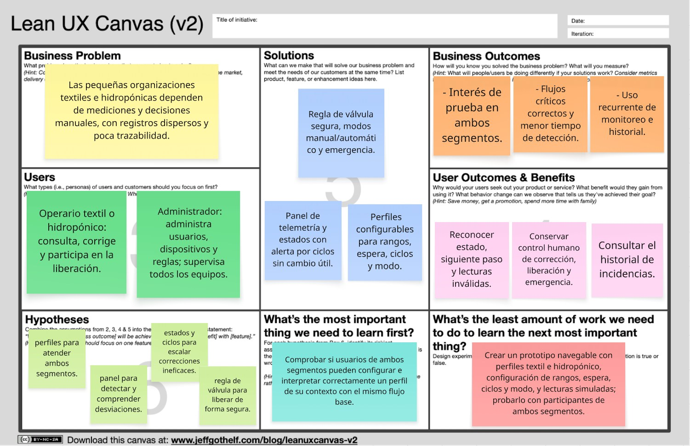
</p>

## 1.3. Segmentos objetivo

La solución se dirige a organizaciones del Perú que, por su tamaño y grado de digitalización, podrían no disponer de sistemas industriales integrados. Para delimitar el segmento se utilizará la clasificación peruana basada en ventas anuales: hasta 150 UIT para microempresa y más de 150 hasta 1 700 UIT para pequeña empresa (Ministerio de Trabajo y Promoción del Empleo [MTPE], s. f.).

### Segmento 1: micro y pequeñas empresas textiles con teñido o acabado

Comprende micro y pequeñas empresas formales o en proceso de formalización que realizan teñido, lavado, acabado u otra operación húmeda y que necesitan vigilar agua residual antes de su descarga al alcantarillado u otra gestión autorizada. Se priorizarán propietarios, responsables de planta y operarios que actualmente dependan de mediciones manuales, instrumentos no conectados o registros dispersos.

- **Ámbito geográfico:** todo el Perú, con posibilidad de reclutamiento inicial en Lima por su concentración empresarial.
- **Características organizacionales:** equipos reducidos, presupuesto tecnológico limitado, responsabilidades operativas combinadas y ausencia de una plataforma IoT propia.
- **Necesidades:** lectura centralizada de temperatura y pH, rangos configurables, alerta ante correcciones sin efecto, trazabilidad y liberación manual o automática según configuración.
- **Contexto normativo:** el sistema puede ayudar a vigilar dos parámetros, pero no reemplaza el muestreo, análisis de laboratorio ni la evaluación de todos los VMA aplicables.
- **Criterio de exclusión inicial:** empresas medianas o grandes con automatización equivalente ya implementada y negocios textiles que no realizan procesos húmedos relevantes para el caso de uso.

### Segmento 2: pequeños productores y microempresas hidropónicas

Comprende pequeños productores, emprendimientos y microempresas que preparan agua o solución nutritiva para cultivos hidropónicos y necesitan verificar temperatura y pH antes de iniciar o habilitar el riego.

- **Ámbito geográfico:** todo el Perú, tanto en entornos urbanos como periurbanos y rurales con conectividad suficiente o posibilidad de operación local.
- **Características organizacionales:** producción de escala pequeña, uno o pocos responsables por módulo, procesos manuales o semiautomatizados y necesidad de controlar costos.
- **Necesidades:** perfiles configurables por cultivo o proceso, observación móvil y web, aviso de desviaciones, historial y liberación normalmente manual, aunque el modo automático también estará disponible.
- **Limitación conocida:** temperatura y pH no describen por sí solos la calidad completa de una solución nutritiva; la conductividad eléctrica, los nutrientes, la oxigenación y la sanidad quedan fuera del alcance.
- **Criterio de exclusión inicial:** operaciones medianas o grandes que ya cuentan con control integrado equivalente y cultivos que requieran variables que el prototipo no puede observar para tomar la decisión estudiada.


# Capítulo II: Requirements Elicitation & Analysis

## 2.1. Competidores

Se identificaron tres alternativas internacionales con componentes comparables. Bluelab es un competidor directo para el segmento hidropónico; Hach es un competidor indirecto industrial para el monitoreo de agua; y Hanna Instruments es un competidor indirecto de instrumentación portátil conectada.


### 2.1.1. Análisis competitivo

**Pregunta del análisis.** ¿Cómo puede HydroGuard ofrecer a micro y pequeñas organizaciones peruanas una alternativa comprensible y accesible que integre monitoreo, trazabilidad y liberación segura, sin competir prematuramente con la automatización industrial integral?

La información de productos, capacidades y precios fue tomada de las páginas oficiales de Bluelab, Hach y Hanna Instruments (Bluelab, s. f.; Hach, s. f.; Hanna Instruments, s. f.).

| Criterio | HydroLink | Bluelab | Hach | Hanna Instruments |
|:--|:--|:--|:--|:--|
| **Overview** | Prototipo IoT configurable para pH, temperatura, estados, alertas, historial y válvula. Atiende textil e hidroponía. | Controlador Wi-Fi para reservorios hidropónicos; monitorea y automatiza pH, conductividad y, con accesorios, temperatura. | Controlador industrial SC4500 para sensores, integración SCADA/PLC y conectividad Claros. | Instrumentación portátil HALO2 que conecta un medidor de pH y temperatura a teléfono o tableta. |
| **Ventaja competitiva / valor** | Unifica dos contextos de pequeña escala mediante perfiles configurables y un ciclo automático que mide, decide la dosificación, espera, reevalúa y libera o retiene el agua de forma segura. | Dosificación automática, gestión de nutrientes y monitoreo remoto mediante Edenic. | Integración industrial, conectividad y compatibilidad con sensores pH/ORP. | Portabilidad, medición conectada y menor barrera de entrada para una lectura puntual. |
| **Mercado objetivo** | MYPE textiles con procesos húmedos y pequeños productores o microempresas hidropónicas del Perú. | Productores hidropónicos; no se orienta a efluentes textiles. | Aplicaciones municipales e industriales; su oferta es de mayor complejidad que el alcance inicial del proyecto. | Laboratorios, procesos y usuarios que requieren medición portátil; no incorpora control de válvula. |
| **Estrategia de marketing** | Validación con pilotos, demostraciones físicas/Wokwi y comunicación de alcance real antes de comercializar. | Venta de productos conectados, aplicación Edenic, guías de uso y automatización del cultivo. | Venta consultiva técnica, documentación de aplicaciones y soporte para instrumentación. | Catálogo de instrumentos especializados, aplicación móvil y venta de medidores por caso de uso. |
| **Productos y servicios** | Dispositivo con medición, dosificación correctiva y control de válvula; API REST; aplicaciones web y móvil; gestión de usuarios; alertas e historial. En el prototipo académico, la dosificación física se representa mediante LED y una intervención manual. | Pro Controller Wi-Fi, PeriPods y aplicación Edenic; incluye dosificación. | SC4500, módulos, sensores y servicios asociados; el precio se cotiza. | HALO2 y aplicación Hanna Lab; instrumento de medición, no sistema IoT de liberación. |
| **Precios y costos** | Costo del prototipo 180 soles | Pro Controller Wi-Fi: US$1,349.10 en la tienda consultada; PeriPod se vende por separado. | Precio mediante contacto/cotización; no publica precio de lista en la página consultada. | Modelos HALO2 desde US$164.99 en la tienda consultada, según electrodo. |
| **Canales de distribución** | Aplicaciones web y móvil, demostración directa y publicidad via landing page y contacto directo. | Tienda web, aplicación y material de soporte del fabricante. | Contacto con especialistas y cotización técnica del fabricante. | Tienda web, aplicación móvil y documentación del fabricante. |
| **Fortalezas** | Adaptabilidad a dos dominios, orientación MYPE y reglas de seguridad explícitas. | Automatización completa de pH/nutrientes y experiencia hidropónica especializada. | Madurez industrial, conectividad y escalabilidad técnica. | Marca de medición reconocida, simplicidad y precio visible en algunos modelos. |
| **Debilidades** | El prototipo académico mide únicamente pH y temperatura y sustituye los dosificadores y mecanismos térmicos reales por una representación mediante LED y una intervención manual del equipo. | Alcance centrado en hidroponía y costo elevado para pequeños usuarios. | Complejidad, cotización y orientación industrial que pueden superar las necesidades MYPE. | Lectura puntual sin trazabilidad operativa integral ni control automático de válvula. |
| **Oportunidades** | Pilotos locales y perfiles por segmento que demuestren valor antes de ampliar sensores. | Expandir canales y compatibilidad de su ecosistema conectado. | Atender instalaciones que requieren integración industrial y más parámetros. | Convertir usuarios de medición manual en usuarios de soluciones conectadas de mayor alcance. |
| **Amenazas** | Medidores económicos, soluciones caseras, proveedores industriales y sustitución por procesos manuales. | Alternativas de dosificación y monitoreo de otros fabricantes. | Competidores industriales, ciclos de compra largos y soluciones SCADA existentes. | Marcas de instrumentación portátil y sensores de bajo costo. |


### 2.1.2. Estrategias y tácticas frente a competidores

La primera versión del producto se enfocará en el monitoreo de pH y temperatura, la dosificación correctiva por ciclos, la trazabilidad de lecturas y el control seguro de la válvula. No intentará igualar la amplitud de parámetros ni la instrumentación industrial de las alternativas analizadas; priorizará una experiencia sencilla y configurable para micro y pequeñas organizaciones. Para la demostración académica, la orden de dosificación se representará mediante LED y su efecto será reproducido mediante intervención manual.

La diferenciación se validará mediante pilotos con ambos segmentos, demostraciones en Wokwi y un prototipo físico. Se buscará comprobar si los usuarios valoran el ciclo de medir, decidir y ejecutar una dosificación, esperar, reevaluar y liberar o retener el agua, así como la alerta cuando no exista un cambio útil. La intervención manual del prototipo físico será únicamente el reemplazo académico de los actuadores correctivos que sí forman parte del producto integral.

El precio, los canales comerciales y las alianzas con pequeñas empresas que puedan ser una manera de lograr un mercado. La comunicación comercial deberá indicar claramente que el sistema es un apoyo operativo.

## 2.2. Entrevistas

### 2.2.1. Diseño de entrevistas

#### Preguntas generales

1. ¿Cuál es tu rol y qué parte del proceso de agua realizas o supervisas habitualmente?
2. Cuéntame la última vez que preparaste, verificaste o liberaste agua o solución: ¿qué hiciste primero y qué ocurrió después?
3. ¿Cómo mides actualmente el pH y la temperatura, con qué instrumentos y con qué frecuencia?
4. Cuando una medición sale fuera de lo esperado, ¿qué haces, quién decide la siguiente acción y qué es lo más difícil del proceso?

#### Preguntas segmento textil

5. En tu proceso de teñido, lavado o acabado, ¿en qué momento se verifica el agua residual y dónde se realiza esa verificación?
6. Antes de descargar o gestionar el agua, ¿qué condiciones, registros o personas intervienen en la decisión?
7. Cuando realizan una corrección manual, ¿cómo mezclan, cuánto esperan y cómo determinan si el cambio fue útil?
8. ¿Qué información te gustaría poder revisar después de un problema y desde qué dispositivo o canal te resultaría más práctico hacerlo?

#### Preguntas segmento hidropónico

5. ¿Qué cultivo y sistema hidropónico manejas, y en qué recipiente o punto preparas la solución?
6. Antes de iniciar el riego, ¿qué valores revisas, quién los valida y qué pasa si no están en el rango que usas?
7. Cuando ajustas la solución de manera manual, ¿cómo mezclas, cuánto esperas y cómo confirmas que el ajuste funcionó?
8. ¿Cómo decides iniciar o detener el riego y qué información te sería útil consultar desde un teléfono o computadora?

### 2.2.2. Registro de entrevistas

En esta sección se documentan las entrevistas a profundidad realizadas a representantes de los segmentos objetivo de HydroGuard. El objetivo de estas entrevistas es recolectar información cualitativa de primera mano acerca de sus flujos de trabajo, prácticas operativas, herramientas de medición, puntos de dolor, toma de decisiones y requerimientos tecnológicos en relación con la vigilancia y acondicionamiento de la calidad del agua. Las evidencias audiovisuales fueron grabadas y cargadas en la plataforma de streaming institucional, permitiendo su revisión y análisis detallado.

---

#### Segmento 1: Micro y pequeñas empresas textiles con teñido o acabado

El primer segmento de investigación comprende a dueños, supervisores de planta y operarios de micro y pequeñas empresas dedicadas a procesos textiles húmedos (teñido, lavado y acabado), responsables de verificar y liberar el agua residual hacia la red de alcantarillado público o reservorios de reúso.

##### Entrevista 1 - Sector Textil

| Entrevistado 1 | Oscar |
| :--- | :--- |
| **Edad** | 28 años |
| **Distrito/Ciudad** | Lima |
|  | **Resumen:**<br>Oscar se desempeña como dueño y supervisor de planta de un taller textil en Lima. Es el responsable exclusivo de monitorear y validar la calidad del agua residual generada en los procesos de teñido y acabado antes de autorizar su descarga al desagüe o su trasvase a cisternas de reúso. Actualmente, realiza mediciones manuales y puntuales de pH y temperatura utilizando un pHímetro digital portátil y un termómetro independiente, sin contar con monitoreo continuo. Cuando detecta valores fuera de rango, aplica reactivos manualmente en la poza (cal para neutralizar acidez o ácido según corresponda), agitando con pala o mediante una bomba auxiliar, para luego esperar entre 15 y 30 minutos antes de repetir el muestreo manual.<br><br>**Características objetivas y subjetivas:**<br>• *Personalidad y actitud:* Práctico, resolutivo y multifuncional. Al concentrar responsabilidades directivas y operativas, experimenta una alta sobrecarga de trabajo y manifiesta preocupación por el tiempo perdido en esperas inciertas.<br>• *Tecnología y dispositivos de preferencia:* Utiliza intensivamente su smartphone como dispositivo primordial de consulta debido a que se desplaza constantemente por los ambientes productivos de la planta sin acceso permanente a una computadora de escritorio o navegador fijo. Opera con instrumentos de medición portátiles digitales básicos.<br>• *Puntos de dolor y frustraciones:* Incertidumbre operativa al no saber con certeza si la dosificación química fue suficiente hasta regresar a medir manualmente; riesgo de demoras en la descarga por atender otras urgencias de planta; y ausencia de un sistema formal de registro, dependiendo de anotaciones eventuales en cuadernos o de la memoria.<br>• *Canales y necesidades identificadas:* Demanda imperativa de un canal móvil para monitorear en tiempo real la evolución de los parámetros, recibir alertas oportunas sobre la efectividad de la corrección química y consultar un historial digital por lote que certifique el cumplimiento adecuado del vertimiento. |

| Timing: 00:04 – 04:38 min (Duración: 04:34 min) | https://upcedupe-my.sharepoint.com/:v:/g/personal/u20231c540_upc_edu_pe/IQDGTYxD461cQ7sXqE9Rvq9zAdVXu2HARbohkL3_5sns7pM?e=Bo8Dj5&nav=eyJyZWZlcnJhbEluZm8iOnsicmVmZXJyYWxBcHAiOiJTdHJlYW1XZWJBcHAiLCJyZWZlcnJhbFZpZXciOiJTaGFyZURpYWxvZy1MaW5rIiwicmVmZXJyYWxBcHBQbGF0Zm9ybSI6IldlYiIsInJlZmVycmFsTW9kZSI6InZpZXcifX0%3D |

##### Entrevista 2 - Sector Textil

| Entrevistado 2 | David Ramírez |
| :--- | :--- |
| **Edad** | 23 años |
| **Distrito/Ciudad** | Lima |
|  | **Resumen:**<br>David se desempeña como encargado del control de agua residual en una planta textil familiar en Lima dedicada al teñido de hilos. Su responsabilidad se concentra en verificar la temperatura y el pH del efluente tras la descarga de la caldera hacia una fosa al aire libre (aproximadamente 3 a 4 veces al día). Registra manualmente la fecha y los parámetros en un cuaderno y, en caso de hallar un pH elevado (el problema más habitual), estabiliza el agua agregando ácido de forma manual y mezclando con una herramienta antes de comprobar nuevamente los valores. Una vez confirmada la estabilización, acciona la válvula de salida hacia el alcantarillado bajo un procedimiento estandarizado y autónomo sin necesidad de autorización previa en cada ciclo.<br><br>**Características objetivas y subjetivas:**<br>• *Personalidad y actitud:* Metódico, organizado y autónomo. Asume con seriedad la rutina operativa y la responsabilidad sobre el vertimiento, recibiendo una supervisión periódica por parte de su jefe basada en la revisión del cuaderno físico.<br>• *Tecnología y dispositivos de preferencia:* Usuario habitual de smartphone. Destaca que una solución accesible desde el teléfono celular resultaría óptima para revisar mediciones e historial operativo sin tener que interrumpir otras tareas para ir presencialmente a la fosa.<br>• *Puntos de dolor y frustraciones:* Registro puramente manual en cuaderno físico, expuesto a deterioro o pérdida de trazabilidad; y la necesidad de desplazarse repetidamente hasta la fosa junto a la válvula para medir y revisar, restando tiempo a sus demás actividades en la planta.<br>• *Canales y necesidades identificadas:* Consulta remota y periódica de parámetros mediante dispositivo móvil, historial de datos para verificar la efectividad de las dosificaciones de ácido y facilidad para supervisar la condición del agua sin permanecer fijado al punto de descarga. |

| Timing: 00:02 – 03:16 min (Duración: 03:14 min) | https://upcedupe-my.sharepoint.com/:v:/g/personal/u20231c540_upc_edu_pe/IQA4RAbLEK9TRJvZK0Ggjao4ARF8RjrLsGc5vLhZnt3-brA?e=ITGKYd&nav=eyJyZWZlcnJhbEluZm8iOnsicmVmZXJyYWxBcHAiOiJTdHJlYW1XZWJBcHAiLCJyZWZlcnJhbFZpZXciOiJTaGFyZURpYWxvZy1MaW5rIiwicmVmZXJyYWxBcHBQbGF0Zm9ybSI6IldlYiIsInJlZmVycmFsTW9kZSI6InZpZXcifX0%3D |

---

##### Entrevista 3 - Sector Textil

| Entrevistado 3 | Carlos Madueño |
| :--- | :--- |
| **Edad** | 24 años |
| **Distrito/Ciudad** | Lima |
|  | **Resumen:**<br>El entrevistado se desempeña en el área de control de agua de una empresa textil en Lima, supervisando principalmente los procesos de teñido y lavado. Su trabajo consiste en verificar el pH y la temperatura del agua durante las principales etapas del proceso. Cuando encuentra valores fuera del rango esperado, repite la medición y comunica el resultado al supervisor, quien indica la corrección correspondiente. Las correcciones se realizan agregando productos químicos y esperando unos minutos antes de volver a medir.<br><br>**Características objetivas y subjetivas:**<br>• *Personalidad y actitud:* Responsable y cuidadoso con las mediciones. Sigue los procedimientos establecidos y consulta al supervisor cuando se presenta una variación.<br>• *Tecnología y dispositivos de preferencia:* Utiliza instrumentos de medición como pH-metro y termómetro. Considera práctico poder consultar información desde una computadora o celular.<br>• *Puntos de dolor y frustraciones:* La necesidad de repetir mediciones y determinar manualmente cuánto producto agregar y cuánto tiempo esperar cuando los valores están fuera del rango.<br>• *Canales y necesidades identificadas:* Historial de mediciones, registro de las correcciones realizadas y seguimiento de los parámetros desde un celular o computadora para facilitar el control del proceso. |

| Timing: 00:02 – 03:16 min (Duración: 03:14 min) |https://upcedupe-my.sharepoint.com/:v:/g/personal/u202315032_upc_edu_pe/IQA6nuyzcUNxQpTUU3tqKpDLAZOyagZ4x_kxWces0Y8-kew?e=DYi0iB&nav=eyJyZWZlcnJhbEluZm8iOnsicmVmZXJyYWxBcHAiOiJTdHJlYW1XZWJBcHAiLCJyZWZlcnJhbFZpZXciOiJTaGFyZURpYWxvZy1MaW5rIiwicmVmZXJyYWxBcHBQbGF0Zm9ybSI6IldlYiIsInJlZmVycmFsTW9kZSI6InZpZXcifX0%3D |

---


#### Segmento 2: Pequeños productores y microempresas hidropónicas

El segundo segmento de investigación abarca a pequeños agricultores urbanos y periurbanos, técnicos y encargados de módulos de cultivo hidropónico (sistemas NFT o raíz flotante), responsables de la formulación, acondicionamiento y liberación de soluciones nutritivas para el riego.

##### Entrevista 4 - Sector Hidropónico

| Entrevistado 4 | Diego Alonso Quispe Flores |
| :--- | :--- |
| **Edad** | 25 años |
| **Distrito/Ciudad** | Lima |
|  | **Resumen:**<br>Diego se desempeña como encargado de producción en un emprendimiento hidropónico urbano/periurbano en Perú, dedicado al cultivo de hortalizas como lechuga y espinaca. Su responsabilidad abarca todo el proceso productivo: prepara manualmente la solución nutritiva (llenado de tanque, dosificación de nutrientes según la etapa del cultivo y mezcla), y luego realiza mediciones de pH y temperatura con instrumentos digitales portátiles (pH-metro y termómetro de sonda) una o dos veces al día. Si los parámetros están fuera de rango, aplica correctores manualmente y espera entre 15 y 30 minutos hasta que la mezcla se estabilice. El riego permanece deshabilitado bajo cualquier circunstancia hasta confirmar que los valores son óptimos, ya que de lo contrario se estresarían las raíces y se afectaría la absorción de nutrientes. Todo el control es manual y autónomo, sin autorización previa para cada ciclo.<br><br>**Características objetivas y subjetivas:**<br>• *Personalidad y actitud:* Joven (25 años), metódico y responsable. Asume con seriedad el control de calidad de su producción, consciente de que un error en la dosificación puede arruinar toda la cosecha. Busca activamente escalar su emprendimiento mediante herramientas tecnológicas que simplifiquen el monitoreo diario sin sacrificar la calidad.<br>• *Tecnología y dispositivos de preferencia:* Usuario habitual de smartphone. Considera óptimo recibir alertas automáticas en el celular ante desviaciones de los parámetros, así como controlar el riego de forma remota mediante una aplicación.<br>• *Puntos de dolor y frustraciones:* El tiempo invertido en el monitoreo manual y la incertidumbre asociada al proceso; el temor constante a que un error de dosificación comprometa la cosecha completa; y la dependencia de mediciones presenciales que no pueden consultarse a distancia.<br>• *Canales y necesidades identificadas:* Alertas automáticas al celular ante desviaciones de pH o temperatura; historial de mediciones para trazabilidad; perfiles configurables por tipo de cultivo; y control remoto del riego mediante aplicación móvil. |

| Timing: 00:00 – 05:38 min (Duración: 05:38 min) | https://upcedupe-my.sharepoint.com/:v:/g/personal/u202220294_upc_edu_pe/IQDh3_0-joIaQoG_r7I4j0EqAbumFTbX7us6qypX58W_oB0?e=9v5dwE&nav=eyJyZWZlcnJhbEluZm8iOnsicmVmZXJyYWxBcHAiOiJTdHJlYW1XZWJBcHAiLCJyZWZlcnJhbFZpZXciOiJTaGFyZURpYWxvZy1MaW5rIiwicmVmZXJyYWxBcHBQbGF0Zm9ybSI6IldlYiIsInJlZmVycmFsTW9kZSI6InZpZXcifX0%3D |

##### Entrevista 5 - Sector Hidropónico

| Entrevistado 5 | Lyan Jarod Luis Carrasco Prosopio |
| :--- | :--- |
| **Edad** | 28 años |
| **Perfil** | Propietario y responsable directo de la producción en un pequeño emprendimiento hidropónico con sistema NFT, dedicado principalmente al cultivo de lechuga y, en menor medida, albahaca. |
|  | **Resumen:**<br>Lyan concentra las funciones de propietario y operario. Prepara la solución nutritiva directamente en un tanque, completa el volumen de agua, añade los nutrientes, mezcla y verifica el pH y la temperatura antes de activar la bomba e iniciar el riego. Utiliza un medidor digital portátil de pH y un termómetro digital; además, consulta ocasionalmente la conductividad eléctrica para comprobar la concentración de la solución. En el caso de la lechuga procura mantener el pH aproximadamente entre 5.5 y 6.5. Cuando detecta una desviación, añade pequeñas cantidades de corrector, mezcla o hace circular la solución, espera entre 5 y 10 minutos y vuelve a medir. Solo inicia el riego cuando confirma que los valores se encuentran dentro del rango que maneja.<br><br>**Características objetivas y subjetivas:**<br>• *Personalidad y actitud:* Responsable, prudente y autónomo. Prefiere realizar ajustes graduales para evitar una sobrecorrección y basa la liberación de la solución en una verificación previa de las mediciones.<br>• *Tecnología y dispositivos de preferencia:* Emplea instrumentos digitales portátiles y considera el celular como el canal más útil para consultar el estado actual de la solución, su evolución y los eventos ocurridos durante el día o la semana.<br>• *Puntos de dolor y frustraciones:* El monitoreo depende de que recuerde realizar cada medición mientras atiende otras tareas del cultivo; existe incertidumbre sobre el momento en que el valor se estabiliza después de una corrección; la temperatura no siempre puede modificarse con rapidez; y la repetición manual de mediciones aumenta el riesgo de retrasar el riego o excederse al corregir el pH.<br>• *Canales y necesidades identificadas:* Monitoreo móvil del pH y la temperatura en tiempo real; visualización de tendencias y del tiempo transcurrido desde un cambio; alertas cuando un parámetro sale del rango configurado; historial diario y semanal; e indicación de que la solución ya cumple las condiciones para que el responsable decida si inicia el riego. La medición de conductividad eléctrica aparece como una posible ampliación futura, aunque el control cotidiano se concentra en pH y temperatura. |


##### Entrevista 6 - Sector Hidropónico

| Entrevistado 6 | Carlos Gabriel Mendoz |
| :--- | :--- |
| ****Edad**** | 26 |
| ****Perfil**** | Encargado de un pequeño módulo hidropónico con sistema NFT, dedicado principalmente al cultivo de lechuga y algunas hierbas aromáticas. Supervisa la preparación de la solución nutritiva, el control del pH y la temperatura, el nivel del depósito y el funcionamiento del sistema de riego. |
|  | ****Resumen:****<br>Carlos se encarga directamente de la preparación, verificación y ajuste de la solución nutritiva utilizada en un pequeño módulo hidropónico. Antes de iniciar el riego revisa que el depósito se encuentre limpio, añade el agua y los nutrientes y posteriormente mide el pH y la temperatura mediante instrumentos digitales. Cuando identifica un valor fuera del rango esperado, repite la medición para confirmar el resultado y realiza correcciones graduales, agregando pequeñas cantidades de regulador para evitar una modificación excesiva. Después mezcla la solución o mantiene la bomba funcionando durante algunos minutos y vuelve a medir antes de continuar. Además del pH y la temperatura, verifica el nivel de la solución y el funcionamiento de la bomba y las tuberías. La decisión de iniciar el riego depende de que los parámetros utilizados para el cultivo se encuentren dentro del rango esperado y de que el sistema opere correctamente.<br><br>****Características objetivas y subjetivas:****<br>• **Personalidad y actitud:** Autónomo, cuidadoso y orientado a la verificación. Prefiere confirmar una medición antes de realizar cambios y efectúa los ajustes de manera progresiva para reducir el riesgo de alterar excesivamente la solución.<br>• **Tecnología y dispositivos de preferencia:** Utiliza un medidor digital de pH y un termómetro digital para supervisar manualmente la solución. Considera útil consultar desde un teléfono o computadora el pH, la temperatura, el nivel del agua y el estado de la bomba en tiempo real.<br>• **Puntos de dolor y frustraciones:** Existe incertidumbre al determinar cuánto producto debe agregar para corregir una desviación del pH y cuánto tiempo debe esperar antes de comprobar si el ajuste funcionó. El proceso requiere realizar mediciones repetidas y supervisar manualmente los cambios antes de iniciar el riego.<br>• **Canales y necesidades identificadas:** Monitoreo en tiempo real del pH, la temperatura, el nivel de la solución y el estado de la bomba desde un teléfono o computadora; alertas cuando algún parámetro se encuentre fuera del rango configurado; seguimiento del proceso de ajuste; y disponibilidad de información que facilite verificar las condiciones de la solución antes de que el responsable decida iniciar el riego. |


### 2.2.3. Análisis de entrevistas

En esta sección se desarrolla un análisis exhaustivo y cuantitativo-cualitativo estructurado por cada uno de los dos segmentos objetivo de HydroGuard, sustentado estadísticamente a partir de las seis (6) entrevistas a profundidad realizadas y registradas en la sección precedente (3 entrevistas para el sector textil y 3 para el sector hidropónico). A través de este análisis se identifican, cuantifican y triangulan todas las características objetivas (demográficas, operativas, técnicas e instrumentales) y subjetivas (personalidad, actitudes, puntos de dolor, temores y motivaciones) que representan los patrones comunes indispensables para la modelación y validación empírica de los arquetipos de usuario (*User Personas*).

---

#### 2.2.3.1. Análisis del Segmento 1: Micro y pequeñas empresas textiles con teñido o acabado

El análisis de este segmento se fundamenta en los datos recopilados en las entrevistas al sector textil: **Entrevista 1 (Oscar, 28 años)**, **Entrevista 2 (David Ramírez, 23 años)** y **Entrevista 3 (Carlos Madueño, 24 años)**, conformando una muestra segmentada de $n = 3$ sujetos (100% de la muestra textil).

##### A. Características Objetivas (Sustento Estadístico)

1. **Rango etario y localización geográfica:**
   - El **100% (3 de 3 entrevistados)** residen y operan en la ciudad de Lima (zonas industriales y talleres de confección/teñido).
   - El rango de edad oscila entre los 23 y 28 años, arrojando una media muestral de **25.0 años**, lo que evidencia una fuerza laboral técnica y de supervisión joven y familiarizada con el ecosistema de aplicaciones digitales.

2. **Rol operativo y concentración funcional:**
   - El **66.7% (2 de 3, Oscar y David)** concentran simultáneamente funciones de supervisión técnica, gestión de planta y ejecución operativa directa del tratamiento de efluentes, con alto grado de autonomía para autorizar la descarga.
   - El **33.3% (1 de 3, Carlos)** se desempeña como operario de control de calidad bajo supervisión directa jerárquica, debiendo validar las anomalías con un supervisor antes de proceder con las descargas.

3. **Frecuencia y momento de monitoreo en el proceso productivo:**
   - El **100% (3 de 3 entrevistados)** efectúan mediciones discontinuas y reactivas por lotes (*batch*), concentradas en los momentos inmediatamente posteriores a las descargas de tinas de teñido, lavado o calderas hacia las pozas o fosas de tratamiento (de 3 a 4 descargas diarias en promedio).
   - Ninguna de las plantas (**0%**) cuenta con instrumentación en línea o monitoreo continuo automatizado.

4. **Instrumentación de medición actual:**
   - El **100% (3 de 3 entrevistados)** utilizan instrumentos portátiles digitales manuales no conectados (pH-metros de bolsillo y termómetros digitales independientes o de sonda manual).
   - El **100% (3 de 3)** manifiesta que las lecturas son puntuales y requieren sumergir manualmente el electrodo en la poza, lo que exige presencia física continua junto a la fosa.

5. **Método de corrección química y mezcla:**
   - El **100% (3 de 3 entrevistados)** corrigen las desviaciones de pH mediante la adición manual empírica de reactivos químicos (cal/álcali para neutralizar acidez o ácidos industriales para neutralizar efluentes básicos).
   - El **66.7% (2 de 3, Oscar y David)** utilizan herramientas manuales (palas o agitadores) o encienden manualmente bombas de recirculación auxiliar para dispersar el reactivo.
   - El **100% (3 de 3)** debe esperar ventanas de estabilización que van desde los 5 hasta los 30 minutos antes de realizar un remuestreo manual.

6. **Sistema de registro y trazabilidad:**
   - El **66.7% (2 de 3, David y Oscar)** registran sus mediciones en cuadernos físicos o libretas de papel expuestas al desgaste de planta, o dependen de la memoria del operario entre tareas.
   - El **33.3% (1 de 3, Carlos)** reporta los resultados de manera verbal a su supervisor sin un registro documental personal.
   - El **0% (ninguno)** dispone de un sistema digital, base de datos o almacenamiento en la nube para consolidar el historial de descargas ante eventuales auditorías de Valores Máximos Admisibles (VMA).

7. **Dispositivos de preferencia y canal de interacción:**
   - El **100% (3 de 3 entrevistados)** utilizan intensivamente el *smartphone* durante su jornada laboral y señalan que una aplicación móvil es el canal idóneo para supervisar la poza mientras se desplazan por la planta.
   - El **33.3% (1 de 3, Carlos)** menciona que una interfaz web en computadora complementaría la labor administrativa de supervisión.

##### B. Características Subjetivas (Sustento Estadístico)

1. **Personalidad y actitud frente al trabajo:**
   - El **100% (3 de 3 entrevistados)** manifiestan una actitud responsable, metódica y orientada al cumplimiento normativo, reconociendo el grave impacto económico que representan las sanciones ambientales o multas por exceder los VMA en el alcantarillado.
   - El **66.7% (2 de 3, Oscar y David)** evidencian frustración por sobrecarga laboral debido a la necesidad de alternar la atención de calderas y producción con la vigilancia física del efluente.

2. **Puntos de dolor y frustraciones prioritarias:**
   - **Incertidumbre en la dosificación y estabilización química (100%, 3 de 3):** Los entrevistados afirman que la mayor molestia es no saber con exactitud si la cantidad de químico dosificada fue suficiente o excesiva, ni en qué minuto exacto el agua terminó de estabilizarse sin tener que acudir a medir a ciegas.
   - **Pérdida de tiempo y desplazamientos físicos repetitivos (100%, 3 de 3):** Manifiestan cansancio de tener que interrumpir sus actividades operativas para caminar hacia la fosa/poza exclusivamente a constatar si el agua ya se enfrió o neutralizó.
   - **Vulnerabilidad documental e inconsistencia de registros (100%, 3 de 3):** Expresan inseguridad al no poseer un historial digital fidedigno y auditable que respalde que el agua se descargó dentro de los parámetros permitidos.

3. **Motivaciones y expectativas frente a HydroGuard:**
   - El **100% (3 de 3)** valoran prioritariamente la visualización de lecturas en tiempo real y la recepción de alertas automáticas en el celular cuando un parámetro sale de norma o cuando el agua ya está conforme.
   - El **66.7% (2 de 3, Oscar y David)** respalda la automatización de la apertura de la válvula de descarga una vez que el sistema certifique la conformidad del agua, liberando tiempo productivo.

##### C. Tabla Síntesis Estadística: Segmento 1 (Textil)

| Variable Analizada | Frecuencia Absoluta ($n=3$) | Porcentaje (%) | Evidencia en Entrevistas Registradas |
| :--- | :---: | :---: | :--- |
| **Ubicación en Lima** | 3 / 3 | 100.0% | Oscar (Lima), David (Lima), Carlos (Lima) |
| **Rango de edad (23–28 años)** | 3 / 3 | 100.0% | Oscar (28), David (23), Carlos (24) — Media: 25.0 años |
| **Rol operativo directo en vertimientos** | 3 / 3 | 100.0% | Dueño/supervisor (Oscar), encargado de efluentes (David), control de agua (Carlos) |
| **Medición manual y discontinua** | 3 / 3 | 100.0% | pH-metro y termómetro portátil; 0% monitoreo en línea continuo |
| **Corrección química y mezcla manual** | 3 / 3 | 100.0% | Dosificación manual de cal/ácido; agitación física o bomba auxiliar |
| **Tiempo de espera tras corrección (5–30 min)** | 3 / 3 | 100.0% | Espera empírica a ciegas reportada por los 3 entrevistados |
| **Preferencia por supervisión móvil** | 3 / 3 | 100.0% | Demanda explícita de alertas y visualización vía smartphone |
| **Incertidumbre operativa por estabilización** | 3 / 3 | 100.0% | Principal punto de dolor cualitativo en las tres entrevistas |
| **Inexistencia de registro digital automático** | 3 / 3 | 100.0% | Cuaderno físico (David), notas/memoria (Oscar), reporte verbal (Carlos) |
| **Interés en apertura automática de válvula** | 2 / 3 | 66.7% | Oscar y David operan con autonomía; Carlos consulta a supervisor |

##### D. Vinculación con la Construcción del Arquetipo (User Persona: Marcelino Valencia)

Los hallazgos estadísticos sustentan directamente la modelación de **Marcelino Valencia (Jefe de Planta / Operario Textil)**:
- Su rol multifuncional (supervisión + operación manual) y su rango etario reflejan al **66.7%** de los casos donde la responsabilidad recae en una sola persona que recorre la planta.
- La frustración central de Marcelino por los cuadernos de papel manchados y la falta de trazabilidad ante fiscalizaciones de VMA se fundamenta en el **100% de ausencia de registros digitales** y el **66.7% de dependencia de anotaciones físicas**.
- Su necesidad de alertas preventivas en el móvil responde al **100% de preferencia por interfaces en smartphone** para no estar atado a la fosa.

---

#### 2.2.3.2. Análisis del Segmento 2: Pequeños productores y microempresas hidropónicas

El análisis de este segmento se basa en las entrevistas al sector hidropónico: **Entrevista 4 (Diego Alonso Quispe Flores, 25 años)**, **Entrevista 5 (Lyan Jarod Luis Carrasco Prosopio, 28 años)** y **Entrevista 6 (Carlos Gabriel Mendoz, 26 años)**, conformando una muestra segmentada de $n = 3$ sujetos (100% de la muestra hidropónica).

##### A. Características Objetivas (Sustento Estadístico)

1. **Rango etario y localización geográfica:**
   - El **100% (3 de 3 entrevistados)** desarrollan sus cultivos hidropónicos en Lima (entornos urbanos y periurbanos).
   - El rango de edad se sitúa entre los 25 y 28 años, con una media de **26.3 años**, representando a jóvenes emprendedores y técnicos agrícolas tecnológicamente receptivos.

2. **Tipo de cultivo y sistema hidropónico implementado:**
   - El **100% (3 de 3 entrevistados)** cultivan hortalizas de hoja verde de ciclo corto, destacando la **lechuga como cultivo común primordial en el 100% de los casos**, complementada con hierbas aromáticas como albahaca (**66.7%, 2 de 3, Lyan y Carlos**) o espinaca (**33.3%, 1 de 3, Diego**).
   - El **66.7% (2 de 3, Lyan y Carlos)** emplean sistemas hidropónicos de recirculación cerrada bajo la técnica NFT (*Nutrient Film Technique*), mientras que el **33.3% (1 de 3, Diego)** formula en reservorios para irrigación controlada.

3. **Rol operativo y toma de decisiones:**
   - El **100% (3 de 3 entrevistados)** son los responsables directos y autónomos de formular la solución nutritiva (agua, macronutrientes y micronutrientes), calibrar el pH y decidir la activación del sistema de bombeo/riego.
   - El **33.3% (Lyan)** combina la propiedad del negocio con la labor agrícola, y el **66.7% (Diego y Carlos)** se desempeñan como encargados técnicos de producción del módulo.

4. **Instrumentación actual y variables controladas:**
   - El **100% (3 de 3 entrevistados)** controlan cotidianamente como parámetros críticos obligatorios el **pH** y la **temperatura** de la solución.
   - El **100% (3 de 3)** utilizan medidores digitales portátiles manuales (pH-metro de sonda y termómetro digital de inmersión).
   - El **33.3% (1 de 3, Lyan)** mide de forma complementaria y esporádica la conductividad eléctrica (EC), pero coincide en que la estabilidad del pH (rango 5.5 – 6.5) y la temperatura del agua determinan la viabilidad del riego diario.

5. **Metodología de corrección y preparación de la solución:**
   - El **100% (3 de 3 entrevistados)** aplican correctores químicos de pH en microdosis progresivas y graduales (*gotas o pequeños volúmenes*) para prevenir sobrecorrecciones que alteren la disponibilidad iónica de los nutrientes.
   - El **100% (3 de 3)** recirculan con bomba o mezclan activamente y esperan entre **5 y 30 minutos** antes de volver a muestrear.

6. **Política de seguridad sobre el riego:**
   - El **100% (3 de 3 entrevistados)** mantienen el riego **estrictamente bloqueado o inhabilitado** mientras la solución nutritiva presente lecturas fuera del rango deseado, ya que el vertido de una solución desbalanceada provocaría el estrés irreversible de las raíces y la pérdida de plantas.
   - El **100% (3 de 3)** prefiere mantener la **decisión final de liberación del riego bajo confirmación manual supervisada**, tras verificar en el sistema que la solución cumple con las condiciones óptimas.

7. **Canales de preferencia tecnológica:**
   - El **100% (3 de 3 entrevistados)** consideran el *smartphone* como el canal imprescindible y natural para supervisar el estado de la solución a distancia y recibir notificaciones push.
   - El **33.3% (1 de 3, Carlos)** utiliza adicionalmente una computadora para monitoreo complementario de nivel de agua y estado de bombas.

##### B. Características Subjetivas (Sustento Estadístico)

1. **Personalidad y actitud:**
   - El **100% (3 de 3 entrevistados)** demuestran un perfil sumamente cauteloso, analítico, perseverante y con alta atención al detalle. Son conscientes de que un descuido biológico arruina cosechas completas.
   - El **100% (3 de 3)** expresan un deseo explícito de modernizar y tecnificar sus módulos con soluciones IoT que reduzcan la carga operativa repetitiva sin perder el control sobre el cultivo.

2. **Puntos de dolor y frustraciones prioritarias:**
   - **Temor permanente a la pérdida total de la cosecha (100%, 3 de 3):** La principal angustia psicológica es que un valor de pH ácido o alcalino no detectado a tiempo, o un alza crítica de temperatura en horas de sol, queme las raíces y comprometa semanas de inversión.
   - **Incertidumbre en los tiempos de homogenización (100%, 3 de 3):** No cuentan con visibilidad del proceso de mezcla continua, debiendo adivinar cuándo la dosis hizo efecto.
   - **Sobrecarga de tareas simultáneas y riesgo de olvido (66.7%, 2 de 3, Diego y Lyan):** Al estar ocupados en trasplantes, limpieza de canaletas o cosecha, admiten que existe el riesgo de postergar las mediciones u olvidar abrir/cerrar el riego oportunamente.

3. **Motivaciones y expectativas frente a HydroGuard:**
   - El **100% (3 de 3)** requiere alertas instantáneas al celular ante desviaciones de pH o temperatura.
   - El **100% (3 de 3)** demanda perfiles de configuración de rangos ajustables según el tipo de cultivo o etapa fenológica (ej. lechuga pH 5.5–6.5).
   - El **100% (3 de 3)** valora un historial de tendencias gráficas para correlacionar variaciones térmicas con la salud radicular.

##### C. Tabla Síntesis Estadística: Segmento 2 (Hidroponía)

| Variable Analizada | Frecuencia Absoluta ($n=3$) | Porcentaje (%) | Evidencia en Entrevistas Registradas |
| :--- | :---: | :---: | :--- |
| **Ubicación en Lima urbana/periurbana** | 3 / 3 | 100.0% | Diego (Lima), Lyan (Lima), Carlos Gabriel (Lima) |
| **Rango de edad (25–28 años)** | 3 / 3 | 100.0% | Diego (25), Lyan (28), Carlos Gabriel (26) — Media: 26.3 años |
| **Cultivo de lechuga como base** | 3 / 3 | 100.0% | 100% producen lechuga; 66.7% suman albahaca/hierbas aromáticas |
| **Sistema NFT / Recirculación de solución** | 2 / 3 | 66.7% | Lyan y Carlos usan sistemas NFT; Diego reservorio para cultivo protegido |
| **Monitoreo exclusivo de pH y temperatura** | 3 / 3 | 100.0% | Parámetros críticos diarios en los 3 casos; EC secundario en Lyan |
| **Uso de instrumentos digitales manuales** | 3 / 3 | 100.0% | pH-metros y termómetros de mano; 0% sensores telemáticos continuos |
| **Corrección en microdosis y recirculación** | 3 / 3 | 100.0% | Dosificación progresiva con espera de 5–15 min en tanque o tuberías |
| **Retención preventiva del riego si no está listo** | 3 / 3 | 100.0% | Riego deshabilitado ante desviaciones para proteger raíces (100%) |
| **Preferencia por liberación con confirmación manual**| 3 / 3 | 100.0% | Los tres productores prefieren validar antes de activar el flujo de riego |
| **Temor a pérdida total de la cosecha** | 3 / 3 | 100.0% | Mayor factor de estrés subjetivo compartido por los tres productores |
| **Preferencia por notificaciones y control móvil** | 3 / 3 | 100.0% | 100% smartphones para supervisión y alertas proactivas |

##### D. Vinculación con la Construcción del Arquetipo (User Persona: Lucía Paredes)

Los datos estadísticos y cualitativos analizados justifican directamente la construcción de **Lucía Paredes (Productora y Operaria Hidropónica)**:
- La especialización en lechuga en sistema NFT y el rango de edad joven representan fielmente al **100% de la muestra agrícola** y al **66.7% con NFT**.
- Su miedo medular a "quemar las raíces por una mezcla descalibrada" surge del **100% de entrevistados** que identificaron el estrés radicular como su peor contingencia.
- Su comportamiento de "preparar, corregir gradualmente y retener el riego hasta verificar conformidad" responde al **100% de concordancia** en la política de liberación manual supervisada y retención obligatoria identificada en Diego, Lyan y Carlos Gabriel.

---

#### 2.2.3.3. Matriz Comparativa Inter-Segmentos y Hallazgos Globales ($N=6$)

A partir del análisis cuantitativo de la muestra global de seis (6) entrevistas registradas, se establecen las siguientes coincidencias y divergencias fundamentales que definen las decisiones de diseño del sistema HydroGuard:

| Criterio de Análisis | Segmento 1: Textil ($n=3$) | Segmento 2: Hidroponía ($n=3$) | Muestra Total ($N=6$) | Impacto Directo en la Solución HydroGuard |
| :--- | :---: | :---: | :---: | :--- |
| **Adopción de smartphone como interfaz principal** | 100.0% (3/3) | 100.0% (3/3) | **100.0% (6/6)** | Justifica el desarrollo de una Progressive Web App (PWA) / aplicación móvil adaptativa con alertas en tiempo real. |
| **Dependencia de instrumentos manuales portátiles** | 100.0% (3/3) | 100.0% (3/3) | **100.0% (6/6)** | Demuestra la oportunidad y viabilidad de un dispositivo IoT integrado que centralice pH y temperatura de manera continua. |
| **Incertidumbre en tiempo de mezcla y estabilización** | 100.0% (3/3) | 100.0% (3/3) | **100.0% (6/6)** | Define la User Story de *ciclos de corrección* y *tiempos de espera configurables* antes de la reevaluación automática. |
| **Necesidad de bloqueo/retención de flujo no conforme** | 100.0% (3/3) | 100.0% (3/3) | **100.0% (6/6)** | Sustenta el control de válvula con estado cerrado por defecto (*retención segura*) mientras el agua no alcance el estado "Listo". |
| **Inexistencia de trazabilidad e historial digital** | 100.0% (3/3) | 100.0% (3/3) | **100.0% (6/6)** | Fundamenta el servicio de persistencia en la nube, exportación de reportes e historial por lote/ciclo de medición. |
| **Modo de liberación preferido** | Automático: 66.7% <br>Manual: 33.3% | Automático: 0.0% <br>Manual: 100.0% | Automático: 33.3% <br>Manual: 66.7% | Exige implementar **ambos modos de liberación configurables** (automático para textil, manual con autorización para hidroponía). |
| **Parámetros de rangos operativos configurables** | pH 6.0 – 9.0; Temp < 35°C | pH 5.5 – 6.5; Temp 18 – 24°C | **100.0% diferenciados** | Confirma la arquitectura con **perfiles de configuración por segmento y dispositivo** habilitada en el modelo de dominio. |

En conclusión, los hallazgos cuantitativos y cualitativos recopilados de las seis entrevistas registradas demuestran una alta convergencia operativa entre ambos sectores en cuanto a la necesidad de automatizar la lectura, alertar desviaciones y retener el flujo. A la vez, sustentan la flexibilidad de HydroGuard para adaptarse a las particularidades de cada industria (liberación automática en efluentes versus liberación manual supervisada en soluciones de cultivo) mediante rangos y políticas de liberación configurables.

## 2.3. Needfinding
### 2.3.1. User Personas

En esta sección, el equipo presenta a los user persona de acuerdo a los segmentos objetivos

---

### Segmento 1: 
<p align="center">
  
</p>

### Segmento 2:

<p align="center">
  
</p>

### 2.3.2. User Task Matrix

En esta sección se detallan las tareas que realizan los diferentes segmentos de usuarios representados por los User Personas de HydroGuard, con el objetivo de cumplir sus metas relacionadas con la vigilancia y acondicionamiento oportuno del agua, ya sea para el control y cumplimiento normativo en descargas textiles o para la preparación y dosificación segura de soluciones de riego hidropónico.

### Marcelino Valencia – Jefe de Planta / Operario Textil

| Actividades | Frecuencia | Importancia |
| :--- | :--- | :--- |
| Monitorear lecturas de pH y temperatura de la poza de descarga | Frecuentemente | Alta |
| Atender alertas por parámetros fuera de rango VMA antes del vertimiento | Frecuentemente | Alta |
| Realizar la corrección química y mezcla manual según las indicaciones | Ocasionalmente | Alta |
| Configurar los tiempos de espera y el límite de ciclos de corrección | Ocasionalmente | Media |
| Accionar el cierre de emergencia ante desbordes o fallos en la poza | Rara vez | Alta |
| Verificar la apertura y cierre de la válvula (modo automático) | Frecuentemente | Alta |
| Consultar el historial de descargas y eventos para auditorías internas | Ocasionalmente | Media |

---

### Lucía Paredes – Productora y Operaria Hidropónica

| Actividades | Frecuencia | Importancia |
| :--- | :--- | :--- |
| Verificar temperatura y pH de la solución nutritiva desde el móvil | Frecuentemente | Alta |
| Configurar los perfiles de rango deseado según el cultivo (NFT) | Ocasionalmente | Alta |
| Ajustar manualmente sales o correctores tras recibir notificación de desvío | Ocasionalmente | Alta |
| Autorizar manualmente la apertura de la válvula para iniciar el riego | Frecuentemente | Alta |
| Detener el riego o ejecutar el cierre de emergencia ante variaciones bruscas | Rara vez | Alta |
| Supervisar el tiempo de estabilización tras mezclar la solución | Ocasionalmente | Media |
| Revisar el historial de mediciones para evaluar el rendimiento del cultivo | Ocasionalmente | Media |

### 2.3.3. User Journey Mapping

Un User Journey Map es una representación visual que detalla las acciones, pensamientos, emociones y puntos de contacto de un usuario a lo largo de su interacción con un producto o servicio para alcanzar un objetivo específico. En esta sección se presentan los Journey Maps desarrollados para HydroGuard, ilustrando la experiencia integral de nuestros dos segmentos clave —el sector textil y el sector hidropónico— a través de las etapas de descubrimiento, adopción, uso operativo, consolidación y potenciales fricciones en el monitoreo y control del agua.

---

### Segmento 1:

<p align="center">
  
</p>

### Segmento 2:

<p align="center">
  
</p>

### 2.3.4. Empathy Mapping

Un mapa de empatía es una herramienta visual y colaborativa que permite comprender a profundidad las necesidades, pensamientos, emociones, percepciones y comportamientos del usuario respecto a su entorno operativo y al uso de una solución tecnológica. En esta sección, el equipo presenta el Empathy Map desarrollado para cada User Persona de HydroGuard, permitiendo sintetizar las realidades cotidianas, frustraciones y motivaciones tanto del sector textil como del sector hidropónico frente al monitoreo y control de la calidad del agua.

---

### Segmento 1:

<p align="center">
  
</p>

### Segmento 2:

<p align="center">
  
</p>

## 2.4. Big Picture EventStorming

En esta sección, el equipo presenta el resultado de nuestra sesión colaborativa de **Big Picture EventStorming**, una práctica fundamental del diseño guiado por el dominio (*Domain-Driven Design* - DDD). El objetivo de esta dinámica fue construir un modelo visual unificado y de alto nivel sobre el flujo operativo de nuestro Sistema IoT de Monitoreo de Calidad de Agua.

A través de este mapeo, trazamos la línea de tiempo del negocio (de izquierda a derecha), explorando las interacciones desde la configuración inicial del sistema hasta la captura de telemetría y la toma de decisiones críticas (corrección, bloqueos por límite de intentos, liberación segura del agua y trazabilidad de los eventos). 

Tras un refinamiento arquitectónico basado en el feedback del equipo, hemos estructurado este flujo transaccional agrupando las interacciones en cinco Bounded Contexts (Contextos Delimitados) para separar adecuadamente las responsabilidades del sistema: Autenticación, Configuración, Telemetría IoT, Calidad de Agua y Tratamiento (nuestro Core Domain), y Monitoreo y Trazabilidad.

Utilizamos la siguiente convención estándar:

* 🟨 **Actores (Notas Amarillas):** Representan a los usuarios (Administrador, Operario) o subsistemas (Dispositivo IoT, Sistema Central) que ejecutan una acción.
* 🟦 **Comandos (Notas Azules):** Definen la intención o acción específica ejecutada por el actor (redactados en infinitivo).
* 🟧 **Eventos de Dominio (Notas Naranjas):** Representan hechos relevantes que ya ocurrieron en el sistema y que alteran su estado (redactados en tiempo pasado).

Esta primera aproximación nos garantiza que tanto los perfiles técnicos como los de negocio compartamos un mismo Lenguaje Ubicuo sobre lo que realmente importa en la solución, asegurando que el desarrollo de software esté perfectamente alineado con los objetivos del proyecto.

<p align="center">
  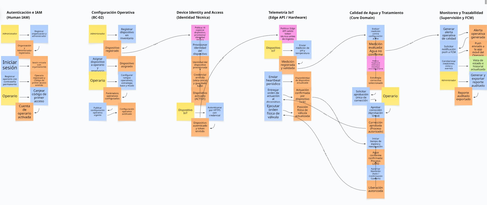
</p>

## 2.5. Ubiquitous Language

El Ubiquitous Language establece un vocabulario común entre los integrantes del equipo y los stakeholders involucrados en el dominio del tratamiento y monitoreo de la calidad del agua. Su propósito es asegurar que los conceptos utilizados para describir el problema, los procesos del negocio y la solución propuesta tengan un significado único y compartido, evitando ambigüedades durante el análisis y desarrollo del proyecto.

| Término (English) | Término (Español) | Definición |
| :--- | :--- | :--- |
| **Water Quality** | Calidad del agua | Condición del agua determinada a partir de características y parámetros que permiten establecer si es adecuada para el proceso o disposición correspondiente. |
| **Wastewater** | Agua residual | Agua que ha sido utilizada durante un proceso productivo y que contiene sustancias o características que requieren evaluación antes de su descarga o reutilización. |
| **Textile Wastewater** | Agua residual textil | Agua residual generada como consecuencia de procesos industriales textiles, especialmente actividades como teñido, lavado o acabado de tejidos. |
| **Dyeing Process** | Proceso de teñido | Proceso industrial donde se modifica el color de un textil, requiriendo homogenización del agua resultante. |
| **Effluent** | Efluente | Flujo de agua proveniente de un proceso productivo que es conducido hacia una etapa de tratamiento, reutilización o disposición. |
| **Treatment Process** | Proceso de tratamiento | Conjunto de actividades destinadas a modificar las condiciones del agua para alcanzar los parámetros de calidad establecidos antes de su disposición o reutilización. |
| **Treatment Tank** | Tanque de tratamiento | Recipiente donde se concentra temporalmente el agua para realizar su monitoreo, tratamiento y posterior evaluación. |
| **Water Sample** | Muestra de agua | Porción de agua obtenida de un punto determinado con el propósito de evaluar sus características y parámetros de calidad. |
| **Water Quality Parameter** | Parámetro de calidad del agua | Característica medible utilizada para determinar el estado o condición del agua. |
| **pH Level** | Nivel de pH | Medida que representa el grado de acidez o alcalinidad del agua y que permite determinar si se encuentra dentro del rango establecido. |
| **Temperature** | Temperatura | Medida de la condición térmica del agua, utilizada como uno de los parámetros para evaluar su estado durante el proceso. |
| **Permitted Range** | Rango permitido | Intervalo de valores establecido para determinar si un parámetro de calidad se encuentra dentro de las condiciones aceptables. |
| **Quality Threshold** | Umbral de calidad | Valor límite utilizado como referencia para determinar si un parámetro requiere una acción de control o tratamiento. |
| **Water Measurement** | Medición del agua | Obtención de los valores correspondientes a los parámetros de calidad de una muestra de agua. |
| **Quality Assessment** | Evaluación de calidad | Proceso mediante el cual se analizan las mediciones obtenidas para determinar la condición del agua respecto a los rangos establecidos. |
| **Compliant Water** | Agua conforme | Agua cuyos parámetros evaluados se encuentran dentro de los rangos establecidos para el proceso o disposición correspondiente. |
| **Non-Compliant Water** | Agua no conforme | Agua cuyos parámetros evaluados se encuentran fuera de los rangos establecidos y que requiere una acción antes de continuar con el proceso. |
| **Correction Strategy** | Estrategia de corrección | Regla configurada de pH o temperatura que determina la sustancia o actuación, la dosificación o intensidad y las condiciones para corregir una desviación. |
| **Correction Approval** | Aprobación de corrección | Autorización que el Operario concede una sola vez a la estrategia seleccionada al comenzar el tratamiento. Tras aprobarla, los ciclos restantes pueden continuar automáticamente hasta conformidad o fallo. |
| **Device** | Dispositivo | Equipo IoT identificado que mide pH y temperatura, recibe configuraciones y ejecuta o representa órdenes de actuación y control de flujo. |
| **Device Identity** | Identidad del dispositivo | Identidad técnica independiente de las cuentas humanas que vincula de forma segura un `deviceId`, una organización y una credencial. |
| **Device Credential** | Credencial del dispositivo | Secreto propio del dispositivo, mostrado una sola vez durante el provisionamiento y almacenado únicamente como hash en el backend. |
| **Device Provisioning** | Provisionamiento del dispositivo | Creación de la identidad técnica después de registrar el dispositivo, incluyendo la emisión inicial de su credencial. |
| **Device Principal** | Principal del dispositivo | Identidad autenticada que Edge obtiene del token y utiliza como fuente confiable de `deviceId`, `organizationId` y permisos. |
| **Device Revocation** | Revocación del dispositivo | Invalidación administrativa de su identidad técnica, que impide enviar telemetría y consultar o confirmar comandos. |
| **Edge API** | API Edge | Frontera HTTPS/REST utilizada por dispositivos autenticados para enviar telemetría y heartbeat, consultar comandos y confirmar su ejecución. |
| **Operating Environment** | Entorno de operación | Entorno físico o simulado en el que opera el dispositivo y que determina cómo se ejecutan o representan las actuaciones. |
| **Device Capability** | Capacidad del dispositivo | Actuación que un dispositivo declara poder ejecutar físicamente o representar de forma visible en el prototipo académico. |
| **Operational Configuration** | Configuración operativa | Versión vigente de rangos, estrategia correctiva, dosificación o intensidad, tiempo de espera, límite de ciclos y modo de liberación aplicable a un dispositivo. |
| **Dosing Setting** | Configuración de dosificación | Sustancia, cantidad o intensidad definida para una actuación correctiva. En el prototipo académico se conserva como parte de la decisión del sistema aunque su ejecución física sea reemplazada por un LED y una intervención manual. |
| **Corrective Actuation** | Actuación correctiva | Ejecución de la dosificación o acción térmica ordenada por el sistema durante el paso de corrección de un ciclo; no constituye una actuación continua. |
| **Actuation Confirmation** | Confirmación de actuación | Evidencia de que la orden correctiva fue ejecutada o representada; no demuestra por sí sola que el agua ya sea conforme. |
| **Process State** | Estado del proceso | Situación vigente del tratamiento que restringe las transiciones y acciones permitidas, como evaluación, corrección, espera, listo, fallo o emergencia. |
| **Release Mode** | Modo de liberación | Configuración manual o automática que determina cómo se confirma la liberación después de alcanzar el estado listo. |
| **Release Authorization** | Autorización de liberación | Decisión vigente del sistema que habilita la apertura de la válvula únicamente cuando el proceso cumple las condiciones de seguridad. |
| **Corrective Treatment** | Tratamiento correctivo | Acción aplicada al agua cuando uno o más parámetros se encuentran fuera de los rangos establecidos, con el objetivo de llevarlos nuevamente a condiciones aceptables. |
| **Treatment Cycle** | Ciclo de tratamiento | Secuencia que comprende la evaluación del agua, la aplicación de una acción correctiva cuando es necesaria y una nueva evaluación para verificar sus resultados. |
| **Useful Variation** | Variación útil | Cambio medible y favorable en los parámetros del agua detectado tras finalizar el tiempo de espera de un ciclo de tratamiento. |
| **Absolute Limit** | Límite absoluto | Cantidad máxima de ciclos de tratamiento permitidos sin éxito antes de declarar el proceso en estado de fallo. |
| **Reassessment** | Reevaluación | Nueva evaluación realizada después de una acción de tratamiento para comprobar si el agua cumple con los parámetros establecidos. |
| **Discharge** | Descarga | Destino o acción externa mediante la cual un efluente textil ya autorizado sale hacia el alcantarillado u otra disposición permitida. No es sinónimo de la decisión interna de liberación. |
| **Water Retention** | Retención del agua | Acción de mantener el agua dentro del sistema de tratamiento cuando sus parámetros no cumplen las condiciones necesarias para su descarga. |
| **Water Flow** | Flujo de agua | Movimiento o circulación del agua entre las diferentes etapas del proceso de tratamiento o disposición. |
| **Flow Control** | Control del flujo | Gestión de la circulación del agua para permitir, restringir o detener su paso durante las diferentes etapas del proceso. |
| **Operator** | Operario | Usuario que supervisa el dispositivo asignado, configura los parámetros operativos permitidos, atiende las indicaciones del sistema y actúa ante una emergencia. |
| **Administrator** | Administrador | Usuario que administra cuentas, roles, dispositivos, asignaciones y perfiles base, y que puede supervisar la información de todos los dispositivos sin tener uno propio. |
| **Emergency Stop** | Parada de emergencia | Orden prioritaria que interrumpe la liberación y obliga a mantener la válvula cerrada hasta un restablecimiento autorizado. |
| **Device Availability** | Disponibilidad del dispositivo | Condición que indica si el dispositivo mantiene comunicación dentro del intervalo esperado y puede participar de forma confiable en el proceso. |
| **Quality Alert** | Alerta de calidad | Aviso generado cuando un parámetro del agua presenta una condición que requiere atención o una acción correctiva. |
| **Quality Incident** | Incidente de calidad | Situación en la que el agua presenta una condición no esperada o fuera de los parámetros establecidos y requiere una acción de control. |
| **Monitoring Loss** | Pérdida de monitoreo | Evento en el que el sistema deja de recibir lecturas de telemetría del dispositivo durante un intervalo de tiempo esperado. |
| **Quality Record** | Registro de calidad | Registro histórico de mediciones, evaluaciones y resultados relacionados con la calidad del agua. |
| **Treatment Result** | Resultado del tratamiento | Resultado obtenido después de aplicar un tratamiento al agua y realizar una nueva evaluación de sus parámetros. |
| **Water Release** | Liberación del agua | Decisión y transición interna que habilita el flujo del agua conforme; puede conducir a una descarga textil o al suministro de riego hidropónico. |

# Capítulo III: Requirements Specification

## 3.1. User Stories

| EPIC | USER STORY |
| :--- | :--- |
| **EP-01: Gestión de Cuentas y Dispositivos**<br>Administración de perfiles de operarios y administradores, autenticación y asignación de dispositivos IoT a los operarios responsables de su monitoreo. | • US-01: Registro de operario<br>• US-02: Autenticación de usuario<br>• US-03: Asignación de dispositivo a operario<br>• US-04: Supervisión de operarios y dispositivos<br>• US-39: Asignación automática de rol según el flujo de alta. |
| **EP-02: Configuración de Parámetros y Reglas Operativas**<br>Definición del segmento y perfil base de cada dispositivo por parte del administrador, y ajuste operativo de rangos, tiempos de espera, límite de ciclos y modo de liberación por parte del operario responsable de cada dispositivo. | • US-05: Asignación de segmento y perfil base al dispositivo<br>• US-06: Configuración de rangos de calidad del dispositivo<br>• US-07: Configuración del límite de ciclos de corrección<br>• US-08: Configuración del tiempo de espera entre ciclos<br>• US-09: Configuración del modo de liberación<br>• US-10: Consulta de configuración de cualquier dispositivo<br>• US-40: Configuración de estrategia correctiva |
| **EP-03: Monitoreo de Calidad del Agua**<br>Adquisición, visualización y consulta histórica de las mediciones de pH y temperatura provenientes del dispositivo. | • US-11: Monitoreo de mediciones en tiempo real<br>• US-12: Monitoreo desde aplicación móvil |
| **EP-04: Evaluación y Tratamiento Correctivo del Agua**<br>Gestión de la conformidad del agua, dosificación correctiva por ciclos, comprobación de variación útil y límites absolutos para definir el estado del proceso. | • US-13: Evaluación de conformidad<br>• US-14: Retención de agua no conforme<br>• US-15: Ejecución de la acción correctiva<br>• US-16: Inicio de un ciclo de corrección<br>• US-17: Bloqueo por límite de ciclos sin efecto<br>• US-18: Reevaluación posterior al tratamiento |
| **EP-05: Control de Válvula y Liberación**<br>Gestión de la apertura, cierre y parada de emergencia de la válvula según el modo de liberación configurado y el estado de conformidad del agua, aplicando siempre la regla de apertura solo desde el estado listo. | • US-19: Liberación automática<br>• US-20: Liberación manual<br>• US-21: Parada de emergencia |
| **EP-06: Monitoreo y Trazabilidad**<br>Creación y administración de alertas operativas, registro de incidentes, correlación de eventos y vistas de estado del sistema. | • US-22: Alerta por parámetro fuera de rango<br>• US-23: Alerta por bloqueo del proceso<br>• US-24: Registro de incidente de calidad<br>• US-25: Alerta por pérdida de monitoreo |
| **EP-07: Historial, Reportes y Trazabilidad**<br>Consulta y exportación de la información histórica de mediciones, alertas y liberaciones para su análisis y auditoría. | • US-26: Consulta del historial de mi dispositivo<br>• US-27: Consulta del historial de cualquier dispositivo<br>• US-28: Generación de reporte de calidad<br>• US-29: Exportación de reporte<br>• US-30: Trazabilidad de tratamiento y liberación |
| **EP-08: Aplicaciones Digitales para Supervisión**<br>Capacidades web y móviles que permiten a operarios y administradores supervisar el estado, las alertas y los resultados del proceso. | • US-31: Supervisión operativa<br>• US-32: Gestión de alertas operativas<br>• US-33: Consulta de resultados desde la aplicación móvil |
| **EP-09: Landing Page y Comunicación de la Propuesta de Valor**<br>Sitio web estático de HydroGuard orientado a comunicar el problema, la propuesta de valor y los beneficios de la solución frente a alternativas existentes. | • US-34: Comprensión de la propuesta de valor<br>• US-35: Explicación del funcionamiento de la solución<br>• US-36: Segmentos y casos de uso<br>• US-37: Solicitud de contacto o demostración<br>• US-38: Acceso a la plataforma |
| **EP-10: Integración IoT, Edge y Servicios Digitales**<br>Comunicación técnica entre el dispositivo, el servicio Edge y los servicios digitales, incluyendo telemetría, ejecución y confirmación de actuaciones correctivas, control del flujo y adaptación al producto integral, la simulación y el prototipo académico mediante contratos comunes. | • TS-01: Registro y autenticación del dispositivo<br>• TS-02: Identificación del entorno de origen del dispositivo<br>• TS-03: Adquisición y validación de mediciones<br>• TS-04: Ingesta de telemetría en el Edge API<br>• TS-05: Sincronización de parámetros vigentes<br>• TS-06: Exposición de servicios de consulta de mediciones y resultados<br>• TS-07: Control del actuador de flujo<br>• TS-08: Ejecución de la parada de emergencia en el dispositivo<br>• TS-09: Almacenamiento temporal ante pérdida de conexión<br>• TS-10: Estado de disponibilidad del dispositivo<br>• TS-11: Integración con servicio externo de notificaciones<br>• TS-12: Exposición de configuración mediante API RESTful<br>• TS-13: Ejecución y confirmación de la actuación correctiva |

| Epic / Story ID | Título | Descripción | Criterios de Aceptación | Relacionado con (Epic ID) |
| :--- | :--- | :--- | :--- | :--- |
| **EP-01** | **Gestión de Cuentas y Dispositivos** | Administración de perfiles de operarios y administradores, autenticación y asignación de dispositivos IoT a los operarios responsables de su monitoreo. | N/A | - |
| **US-01** | Registro de operario | Como administrador, quiero registrar operarios con sus datos básicos, para habilitar su participación en el monitoreo de un dispositivo asignado. | **Escenario 1:** Given el administrador proporciona datos válidos y completos, When registra al operario, Then el sistema crea la cuenta del operario en estado activo. <br><br>**Escenario 2:** Given los datos obligatorios están incompletos, When el administrador intenta registrar al operario, Then el sistema rechaza el registro e indica los datos faltantes. <br><br>**Escenario 3:** Given ya existe un operario registrado con el mismo identificador, When el administrador intenta registrarlo nuevamente, Then el sistema rechaza la duplicación. | EP-01 |
| **US-02** | Autenticación de usuario | Como usuario, quiero autenticarme con mis credenciales, para acceder únicamente a las funciones correspondientes a mi rol (operario o administrador). | **Escenario 1:** Given el usuario posee credenciales válidas, When envía la solicitud de acceso, Then el sistema concede el acceso a las funciones autorizadas para su rol. <br><br>**Escenario 2:** Given las credenciales proporcionadas no son válidas, When el usuario intenta autenticarse, Then el sistema deniega el acceso y registra el intento fallido. <br><br>**Escenario 3:** Given un usuario autenticado intenta acceder a una función que no corresponde a su rol, When realiza la solicitud, Then el sistema rechaza la operación. | EP-01 |
| **US-03** | Asignación de dispositivo a operario | Como administrador, quiero asignar un dispositivo IoT a un operario, para delegar la responsabilidad de su monitoreo, dado que el alcance actual contempla un operario por dispositivo. | **Escenario 1:** Given un dispositivo sin operario asignado, When el administrador lo vincula a un operario activo, Then el sistema actualiza la asignación y otorga al operario los permisos correspondientes sobre ese dispositivo. <br><br>**Escenario 2:** Given un dispositivo ya cuenta con un operario asignado, When el administrador intenta asignarlo a otro operario, Then el sistema reemplaza la asignación anterior y notifica el cambio. <br><br>**Escenario 3:** Given un operario no está activo, When el administrador intenta asignarle un dispositivo, Then el sistema rechaza la asignación. | EP-01 |
| **US-04** | Supervisión de operarios y dispositivos | Como administrador, quiero consultar el estado de los operarios y los dispositivos del sistema, para mantener control sobre las asignaciones vigentes, dado que no cuento con un dispositivo propio. | **Escenario 1:** Given existen operarios y dispositivos registrados, When el administrador consulta la relación entre ellos, Then el sistema muestra las asignaciones vigentes. <br><br>**Escenario 2:** Given un dispositivo no tiene operario asignado, When el administrador consulta el listado, Then el sistema lo identifica como pendiente de asignación. | EP-01 |
| **US-39** | Asignación automática de rol según el flujo de alta | Como sistema, quiero asignar el rol Administrador únicamente durante el registro inicial de la organización y el rol Operario durante el alta administrativa de un operario, para impedir cambios manuales de rol y conservar un solo Administrador por organización. | **Escenario 1:** Given una organización nueva, When se completa su registro público, Then el sistema crea su única cuenta con rol Administrador. <br><br>**Escenario 2:** Given el Administrador registra una cuenta de operario, When el alta se completa, Then el sistema asigna el rol Operario sin permitir seleccionar otro rol. <br><br>**Escenario 3:** Given una cuenta existente, When se intenta modificar manualmente su rol, Then el sistema rechaza la operación. | EP-01 |
| **EP-02** | **Configuración de Parámetros y Reglas Operativas** | Definición del segmento y perfil base de cada dispositivo por parte del administrador, y ajuste operativo de rangos, tiempos de espera, límite de ciclos y modo de liberación por parte del operario responsable de cada dispositivo. | N/A | - |
| **US-05** | Asignación de segmento y perfil base al dispositivo | Como administrador, quiero asignar un segmento (textil u hidropónico) y un perfil base de configuración a un dispositivo, para habilitar al operario a ajustar sus rangos dentro de un contexto válido. | **Escenario 1:** Given un dispositivo recién asignado a un operario, When el administrador le asigna un segmento y un perfil base, Then el sistema habilita al operario a configurar rangos, tiempos y ciclos dentro de los límites de ese perfil. <br><br>**Escenario 2:** Given un dispositivo no tiene segmento asignado, When el operario intenta configurar un rango, Then el sistema rechaza la operación e indica que falta la asignación del segmento. | EP-02 |
| **US-06** | Configuración de rangos de calidad del dispositivo | Como operario, quiero configurar los rangos permitidos de pH y temperatura de mi dispositivo dentro del perfil habilitado para mi segmento, para establecer las condiciones que determinan la conformidad del agua en mi proceso. | **Escenario 1:** Given valores numéricos coherentes con los límites físicos del sensor (pH entre 0 y 14, temperatura entre 0 °C y 100 °C), When el operario guarda la configuración, Then el sistema establece los rangos como vigentes para su dispositivo. <br><br>**Escenario 2:** Given un rango configurado con el límite inferior mayor que el límite superior, When el operario intenta guardarlo, Then el sistema rechaza la configuración. <br><br>**Escenario 3:** Given existe una configuración vigente para el dispositivo, When el operario guarda una nueva configuración, Then esta reemplaza a la anterior para las evaluaciones posteriores. | EP-02 |
| **US-07** | Configuración del límite de ciclos de corrección | Como operario, quiero establecer el número máximo de ciclos de corrección permitidos para mi dispositivo, para detectar correcciones que no producen un cambio útil. | **Escenario 1:** Given un valor numérico mayor a cero, When el operario guarda el límite de ciclos, Then el sistema lo establece como vigente para el dispositivo. <br><br>**Escenario 2:** Given un valor igual o menor a cero, When el operario intenta guardarlo, Then el sistema rechaza la configuración. | EP-02 |
| **US-08** | Configuración del tiempo de espera entre ciclos | Como operario, quiero configurar el tiempo de espera antes de reevaluar el agua tras una corrección, para dar tiempo suficiente a que la dosificación produzca un efecto medible. | **Escenario 1:** Given un valor de tiempo de espera mayor a cero, When el operario lo guarda, Then el sistema lo aplica antes de cada reevaluación posterior a una corrección. <br><br>**Escenario 2:** Given un valor igual o menor a cero, When el operario intenta guardarlo, Then el sistema rechaza la configuración. | EP-02 |
| **US-09** | Configuración del modo de liberación | Como operario, quiero configurar el modo de liberación de mi dispositivo como manual o automático, para adaptar la operación a mi contexto sin quedar limitado a un único modo por segmento. | **Escenario 1:** Given el operario selecciona un modo de liberación válido, When guarda la configuración, Then el sistema aplica el modo elegido a las evaluaciones conformes posteriores. <br><br>**Escenario 2:** Given el modo automático está configurado, When el agua alcanza el estado listo, Then el sistema no requiere confirmación manual para autorizar la liberación. <br><br>**Escenario 3:** Given el modo manual está configurado, When el agua alcanza el estado listo, Then el sistema espera la confirmación del operario antes de autorizar la liberación. | EP-02 |
| **US-10** | Consulta de configuración de cualquier dispositivo | Como administrador, quiero consultar los rangos, el tiempo de espera, el límite de ciclos y el modo de liberación vigentes de cualquier dispositivo, para supervisar la configuración operativa establecida por cada operario. | **Escenario 1:** Given existe una configuración vigente para un dispositivo, When el administrador la consulta, Then el sistema muestra los rangos, el tiempo de espera, el límite de ciclos y el modo de liberación activos. <br><br>**Escenario 2:** Given un dispositivo no posee una configuración vigente, When el administrador realiza la consulta, Then el sistema informa que no existe una configuración disponible. | EP-02 |
| **US-40** | Configuración de estrategia correctiva | Como operario, quiero configurar la estrategia de corrección (ej. reducir pH, enfriamiento activo), para definir qué acción aplicará el sistema ante una desviación. | **Escenario 1:** Given un dispositivo con perfil activo, When el operario selecciona una estrategia correctiva y la guarda, Then el sistema la asocia a las reglas de flujo. | EP-02 |
| **EP-03** | **Monitoreo de Calidad del Agua** | Adquisición, visualización y consulta histórica de las mediciones de pH y temperatura provenientes del dispositivo, durante el estado de lectura del proceso. | N/A | - |
| **US-11** | Monitoreo de mediciones en tiempo real | Como operario, quiero observar las mediciones actuales de pH y temperatura de mi dispositivo, para conocer el estado del agua durante el proceso. | **Escenario 1:** Given existe una medición reciente disponible, When el operario consulta el estado del dispositivo, Then el sistema muestra los valores de pH, temperatura y el momento de la medición. <br><br>**Escenario 2:** Given no existen mediciones recientes disponibles, When el operario consulta el estado, Then el sistema informa que no dispone de una medición actualizada. | EP-03 |
| **US-12** | Monitoreo desde aplicación móvil | Como operario, quiero consultar el estado de mi dispositivo desde una aplicación móvil, para supervisar el proceso cuando no me encuentro frente al panel principal. | **Escenario 1:** Given existen mediciones válidas disponibles, When el operario consulta el estado mediante la aplicación móvil, Then el sistema entrega los mismos valores disponibles en la aplicación web. <br><br>**Escenario 2:** Given no existe conexión con el servicio, When el operario intenta consultar el estado desde la aplicación móvil, Then el sistema informa que la información no pudo actualizarse. | EP-03 |
| **EP-04** | **Evaluación y Tratamiento Correctivo del Agua** | Determinación de la conformidad del agua respecto a los rangos configurados y gestión del ciclo de corrección (lectura, corrección, espera, reevaluación) cuando los parámetros se encuentran fuera de rango, hasta alcanzar el estado listo o el estado de fallo. | N/A | - |
| **US-13** | Evaluación de conformidad | Como operario, quiero que el sistema evalúe cada medición respecto a los rangos configurados, para conocer si el agua es conforme o requiere tratamiento. | **Escenario 1:** Given los valores de pH y temperatura están dentro de los rangos configurados, When se evalúa la medición, Then el sistema clasifica el agua como conforme y el proceso pasa al estado listo. <br><br>**Escenario 2:** Given uno o más valores están fuera de los rangos configurados y el tratamiento todavía no fue aprobado, When el sistema selecciona la estrategia, Then clasifica el agua como no conforme y pasa el proceso a pendiente de aprobación de corrección. <br><br>**Escenario 3:** Given la corrección ya fue aprobada para el proceso y una reevaluación continúa fuera de rango, When quedan ciclos disponibles, Then el sistema continúa automáticamente con el siguiente ciclo sin solicitar una nueva aprobación. | EP-04 |
| **US-14** | Retención de agua no conforme | Como operario, quiero que el agua no conforme permanezca retenida, para evitar que continúe hacia la liberación antes de completar el tratamiento correspondiente. | **Escenario 1:** Given el agua es clasificada como no conforme, When se confirma la clasificación, Then el sistema mantiene la válvula cerrada. <br><br>**Escenario 2:** Given el agua pasa al estado listo, When se confirma el cumplimiento de los rangos, Then el sistema libera la condición de retención. | EP-04 |
| **US-15** | Aprobación y ejecución de la acción correctiva | Como operario, quiero revisar y aprobar una sola vez la estrategia seleccionada por el sistema antes de comenzar el tratamiento, para autorizar los ciclos correctivos de ese proceso. | **Escenario 1:** Given el agua es no conforme y el sistema seleccionó una estrategia válida, When todavía no existe aprobación, Then el proceso permanece pendiente, la válvula continúa cerrada y no se emite ninguna orden correctiva. <br><br>**Escenario 2:** Given el proceso está pendiente de aprobación, When el operario responsable aprueba la estrategia, Then el sistema registra actor y fecha, ordena la primera actuación y considera autorizados los ciclos restantes del mismo proceso. <br><br>**Escenario 3:** Given la actuación fue confirmada, When finaliza el tiempo de espera y una nueva medición continúa fuera de rango con ciclos disponibles, Then el sistema inicia automáticamente otro ciclo sin pedir una nueva aprobación. <br><br>**Escenario 4:** Given el prototipo académico ejecuta una orden aprobada, When comienza la corrección, Then activa el LED mientras una persona del equipo realiza la corrección manual sustitutiva. | EP-04 |
| **US-16** | Inicio de un ciclo de corrección | Como operario, quiero que el sistema registre el inicio de cada ciclo cuando acepta una actuación correctiva, para llevar un conteo inequívoco de los intentos realizados. | **Escenario 1:** Given el agua está clasificada como no conforme y no se ha alcanzado el límite configurado, When la orden de actuación correctiva es aceptada, Then el sistema registra el inicio del ciclo y su número de intento. <br><br>**Escenario 2:** Given finaliza el tiempo de espera y se registra una nueva medición, When el sistema la reevalúa, Then cierra el ciclo vigente y decide si inicia otro o detiene el tratamiento. <br><br>**Escenario 3:** Given el agua se encuentra en estado listo, When se evalúa una nueva medición, Then el sistema no inicia un ciclo de corrección. | EP-04 |
| **US-17** | Bloqueo por límite de ciclos sin efecto | Como operario, quiero que el sistema detenga el proceso y pase al estado de fallo cuando se alcanza el límite de ciclos configurado sin lograr una variación útil de los valores, para evitar intentos indefinidos ante una posible falla. | **Escenario 1:** Given se alcanza el número máximo de ciclos configurado sin que los valores varíen en la dirección esperada, When el sistema evalúa el último ciclo, Then el proceso pasa al estado de fallo y la válvula permanece cerrada. <br><br>**Escenario 2:** Given el número de ciclos realizados es menor al límite configurado, When una nueva medición continúa fuera de rango, Then el sistema permite iniciar un nuevo ciclo de corrección. <br><br>**Escenario 3:** Given los valores varían en la dirección esperada aunque no alcancen aún el rango configurado, When se evalúa el ciclo, Then el sistema permite continuar con los ciclos restantes en lugar de pasar al estado de fallo. | EP-04 |
| **US-18** | Reevaluación posterior al tratamiento | Como operario, quiero que el sistema reevalúe el agua después de cada tiempo de espera, para comprobar si los parámetros cumplen las condiciones establecidas. | **Escenario 1:** Given finaliza el tiempo de espera configurado tras una corrección, When se registra una nueva medición, Then el sistema determina nuevamente el estado de conformidad del agua. <br><br>**Escenario 2:** Given la nueva medición cumple los rangos configurados, When finaliza la reevaluación, Then el agua queda clasificada como conforme y el proceso pasa al estado listo. | EP-04 |
| **EP-05** | **Control de Válvula y Liberación** | Gestión de la apertura, cierre y parada de emergencia de la válvula según el modo de liberación configurado y el estado de conformidad del agua, aplicando siempre la regla de apertura solo desde el estado listo. | N/A | - |
| **US-19** | Liberación automática | Como operario, quiero que la válvula se abra automáticamente cuando el agua alcanza el estado listo y el modo automático está configurado, para agilizar el proceso sin intervención manual. | **Escenario 1:** Given el modo automático está configurado y el agua se encuentra en estado listo, When se confirma dicho estado, Then el sistema autoriza y ejecuta la apertura de la válvula. <br><br>**Escenario 2:** Given el agua no se encuentra en estado listo, When se evalúa el estado, Then el sistema no autoriza la apertura de la válvula aunque el modo automático esté configurado. | EP-05 |
| **US-20** | Liberación manual | Como operario, quiero confirmar manualmente la liberación del agua cuando esta se encuentra en estado listo y el modo manual está configurado, para decidir el momento adecuado de inicio del riego o la descarga. | **Escenario 1:** Given el modo manual está configurado y el agua se encuentra en estado listo, When el operario confirma la liberación, Then el sistema autoriza y ejecuta la apertura de la válvula. <br><br>**Escenario 2:** Given el agua no se encuentra en estado listo, When el operario intenta confirmar la liberación, Then el sistema rechaza la operación. | EP-05 |
| **US-21** | Parada de emergencia | Como operario, quiero accionar una parada de emergencia en cualquier momento, para detener de inmediato cualquier liberación de agua ante errores o situaciones extraordinarias. | **Escenario 1:** Given el sistema recibe una orden de parada de emergencia, When la procesa, Then cierra la válvula de inmediato e ignora las rutinas automáticas de liberación en curso, sin importar el modo de liberación configurado. <br><br>**Escenario 2:** Given la válvula fue cerrada por una parada de emergencia o por un estado de fallo, When el ciclo automático intenta continuar, Then el sistema mantiene la válvula cerrada hasta que el operario responsable restablece el proceso. | EP-05 |
| **EP-06** | **Monitoreo y Trazabilidad** | Administración de alertas, incidentes y vistas de estado. | N/A | - |
| **US-22** | Alerta por parámetro fuera de rango | Como operario, quiero recibir una alerta cuando una medición se encuentre fuera del rango configurado, para actuar antes de una liberación no conforme. | **Escenario 1:** Given existe una configuración vigente, When una medición presenta un parámetro fuera del rango establecido, Then el sistema genera una alerta de calidad dirigida al operario. <br><br>**Escenario 2:** Given todos los parámetros se encuentran dentro de los rangos establecidos, When se procesa la medición, Then el sistema no genera una alerta. | EP-06 |
| **US-23** | Alerta por bloqueo del proceso | Como operario, quiero recibir una alerta crítica cuando el proceso pasa al estado de fallo por alcanzar el límite de ciclos sin efecto, para identificar una posible falla del sensor o del tratamiento. | **Escenario 1:** Given el proceso alcanza el estado de fallo por límite de ciclos, When el sistema registra el bloqueo, Then genera una alerta crítica dirigida al operario y al administrador. | EP-06 |
| **US-24** | Registro de incidente de calidad | Como administrador, quiero registrar y consultar los incidentes relacionados con agua no conforme, para mantener trazabilidad de las situaciones que requirieron intervención. | **Escenario 1:** Given se detecta una condición no conforme, When el sistema registra el incidente, Then el registro incluye el parámetro afectado, el dispositivo y el momento de detección. <br><br>**Escenario 2:** Given un incidente fue registrado, When el administrador consulta el historial de incidentes, Then el sistema entrega la información correspondiente. | EP-06 |
| **US-25** | Alerta por pérdida de monitoreo | Como administrador, quiero recibir una alerta cuando un dispositivo deje de enviar mediciones durante el intervalo esperado, para identificar oportunamente una interrupción del monitoreo. | **Escenario 1:** Given el dispositivo está configurado para enviar mediciones periódicas, When transcurre el intervalo esperado sin una nueva medición, Then el sistema genera una alerta de pérdida de monitoreo. <br><br>**Escenario 2:** Given existe una alerta de pérdida de monitoreo activa, When se recibe una nueva medición válida, Then el sistema registra la recuperación del dispositivo. | EP-06 |
| **EP-07** | **Historial, Reportes y Trazabilidad** | Consulta y exportación de la información histórica de mediciones, evaluaciones, tratamientos, alertas y liberaciones para su análisis y seguimiento, tanto a nivel de un dispositivo como del conjunto del sistema. | N/A | - |
| **US-26** | Consulta del historial de mi dispositivo | Como operario, quiero consultar el historial de lecturas, ciclos y liberaciones de mi dispositivo, para evaluar el rendimiento del proceso o sustentar una auditoría interna. | **Escenario 1:** Given existen mediciones y eventos registrados para mi dispositivo, When el operario consulta el historial, Then el sistema entrega los registros manteniendo su relación temporal. <br><br>**Escenario 2:** Given no existen registros en el periodo solicitado, When el operario consulta el historial, Then el sistema informa que no existen datos disponibles. | EP-07 |
| **US-27** | Consulta del historial de cualquier dispositivo | Como administrador, quiero consultar el historial completo de cualquier dispositivo, para conocer la evolución del proceso y las acciones realizadas por los operarios. | **Escenario 1:** Given existen mediciones y eventos registrados, When el administrador consulta el historial de un dispositivo, Then el sistema entrega los registros manteniendo su relación temporal. <br><br>**Escenario 2:** Given no existen registros en el periodo solicitado, When se consulta el historial, Then el sistema informa que no existen datos disponibles. | EP-07 |
| **US-28** | Generación de reporte de calidad | Como administrador, quiero generar un reporte del estado y evolución de la calidad del agua de un dispositivo, para utilizarlo en la toma de decisiones o en la sustentación de una auditoría. | **Escenario 1:** Given existen mediciones y evaluaciones registradas para el periodo solicitado, When el administrador solicita el reporte, Then el sistema lo genera con los datos correspondientes. <br><br>**Escenario 2:** Given el periodo seleccionado no contiene registros, When el administrador solicita el reporte, Then el sistema informa que no existe información suficiente. | EP-07 |
| **US-29** | Exportación de reporte | Como administrador, quiero exportar un reporte generado, para conservarlo o compartirlo con otros responsables autorizados. | **Escenario 1:** Given existe un reporte generado correctamente, When el administrador solicita su exportación, Then el sistema produce un archivo con la información del reporte. <br><br>**Escenario 2:** Given no existe información suficiente para generar el reporte, When el administrador solicita la exportación, Then el sistema rechaza la operación. | EP-07 |
| **US-30** | Trazabilidad de tratamiento y liberación | Como administrador, quiero consultar la relación entre mediciones, ciclos de corrección y liberaciones autorizadas, para verificar cómo se tomó cada decisión sobre el agua. | **Escenario 1:** Given existe una medición no conforme, When el administrador consulta su trazabilidad, Then el sistema la relaciona con los ciclos de corrección realizados. <br><br>**Escenario 2:** Given existe una liberación autorizada, When el administrador consulta la trazabilidad, Then el sistema identifica la reevaluación que permitió la autorización. | EP-07 |
| **EP-08** | **Aplicaciones Digitales para Supervisión** | Capacidades web y móviles que permiten a operarios y administradores supervisar el estado, las alertas y los resultados del proceso. | N/A | - |
| **US-31** | Supervisión operativa | Como operario, quiero consultar el estado actual del proceso de mi dispositivo, para conocer si debo aprobar el tratamiento, si está ejecutándose o si puede continuar hacia la liberación. | **Escenario 1:** Given existe una medición reciente, When el operario consulta el estado operativo, Then el sistema informa el estado actual del proceso, incluyendo pendiente de aprobación, corrección, espera, reevaluación, listo, fallo o emergencia. <br><br>**Escenario 2:** Given el proceso espera aprobación, When el operario consulta su detalle, Then la aplicación muestra la estrategia seleccionada, sus parámetros y una única acción de aprobación. <br><br>**Escenario 3:** Given el tratamiento ya fue aprobado, When se ejecutan ciclos posteriores, Then la aplicación muestra su progreso sin volver a solicitar aprobación. <br><br>**Escenario 4:** Given el dispositivo pertenece al prototipo académico, When el sistema ordena la corrección, Then la interfaz identifica que el LED representa el proceso y que la intervención manual del equipo es una sustitución demostrativa, no el comportamiento del producto integral. | EP-08 |
| **US-32** | Gestión de alertas operativas | Como operario, quiero consultar las alertas activas de mi dispositivo, para priorizar las situaciones que requieren atención. | **Escenario 1:** Given existen alertas activas, When el operario las consulta, Then el sistema entrega las alertas pendientes de atención. <br><br>**Escenario 2:** Given una alerta fue generada por una condición fuera de rango, When la condición se corrige, Then el sistema asocia la alerta con la resolución correspondiente. | EP-08 |
| **US-33** | Consulta de resultados desde la aplicación móvil | Como operario, quiero consultar evaluaciones y alertas de los dispositivos que tengo asignados desde la aplicación móvil, para supervisar mis procesos sin depender de inspecciones presenciales. | **Escenario 1:** Given existen resultados registrados para una asignación del operario, When consulta el proceso desde la aplicación móvil, Then el sistema entrega su estado y resultado más reciente. <br><br>**Escenario 2:** Given el operario intenta consultar un dispositivo no asignado, When realiza la solicitud, Then el sistema rechaza el acceso. <br><br>**Escenario 3:** Given no existe información reciente disponible, When el operario realiza la consulta, Then el sistema informa que los datos no están actualizados. | EP-08 |
| **EP-09** | **Landing Page y Comunicación de la Propuesta de Valor** | Sitio web estático de HydroGuard orientado a comunicar el problema, la propuesta de valor y los beneficios de la solución frente a alternativas existentes. | N/A | - |
| **US-34** | Comprensión de la propuesta de valor | Como visitante, quiero comprender el problema que enfrenta el control de calidad del agua en los procesos productivos, para conocer la necesidad que aborda HydroGuard. | **Escenario 1:** Given el visitante accede al sitio web, When consulta la información principal, Then encuentra una explicación del problema y de la propuesta de valor. <br><br>**Escenrio 2:** Given el visitante revisa la propuesta de valor, When explora la información presentada, Then puede identificar los principales beneficios de la solución frente a alternativas de medición no conectadas. | EP-09 |
| **US-35** | Explicación del funcionamiento de la solución | Como visitante, quiero conocer cómo funciona la solución, para comprender su propuesta tecnológica y operativa. | **Escenario 1:** Given el visitante consulta la información del producto, When explora el funcionamiento, Then identifica las etapas de lectura, evaluación, corrección, espera y liberación del proceso. | EP-09 |
| **US-36** | Segmentos y casos de uso | Como visitante, quiero conocer los segmentos y casos de aplicación de la solución, para determinar si responde a una necesidad de mi organización. | **Escenario 1:** Given el visitante consulta los casos de aplicación, When explora la información, Then identifica los segmentos textil e hidropónico a los que se dirige la solución. <br><br>**Escenario 2:** Given el visitante pertenece a uno de los segmentos objetivo, When consulta la información correspondiente, Then encuentra beneficios relacionados con sus necesidades de monitoreo. | EP-09 |
| **US-37** | Solicitud de contacto o demostración | Como visitante, quiero solicitar información o una demostración de la solución, para conocer con mayor detalle sus capacidades antes de adoptarla. | **Escenario 1:** Given el visitante proporciona información de contacto válida y completa, When envía la solicitud, Then el sistema registra la solicitud de contacto. <br><br>**Escenario 2:** Given la información obligatoria de contacto está incompleta, When el visitante envía la solicitud, Then el sistema rechaza el registro e indica los datos faltantes. | EP-09 |
| **US-38** | Acceso a la plataforma | Como visitante, quiero dirigirme desde el sitio web hacia el ingreso a mi cuenta operativa, para continuar hacia el proceso de autenticación. | **Escenario 1:** Given el visitante posee una cuenta registrada, When solicita el ingreso a la plataforma, Then el sistema lo dirige al proceso de autenticación. | EP-09 |
| **EP-10** | **Integración IoT, Edge y Servicios Digitales** | Comunicación técnica entre el dispositivo (físico o simulado en Wokwi), el servicio Edge y los servicios digitales, incluyendo la ejecución de acciones sobre el actuador de flujo bajo un mismo contrato de telemetría. | N/A | - |
| **TS-01** | Provisionamiento y autenticación del dispositivo | Como Developer, quiero que cada dispositivo disponga de una identidad y credencial únicas vinculadas con su organización, para permitir únicamente comunicaciones autorizadas. | **Escenario 1:** Given un Administrador registra un dispositivo válido, When el backend completa el provisionamiento, Then crea su identidad en estado activo, vincula `deviceId` con `organizationId` y entrega la credencial original una sola vez. <br><br>**Escenario 2:** Given el dispositivo presenta una credencial válida por HTTPS, When solicita autenticación, Then el servicio emite un token de corta duración con su identidad, organización, audiencia y permisos. <br><br>**Escenario 3:** Given la identidad no existe, está revocada o la credencial es inválida, When solicita autenticación, Then el servicio rechaza la solicitud sin revelar información sensible. <br><br>**Escenario 4:** Given el Administrador revoca la identidad, When el dispositivo intenta enviar telemetría o consultar comandos, Then Edge rechaza la operación. | EP-10 |
| **TS-02** | Identificación del entorno de origen del dispositivo | Como Developer, quiero que el sistema identifique si una medición proviene del dispositivo físico (ESP32) o del entorno simulado (Wokwi), para mantener trazabilidad diferenciada bajo un mismo contrato de telemetría. | **Escenario 1:** Given un identificador de dispositivo correspondiente al entorno físico, When el API recibe la medición, Then la registra con el origen físico correspondiente. <br><br>**Escenario 2:** Given un identificador de dispositivo correspondiente al entorno simulado, When el API recibe la medición, Then la registra con el origen simulado correspondiente. | EP-10 |
| **TS-03** | Adquisición y validación de mediciones | Como Developer, quiero que el dispositivo obtenga y valide las lecturas de pH y temperatura, para entregar únicamente mediciones utilizables por el proceso de calidad del agua. | **Escenario 1:** Given los sensores entregan un valor de pH entre 0 y 14 y una temperatura entre 0 °C y 100 °C, When el dispositivo realiza una medición, Then genera un registro completo con ambos valores. <br><br>**Escenario 2:** Given un sensor entrega un valor fuera de esos límites físicos, When el dispositivo procesa la lectura, Then la descarta como medición no válida. | EP-10 |
| **TS-04** | Ingesta HTTPS de telemetría en Edge API | Como Developer, quiero que Edge API reciba por HTTPS/REST las mediciones de dispositivos autenticados, para procesarlas con una identidad confiable. | **Escenario 1:** Given un token válido y un payload con temperatura, pH, marca temporal e identificador idempotente, When el dispositivo realiza `POST /edge/v1/telemetry`, Then Edge obtiene `deviceId` y `organizationId` del token y confirma la recepción. <br><br>**Escenario 2:** Given el token falta, venció o pertenece a una identidad revocada, When se intenta enviar la medición, Then Edge rechaza la solicitud. <br><br>**Escenario 3:** Given se reintenta una medición ya aceptada, When Edge valida su identificador, Then devuelve el resultado previo sin duplicar el registro. | EP-10 |
| **TS-05** | Sincronización de parámetros vigentes | Como Developer, quiero que el dispositivo consulte la versión vigente de rangos, estrategia correctiva, sustancia, dosis o intensidad, tiempo de espera, límite de ciclos y modo de liberación, para operar según la configuración establecida. | **Escenario 1:** Given existe una configuración vigente y compatible con las capacidades del dispositivo, When este la solicita, Then el servicio responde con todos sus parámetros y su número de versión. <br><br>**Escenario 2:** Given el servicio no dispone de una configuración vigente, When el dispositivo la solicita, Then informa la ausencia y el dispositivo conserva la última configuración válida sin habilitar un proceso nuevo con datos incompletos. <br><br>**Escenario 3:** Given la configuración exige una capacidad no declarada por el dispositivo, When se intenta sincronizarla, Then el servicio rechaza su activación e informa la incompatibilidad. | EP-10 |
| **TS-06** | Exposición de servicios de consulta de mediciones y resultados | Como Developer, quiero exponer servicios RESTful para consultar mediciones, evaluaciones y reportes, para que las aplicaciones web y móvil consuman la información del dominio. | **Escenario 1:** Given una solicitud válida con parámetros de consulta correctos, When el servicio la procesa, Then responde con los registros correspondientes. <br><br>**Escenario 2:** Given una solicitud con parámetros inválidos, When el servicio la procesa, Then responde con un error de validación. | EP-10 |
| **TS-07** | Control del actuador de flujo | Como Developer, quiero emitir una orden de apertura o cierre hacia el actuador de la válvula (servomotor físico o representación en Wokwi), para ejecutar la decisión de liberación o retención del agua. | **Escenario 1:** Given el agua posee una autorización de liberación vigente, When el sistema emite la orden de apertura, Then el dispositivo ejecuta la acción sobre el actuador (o su representación visual mediante LED en el entorno simulado) y confirma el resultado. <br><br>**Escenario 2:** Given el agua no posee autorización de liberación, When se intenta emitir una orden de apertura, Then la orden es rechazada. | EP-10 |
| **TS-08** | Ejecución de la parada de emergencia en el dispositivo | Como Developer, quiero que el dispositivo priorice y ejecute de inmediato una orden de parada de emergencia, para garantizar el cierre de la válvula ante cualquier rutina en curso. | **Escenario 1:** Given el dispositivo recibe una orden de parada de emergencia, When la procesa, Then interrumpe cualquier rutina automática en ejecución y ejecuta el cierre del actuador. <br><br>**Escenario 2:** Given el actuador fue cerrado por una parada de emergencia, When se recibe una nueva orden automática de apertura, Then el dispositivo la ignora hasta recibir una orden explícita de restablecimiento por parte del operario. | EP-10 |
| **TS-09** | Almacenamiento temporal ante pérdida de conexión | Como Developer, quiero conservar temporalmente las mediciones cuando no exista comunicación con el servicio, para evitar la pérdida de información del proceso. | **Escenario 1:** Given el dispositivo posee una medición válida y no existe comunicación con el servicio, When intenta transmitirla, Then la conserva temporalmente. <br><br>**Escenario 2:** Given existen mediciones pendientes de transmisión, When se restablece la comunicación, Then el dispositivo las transmite y deja de considerarlas pendientes. | EP-10 |
| **TS-10** | Estado de disponibilidad del dispositivo | Como Developer, quiero que el dispositivo comunique periódicamente su disponibilidad, para detectar interrupciones en el monitoreo. | **Escenario 1:** Given el dispositivo está operativo y conectado, When transcurre el intervalo configurado, Then el servicio recibe una señal de disponibilidad válida. <br><br>**Escenario 2:** Given no se recibe la señal esperada durante el periodo definido, When el servicio evalúa la disponibilidad, Then identifica al dispositivo como no disponible. | EP-10 |
| **TS-11** | Integración de notificaciones con FCM | Como Developer, quiero integrar Firebase Cloud Messaging, para comunicar oportunamente las alertas a la aplicación móvil del Operario. | **Escenario 1:** Given existe una alerta persistida y un token FCM vigente, When Monitoring solicita el envío, Then FCM acepta la notificación y se registra el resultado. <br><br>**Escenario 2:** Given FCM rechaza o no entrega la solicitud, When Monitoring procesa el fallo, Then conserva la alerta como fuente de verdad y registra el intento para reintento. <br><br>**Escenario 3:** Given el Operario abre una notificación, When la aplicación procesa sus datos, Then navega al proceso o alerta correspondiente dentro de sus asignaciones. | EP-10 |
| **TS-12** | Exposición de configuración mediante API RESTful | Como Developer, quiero disponer de servicios RESTful para consultar y modificar las configuraciones del dispositivo, para integrar las aplicaciones digitales con el dominio de calidad del agua. | **Escenario 1:** Given una solicitud válida para registrar una configuración, When el servicio valida los datos, Then confirma la configuración aceptada. <br><br>**Escenario 2:** Given una solicitud con datos inválidos, When el servicio la procesa, Then responde con un error de validación sin aplicar la configuración. | EP-10 |
| **TS-13** | Ejecución y confirmación de la actuación correctiva | Como Developer, quiero que el dispositivo procese de manera idempotente una orden correctiva con la sustancia o acción, dosis o intensidad y ciclo correspondiente, para ejecutar la dosificación física o su representación académica y devolver un resultado verificable. | **Escenario 1:** Given el producto integral recibe una orden válida compatible con sus capacidades, When la procesa, Then ejecuta la dosificación o actuación física únicamente durante la etapa correctiva y confirma su finalización con el mismo identificador de comando. <br><br>**Escenario 2:** Given el simulador recibe una orden válida, When la procesa, Then activa el indicador correspondiente y confirma la representación; una modificación posterior del sensor representa el efecto para la siguiente medición. <br><br>**Escenario 3:** Given el prototipo académico recibe una orden válida, When la procesa, Then mantiene encendido el LED durante la corrección manual sustitutiva realizada por el equipo y confirma la representación al finalizar. <br><br>**Escenario 4:** Given el dispositivo recibe nuevamente un identificador de comando ya procesado, When valida la orden, Then devuelve el resultado registrado sin repetir la actuación. <br><br>**Escenario 5:** Given la orden es incompatible, inválida o no puede ejecutarse, When el dispositivo la procesa, Then no inicia la actuación y responde con estado rechazado o fallido y un código de error. | EP-10 |


## 3.2. Impact Mapping.

<p align="center">
  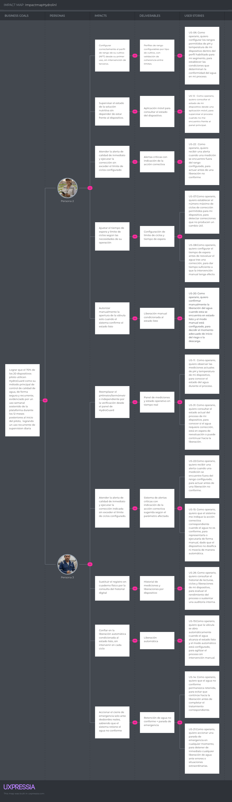
</p>

## 3.3. Product Backlog.

A continuación se detalla la lista de requerimientos priorizados por valor de negocio, comenzando con el sitio web estático y las funcionalidades principales de consolidación y flujos de intervención, dejando la autenticación para iteraciones posteriores.

| # Orden | User Story Id | Título | Descripción | Story Points (1/2/3/5/8) |
|:--:|:--|:--|:--|:--:|
| 1 | US-34 | Comprensión de la propuesta de valor | Como visitante, quiero comprender el problema que enfrenta el control de calidad del agua en los procesos productivos, para conocer la necesidad que aborda HydroGuard. | 2 |
| 2 | US-35 | Explicación del funcionamiento de la solución | Como visitante, quiero conocer cómo funciona la solución, para comprender su propuesta tecnológica y operativa. | 2 |
| 3 | US-36 | Segmentos y casos de uso | Como visitante, quiero conocer los segmentos y casos de aplicación de la solución, para determinar si responde a una necesidad de mi organización. | 2 |
| 4 | US-37 | Solicitud de contacto o demostración | Como visitante, quiero solicitar información o una demostración de la solución, para conocer con mayor detalle sus capacidades antes de adoptarla. | 3 |
| 5 | US-38 | Acceso a la plataforma | Como visitante, quiero dirigirme desde el sitio web hacia el ingreso a mi cuenta operativa, para continuar hacia el proceso de autenticación. | 1 |
| 6 | TS-03 | Adquisición y validación de mediciones | Como Developer, quiero que el dispositivo obtenga y valide las lecturas de pH y temperatura, para entregar únicamente mediciones utilizables por el proceso de calidad del agua. | 3 |
| 7 | TS-04 | Ingesta de telemetría en el Edge API | Como Developer, quiero que el Edge API reciba las mediciones del dispositivo, para procesarlas y entregarlas a los servicios digitales. | 8 |
| 8 | US-11 | Monitoreo de mediciones en tiempo real | Como operario, quiero observar las mediciones actuales de pH y temperatura de mi dispositivo, para conocer el estado del agua durante el proceso. | 3 |
| 9 | US-06 | Configuración de rangos de calidad del dispositivo | Como operario, quiero configurar los rangos permitidos de pH y temperatura de mi dispositivo dentro del perfil habilitado para mi segmento, para establecer las condiciones que determinan la conformidad del agua en mi proceso. | 3 |
| 10 | US-13 | Evaluación de conformidad | Como operario, quiero que el sistema evalúe cada medición respecto a los rangos configurados, para conocer si el agua es conforme (estado listo) o no conforme (estado de corrección). | 5 |
| 11 | US-15 | Aprobación y ejecución de la acción correctiva | Como operario, quiero revisar y aprobar una sola vez la estrategia seleccionada antes de que el sistema ejecute automáticamente los ciclos del tratamiento. | 5 |
| 12 | TS-13 | Ejecución y confirmación de la actuación correctiva | Como Developer, quiero que el dispositivo procese de manera idempotente la orden correctiva, para ejecutar la dosificación física o su representación académica y confirmar su resultado sin repetir actuaciones. | 5 |
| 13 | TS-07 | Control del actuador de flujo | Como Developer, quiero emitir una orden de apertura o cierre hacia el actuador de la válvula (servomotor físico o representación en Wokwi), para ejecutar la decisión de liberación o retención del agua. | 5 |
| 14 | US-19 | Liberación automática | Como operario, quiero que la válvula se abra automáticamente cuando el agua alcanza el estado listo y el modo automático está configurado, para agilizar el proceso sin intervención manual. | 5 |
| 15 | US-20 | Liberación manual | Como operario, quiero confirmar manualmente la liberación del agua cuando esta se encuentra en estado listo y el modo manual está configurado, para decidir el momento adecuado de inicio del riego o la descarga. | 3 |
| 16 | US-14 | Retención de agua no conforme | Como operario, quiero que el agua no conforme permanezca retenida, para evitar que continúe hacia la liberación antes de completar el tratamiento correspondiente. | 3 |
| 17 | US-16 | Inicio de un ciclo de corrección | Como operario, quiero que el sistema registre el inicio de cada ciclo cuando acepta una actuación correctiva, para llevar un conteo inequívoco de los intentos realizados. | 5 |
| 18 | US-18 | Reevaluación posterior al tratamiento | Como operario, quiero que el sistema reevalúe el agua después de cada tiempo de espera, para comprobar si los parámetros cumplen las condiciones establecidas. | 3 |
| 19 | US-07 | Configuración del límite de ciclos de corrección | Como operario, quiero establecer el número máximo de ciclos de corrección permitidos para mi dispositivo, para detectar correcciones que no producen un cambio útil. | 2 |
| 20 | US-08 | Configuración del tiempo de espera entre ciclos | Como operario, quiero configurar el tiempo de espera antes de reevaluar el agua tras una corrección, para dar tiempo suficiente a que la dosificación produzca un efecto medible. | 2 |
| 21 | US-17 | Bloqueo por límite de ciclos sin efecto | Como operario, quiero que el sistema detenga el proceso y pase al estado de fallo cuando se alcanza el límite de ciclos configurado sin lograr una variación útil de los valores, para evitar intentos indefinidos ante una posible falla. | 5 |
| 22 | US-21 | Parada de emergencia | Como operario, quiero accionar una parada de emergencia en cualquier momento, para detener de inmediato cualquier liberación de agua ante errores o situaciones extraordinarias. | 5 |
| 23 | TS-08 | Ejecución de la parada de emergencia en el dispositivo | Como Developer, quiero que el dispositivo priorice y ejecute de inmediato una orden de parada de emergencia, para garantizar el cierre de la válvula ante cualquier rutina en curso. | 3 |
| 24 | US-09 | Configuración del modo de liberación | Como operario, quiero configurar el modo de liberación de mi dispositivo como manual o automático, para adaptar la operación a mi contexto sin quedar limitado a un único modo por segmento. | 2 |
| 25 | US-22 | Alerta por parámetro fuera de rango | Como operario, quiero recibir una alerta cuando una medición se encuentre fuera del rango configurado, para actuar antes de una liberación no conforme. | 3 |
| 26 | US-23 | Alerta por bloqueo del proceso | Como operario, quiero recibir una alerta crítica cuando el proceso pasa al estado de fallo por alcanzar el límite de ciclos sin efecto, para identificar una posible falla del sensor o del tratamiento. | 2 |
| 27 | US-25 | Alerta por pérdida de monitoreo | Como administrador, quiero recibir una alerta cuando un dispositivo deje de enviar mediciones durante el intervalo esperado, para identificar oportunamente una interrupción del monitoreo. | 3 |
| 28 | TS-10 | Estado de disponibilidad del dispositivo | Como Developer, quiero que el dispositivo comunique periódicamente su disponibilidad, para detectar interrupciones en el monitoreo. | 3 |
| 29 | TS-11 | Integración con servicio externo de notificaciones | Como Developer, quiero integrar un servicio externo de notificaciones, para comunicar oportunamente las alertas generadas por el dominio de calidad del agua. | 5 |
| 30 | US-24 | Registro de incidente de calidad | Como administrador, quiero registrar y consultar los incidentes relacionados con agua no conforme, para mantener trazabilidad de las situaciones que requirieron intervención. | 3 |
| 31 | US-32 | Gestión de alertas operativas | Como operario, quiero consultar las alertas activas de mi dispositivo, para priorizar las situaciones que requieren atención. | 3 |
| 32 | US-31 | Supervisión operativa | Como operario, quiero consultar el estado actual del proceso de mi dispositivo, para conocer si el agua requiere corrección, está en espera de reevaluación o puede continuar hacia la liberación. | 3 |
| 33 | US-12 | Monitoreo desde aplicación móvil | Como operario, quiero consultar el estado de mi dispositivo desde una aplicación móvil, para supervisar el proceso cuando no me encuentro frente al panel principal. | 5 |
| 34 | US-33 | Consulta de resultados desde la aplicación móvil | Como operario, quiero consultar evaluaciones y alertas de los dispositivos que tengo asignados desde la aplicación móvil, para supervisar mis procesos sin depender de inspecciones presenciales. | 5 |
| 35 | US-01 | Registro de operario | Como administrador, quiero registrar operarios con sus datos básicos, para habilitar su participación en el monitoreo de un dispositivo asignado. | 2 |
| 36 | US-02 | Autenticación de usuario | Como usuario, quiero autenticarme con mis credenciales, para acceder únicamente a las funciones correspondientes a mi rol (operario o administrador). | 3 |
| 37 | US-03 | Asignación de dispositivo a operario | Como administrador, quiero asignar un dispositivo IoT a un operario, para delegar la responsabilidad de su monitoreo, dado que el alcance actual contempla un operario por dispositivo. | 2 |
| 38 | US-39 | Asignación automática de rol según el flujo de alta | Como sistema, quiero asignar Administrador únicamente en el alta inicial de la organización y Operario en el alta administrativa de cuentas, para impedir cambios manuales de rol y conservar un solo Administrador por organización. | 2 |
| 39 | US-04 | Supervisión de operarios y dispositivos | Como administrador, quiero consultar el estado de los operarios y los dispositivos del sistema, para mantener control sobre las asignaciones vigentes, dado que no cuento con un dispositivo propio. | 3 |
| 40 | US-05 | Asignación de segmento y perfil base al dispositivo | Como administrador, quiero asignar un segmento (textil u hidropónico) y un perfil base de configuración a un dispositivo, para habilitar al operario a ajustar sus rangos dentro de un contexto válido. | 3 |
| 41 | US-10 | Consulta de configuración de cualquier dispositivo | Como administrador, quiero consultar los rangos, el tiempo de espera, el límite de ciclos y el modo de liberación vigentes de cualquier dispositivo, para supervisar la configuración operativa establecida por cada operario. | 2 |
| 42 | US-40 | Configuración de estrategia correctiva | Como operario, quiero configurar la estrategia de corrección (ej. reducir pH, enfriamiento activo), para definir qué acción aplicará el sistema ante una desviación. | 3 |
| 43 | TS-01 | Provisionamiento y autenticación del dispositivo | Como Developer, quiero provisionar una identidad y credencial únicas vinculadas con el dispositivo y su organización, para autorizar su comunicación HTTPS con Edge. | 5 |
| 44 | TS-02 | Identificación del entorno de origen del dispositivo | Como Developer, quiero que el sistema identifique si una medición proviene del dispositivo físico (ESP32) o del entorno simulado (Wokwi), para mantener trazabilidad diferenciada bajo un mismo contrato de telemetría. | 2 |
| 45 | TS-05 | Sincronización de parámetros vigentes | Como Developer, quiero que el dispositivo consulte la versión vigente de rangos, estrategia correctiva, dosis o intensidad, espera, límite de ciclos y modo de liberación, para operar con una configuración completa y compatible. | 3 |
| 46 | TS-06 | Exposición de servicios de consulta de mediciones y resultados | Como Developer, quiero exponer servicios RESTful para consultar mediciones, evaluaciones y reportes, para que las aplicaciones web y móvil consuman la información del dominio. | 5 |
| 47 | TS-12 | Exposición de configuración mediante API RESTful | Como Developer, quiero disponer de servicios RESTful para consultar y modificar las configuraciones del dispositivo, para integrar las aplicaciones digitales con el dominio de calidad del agua. | 3 |
| 48 | TS-09 | Almacenamiento temporal ante pérdida de conexión | Como Developer, quiero conservar temporalmente las mediciones cuando no exista comunicación con el servicio, para evitar la pérdida de información del proceso. | 8 |
| 49 | US-26 | Consulta del historial de mi dispositivo | Como operario, quiero consultar el historial de lecturas, ciclos y liberaciones de mi dispositivo, para evaluar el rendimiento del proceso o sustentar una auditoría interna. | 3 |
| 50 | US-27 | Consulta del historial de cualquier dispositivo | Como administrador, quiero consultar el historial completo de cualquier dispositivo, para conocer la evolución del proceso y las acciones realizadas por los operarios. | 3 |
| 51 | US-30 | Trazabilidad de tratamiento y liberación | Como administrador, quiero consultar la relación entre mediciones, ciclos de corrección y liberaciones autorizadas, para verificar cómo se tomó cada decisión sobre el agua. | 8 |
| 52 | US-28 | Generación de reporte de calidad | Como administrador, quiero generar un reporte del estado y evolución de la calidad del agua de un dispositivo, para utilizarlo en la toma de decisiones o en la sustentación de una auditoría. | 5 |
| 53 | US-29 | Exportación de reporte | Como administrador, quiero exportar un reporte generado, para conservarlo o compartirlo con otros responsables autorizados. | 3 |

<p align="center">
  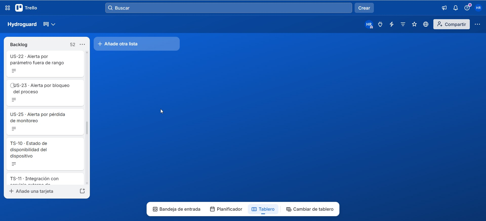
</p>

# Capítulo IV: Solution Software Design

## 4.1. Strategic-Level Domain-Driven Design

En esta sección se define el diseño estratégico del dominio mediante Domain-Driven Design. A partir del lenguaje ubicuo, los eventos y las capacidades del negocio se delimitan los bounded contexts, sus responsabilidades y sus relaciones. Las decisiones de arquitectura de software y atributos de calidad se desarrollan posteriormente en la sección 4.1.3.


### 4.1.1. Design-Level EventStorming

El EventStorming de Nivel de Diseño es la evolución directa del modelo de Big Picture. Su objetivo es pasar del entendimiento general a un modelo de diseño que exponga actores, comandos, eventos, políticas y reglas relevantes. Los artefactos siguientes incorporan la identidad técnica del dispositivo, la aprobación única del tratamiento y la comunicación HTTPS/REST.

**Autenticación y acceso**
Inicio de sesión, validación de credenciales y control de acceso por rol

<p align="center">
  
</p>

**Provisionamiento y Autenticación del Dispositivo**
Representa el registro del dispositivo, el provisionamiento de su identidad técnica y su autenticación mediante una credencial propia para obtener un token de acceso.
<p align="center">
  
</p>


**Asignación y configuración operativa**
Asignación del dispositivo al operario y configuración completa de parámetros de tratamiento, hasta su publicación y sincronización.
<p align="center">
  
</p>

**Recepción y evaluación de una medición**
Validación técnica de la telemetría entrante y evaluación de negocio contra la configuración efectiva.
<p align="center">
  
</p>

**Selección, aprobación y ejecución de la corrección**
Treatment selecciona la estrategia y el Operario la aprueba una sola vez antes de la primera actuación. Desde ese momento, el sistema puede continuar automáticamente los ciclos del mismo proceso. En el producto integral la orden representa una actuación física; en el prototipo el LED acompaña la corrección manual sustitutiva y en la simulación se modifica posteriormente el sensor.
<p align="center">
  
</p>

**Espera, reevaluación y ciclos**
Tiempo de espera tras la corrección, nueva medición y decisión sobre continuar, reintentar o bloquear el proceso.
<p align="center">
  
</p>

**Liberación manual y automática**
Autorización de la liberación del agua conforme, en modo automático o con confirmación del operario, y apertura de la válvula.
<p align="center">
  
</p>

**Fallo, pérdida de monitoreo y emergencia**
Bloqueo seguro del proceso ante fallos o pérdida de monitoreo, registro del incidente y restablecimiento.
<p align="center">
  
</p>

**Monitoreo, trazabilidad y reporte**
Reacciones automáticas de trazabilidad/alertas y consultas de supervisión disponibles para operario y administrador.

<p align="center">
  
</p>

#### 4.1.1.1 Candidate Context Discovery

Una vez establecido el modelo de diseño mediante EventStorming, el siguiente paso fue aislar las fronteras de los bounded contexts. Estos límites separan modelos y responsabilidades; orientan la separación de servicios, pero no obligan por sí mismos a que cada contexto sea un despliegue independiente.

La línea base vigente contiene seis contextos: `Identity and Access Management`, `Device Identity and Access`, `Device and Operational Configuration`, `IoT Telemetry and Device Integration`, `Water Quality Treatment and Release` y `Operational Monitoring and Traceability`. `Edge API` y Firebase Cloud Messaging son componentes de integración, no bounded contexts.

Se usaron las siguientes técnicas:

Start-with-Value: Esta técnica permitió identificar los BCs Core (Núcleo), que son la fuente de valor diferenciador del negocio.

Start-with-Simple: Se utilizó esta técnica para dividir el timeline en flujos de trabajo secuenciales, creando modelos con un propósito único.

<p align="center">
  
</p>

<p align="center">
  
</p>
<p align="center">
  
</p>

#### 4.1.1.2 Domain Message Flows Modeling

##### Caso 0: Registro y autenticación técnica del dispositivo

1. El Administrador registra el dispositivo con su inventario, entorno y capacidades en Device and Operational Configuration.
2. El backend solicita a Device Identity and Access el provisionamiento de una identidad vinculada con `deviceId` y `organizationId`.
3. La credencial original se muestra una sola vez al Administrador; el servicio conserva únicamente su hash.
4. El dispositivo presenta `deviceId` y credencial mediante HTTPS para obtener un token de corta duración.
5. Edge API valida el token y utiliza sus claims como identidad confiable para aceptar telemetría, heartbeat, consulta de comandos y acknowledgements.

<p align="center">
  
</p>

##### Caso 1: Configuración y sincronización del dispositivo

1. El operario configura los parámetros operativos desde la aplicación:
   - Rangos permitidos.
   - Estrategia de operación.
   - Dosificación.
   - Tiempos de espera.
   - Modo de liberación.

2. El contexto de Configuración valida los datos y publica la configuración.

3. Se emite el evento `ConfiguracionPublicada`.

4. El contexto de Telemetría IoT recibe el evento y sincroniza la configuración con el dispositivo físico.

5. El contexto de Monitoreo y Trazabilidad registra la actualización en la línea temporal del dispositivo.

<p align="center">
  
</p>

##### Caso 2: Recepción y evaluación de una medición

1. El dispositivo IoT envía una medición de pH y temperatura del agua.

2. Edge API valida el token con Device Identity and Access y obtiene de él `deviceId` y `organizationId`; Telemetría IoT valida que el mensaje no sea duplicado.

3. Se registra la medición y se emite el evento `MedicionRegistrada`.

4. El contexto de Calidad de agua y tratamiento evalúa la medición contra la configuración efectiva.

5. El contexto de Monitoreo y Trazabilidad actualiza la vista de estado del dispositivo.

<p align="center">
  
</p>

##### Caso 3: Selección, aprobación única y primera actuación

1. Water Quality Treatment and Release detecta agua no conforme y selecciona la estrategia adecuada según la configuración vigente.

2. Se emite `EstrategiaCorrectivaSeleccionada` y el proceso pasa a `PENDIENTE_APROBACION_CORRECCION`.

3. El Operario responsable revisa y aprueba una sola vez la estrategia para ese proceso.

4. Treatment registra `CorreccionAprobada` y ordena la primera actuación. Sin aprobación no existe orden de actuación y la válvula permanece cerrada.

5. IoT Telemetry entrega el comando al dispositivo mediante Edge API; el dispositivo ejecuta la actuación física o su representación correspondiente.

6. Monitoring registra el cambio de estado y, cuando corresponda, solicita a FCM la notificación móvil.
<p align="center">
  
</p>


##### Caso 4: Confirmación de la corrección e inicio de espera

1. El dispositivo ejecuta la orden según su entorno: dosificación o actuación física en el producto integral, indicador seguido de modificación del sensor en la simulación, o LED activo mientras el equipo realiza la corrección manual sustitutiva en el prototipo académico.

2. El contexto de Telemetría IoT confirma la ejecución técnica.

3. Se emite el evento `ActuacionCorrectivaConfirmada`.

4. El contexto de Calidad de agua y tratamiento inicia el tiempo de espera antes de reevaluar el agua.

5. Si la reevaluación continúa fuera de rango y existen ciclos disponibles, Treatment ordena el siguiente ciclo automáticamente porque la aprobación ya pertenece al proceso.

6. El contexto de Monitoreo y Trazabilidad actualiza el historial del proceso de tratamiento.

<p align="center">
  
</p>

##### Caso 5: Liberación del agua tratada

1. El contexto de Calidad de agua y tratamiento confirma que el agua está conforme mediante el evento `AguaConformeConfirmada`.

2. Si el modo es manual, el operario confirma la liberación. Si es automático, el sistema la autoriza directamente.

3. Se emite el evento `LiberacionAutorizada`.

4. El contexto de Telemetría IoT abre la válvula del dispositivo físico.

5. El contexto de Monitoreo y Trazabilidad registra el proceso como finalizado.

<p align="center">
  
</p>

##### Caso 6: Fallo, emergencia y restablecimiento

1. Un fallo automático se origina por el límite de ciclos alcanzado, una actuación fallida, una medición crítica o la pérdida de monitoreo. Treatment cambia el proceso a `FALLO`, ordena el cierre de la válvula y Monitoring registra el incidente y solicita la alerta correspondiente.

2. Una emergencia se origina exclusivamente cuando el Operario activa la parada de emergencia. Esta orden tiene prioridad, interrumpe cualquier actuación, cambia el proceso a `EMERGENCIA`, cierra la válvula y genera una alerta de emergencia.

3. Fallo y emergencia son estados diferentes, aunque ambos conservan la válvula cerrada e impiden nuevas órdenes automáticas.

4. Después de atender la causa, el Operario solicita un restablecimiento explícito. Treatment verifica que el dispositivo esté disponible y la válvula permanezca cerrada antes de volver a `SIN_INICIAR`.

5. El sistema exige una nueva medición después del restablecimiento; ninguna lectura anterior puede reutilizarse para liberar el agua.

<p align="center">
  
</p>


#### 4.1.1.3 Bounded Context Canvases

En esta sección se desarrollan los Bounded Context Canvases correspondientes a los contextos delimitados previamente durante el proceso de Candidate Context Discovery. El objetivo principal de este apartado es detallar, para cada contexto, los criterios de diseño que permitan comprender su propósito, límites de responsabilidad, capacidades clave, dependencias y reglas de negocio asociadas.

##### Human Identity and Access Management

<p align="center">
  
</p>


##### Device and Operational Configuration

<p align="center">
  
</p>

##### IoT Telemetry and Device Integration

<p align="center">
  
</p>
##### Water Quality Treatment and Release
<p align="center">
  
</p>
##### Operational Monitoring and Traceability
<p align="center">
  
</p>

##### Device Identity and Access

Este contexto administra exclusivamente la identidad técnica de los dispositivos, incluyendo su provisionamiento, autenticación, activación, revocación y regeneración manual de credenciales, sin asumir responsabilidades de inventario, configuración, telemetría ni cuentas humanas.

<p align="center">
  
</p>


### 4.1.2. Context Mapping

El Context Mapping se elaboró a partir de los eventos, comandos, políticas y capacidades identificados en EventStorming. El equipo agrupó inicialmente las capacidades por propósito y propiedad de datos, y después evaluó si moverlas, dividirlas o compartirlas reducía el acoplamiento sin fragmentar innecesariamente el flujo de tratamiento.

Para comparar los diseños candidatos se utilizaron cuatro criterios: protección del Core Domain, coherencia del lenguaje ubicuo, propiedad exclusiva de los datos y simplicidad operativa para el alcance académico. Se analizaron únicamente alternativas que podían modificar de forma relevante los límites ya identificados.

| Alternativa evaluada | Cambio considerado | Consecuencia principal | Decisión |
|:--|:--|:--|:--|
| Unificar Human IAM y Device Identity and Access | Gestionar usuarios y dispositivos dentro de un mismo contexto de identidad. | Mezcla credenciales humanas con credenciales técnicas, ciclos de vida y superficies de ataque diferentes. | Rechazada. Se mantienen contextos separados. |
| Mantener la identidad técnica dentro de Configuration | Hacer que el registro de inventario también genere, valide y revoque credenciales. | Configuration asumiría responsabilidades de seguridad y expondría detalles que no pertenecen a su modelo operativo. | Rechazada. Configuration solicita el provisionamiento mediante un contrato explícito. |
| Dividir Treatment en evaluación, corrección y liberación | Crear contextos independientes para cada etapa del proceso. | Introduce coordinación distribuida sobre un mismo estado, ciclos y reglas de seguridad sin aportar valor suficiente al prototipo. | Rechazada para el alcance actual. Treatment conserva el proceso completo. |
| Duplicar alertas e historial dentro de cada contexto de origen | Permitir que cada contexto genere sus propias vistas y reportes. | Duplica lógica, dificulta una trazabilidad transversal y puede producir estados contradictorios. | Rechazada. Monitoring consume eventos publicados y construye sus proyecciones. |
| Crear un modelo compartido entre Telemetry y Treatment | Compartir entidades internas para evitar traducciones. | Aumenta el acoplamiento del Core Domain con detalles técnicos del dispositivo. | Rechazada. Se conservan contratos versionados y una relación Customer/Supplier. |
| Aislar el núcleo de tratamiento y separar capacidades de soporte | Mantener Treatment como Core y separar identidad humana, identidad técnica, configuración, telemetría y monitoreo. | Protege las reglas diferenciadoras y permite que cada contexto evolucione con su propio modelo. | Seleccionada. |

<p align="center">
  
</p>

La alternativa seleccionada establece seis bounded contexts. `Water Quality Treatment and Release` conserva las decisiones de evaluación, corrección por ciclos y liberación. Los demás contextos ofrecen capacidades de soporte claramente delimitadas. Edge API y Firebase Cloud Messaging permanecen como componentes externos de integración y no se modelan como bounded contexts.


<p align="center">
  
</p>


| Contexto A | Contexto B | Relación (DDD) | Justificación |
|:--|:--|:--|:--|
| IAM | Device and Operational Configuration | Conformist | Configuration conforma su modelo de sesión y permisos al que define IAM, sin negociar cambios en el contrato de autenticación. |
| IAM | Water Quality Treatment and Release | Conformist | Treatment solo necesita saber si la sesión es válida y qué rol la autoriza; adopta el modelo de IAM tal como se publica, sin influir en su diseño. |
| IAM | Operational Monitoring and Traceability | Open Host Service / Published Language | IAM publica eventos de acceso (Acceso Denegado, Rol Asignado) en un formato abierto que Monitoring consume para fines de auditoría. |
| Device and Operational Configuration | Device Identity and Access | Customer / Supplier | Configuration solicita el provisionamiento al registrar un dispositivo y conserva solo el estado público de identidad; Device Identity and Access controla las credenciales. |
| Device Identity and Access | Edge API | Open Host Service / Published Language | Expone autenticación y validación de tokens de dispositivo. Edge obtiene de los claims el dispositivo, la organización y sus permisos. |
| Device Identity and Access | IoT Telemetry and Device Integration | Anticorruption Layer | Telemetry recibe de Edge un principal autenticado y evita incorporar el modelo interno de credenciales en su dominio. |
| Device and Operational Configuration | IoT Telemetry and Device Integration | Customer / Supplier | Telemetry depende de que Configuration le entregue una configuración publicada y válida para poder sincronizarla con el dispositivo; sus necesidades de formato condicionan el contrato de Configuration. |
| Device and Operational Configuration | Water Quality Treatment and Release | Customer / Supplier | El Core Domain exige que la configuración efectiva cumpla reglas estrictas (rangos, dosificación, tiempos) antes de poder evaluarla, lo que condiciona el contrato que expone Configuration. |
| Device and Operational Configuration | Operational Monitoring and Traceability | Open Host Service / Published Language | Configuration publica sus eventos (Dispositivo Asignado, Configuración Publicada) en un formato abierto, consumido por Monitoring sin coordinación directa. |
| IoT Telemetry and Device Integration | Water Quality Treatment and Release | Customer / Supplier | Treatment, como Core Domain, define qué datos de telemetría necesita (medición válida, confirmaciones de actuación) y Telemetry ajusta su contrato para satisfacerlos. |
| Water Quality Treatment and Release | IoT Telemetry and Device Integration | Conformist | Telemetry ejecuta los comandos que Treatment le envía —actuación correctiva física o representada, apertura, cierre y parada— según las capacidades declaradas por el dispositivo; es un ejecutor técnico que no redefine las decisiones del Core. |
| IoT Telemetry and Device Integration | Operational Monitoring and Traceability | Open Host Service / Published Language | Telemetry emite eventos técnicos (Medición Registrada, Monitoreo Perdido) como lenguaje publicado, consumidos por Monitoring para trazabilidad. |
| Water Quality Treatment and Release | Operational Monitoring and Traceability | Open Host Service / Published Language | El Core Domain publica sus eventos de negocio (Agua Conforme, Proceso Bloqueado, Liberación Autorizada) como lenguaje publicado; Monitoring los consume para alertas e historial. |
| Operational Monitoring and Traceability | Firebase Cloud Messaging | Anti-corruption Layer | Monitoring utiliza un puerto propio de notificaciones y adapta las respuestas de FCM sin incorporar su modelo externo al dominio. |

Firebase Cloud Messaging es un sistema externo consumido por Monitoring mediante un puerto de notificaciones. Edge API es la frontera HTTPS/REST de dispositivos. Ninguno constituye un bounded context adicional.

#### 4.1.2.1. Línea base de implementación

Esta línea base establece las decisiones que deben compartir los servicios de backend, el Edge API, el firmware, el simulador y las aplicaciones cliente. Su propósito es impedir que cada componente interprete de forma diferente los ciclos, las actuaciones o las condiciones de seguridad. Los cambios posteriores deberán registrarse como una decisión arquitectónica y reflejarse en las historias, contratos y pruebas afectadas.

##### Estados y transiciones del proceso

| Estado | Entrada válida | Responsabilidad | Salida permitida |
|:--|:--|:--|:--|
| `SIN_INICIAR` | Dispositivo disponible y configuración vigente | Mantener la válvula cerrada y esperar el inicio del proceso. | `MIDIENDO` o `EMERGENCIA` |
| `MIDIENDO` | Inicio o solicitud de nueva lectura | Obtener una medición identificada de pH y temperatura. | `EVALUANDO`, `FALLO` o `EMERGENCIA` |
| `EVALUANDO` | Medición válida y no duplicada | Comparar la lectura con la versión de configuración asociada al proceso y seleccionar la estrategia cuando sea no conforme. | `PENDIENTE_APROBACION_CORRECCION`, `CORRIGIENDO`, `LISTO`, `FALLO` o `EMERGENCIA` |
| `PENDIENTE_APROBACION_CORRECCION` | Agua no conforme, estrategia válida y tratamiento todavía no aprobado | Mantener la válvula cerrada y esperar la aprobación única del Operario responsable. No emitir órdenes correctivas. | `CORRIGIENDO`, `FALLO` o `EMERGENCIA` |
| `CORRIGIENDO` | Estrategia aprobada para el proceso y ciclos disponibles | Ordenar una única actuación correctiva para el ciclo. | `ESPERANDO`, `FALLO` o `EMERGENCIA` |
| `ESPERANDO` | Actuación confirmada | Mantener la actuación detenida y esperar el intervalo configurado. | `REEVALUANDO`, `FALLO` o `EMERGENCIA` |
| `REEVALUANDO` | Tiempo de espera finalizado y nueva medición válida | Cerrar el ciclo y decidir automáticamente si el agua está lista, requiere otro ciclo ya autorizado o debe bloquearse. | `CORRIGIENDO`, `LISTO`, `FALLO` o `EMERGENCIA` |
| `LISTO` | Medición conforme | Mantener disponible la autorización de liberación conforme al modo configurado. | `LIBERANDO`, `MIDIENDO` o `EMERGENCIA` |
| `LIBERANDO` | Autorización vigente | Abrir la válvula, confirmar la operación y finalizar la liberación. | `FINALIZADO`, `FALLO` o `EMERGENCIA` |
| `FALLO` | Límite alcanzado, actuación rechazada o fallida, configuración inválida o pérdida crítica de monitoreo | Detener actuaciones, cerrar la válvula y exigir atención y restablecimiento autorizado. | `SIN_INICIAR` o `EMERGENCIA` |
| `EMERGENCIA` | Parada de emergencia desde cualquier estado activo | Interrumpir la actuación, cerrar la válvula e impedir órdenes automáticas. | `SIN_INICIAR`, únicamente mediante restablecimiento autorizado |
| `FINALIZADO` | Liberación confirmada | Cerrar el proceso y conservar su trazabilidad. | `SIN_INICIAR` para un proceso nuevo |

Una medición inválida, duplicada o anterior al fin del tiempo de espera no permite avanzar ni cerrar un ciclo. Ante incertidumbre, el proceso conserva la válvula cerrada.

##### Inicio y cierre de un ciclo correctivo

1. Treatment selecciona la estrategia y, si el proceso aún no está autorizado, pasa a `PENDIENTE_APROBACION_CORRECCION`.
2. El Operario responsable aprueba una sola vez. Treatment registra `approvedAt`, `approvedByOperatorId` y la versión de configuración; repetir la misma aprobación es idempotente.
3. Treatment crea una orden con `commandId`, `processId`, número de ciclo y versión de configuración. Ninguna orden se crea antes de la aprobación.
4. El ciclo comienza y su contador aumenta una sola vez cuando IoT Telemetry acepta la orden correctiva.
5. El dispositivo ejecuta una sola actuación por orden. La dosificación se detiene al completar la cantidad o duración indicada; no permanece activa durante la espera.
6. Una confirmación prueba que la orden fue ejecutada o representada, pero no que el agua ya sea conforme.
7. Después de la confirmación, el proceso pasa a `ESPERANDO`. Al vencer el intervalo solicita una nueva medición y pasa a `REEVALUANDO`.
8. El ciclo termina cuando Treatment evalúa esa nueva medición válida. Si continúa fuera de rango y quedan intentos con variación útil, prepara automáticamente otro ciclo bajo la aprobación existente; si está conforme pasa a `LISTO`; y si alcanza el límite o incumple una regla de seguridad pasa a `FALLO`.

##### Contrato común de mensajes

Todo comando y evento entre contextos debe incluir el siguiente sobre común:

| Campo | Regla |
|:--|:--|
| `messageId` | Identificador único del mensaje. |
| `messageType` | Nombre estable del comando o evento. |
| `schemaVersion` | Versión explícita del contrato. |
| `occurredAt` | Fecha y hora en UTC con formato ISO 8601. |
| `correlationId` | Identificador común del proceso completo. |
| `causationId` | Identificador del mensaje que produjo el mensaje actual. |
| `organizationId` | Organización propietaria obtenida de la identidad autenticada. |
| `deviceId` | Dispositivo al que pertenece la operación. |
| `processId` | Proceso de tratamiento asociado. |
| `payload` | Datos propios del comando o evento. |

Los consumidores deben ser idempotentes mediante `messageId` o `commandId`. Reintentar un mensaje no puede repetir una dosificación, incrementar nuevamente el ciclo ni abrir dos veces la válvula.

| Mensaje | Emisor → receptor | Contenido mínimo del `payload` |
|:--|:--|:--|
| `EvaluarMedicion` | IoT Telemetry → Treatment | `measurementId`, pH, temperatura, unidad, `measuredAt`, `configurationVersion`. |
| `CorreccionPropuesta` | Treatment → aplicación móvil / Monitoring | `strategy`, parámetros de actuación, `configurationVersion` y resumen de la desviación. |
| `AprobarCorreccion` | Operario autorizado → Treatment | `operatorId`, `processId`, `configurationVersion` y fecha de aprobación. |
| `CorreccionAprobada` | Treatment → IoT Telemetry / Monitoring | `operatorId`, `approvedAt`, estrategia y versión aprobadas. |
| `EjecutarActuacionCorrectiva` | Treatment → IoT Telemetry | `commandId`, `cycleNumber`, parámetro objetivo, tipo de actuación, sustancia o acción, dosis o intensidad y duración cuando corresponda. |
| `ActuacionCorrectivaConfirmada` | IoT Telemetry → Treatment | `commandId`, `cycleNumber`, entorno, modo de ejecución, inicio, fin y resultado `COMPLETADA`. |
| `ActuacionCorrectivaRechazada` | IoT Telemetry → Treatment | `commandId`, `cycleNumber`, resultado `RECHAZADA` o `FALLIDA`, `errorCode` y detalle seguro. |
| `SolicitarNuevaMedicion` | Treatment → IoT Telemetry | `cycleNumber`, instante mínimo permitido y motivo `REEVALUACION`. |
| `AutorizarLiberacion` | Treatment → IoT Telemetry | `authorizationId`, `measurementId` conforme, modo de liberación y vencimiento. |
| `AbrirValvula` / `CerrarValvula` | Treatment → IoT Telemetry | `commandId`, `authorizationId` cuando se abre y motivo de la operación. |
| `ActivarParadaEmergencia` | Usuario autorizado o Treatment → IoT Telemetry | `commandId`, actor, motivo y fecha. |
| `RestablecerProceso` | Operario autorizado → Treatment | `commandId`, actor, causa atendida y evidencia o nota operativa. |

##### Entornos y capacidades del dispositivo

El entorno no altera las decisiones de Treatment; solamente determina cómo IoT Telemetry adapta la ejecución.

| Entorno | Capacidades mínimas | Ejecución de la actuación correctiva |
|:--|:--|:--|
| `PRODUCTO_INTEGRAL` | Telemetría, dosificación física, actuación térmica cuando corresponda y control de flujo. | Ejecuta físicamente la sustancia, dosis, intensidad o acción ordenada y confirma el resultado técnico. |
| `SIMULACION` | Telemetría simulada, indicador visual y representación del control de flujo. | Activa el indicador; posteriormente una persona modifica el sensor simulado para representar el efecto que será evaluado en la siguiente medición. |
| `PROTOTIPO_ACADEMICO` | Sensores de pH y temperatura, LED de actuación y servomotor de válvula. | Mantiene el LED activo mientras una persona del equipo realiza manualmente la corrección y la mezcla sustitutivas; luego confirma la representación. |

Cada dispositivo declara capacidades como `PH_MEASUREMENT`, `TEMPERATURE_MEASUREMENT`, `PHYSICAL_DOSING`, `THERMAL_ACTUATION`, `VISUAL_INDICATION` y `FLOW_CONTROL`. Configuration no puede publicar para un dispositivo una estrategia incompatible con su entorno y capacidades.

##### Reglas de seguridad obligatorias

- La válvula permanece cerrada en `SIN_INICIAR`, `MIDIENDO`, `EVALUANDO`, `PENDIENTE_APROBACION_CORRECCION`, `CORRIGIENDO`, `ESPERANDO`, `REEVALUANDO`, `FALLO` y `EMERGENCIA`.
- Ninguna actuación correctiva se ordena antes de la aprobación única del Operario responsable. La aprobación solo sirve para el proceso y la versión de configuración registrados.
- Solo una autorización vigente, asociada a una medición conforme y al proceso actual, permite abrir la válvula desde `LISTO`.
- La parada de emergencia tiene prioridad sobre cualquier orden pendiente y cancela la autorización de liberación.
- Una actuación rechazada, fallida o sin confirmación dentro del tiempo permitido detiene el ciclo y lleva el proceso a `FALLO`; no se reintenta físicamente sin una nueva decisión de Treatment.
- Una configuración no puede modificarse dentro de un proceso activo. El proceso conserva su `configurationVersion`; la nueva versión se aplica al siguiente proceso.
- Ninguna confirmación de actuador sustituye la reevaluación mediante una nueva medición.
- Los registros de actuación, transición, autorización y emergencia son inmutables para fines de trazabilidad.

##### Propiedad de datos e integración

| Bounded context | Datos que posee | Integración autorizada |
|:--|:--|:--|
| Identity and Access Management | Cuentas, credenciales, roles y estado del usuario. | Token o identidad validada y eventos de acceso; ningún otro contexto consulta directamente su base de datos. |
| Device Identity and Access | Identidades técnicas, hash de credenciales, estado de activación o revocación y permisos de dispositivos. | Provisionamiento administrativo y autenticación de dispositivos; publica un principal validado para Edge. |
| Device and Operational Configuration | Dispositivos, asignaciones, perfiles, capacidades declaradas y versiones de configuración. | API para comandos y consultas; evento versionado `ConfiguracionPublicada`. |
| IoT Telemetry and Device Integration | Mediciones recibidas, disponibilidad y resultado técnico de comandos. | Recibe de Edge un principal ya autenticado y usa mensajes versionados de telemetría, actuación y válvula. |
| Water Quality Treatment and Release | Proceso, estado, ciclos, decisiones, fallos y autorizaciones de liberación. | Comandos hacia IoT y eventos de negocio publicados para Monitoring. |
| Operational Monitoring and Traceability | Alertas, incidentes, proyecciones de consulta, historial y reportes. | Consume eventos publicados; no modifica los agregados ni las bases de los otros contextos. |

Cada contexto mantiene su propio esquema o base lógica. No se permiten tablas compartidas, uniones directas entre bases ni escritura en datos ajenos. En el alcance actual, los dispositivos se comunican con Edge exclusivamente mediante HTTPS/REST; no se incorpora un broker MQTT. Las integraciones internas pueden utilizar APIs REST y eventos versionados según la necesidad, manteniendo idempotencia y reintentos.

##### Contratos HTTPS/REST para dispositivos

- `POST /api/v1/device-identities/provision`: provisiona la identidad al registrar el dispositivo y devuelve la credencial original una sola vez.
- `POST /edge/v1/device-auth/token`: valida `deviceId` y credencial y emite un token de corta duración con `deviceId`, `organizationId`, audiencia `hydroguard-edge` y scopes mínimos.
- `POST /api/v1/device-identities/{deviceId}/revoke`: revoca la identidad e invalida nuevas operaciones Edge.
- `POST /api/v1/device-identities/{deviceId}/regenerate-credential`: regeneración manual administrativa; no se requiere rotación automática en el alcance académico.
- `POST /edge/v1/telemetry`: recibe pH y temperatura con identificador idempotente y obtiene la identidad desde el token.
- `POST /edge/v1/heartbeat`: actualiza la disponibilidad técnica del dispositivo.
- `GET /edge/v1/commands/next`: permite al dispositivo consultar la siguiente orden pendiente.
- `POST /edge/v1/commands/{commandId}/acknowledgements`: confirma o rechaza la ejecución sin duplicarla.

Los scopes mínimos son `telemetry:write`, `commands:read` y `commands:ack`. Un token ausente, vencido, con audiencia incorrecta o vinculado a una identidad revocada debe ser rechazado. El `deviceId` recibido en un payload nunca sustituye la identidad derivada del token.


### 4.1.3. Software Architecture

#### 4.1.3.1. Software Architecture System Landscape Diagram
<p align="center">
  
</p>

#### 4.1.3.2. Software Architecture Context Level Diagrams
<p align="center">
  
</p>

#### 4.1.3.3. Software Architecture Container Level Diagrams
<p align="center">
  
</p>

#### 4.1.3.4. Software Architecture Deployment Diagrams
<p align="center">
  
</p>

## 4.2. Tactical-Level Domain-Driven Design

### 4.2.1. Bounded Context: Human Identity and Access Management

#### 4.2.1.1. Domain Layer

##### A. Aggregates (Agregados)

* **`User` (Agregado Principal)**
  * **Descripción:** Encapsula la identidad humana, credenciales, organización, rol y estado de la cuenta.
  * **Comportamiento y Reglas de Negocio:**
    * Validar los datos durante la creación/registro.
    * Autenticar credenciales mediante la verificación del hash de contraseña.
    * Mantener exactamente un rol por cuenta (`ROLE_OPERATOR` o `ROLE_ADMIN`). El flujo público no permite escogerlo.

* **`Organization` (Agregado)**
  * Se crea conjuntamente con su único Administrador durante el alta pública.
  * Rechaza RUC duplicado y una segunda cuenta administradora para la misma organización.

---

##### B. Value Objects (Objetos de Valor)
* **`Role`**: Representa el rol dentro del sistema (`ROLE_OPERATOR`, `ROLE_ADMIN`).
* **`OrganizationId`**: Límite de autorización obtenido de la sesión y nunca confiado desde el cuerpo de una petición.

---

##### C. Commands (Comandos - CQRS)
Representan las intenciones del usuario o sistema para modificar el estado del dominio:
* **`RegisterOrganizationAdministratorCommand(OrganizationData organization, String username, String rawPassword)`**: Crea una organización y su único Administrador.
* **`CreateOperatorAccountCommand(String organizationId, String username, String rawPassword)`**: Crea una cuenta de Operario desde la sesión del Administrador.
* **`SignInCommand(String username, String rawPassword)`**: Intención de iniciar sesión en el sistema.

---

##### D. Queries (Consultas - CQRS)
Abstracciones para la lectura de información del dominio sin alterar su estado:
* **`GetUserByIdQuery(Long userId)`**
* **`GetUserByUsernameQuery(String username)`**

---

##### E. Services (Servicios de Comando y Consulta)

* **`UserCommandService` (Interfaz de Servicio de Dominio / Aplicación)**
  * **Descripción:** Coordina las operaciones que modifican el estado del dominio procesando los *Commands*.
  * **Métodos principales:**
    * `Optional<User> handle(RegisterOrganizationAdministratorCommand command)`: Crea conjuntamente la organización y su único Administrador durante el alta inicial.
    * `Optional<User> handle(CreateOperatorAccountCommand command)`: Permite al Administrador crear una cuenta de Operario con contraseña permanente.
    * `Optional<String> handle(SignInCommand command)`: Valida las credenciales e inicia la sesión generando el token de autenticación.

* **`UserQueryService` (Interfaz de Servicio de Dominio / Aplicación)**
  * **Descripción:** Atiende únicamente las operaciones de lectura recibiendo objetos *Query*.
  * **Métodos principales:**
    * `Optional<User> handle(GetUserByIdQuery query)`: Retorna el usuario por su `UserId`.
    * `Optional<User> handle(GetUserByUsernameQuery query)`: Retorna el usuario por su `Username`.

#### 4.2.1.2. Interface Layer

##### A. Controllers (Controladores REST)

Son los puntos de entrada HTTP (Inbound Adapters) que exponen los endpoints de la API REST del Bounded Context.

* **`AuthenticationController`**
  * **Descripción:** Expone el inicio de sesión y el alta inicial conjunta de organización y Administrador. Los Operarios no disponen de registro público.
  * **Endpoints:**
    * `POST /api/v1/authentication/sign-in`: Recibe un `SignInResource`, lo transforma a `SignInCommand`, lo envía a `UserCommandService` y retorna un `AuthenticatedUserResource` con el token generado.
    * `POST /api/v1/authentication/register-organization`: Crea la organización y su única cuenta administradora de manera atómica.

* **`UsersController`**
  * **Descripción:** Gestiona las operaciones de administración sobre la entidad de usuarios.
  * **Endpoints:**
    * `GET /api/v1/users/{userId}`: Recibe el ID, ejecuta `GetUserByIdQuery` mediante `UserQueryService` y retorna un `UserResource`.
    * `POST /api/v1/operators`: Permite al único Administrador crear la cuenta de un Operario con contraseña permanente.
    * `POST /api/v1/operators/{operatorId}/first-access-code`: Genera el código sin caducidad únicamente cuando su perfil, grupo, reservorio y dispositivo estén completos.

---

##### B. Resources / DTOs (Objetos de Transferencia de Datos)

Definen las estructuras de datos aceptadas en las peticiones (Requests) y enviadas en las respuestas (Responses) de la API REST:

* **`SignInResource(String username, String password)`**: DTO de entrada con las credenciales enviadas en el login.
* **`RegisterOrganizationAdministratorResource(OrganizationData organization, String username, String password)`**: DTO del alta inicial; el rol resultante siempre es `ADMINISTRATOR`.
* **`CreateOperatorAccountResource(String username, String password)`**: DTO administrativo; la contraseña es permanente y no exige cambio en el primer acceso.
* **`UserResource(Long id, String organizationId, String username, String role, String status)`**: DTO de salida que expone la información pública del usuario.
* **`AuthenticatedUserResource(Long id, String organizationId, String username, String role, String token)`**: DTO de salida que retorna la sesión humana; la organización y el rol también forman parte de los claims firmados.

---

##### C. Transformers / Mappers

Clases de transformación encargadas de mapear entre los DTOs/Resources de la capa de interfaz y los objetos de la capa de aplicación/dominio (Commands, Queries y Agregados).

* **`SignInCommandFromResourceAssembler`**: Transforma un `SignInResource` a un `SignInCommand`.
* **`RegisterOrganizationAdministratorCommandFromResourceAssembler`**: Transforma el alta pública en el comando conjunto de organización y Administrador.
* **`CreateOperatorAccountCommandFromResourceAssembler`**: Transforma la solicitud administrativa en el comando de creación de Operario.
* **`UserResourceFromEntityAssembler`**: Transforma la entidad/agregado `User` a un `UserResource`.

#### 4.2.1.3. Application Layer

##### A. Command Services & Handlers (Servicios de Comandos)

Procesan las intenciones de cambio de estado recibiendo *Commands*, orquestando la lógica de negocio junto con los agregados del dominio y persistiendo los cambios mediante los repositorios.

* **`UserCommandServiceImpl`**
  * **Descripción:** Implementación principal de la interfaz `UserCommandService`. Coordina las mutaciones del dominio y la publicación de eventos tras cambios exitosos.
  * **Flujos de trabajo / Handlers:**
    * **`handle(RegisterOrganizationAdministratorCommand command)`**: Verifica la unicidad de la organización y crea su única cuenta administradora.
    * **`handle(CreateOperatorAccountCommand command)`**: Verifica que el actor sea el Administrador de la organización, cifra la contraseña permanente y crea la cuenta con rol `OPERATOR`.
    * **`handle(SignInCommand command)`**: Recupera el usuario desde la capa de persistencia, valida la coincidencia de las credenciales mediante el servicio de hashing/seguridad, genera el token de acceso JWT y publica el evento `UserSignedInEvent`.

---

##### B. Query Services & Handlers (Servicios de Consulta)

Atienden las lecturas de información recibiendo objetos *Query*, optimizando el acceso a los datos sin alterar el estado del dominio.

* **`UserQueryServiceImpl`**
  * **Descripción:** Implementación de la interfaz `UserQueryService` enfocada exclusivamente en la recuperación eficiente de datos.
  * **Flujos de trabajo / Handlers:**
    * **`handle(GetUserByIdQuery query)`**: Consulta la persistencia para recuperar el agregado `User` correspondiente al identificador provisto.
    * **`handle(GetUserByUsernameQuery query)`**: Busca y retorna el agregado `User` a partir de su nombre de usuario único.

---

##### C. Outbound Services / Ports (Servicios de Salida)

Interfaces y abstracciones requeridas por la capa de aplicación para comunicarse con el exterior sin acoplarse a tecnologías específicas.

* **`HashingService`**: Puerto para la delegación del cifrado y verificación de contraseñas de manera segura.
* **`TokenVerificationService`**: Puerto para la generación y firma de tokens de autenticación (JWT).

#### 4.2.1.4. Infrastructure Layer

##### A. Persistence & Repositories (Persistencia y Repositorios)

Proporciona las implementaciones concretas para el almacenamiento y recuperación de agregados mediante Spring Data JPA y la base de datos relacional.

* **`UserRepository` (JPA Repository)**
  * **Descripción:** Interfaz que extiende de `JpaRepository` para la gestión directa de las operaciones CRUD y consultas personalizadas sobre la entidad `User`.
  * **Métodos principales:**
    * `Optional<User> findByUsername(String username)`: Recupera un usuario basándose en su nombre de usuario único.
    * `boolean existsByUsername(String username)`: Verifica la existencia de un usuario antes del registro para evitar duplicados.

---

##### B. Security & Cryptography Adapters (Adaptadores de Seguridad)

Implementa los puertos de la capa de aplicación destinados al cifrado de contraseñas y la gestión de tokens de seguridad para la autenticación REST.

* **`BCryptHashingServiceImpl`**
  * **Descripción:** Implementación del puerto `HashingService` utilizando el algoritmo BCrypt para el encriptado y verificación segura de credenciales.
  * **Métodos:**
    * `encode(CharSequence rawPassword)`: Retorna el hash cifrado de la contraseña.
    * `matches(CharSequence rawPassword, String encodedPassword)`: Valida la autenticidad de la contraseña en texto plano contra el hash almacenado.

* **`JwtTokenServiceImpl`**
  * **Descripción:** Implementación del puerto `TokenVerificationService` encargada del ciclo de vida de los tokens JWT.
  * **Métodos:**
    * `generateToken(User user)`: Construye, firma y emite el JWT con los *claims* (roles e identidad) del usuario.
    * `validateToken(String token)`: Comprueba la validez técnica y firma del token recibido en las peticiones HTTP.

---

##### C. Configuration & OpenAPI (Configuración de Infraestructura)

Clases que configuran componentes del framework y la documentación del microservicio.

* **`SecurityConfiguration`**: Define la cadena de filtros de seguridad (`SecurityFilterChain`), reglas de acceso a endpoints HTTP (CORS, CSRF) y la gestión de sesiones *stateless*.

#### 4.2.1.5. Bounded Context Software Architecture Component Level Diagrams

[](https://postimg.cc/N26PXMpB)

#### 4.2.1.6. Bounded Context Software Architecture Code Level Diagrams

##### 4.2.1.6.1. Bounded Context Domain Layer Class Diagrams

A continuación se presenta el diagrama de clases correspondiente a la capa de dominio del Bounded Context de Autenticación, donde se estructuran los agregados, objetos de valor, comandos, consultas y servicios bajo el patrón CQRS y DDD:

[](https://postimg.cc/mcJQ3dWm)

* **`User` (Agregado Principal)**: Modela las credenciales y el estado del usuario heredando de `AuditableAbstractAggregateRoot`.
* **`Roles` y `Role` (Value Objects)**: Encapsulan el conjunto inmutable de permisos asignados a un usuario, garantizando que no existan duplicados.
* **Separación CQRS**: Desacopla el alta de organización, la creación administrativa de Operarios y el inicio de sesión de las consultas de cuenta.

##### 4.2.1.6.2. Bounded Context Database Design Diagram

Para respaldar el modelo relacional de Human IAM, cada cuenta pertenece a una organización y posee un único rol. La base refuerza la regla de un solo Administrador activo por organización:

[](https://postimg.cc/wRVyr2n3)

---

```sql
CREATE TABLE organizations
(
  id BIGINT NOT NULL,
  ruc VARCHAR(11) NOT NULL,
  name VARCHAR(120) NOT NULL,
  created_at TIMESTAMP NOT NULL,
  updated_at TIMESTAMP NOT NULL,
  PRIMARY KEY (id),
  UNIQUE (ruc)
);

CREATE TABLE users
(
  id BIGINT NOT NULL,
  organization_id BIGINT NOT NULL,
  username VARCHAR(50) NOT NULL,
  password_hash VARCHAR(255) NOT NULL,
  role VARCHAR(20) NOT NULL,
  status VARCHAR(16) NOT NULL,
  created_at TIMESTAMP NOT NULL,
  updated_at TIMESTAMP NOT NULL,
  PRIMARY KEY (id),
  UNIQUE (username),
  FOREIGN KEY (organization_id) REFERENCES organizations(id),
  CHECK (role IN ('ROLE_OPERATOR', 'ROLE_ADMIN'))
);

CREATE UNIQUE INDEX ux_one_admin_per_organization
ON users (organization_id)
WHERE role = 'ROLE_ADMIN' AND status = 'ACTIVE';

```

---

* **`organizations`**: Mantiene el límite de pertenencia y la unicidad del RUC.
* **`users`**: Almacena credenciales humanas, un único rol y estado. La restricción garantiza un solo Administrador activo por organización.

### 4.2.2. Bounded Context: Configuration

#### 4.2.2.1. Domain Layer

##### A. Aggregates (Agregados)

* **`IotDevice` (Agregado)**
  * **Descripción:** Representa al dispositivo IoT registrado en el sistema y su asignación operativa.
  * **Comportamiento y Reglas de Negocio:**
    * Validar la unicidad del identificador físico/MAC o número de serie del dispositivo durante el registro.
    * Asignar o reasignar un operario responsable verificando el estado del dispositivo.
    * Registrar entorno y capacidades; el dispositivo se activa al completar el registro y queda inicialmente sin responsable si todavía no existe una asignación.

* **`WorkGroup` y `Reservoir` (Agregados)**
  * Un Operario pertenece a un solo grupo; un grupo contiene uno o varios reservorios.
  * Cada reservorio se vincula con una única unidad de dispositivo. Un dispositivo no puede compartirse entre reservorios.

* **`OperatorProfile` y `OperationalAssignment` (Agregados)**
  * El perfil enlaza la cuenta humana con su grupo y asignaciones operativas.
  * Un Operario puede administrar uno o varios pares reservorio-dispositivo dentro de su grupo, pero un par no se comparte con otros Operarios.
  * Al desvincularlo, el reservorio y el dispositivo quedan sin responsable; toda reasignación se realiza explícitamente desde el perfil del nuevo Operario.

* **`DeviceConfiguration` (Agregado Principal)**
  * **Descripción:** Agregado que encapsula los parámetros, rangos operativos, tiempos de espera y estrategias correctivas asociadas a un dispositivo o cultivo (hereda de `AuditableAbstractAggregateRoot`).
  * **Comportamiento y Reglas de Negocio:**
    * Definir y validar rangos operativos de VMA (Valores Máximos Admisibles) y parámetros del cultivo (temperatura, pH, humedad).
    * Configurar la estrategia correctiva (pH / Térmica) garantizando que los valores de ajuste sean coherentes.
    * Definir tiempos de espera para ciclos de control.
    * Alternar el modo de liberación entre `AUTOMATIC` y `MANUAL`.
    * Publicar la configuración final cambiando su estado a publicado para su consumo por los dispositivos.

---

##### B. Value Objects (Objetos de Valor)

* **`OperatingRange`**: Modela el rango operativo (mínimo, máximo, objetivo) para variables VMA/Cultivo.
* **`CorrectiveStrategy`**: Encapsula el tipo de corrección (pH, Térmica) y sus reglas de dosificación/accionamiento.
* **`WaitTime`**: Modela los intervalos de espera entre mediciones o acciones correctivas.
* **`ReleaseMode`**: Enum que define el modo de liberación (`AUTOMATIC`, `MANUAL`).
* **`ConfigurationStatus`**: Enum que define el estado de la configuración (`DRAFT`, `PUBLISHED`).

---

##### C. Commands (Comandos - CQRS)

* **`RegisterIotDeviceCommand(String serialNumber, String alias, String deviceModel, OperatingEnvironment environment, Set<DeviceCapability> capabilities)`**: Registrar un nuevo dispositivo IoT (Administrador) y coordinar su provisionamiento técnico.
* **`AssignIotDeviceCommand(Long deviceId, Long operatorId)`**: Asignar un dispositivo IoT a un operario (Administrador).
* **`ConfigureOperatingRangesCommand(Long configurationId, OperatingRange vmaRange, OperatingRange cropRange)`**: Establecer los rangos operativos (Operario).
* **`ConfigureCorrectiveStrategyCommand(Long configurationId, CorrectiveStrategy strategy)`**: Configurar la estrategia correctiva de pH o Térmica (Operario).
* **`ConfigureWaitTimeCommand(Long configurationId, WaitTime waitTime)`**: Establecer los tiempos de espera del ciclo (Operario).
* **`ConfigureReleaseModeCommand(Long configurationId, ReleaseMode releaseMode)`**: Configurar el modo de liberación Auto/Manual (Operario).
* **`PublishConfigurationCommand(Long configurationId)`**: Publicar la configuración activa para el dispositivo (Operario).

---

##### D. Queries (Consultas - CQRS)

* **`GetIotDeviceByIdQuery(Long deviceId)`**
* **`GetConfigurationByDeviceIdQuery(Long deviceId)`**
* **`GetPublishedConfigurationQuery(Long deviceId)`**

---

##### E. Services (Servicios de Comando y Consulta)

* **`ConfigurationCommandService` (Interfaz)**
  * **Métodos principales:**
    * `Optional<IotDevice> handle(RegisterIotDeviceCommand command)`
    * `Optional<IotDevice> handle(AssignIotDeviceCommand command)`
    * `Optional<DeviceConfiguration> handle(ConfigureOperatingRangesCommand command)`
    * `Optional<DeviceConfiguration> handle(ConfigureCorrectiveStrategyCommand command)`
    * `Optional<DeviceConfiguration> handle(ConfigureWaitTimeCommand command)`
    * `Optional<DeviceConfiguration> handle(ConfigureReleaseModeCommand command)`
    * `Optional<DeviceConfiguration> handle(PublishConfigurationCommand command)`

* **`ConfigurationQueryService` (Interfaz)**
  * **Métodos principales:**
    * `Optional<IotDevice> handle(GetIotDeviceByIdQuery query)`
    * `Optional<DeviceConfiguration> handle(GetConfigurationByDeviceIdQuery query)`
    * `Optional<DeviceConfiguration> handle(GetPublishedConfigurationQuery query)`

---

#### 4.2.2.2. Interface Layer

##### A. Controllers (Controladores REST)

* **`IotDevicesController`**
  * **Endpoints:**
    * `POST /api/v1/iot-devices`: Registra inventario, activa el dispositivo y coordina el provisionamiento de Device Identity and Access. La respuesta inicial puede incluir la credencial técnica una sola vez.
    * `POST /api/v1/iot-devices/{deviceId}/assignments`: Permite asignar un dispositivo a un operario (`AssignIotDeviceResource`).

* **`ConfigurationsController`**
  * **Endpoints:**
    * `PUT /api/v1/configurations/{configurationId}/operating-ranges`: Actualiza rangos operativos VMA/Cultivo.
    * `PUT /api/v1/configurations/{configurationId}/corrective-strategy`: Configura estrategia correctiva pH/Térmica.
    * `PUT /api/v1/configurations/{configurationId}/wait-time`: Establece el tiempo de espera.
    * `PUT /api/v1/configurations/{configurationId}/release-mode`: Modifica el modo de liberación (Auto/Manual).
    * `POST /api/v1/configurations/{configurationId}/publish`: Publica la configuración final.
    * `GET /api/v1/devices/{deviceId}/configuration`: Consulta la configuración de un dispositivo.

---

##### B. Resources / DTOs (Objetos de Transferencia de Datos)

* **`RegisterIotDeviceResource(String serialNumber, String alias, String deviceModel, String operatingEnvironment, Set<String> capabilities)`**
* **`RegisteredIotDeviceResource(IotDeviceResource device, String identityStatus, String activationCredential)`**: Respuesta exclusiva del alta; `activationCredential` no aparece en consultas posteriores.
* **`AssignIotDeviceResource(Long operatorId)`**
* **`ConfigureOperatingRangesResource(Double minVma, Double maxVma, Double minCrop, Double maxCrop)`**
* **`ConfigureCorrectiveStrategyResource(String strategyType, Double thresholdValue)`**
* **`ConfigureWaitTimeResource(Integer waitTimeSeconds)`**
* **`ConfigureReleaseModeResource(String releaseMode)`**
* **`IotDeviceResource(Long id, String serialNumber, Long operatorId)`**
* **`DeviceConfigurationResource(Long id, Long deviceId, String status, String releaseMode)`**

---

##### C. Transformers / Mappers

* **`RegisterIotDeviceCommandFromResourceAssembler`**: Mapea `RegisterIotDeviceResource` a `RegisterIotDeviceCommand`.
* **`AssignIotDeviceCommandFromResourceAssembler`**: Mapea `AssignIotDeviceResource` a `AssignIotDeviceCommand`.
* **`ConfigureOperatingRangesCommandFromResourceAssembler`**: Mapea la petición de rangos a su respectivo `Command`.
* **`DeviceConfigurationResourceFromEntityAssembler`**: Mapea la entidad `DeviceConfiguration` hacia `DeviceConfigurationResource`.

#### 4.2.2.3. Application Layer

##### A. Command Services & Handlers (Servicios de Comandos)

* **`ConfigurationCommandServiceImpl`**
  * **Descripción:** Implementa la orquestación de la lógica de configuración y registro de dispositivos.
  * **Flujos de trabajo / Handlers:**
    * **`handle(RegisterIotDeviceCommand command)`**: Valida la unicidad, entorno y capacidades, crea el inventario y solicita el provisionamiento de identidad. Si el provisionamiento falla, devuelve un resultado coherente y reintentable sin duplicar el dispositivo.
    * **`handle(AssignIotDeviceCommand command)`**: Actualiza la asignación del operario en el dispositivo.
    * **`handle(ConfigureOperatingRangesCommand command)`**: Actualiza los objetos de valor de rangos VMA/Cultivo en el agregado `DeviceConfiguration`.
    * **`handle(ConfigureCorrectiveStrategyCommand command)`**: Aplica la estrategia correctiva pH/Térmica.
    * **`handle(ConfigureWaitTimeCommand command)`**: Modifica los parámetros de tiempo de espera.
    * **`handle(ConfigureReleaseModeCommand command)`**: Establece el modo Auto/Manual.
    * **`handle(PublishConfigurationCommand command)`**: Cambia el estado a `PUBLISHED`.

---

##### B. Query Services & Handlers (Servicios de Consulta)

* **`ConfigurationQueryServiceImpl`**
  * **Flujos de trabajo / Handlers:**
    * **`handle(GetIotDeviceByIdQuery query)`**: Recupera la información del dispositivo IoT.
    * **`handle(GetConfigurationByDeviceIdQuery query)`**: Obtiene el estado actual de la configuración.
    * **`handle(GetPublishedConfigurationQuery query)`**: Retorna únicamente la última configuración validada y publicada.

#### 4.2.2.4. Infrastructure Layer

##### A. Persistence & Repositories (Persistencia y Repositorios)

* **`IotDeviceRepository` (JPA Repository)**
  * `Optional<IotDevice> findBySerialNumber(String serialNumber)`

* **`DeviceConfigurationRepository` (JPA Repository)**
  * `Optional<DeviceConfiguration> findByDeviceIdAndStatus(Long deviceId, ConfigurationStatus status)`

#### 4.2.2.5. Bounded Context Software Architecture Component Level Diagrams

[](https://postimg.cc/1fYYNLKQ)

#### 4.2.2.6. Bounded Context Software Architecture Code Level Diagrams

##### 4.2.2.6.1. Bounded Context Domain Layer Class Diagrams

A continuación se presenta el diagrama de clases correspondiente a la capa de dominio del Bounded Context de Configuración, detallando los agregados `IotDevice` y `DeviceConfiguration`, sus objetos de valor, comandos, consultas y servicios del patrón CQRS:

---

[](https://postimg.cc/4Ky34Zqf)

---

* **`IotDevice`**: Encapsula el registro del hardware físico y su vinculación con el operario asignado.
* **`DeviceConfiguration`**: Modela los parámetros dinámicos de operación, aplanando los objetos de valor (`OperatingRange`, `CorrectiveStrategy`, `WaitTime`) para un control preciso de ciclos y liberación.
* **Patrón CQRS**: Separa la orquestación de mutaciones de parámetros mediante comandos específicos de las operaciones de lectura orientadas a la consulta del dispositivo.

##### 4.2.2.6.2. Bounded Context Database Design Diagram

A continuación se detalla la definición DDL de la base de datos relacional encargada del almacenamiento de los dispositivos IoT y sus respectivas configuraciones operativas:

---

[](https://postimg.cc/wRLMKVPq)

---

```sql
CREATE TABLE iot_devices
(
  id INT NOT NULL,
  serial_number VARCHAR(50) NOT NULL,
  device_model VARCHAR(255) NOT NULL,
  operator_id INT NULL,
  created_at DATE NOT NULL,
  updated_at DATE NOT NULL,
  PRIMARY KEY (id),
  UNIQUE (id),
  UNIQUE (serial_number)
);

CREATE TABLE device_configurations
(
  id INT NOT NULL,
  status VARCHAR(15) NOT NULL,
  release_mode VARCHAR(20) NOT NULL,
  vma_min_value FLOAT NOT NULL,
  vma_max_value FLOAT NOT NULL,
  vma_target_value FLOAT NOT NULL,
  crop_min_value FLOAT NOT NULL,
  crop_max_value FLOAT NOT NULL,
  crop_target_value FLOAT NOT NULL,
  strategy_type VARCHAR(50) NOT NULL,
  strategy_threshold_value FLOAT NOT NULL,
  wait_time_seconds INT NOT NULL,
  created_at DATE NOT NULL,
  updated_at DATE NOT NULL,
  device_id INT NOT NULL,
  PRIMARY KEY (id),
  FOREIGN KEY (device_id) REFERENCES iot_devices(id),
  UNIQUE (id)
);

```

* **`iot_devices`**: Almacena el inventario de hardware registrado, garantizando la unicidad mediante la restricción sobre `serial_number`.
* **`device_configurations`**: Modela la configuración de umbrales y tiempos de espera de forma denormalizada para optimizar las lecturas por parte del microservicio, enlazada mediante la clave foránea `device_id` en una relación de 1 a N.

### 4.2.3. Bounded Context: IOT Telemetry

#### 4.2.3.1. Domain Layer

##### A. Aggregates (Agregados)

* **`WaterMeasurement` (Agregado Principal)**
  * **Descripción:** Representa el registro inmutable del sensado de las variables del agua enviadas por un dispositivo IoT (hereda de `AuditableAbstractAggregateRoot`).
  * **Comportamiento y Reglas de Negocio:**
    * Capturar e interpretar las lecturas enviadas por los sensores del dispositivo.
    * Validar la integridad de los datos de la medición (rangos físicos válidos para pH y temperatura).
    * Registrar la fecha y hora precisa de la captura.

---

##### B. Value Objects (Objetos de Valor)

* **`WaterMetrics`**: Encapsula los valores numéricos de pH y temperatura en °C.
* **`DeviceId`**: Identificador único del dispositivo IoT emisor de la telemetría.
* **`MeasurementTimestamp`**: Marca de tiempo inmutable del momento en que el sensor realizó la lectura.

---

##### C. Commands (Comandos - CQRS)

* **`RecordWaterMeasurementCommand(String deviceId, String organizationId, String measurementId, Double ph, Double temperature, Long timestamp)`**: Intención creada por Edge a partir de una solicitud HTTPS autenticada para registrar una nueva lectura de agua.

---

##### D. Queries (Consultas - CQRS)

* **`GetWaterMeasurementByIdQuery(Long measurementId)`**
* **`GetWaterMeasurementsByDeviceIdQuery(String deviceId)`**
* **`GetLatestWaterMeasurementByDeviceIdQuery(String deviceId)`**

---

##### E. Services (Servicios de Comando y Consulta)

* **`TelemetryCommandService` (Interfaz)**
  * **Métodos principales:**
    * `Optional<WaterMeasurement> handle(RecordWaterMeasurementCommand command)`: Procesa y persiste la lectura recibida desde los sensores.

* **`TelemetryQueryService` (Interfaz)**
  * **Métodos principales:**
    * `Optional<WaterMeasurement> handle(GetWaterMeasurementByIdQuery query)`
    * `List<WaterMeasurement> handle(GetWaterMeasurementsByDeviceIdQuery query)`
    * `Optional<WaterMeasurement> handle(GetLatestWaterMeasurementByDeviceIdQuery query)`

#### 4.2.3.2. Interface Layer

##### A. Controllers (Controladores REST)

* **`WaterMeasurementsController`**
  * **Endpoints:**
    * `GET /api/v1/devices/{deviceId}/water-measurements`: Consulta el historial de mediciones de un dispositivo (`WaterMeasurementResource`).
    * `GET /api/v1/devices/{deviceId}/water-measurements/latest`: Obtiene la última medición registrada.

* **`EdgeTelemetryController` (Inbound Adapter)**
  * **Descripción:** Recibe `POST /edge/v1/telemetry` por HTTPS/REST después de que Edge autentica el token del dispositivo.
  * **Acción:** Construye el comando con `deviceId` y `organizationId` obtenidos del principal autenticado, valida el identificador idempotente e invoca `TelemetryCommandService`.

---

##### B. Resources / DTOs (Objetos de Transferencia de Datos)

* **`RecordWaterMeasurementResource(String measurementId, Double ph, Double temperature, Long timestamp)`**
* **`WaterMeasurementResource(Long id, String deviceId, Double ph, Double temperature, String recordedAt)`**

---

##### C. Transformers / Mappers

* **`RecordWaterMeasurementCommandFromResourceAssembler`**: Transforma el payload REST y el principal autenticado en `RecordWaterMeasurementCommand`.
* **`WaterMeasurementResourceFromEntityAssembler`**: Mapea la entidad `WaterMeasurement` hacia `WaterMeasurementResource`.

#### 4.2.3.3. Application Layer

##### A. Command Services & Handlers (Servicios de Comandos)

* **`TelemetryCommandServiceImpl`**
  * **Descripción:** Implementa la lógica de procesamiento de telemetría proveniente del sensado de dispositivos.
  * **Flujos de trabajo / Handlers:**
    * **`handle(RecordWaterMeasurementCommand command)`**: Verifica la correspondencia entre organización y dispositivo publicada por Configuration, evita duplicados por `measurementId`, instancia `WaterMeasurement`, persiste el registro y emite `WaterMeasurementRecordedEvent`. La credencial ya fue validada por Edge y Device Identity and Access.

---

##### B. Query Services & Handlers (Servicios de Consulta)

* **`TelemetryQueryServiceImpl`**
  * **Flujos de trabajo / Handlers:**
    * **`handle(GetWaterMeasurementByIdQuery query)`**: Busca una medición por su identificador único.
    * **`handle(GetWaterMeasurementsByDeviceIdQuery query)`**: Retorna la lista histórica de sensado para un dispositivo.
    * **`handle(GetLatestWaterMeasurementByDeviceIdQuery query)`**: Recupera de manera optimizada el último registro ingresado.

#### 4.2.3.4. Infrastructure Layer

##### A. Persistence & Repositories (Persistencia y Repositorios)

* **`WaterMeasurementRepository` (JPA Repository)**
  * `List<WaterMeasurement> findByDeviceIdOrderByCreatedAtDesc(String deviceId)`
  * `Optional<WaterMeasurement> findFirstByDeviceIdOrderByCreatedAtDesc(String deviceId)`

---

##### B. Edge REST Adapter (Adaptador de Edge)

* **`AuthenticatedEdgeRequestAdapter`**
  * **Descripción:** Convierte el principal autenticado y la solicitud HTTPS en comandos del contexto, aplica control de idempotencia y no permite que el payload reemplace la identidad validada.

#### 4.2.3.5. Bounded Context Software Architecture Component Level Diagrams

[](https://postimg.cc/dLzjFvBn)

#### 4.2.3.6. Bounded Context Software Architecture Code Level Diagrams

##### 4.2.3.6.1. Bounded Context Domain Layer Class Diagrams

A continuación se presenta el diagrama de clases correspondiente a la capa de dominio del Bounded Context de Telemetría IoT, detallando el agregado principal `WaterMeasurement`, sus objetos de valor inmutables (`DeviceId`, `WaterMetrics`, `MeasurementTimestamp`), comandos, consultas y servicios bajo el patrón CQRS:

---

[](https://postimg.cc/4nfwPSDW)

---

* **`WaterMeasurement`**: Representa la entidad raíz del agregado que consolida y valida las métricas del agua recibidas de un dispositivo en un instante de tiempo.
* **`WaterMetrics` / `MeasurementTimestamp**`: Objetos de valor que garantizan la inmutabilidad de los datos recolectados por el hardware sensado.
* **CQRS Pattern**: Desacopla la inserción masiva de lecturas mediante `RecordWaterMeasurementCommand` de la consulta histórica optimizada mediante las queries correspondientes.

##### 4.2.3.6.2. Bounded Context Database Design Diagram

Para la persistencia de las métricas enviadas por los dispositivos IoT, se establece el siguiente esquema relacional DDL diseñado para almacenar registros inmutables de telemetría:

---

[](https://postimg.cc/yWD37h9P)

---

```sql
CREATE TABLE water_measurements
(
  id INT NOT NULL,
  device_id INT NOT NULL,
  ph FLOAT NOT NULL,
  temperature FLOAT NOT NULL,
  measurement_timestamp INT NOT NULL,
  created_at DATE NOT NULL,
  updated_at DATE NOT NULL,
  PRIMARY KEY (id),
  UNIQUE (id)
);

```

---

* **`water_measurements`**: Almacena las lecturas físicas individuales (`ph`, `temperature`) indexadas por el identificador del dispositivo (`device_id`) y su correspondiente sello de tiempo (`measurement_timestamp`).
* **Auditoría e Inmutabilidad**: Mantiene trazabilidad mediante los campos `created_at` y `updated_at`, sirviendo como fuente primaria para análisis histórico y consultas de última medición.

### 4.2.4. Bounded Context: Treatment

#### 4.2.4.1. Domain Layer

* **`WaterTreatmentProcess` (Agregado Principal)**
  * **Descripción:** Encapsula el ciclo de vida completo de evaluación, tratamiento, reevaluación y liberación o retención de agua para un dispositivo/cultivo específico (hereda de `AuditableAbstractAggregateRoot`).
  * **Comportamiento y Reglas de Negocio:**
    * Iniciar y contabilizar ciclos de tratamiento.
    * Evaluar mediciones entrantes (pH, Temperatura) y determinar la conformidad del agua.
    * Seleccionar la estrategia de corrección (pH+, pH-, Térmica) y esperar la aprobación única del Operario responsable antes de la primera actuación.
    * Continuar automáticamente los ciclos posteriores del mismo proceso después de la aprobación, hasta conformidad o fallo.
    * Comprobar variación útil y límites absolutos de ciclos para detectar fallos del sistema.
    * Activar el estado de fallo con retención (cierre de válvula) al exceder límites permisibles.
    * Autorizar la liberación automática o manual del agua tratada.
    * Ejecutar parada de emergencia e interactuar con el restablecimiento explícito del proceso por parte del operario.

---

##### B. Value Objects (Objetos de Valor)

* **`WaterConformity`**: Estado de evaluación del agua (`CONFORME`, `NO_CONFORME`).
* **`TreatmentStatus`**: Estado del proceso (`SIN_INICIAR`, `MIDIENDO`, `EVALUANDO`, `PENDIENTE_APROBACION_CORRECCION`, `CORRIGIENDO`, `ESPERANDO`, `REEVALUANDO`, `LISTO`, `LIBERANDO`, `FALLO`, `EMERGENCIA`, `FINALIZADO`).
* **`CorrectionApproval`**: Aprobación inmutable ligada a `processId`, Operario, estrategia, versión de configuración y fecha. Solo puede registrarse una vez por proceso.
* **`TreatmentCycle`**: Contador inmutable de ciclos aplicados e intervalo de variación útil.
* **`CorrectionStrategyType`**: Enum que representa el tipo de corrección (`PH_PLUS`, `PH_MINUS`, `THERMAL`).

---

##### C. Commands (Comandos - CQRS)

* **`StartTreatmentProcessCommand(Long deviceId)`**: Inicia un nuevo ciclo de proceso de tratamiento.
* **`EvaluateMeasurementCommand(Long processId, Double ph, Double temperature)`**: Evalúa las condiciones físicas actuales del agua contra los rangos configurados.
* **`ApplyCorrectionStrategyCommand(Long processId, CorrectionStrategyType strategyType)`**: Registra la selección y aplicación de una estrategia de corrección.
* **`ApproveCorrectionCommand(Long processId, Long operatorId, Long configurationVersion)`**: Aprueba una sola vez la estrategia propuesta para el proceso.
* **`AuthorizeReleaseCommand(Long processId, String releaseType)`**: Autoriza la liberación (automática o manual) del agua.
* **`ExecuteEmergencyStopCommand(Long processId)`**: Dispara la parada de emergencia y el cierre de válvulas.
* **`ResetProcessCommand(Long processId, Long operatorId)`**: Restablece el proceso tras una falla o parada de emergencia.

---

##### D. Queries (Consultas - CQRS)

* **`GetTreatmentProcessByIdQuery(Long processId)`**
* **`GetActiveTreatmentProcessByDeviceIdQuery(Long deviceId)`**
* **`GetTreatmentHistoryByDeviceIdQuery(Long deviceId)`**

---

##### E. Services (Servicios de Comando y Consulta)

* **`QualityCommandService` (Interfaz)**
  * **Métodos principales:**
    * `Optional<WaterTreatmentProcess> handle(StartTreatmentProcessCommand command)`
    * `Optional<WaterTreatmentProcess> handle(EvaluateMeasurementCommand command)`
    * `Optional<WaterTreatmentProcess> handle(ApplyCorrectionStrategyCommand command)`
    * `Optional<WaterTreatmentProcess> handle(ApproveCorrectionCommand command)`
    * `Optional<WaterTreatmentProcess> handle(AuthorizeReleaseCommand command)`
    * `Optional<WaterTreatmentProcess> handle(ExecuteEmergencyStopCommand command)`
    * `Optional<WaterTreatmentProcess> handle(ResetProcessCommand command)`

* **`QualityQueryService` (Interfaz)**
  * **Métodos principales:**
    * `Optional<WaterTreatmentProcess> handle(GetTreatmentProcessByIdQuery query)`
    * `Optional<WaterTreatmentProcess> handle(GetActiveTreatmentProcessByDeviceIdQuery query)`
    * `List<WaterTreatmentProcess> handle(GetTreatmentHistoryByDeviceIdQuery query)`

#### 4.2.4.2. Interface Layer

##### A. Controllers (Controladores REST)

* **`QualityController`**
  * **Endpoints:**
    * `POST /api/v1/quality/processes`: Inicia un proceso de tratamiento para un dispositivo (`StartTreatmentProcessResource`).
    * `POST /api/v1/quality/processes/{processId}/evaluations`: Recibe datos de sensado para evaluar la conformidad (`EvaluateMeasurementResource`).
    * `POST /api/v1/quality/processes/{processId}/correction-approval`: Registra de manera idempotente la aprobación única del Operario (`ApproveCorrectionResource`).
    * `POST /api/v1/quality/processes/{processId}/release`: Permite la liberación manual de agua por un operario (`AuthorizeReleaseResource`).
    * `POST /api/v1/quality/processes/{processId}/emergency-stop`: Ejecuta la parada de emergencia del tratamiento.
    * `POST /api/v1/quality/processes/{processId}/reset`: Restablece el proceso detenido (`ResetProcessResource`).
    * `GET /api/v1/quality/devices/{deviceId}/active-process`: Obtiene el estado del proceso en curso.

---

##### B. Resources / DTOs (Objetos de Transferencia de Datos)

* **`StartTreatmentProcessResource(Long deviceId)`**
* **`EvaluateMeasurementResource(Double ph, Double temperature)`**
* **`ApproveCorrectionResource(Long configurationVersion)`**: El Operario se obtiene de la sesión autenticada, no del cuerpo de la solicitud.
* **`AuthorizeReleaseResource(String releaseType)`**
* **`ResetProcessResource(Long operatorId, String reason)`**
* **`WaterTreatmentProcessResource(Long id, Long deviceId, String conformity, String status, Integer cycleCount)`**

---

##### C. Transformers / Mappers

* **`StartTreatmentProcessCommandFromResourceAssembler`**: Mapea la petición de inicio a `StartTreatmentProcessCommand`.
* **`EvaluateMeasurementCommandFromResourceAssembler`**: Transforma el recurso de evaluación a `EvaluateMeasurementCommand`.
* **`WaterTreatmentProcessResourceFromEntityAssembler`**: Mapea la entidad `WaterTreatmentProcess` hacia `WaterTreatmentProcessResource`.

#### 4.2.4.3. Application Layer

##### A. Command Services & Handlers (Servicios de Comandos)

* **`QualityCommandServiceImpl`**
  * **Descripción:** Orquesta el flujo completo de evaluación, toma de decisiones y emergencias sobre el agua sensada.
  * **Flujos de trabajo / Handlers:**
    * **`handle(StartTreatmentProcessCommand command)`**: Instancia y persiste un nuevo `WaterTreatmentProcess` para el dispositivo.
    * **`handle(EvaluateMeasurementCommand command)`**: Verifica la calidad del agua. Ante la primera no conformidad selecciona la estrategia y pasa a `PENDIENTE_APROBACION_CORRECCION`; después de una aprobación, una reevaluación no conforme inicia automáticamente el siguiente ciclo si aún es seguro continuar.
    * **`handle(ApproveCorrectionCommand command)`**: Verifica que el Operario sea responsable del dispositivo y que coincida la versión de configuración, registra la aprobación una sola vez y emite la primera orden. Repetir la misma solicitud no duplica la actuación.
    * **`handle(AuthorizeReleaseCommand command)`**: Autoriza la apertura únicamente si el proceso está `LISTO`. En modo manual requiere la confirmación del Operario; en modo automático se ejecuta sin esa confirmación. Ningún Operario puede sustituir la conformidad del sistema.
    * **`handle(ExecuteEmergencyStopCommand command)`**: Cambia el estado a `PARADA_EMERGENCIA` y genera una alerta del sistema.
    * **`handle(ResetProcessCommand command)`**: Permite el reingreso a operaciones tras la revisión directa del operario.

---

##### B. Query Services & Handlers (Servicios de Consulta)

* **`QualityQueryServiceImpl`**
  * **Flujos de trabajo / Handlers:**
    * **`handle(GetTreatmentProcessByIdQuery query)`**: Retorna el detalle del tratamiento solicitado.
    * **`handle(GetActiveTreatmentProcessByDeviceIdQuery query)`**: Consulta el tratamiento actual que no ha finalizado su ciclo.
    * **`handle(GetTreatmentHistoryByDeviceIdQuery query)`**: Retorna el histórico de ejecuciones y evaluaciones de calidad.

#### 4.2.4.4. Infrastructure Layer

##### A. Persistence & Repositories (Persistencia y Repositorios)

* **`WaterTreatmentProcessRepository` (JPA Repository)**
* `Optional<WaterTreatmentProcess> findByDeviceIdAndStatusNotIn(Long deviceId, List<TreatmentStatus> closedStatuses)`
* `List<WaterTreatmentProcess> findByDeviceIdOrderByCreatedAtDesc(Long deviceId)`

#### 4.2.4.5. Bounded Context Software Architecture Component Level Diagrams

[](https://postimg.cc/rz58jNHM)

#### 4.2.4.6. Bounded Context Software Architecture Code Level Diagrams

##### 4.2.4.6.1. Bounded Context Domain Layer Class Diagrams

A continuación se presenta el diagrama de clases correspondiente a la capa de dominio del Bounded Context de Tratamiento y Calidad del Agua, detallando el agregado principal `WaterTreatmentProcess`, sus objetos de valor (`WaterConformity`, `TreatmentStatus`, `CorrectionStrategyType`, `TreatmentCycle`), comandos, consultas y servicios del patrón CQRS:

---

[](https://postimg.cc/CR8csMGt)

---

* **`WaterTreatmentProcess`**: Encapsula las reglas del ciclo de evaluación, control de estados del agua, toma de decisiones correctivas e intervenciones manuales o de emergencia.
* **Objetos de Valor**: Definen de manera explícita e inmutable los estados (`WaterConformity`, `TreatmentStatus`), tipos de corrección (`CorrectionStrategyType`) y métricas de iteración del ciclo (`TreatmentCycle`).
* **Patrón CQRS**: Separa limpiamente la ejecución de comandos de cambio de estado sobre el tratamiento de la consulta de procesos activos e históricos.

##### 4.2.4.6.2. Bounded Context Database Design Diagram

A continuación se detalla la definición DDL de la base de datos relacional encargada del almacenamiento y persistencia del flujo de tratamiento de agua:

---

[](https://postimg.cc/z3RHBLqJ)

---

```sql
CREATE TABLE water_treatment_processes
(
  id INT NOT NULL,
  device_id INT NOT NULL,
  conformity VARCHAR(20) NOT NULL,
  status VARCHAR(20) NOT NULL,
  current_strategy VARCHAR(20) NOT NULL,
  cycle_count INT NOT NULL,
  useful_variation FLOAT NOT NULL,
  created_at INT NOT NULL,
  updated_at INT NOT NULL,
  PRIMARY KEY (id),
  UNIQUE (id)
);

```

---

* **`water_treatment_processes`**: Mantiene la trazabilidad y persistencia de cada flujo de tratamiento asignado a un dispositivo (`device_id`), registrando las métricas de ciclo (`cycle_count`, `useful_variation`), las estrategias aplicadas y las decisiones de liberación o retención por fallo.

### 4.2.5. Bounded Context: Monitoring

#### 4.2.5.1. Domain Layer

##### A. Aggregates (Agregados)

* **`OperationalAlert` (Agregado Principal)**
  * **Descripción:** Encapsula la creación, gestión y trazabilidad de alertas operativas en el sistema (hereda de `AuditableAbstractAggregateRoot`).
  * **Comportamiento y Reglas de Negocio:**
    * Crear e inicializar alertas operativas asignando un nivel de severidad y origen.
    * Permitir la atención y cambio de estado de la alerta por parte del sistema o personal autorizados.
* **`QualityIncident` (Agregado)**
  * **Descripción:** Representa el registro de incidentes de calidad o la pérdida de monitoreo observada en los dispositivos/ciclos.
  * **Comportamiento y Reglas de Negocio:**
    * Registrar incidentes detallando el tipo (calidad o pérdida de monitoreo).
    * Validar y asociar el incidente con las métricas y eventos recopilados.
* **`EventCorrelation` (Agregado)**
  * **Descripción:** Asocia y correlaciona eventos del sistema con los ciclos de tratamiento y telemetría para mantener la trazabilidad completa.
  * **Comportamiento y Reglas de Negocio:**
    * Agrupar y correlacionar eventos temporales y de ciclo.
    * Generar proyecciones y consolidados de estado actualizados.

---

##### B. Value Objects (Objetos de Valor)

* **`IncidentType`**: Tipo de incidente (`QUALITY_INCIDENT`, `MONITORING_LOSS`).
* **`AlertSeverity`**: Nivel de severidad de la alerta operativa (`LOW`, `MEDIUM`, `HIGH`, `CRITICAL`).
* **`StatusView`**: Estado proyectado o vista de monitoreo (`UPDATED`, `OUTDATED`).
* **`CorrelationData`**: Contenedor inmutable de claves de correlación y métricas asociadas.

---

##### C. Commands (Comandos - CQRS)

* **`CreateOperationalAlertCommand(Long deviceId, String severity, String description)`**: Solicita la creación de una alerta operativa.
* **`RegisterIncidentCommand(Long deviceId, IncidentType incidentType, String description)`**: Registra un incidente de calidad o pérdida de monitoreo.
* **`CorrelateEventsCommand(Long deviceId, Long cycleId, List<Long> eventIds)`**: Correlaciona eventos con ciclos operativos específicos.
* **`UpdateStatusViewCommand(Long deviceId, StatusView statusView)`**: Actualiza la vista de estado del sistema.
* **`GenerateUpdatedReportCommand(Long deviceId, String reportType)`**: Genera el estado consolidado o reporte actualizado.

---

##### D. Queries (Consultas - CQRS)

* **`GetActiveAlertsByDeviceIdQuery(Long deviceId)`**
* **`GetIncidentsByDeviceIdQuery(Long deviceId)`**
* **`GetCorrelatedEventsByCycleQuery(Long cycleId)`**
* **`GetStatusViewByDeviceIdQuery(Long deviceId)`**
* **`GetTraceabilityReportQuery(Long deviceId)`**

---

##### E. Services (Servicios de Comando y Consulta)

* **`MonitoringCommandService` (Interfaz)**
  * **Métodos principales:**
    * `Optional<OperationalAlert> handle(CreateOperationalAlertCommand command)`
    * `Optional<QualityIncident> handle(RegisterIncidentCommand command)`
    * `Optional<EventCorrelation> handle(CorrelateEventsCommand command)`
    * `void handle(UpdateStatusViewCommand command)`
    * `Optional<Report> handle(GenerateUpdatedReportCommand command)`

* **`NotificationPort` (Puerto de salida)**
  * `NotificationResult sendToOperator(String operatorId, NotificationPayload payload)`: Solicita el envío móvil sin transferir a FCM la propiedad de la alerta.

* **`MonitoringQueryService` (Interfaz)**
  * **Métodos principales:**
    * `List<OperationalAlert> handle(GetActiveAlertsByDeviceIdQuery query)`
    * `List<QualityIncident> handle(GetIncidentsByDeviceIdQuery query)`
    * `Optional<EventCorrelation> handle(GetCorrelatedEventsByCycleQuery query)`
    * `Optional<StatusViewResource> handle(GetStatusViewByDeviceIdQuery query)`
    * `Optional<ReportResource> handle(GetTraceabilityReportQuery query)`

#### 4.2.5.2. Interface Layer

##### A. Controllers (Controladores REST)

* **`MonitoringController`**
  * **Endpoints:**
    * `POST /api/v1/monitoring/alerts`: Crea una nueva alerta operativa (`CreateOperationalAlertResource`).
    * `POST /api/v1/monitoring/incidents`: Registra un incidente de calidad o pérdida de monitoreo (`RegisterIncidentResource`).
    * `POST /api/v1/monitoring/correlations`: Ejecuta la correlación de eventos/ciclos (`CorrelateEventsResource`).
    * `PUT /api/v1/monitoring/status-views`: Actualiza las vistas de estado (`UpdateStatusViewResource`).
    * `POST /api/v1/monitoring/reports/generate`: Solicita la generación de un reporte de estado actualizado (`GenerateReportResource`).
    * `GET /api/v1/monitoring/devices/{deviceId}/status-view`: Consulta la vista de estado actual.

---

##### B. Resources / DTOs (Objetos de Transferencia de Datos)

* **`CreateOperationalAlertResource(Long deviceId, String severity, String description)`**
* **`RegisterIncidentResource(Long deviceId, String incidentType, String description)`**
* **`CorrelateEventsResource(Long deviceId, Long cycleId, List<Long> eventIds)`**
* **`UpdateStatusViewResource(Long deviceId, String status)`**
* **`GenerateReportResource(Long deviceId, String reportType)`**
* **`OperationalAlertResource(Long id, Long deviceId, String severity, String description, String createdAt)`**

---

##### C. Transformers / Mappers

* **`CreateOperationalAlertCommandFromResourceAssembler`**: Mapea `CreateOperationalAlertResource` a `CreateOperationalAlertCommand`.
* **`RegisterIncidentCommandFromResourceAssembler`**: Transforma el recurso de incidente en `RegisterIncidentCommand`.
* **`OperationalAlertResourceFromEntityAssembler`**: Transforma la entidad `OperationalAlert` en `OperationalAlertResource`.

#### 4.2.5.3. Application Layer

##### A. Command Services & Handlers (Servicios de Comandos)

* **`MonitoringCommandServiceImpl`**
  * **Descripción:** Coordina los flujos de trabajo de trazabilidad, registro de incidentes y correlación de eventos.
  * **Flujos de trabajo / Handlers:**
    * **`handle(CreateOperationalAlertCommand command)`**: Instancia la alerta operativa y la persiste.
    * Después de persistir una alerta notificable, solicita el envío mediante `NotificationPort`. Un fallo externo se registra para reintento y no elimina ni resuelve la alerta.
    * **`handle(RegisterIncidentCommand command)`**: Registra la incidencia de calidad o pérdida de monitoreo.
    * **`handle(CorrelateEventsCommand command)`**: Correlaciona eventos del sistema con ciclos operativos.
    * **`handle(UpdateStatusViewCommand command)`**: Actualiza la proyección de las vistas de estado para consulta rápida.
    * **`handle(GenerateUpdatedReportCommand command)`**: Procesa el consolidado histórico y genera el reporte actualizado (`ReportGeneratedEvent`).

---

##### B. Query Services & Handlers (Servicios de Consulta)

* **`MonitoringQueryServiceImpl`**
  * **Flujos de trabajo / Handlers:**
    * **`handle(GetActiveAlertsByDeviceIdQuery query)`**: Obtiene las alertas activas del dispositivo.
    * **`handle(GetIncidentsByDeviceIdQuery query)`**: Devuelve la lista de incidentes registrados.
    * **`handle(GetCorrelatedEventsByCycleQuery query)`**: Recupera la información correlacionada por ciclo.
    * **`handle(GetTraceabilityReportQuery query)`**: Devuelve el reporte de trazabilidad consolidado.

#### 4.2.5.4. Infrastructure Layer

##### A. Persistence & Repositories (Persistencia y Repositorios)

* **`OperationalAlertRepository` (JPA Repository)**
  * `List<OperationalAlert> findByDeviceIdOrderByCreatedAtDesc(Long deviceId)`
* **`QualityIncidentRepository` (JPA Repository)**
  * `List<QualityIncident> findByDeviceId(Long deviceId)`
* **`EventCorrelationRepository` (JPA Repository)**
  * `Optional<EventCorrelation> findByCycleId(Long cycleId)`

##### B. Notification Adapter (Adaptador de notificaciones)

* **`FirebaseCloudMessagingAdapter`**
  * **Descripción:** Implementa `NotificationPort` mediante Firebase Cloud Messaging. Utiliza el token móvil vigente del Operario, registra el resultado de entrega y desactiva tokens rechazados sin alterar el estado de la alerta.

#### 4.2.5.5. Bounded Context Software Architecture Component Level Diagrams

[](https://postimg.cc/kV8nHN5x)

#### 4.2.5.6. Bounded Context Software Architecture Code Level Diagrams

##### 4.2.5.6.1. Bounded Context Domain Layer Class Diagrams

A continuación se presenta el diagrama de clases correspondiente a la capa de dominio del Bounded Context de Monitoreo y Trazabilidad, estructurando los agregados `OperationalAlert`, `QualityIncident` y `EventCorrelation`, sus objetos de valor asociados (`AlertSeverity`, `IncidentType`, `StatusView`, `CorrelationData`), junto con las interfaces para los comandos, consultas y servicios del patrón CQRS:

---

[](https://postimg.cc/Wd60gZGj)

---

* **`OperationalAlert`**: Agregado encargado de gestionar las notificaciones de eventos operacionales críticos en base a incidentes o anomalías del sistema.
* **`QualityIncident`**: Encapsula la detección de fallos de calidad de agua o interrupciones de lectura en los sensores.
* **`EventCorrelation`**: Mantiene la agrupación relacional de identificadores de eventos por ciclos de tratamiento para garantizar trazabilidad técnica.

##### 4.2.5.6.2. Bounded Context Database Design Diagram

[](https://postimg.cc/1420QsmC)

---

```sql
CREATE TABLE event_correlations
(
  id INT NOT NULL,
  device_id INT NOT NULL,
  cycle_id INT NOT NULL,
  created_at DATE NOT NULL,
  updated_at DATE NOT NULL,
  PRIMARY KEY (id),
  UNIQUE (id)
);

CREATE TABLE quality_incidents
(
  id INT NOT NULL,
  device_id INT NOT NULL,
  incident_type VARCHAR(15) NOT NULL,
  description VARCHAR(100) NOT NULL,
  created_at DATE NOT NULL,
  updated_at DATE NOT NULL,
  correlation_id INT NOT NULL,
  PRIMARY KEY (id),
  FOREIGN KEY (correlation_id) REFERENCES event_correlations(id),
  UNIQUE (id)
);

CREATE TABLE operational_alerts
(
  id INT NOT NULL,
  device_id INT NOT NULL,
  severity VARCHAR(15) NOT NULL,
  description VARCHAR(100) NOT NULL,
  created_at DATE NOT NULL,
  updated_at DATE NOT NULL,
  incident_id INT NOT NULL,
  PRIMARY KEY (id),
  FOREIGN KEY (incident_id) REFERENCES quality_incidents(id),
  UNIQUE (id)
);
```

* **`event_correlations`**: Registra las agrupaciones de eventos del sistema por ciclos operativos y dispositivos IoT.
* **`quality_incidents`**: Almacena las incidencias técnicas y de calidad detectadas, enlazadas mediante clave foránea (`correlation_id`) a la trazabilidad de eventos origen.
* **`operational_alerts`**: Mantiene las alertas dirigidas a los operadores, vinculadas a su incidente disparador (`incident_id`) para permitir un análisis inmediato de causa raíz.

### 4.2.6. Bounded Context: Device Identity and Access

Este bounded context administra exclusivamente la identidad técnica de los dispositivos. Human IAM continúa siendo responsable de Administradores y Operarios; Configuration conserva el inventario, las capacidades, el reservorio y las asignaciones.

#### 4.2.6.1. Domain Layer

* **`DeviceIdentity` (Agregado principal):** vincula `deviceId`, `organizationId`, `credentialHash`, estado, fechas de activación y revocación. Un dispositivo solo posee una identidad vigente.
* **`DeviceIdentityStatus`:** `PENDING`, `ACTIVE` o `REVOKED`.
* **`DeviceCredentialHash`:** hash irreversible del secreto; la credencial original nunca se vuelve a consultar.
* **`DeviceScopes`:** permisos mínimos `telemetry:write`, `commands:read` y `commands:ack`.

Comandos principales:

- `ProvisionDeviceIdentityCommand(deviceId, organizationId)`.
- `AuthenticateDeviceCommand(deviceId, rawCredential)`.
- `RevokeDeviceIdentityCommand(deviceId, administratorId)`.
- `RegenerateDeviceCredentialCommand(deviceId, administratorId)` como operación manual opcional.

Consultas principales:

- `GetDeviceIdentityStatusQuery(deviceId, organizationId)`.
- `ValidateDevicePrincipalQuery(deviceId, organizationId, scopes)`.

#### 4.2.6.2. Interface Layer

- `POST /api/v1/device-identities/provision`: operación interna o administrativa coordinada con el registro de Configuration.
- `POST /edge/v1/device-auth/token`: intercambio de credencial por token de corta duración.
- `POST /api/v1/device-identities/{deviceId}/revoke`: revocación administrativa.
- `POST /api/v1/device-identities/{deviceId}/regenerate-credential`: regeneración manual y entrega única del nuevo secreto.
- `GET /api/v1/device-identities/{deviceId}/status`: consulta del estado sin exponer hashes ni secretos.

`DeviceCredentialIssuedResource` contiene `deviceId`, `identityStatus` y `activationCredential`. Este recurso solo se devuelve como resultado inmediato del provisionamiento o la regeneración; listados y detalles posteriores nunca contienen la credencial.

#### 4.2.6.3. Application Layer

`DeviceIdentityCommandService` genera una credencial aleatoria, persiste únicamente su hash, emite `DeviceIdentityProvisioned` y devuelve el secreto una sola vez. La autenticación compara el secreto mediante un algoritmo de hashing resistente y emite un token con audiencia `hydroguard-edge`, duración limitada y claims de dispositivo, organización y scopes. Revocar impide nuevas autenticaciones y operaciones Edge.

El registro se coordina desde backend: Configuration crea el dispositivo y solicita el provisionamiento. Si el provisionamiento falla, el dispositivo no debe presentarse como listo para operar; la aplicación recibe un resultado coherente y reintentable, sin ejecutar una segunda alta de inventario.

#### 4.2.6.4. Infrastructure Layer

- `DeviceIdentityRepository`: acceso exclusivo al almacenamiento del contexto.
- `SecureCredentialGenerator`: generación criptográficamente segura del secreto.
- `DeviceCredentialHashingService`: hash y verificación de credenciales.
- `DeviceTokenService`: firma y validación de tokens con audiencia y expiración.
- `EdgeDeviceAuthenticationFilter`: entrega a Edge un `DevicePrincipal` autenticado.

Esquema lógico mínimo:

```sql
CREATE TABLE device_identities
(
  device_id VARCHAR(64) NOT NULL,
  organization_id VARCHAR(64) NOT NULL,
  credential_hash VARCHAR(255) NOT NULL,
  status VARCHAR(16) NOT NULL,
  activated_at TIMESTAMP NULL,
  revoked_at TIMESTAMP NULL,
  created_at TIMESTAMP NOT NULL,
  updated_at TIMESTAMP NOT NULL,
  PRIMARY KEY (device_id),
  UNIQUE (organization_id, device_id)
);
```

No se requiere rotación automática para el alcance académico. La regeneración manual invalida la credencial anterior. Los diagramas de componentes, clases y base de datos de este contexto quedan pendientes de elaboración y no forman parte de esta actualización textual.

# Capítulo V: Solution UI/UX Design

## 5.1. Style Guidelines

Las guías de estilo de HydroGuard constituyen la fuente común para diseñar las interfaces de administración web, la aplicación móvil del operario y la interacción con el dispositivo IoT. Su propósito es que una medición, alerta o estado conserve el mismo significado sin importar el canal en el que se presente. Para evitar divergencias, los recursos visuales y las decisiones reutilizables se mantienen como tokens de diseño en el repositorio del producto: familia tipográfica, colores, radios, sombras, espaciado y estados semánticos.

La implementación web existente es la referencia visual inicial. Esta utiliza una interfaz clara para las áreas de trabajo, navegación lateral oscura, azul como color de acción y tarjetas blancas sobre un fondo neutro. El diseño del bounded context **Operational Monitoring and Traceability** reutiliza los mismos patrones de **Device and Operational Configuration**: encabezado de página, filtros, indicadores resumen, tablas responsivas, tarjetas, chips de estado y estados de carga, vacío y error. De esta manera, el usuario no necesita aprender una gramática visual distinta al cambiar de función.

### 5.1.1. General Style Guidelines

#### Identidad y principios

La identidad de HydroGuard comunica **control, confianza, trazabilidad y cuidado del agua**. Las decisiones de interfaz se evalúan con los siguientes principios:

1. **El estado debe entenderse primero.** La condición del agua, del dispositivo o de una operación crítica debe identificarse antes que los detalles secundarios.
2. **La seguridad prevalece sobre la estética.** Las alertas, liberaciones y fallas se comunican con texto, icono y color; nunca únicamente mediante color.
3. **Una acción debe producir retroalimentación.** Toda consulta, actualización o exportación muestra carga, resultado satisfactorio o explicación del error.
4. **La trazabilidad no debe ocultarse.** Las fechas, responsables, dispositivos y relaciones entre mediciones, correcciones y liberaciones permanecen visibles y utilizan términos del lenguaje ubicuo.
5. **Consistencia antes que novedad.** Un mismo concepto conserva etiqueta, color y comportamiento en todas las vistas.
6. **Divulgación progresiva.** Los tableros presentan primero indicadores y excepciones; el detalle técnico se ofrece bajo demanda.

#### Logotipo y marca

El nombre visible del producto es **HydroGuard** y la organización responsable es **HydroLink**. El logotipo se emplea sobre fondos de contraste suficiente, sin deformarlo, rotarlo, recortarlo ni modificar sus colores. Debe conservar un área libre equivalente, como mínimo, a la altura de la letra mayúscula de la marca. En superficies reducidas se utiliza el isotipo acompañado de un nombre accesible; no se sustituye por texto decorativo ni se incorpora dentro de botones operativos.

#### Tipografía

| Uso | Familia | Peso recomendado | Aplicación |
|:--|:--|:--|:--|
| Interfaz y contenido | Plus Jakarta Sans | 400, 500, 600, 700 y 800 | Títulos, etiquetas, botones, tablas y texto descriptivo. |
| Datos técnicos | JetBrains Mono | 400 a 600 | Identificadores, códigos, marcas de tiempo y valores que requieran alineación monoespaciada. |
| Reserva del sistema | Segoe UI, Roboto, sans-serif | Según plataforma | Se utiliza cuando la fuente principal no se encuentra disponible. |

Los títulos se escriben en estilo oración, evitando bloques completos en mayúsculas. El cuerpo debe conservar una altura de línea aproximada de 1.5 y un tamaño mínimo equivalente a 16 px en contenido principal. La tipografía monoespaciada se reserva para datos técnicos; no se emplea en párrafos extensos.

#### Paleta cromática

| Rol | Valor principal | Uso |
|:--|:--:|:--|
| Acción primaria | `#0284C7` | Botones principales, enlaces activos y selección. |
| Información/acento | `#0EA5E9` | Indicadores, gráficos y elementos informativos. |
| Navegación | `#0F172A` | Barra lateral y superficies de alto contraste. |
| Fondo general | `#F8FAFC` | Lienzo de las aplicaciones. |
| Superficie | `#FFFFFF` | Tarjetas, formularios y tablas. |
| Texto principal | `#0F172A` | Títulos, datos y contenido de alta prioridad. |
| Texto secundario | `#475569` | Ayudas, descripciones y metadatos. |
| Borde | `#E2E8F0` | Separadores y contornos. |
| Correcto | `#047857` sobre `#ECFDF5` | Estado normal, liberado o completado. |
| Advertencia | `#C2410C` sobre `#FFF7ED` | Desviación, espera o atención requerida. |
| Crítico | `#BE123C` sobre `#FFF1F2` | Error, peligro, bloqueo o incidencia crítica. |

Cada combinación debe alcanzar, como mínimo, los criterios de contraste de **WCAG 2.2 nivel AA**. Los colores semánticos no cambian de significado entre vistas: rojo indica una condición crítica y no una acción común; verde confirma un resultado válido y no se usa solo como decoración.

#### Espaciado, formas e iconografía

HydroGuard utiliza una retícula base de 4 px. Los espacios habituales son 8, 12, 16, 24 y 32 px. Los controles relacionados se agrupan con menor separación que los grupos independientes. Los radios definidos son 6 px para controles compactos, 10 px para campos y botones, y 16 px para tarjetas o paneles. Las sombras son sutiles y expresan elevación, no decoración.

Los iconos pertenecen a una misma familia visual, se muestran junto a una etiqueta cuando representan acciones importantes y disponen de nombre accesible. Los iconos de estado se acompañan con términos como **Operativo**, **Advertencia**, **Crítico**, **Sin conexión** o **Liberado**.

#### Voz, tono y redacción

La interfaz se dirige al usuario de forma directa, profesional y calmada. Se prefieren verbos de acción —**Guardar configuración**, **Ver trazabilidad**, **Exportar reporte**— y mensajes que indiquen causa y recuperación. Por ejemplo: “No se pudieron cargar las alertas. Verifica la conexión y vuelve a intentarlo”. Las confirmaciones describen el resultado; las operaciones irreversibles explican su alcance antes de ejecutarse. Las unidades (`pH`, `°C`, minutos y ciclos) siempre acompañan al valor correspondiente.

#### Accesibilidad y estados de interacción

La navegación debe ser posible mediante teclado y mantener un foco visible. Los formularios asocian cada campo con su etiqueta y expresan los errores cerca del control. El orden visual coincide con el orden de lectura. Las tablas emplean encabezados semánticos y ofrecen una representación por tarjetas en pantallas angostas. Las animaciones son breves, no bloquean la interacción y respetan la preferencia de movimiento reducido. Toda vista contempla al menos los estados de carga, sin resultados, error, contenido disponible y permisos insuficientes.

### 5.1.2. Web, Mobile and IoT Style Guidelines

#### Aplicación web administrativa

La aplicación web está orientada a administradores que supervisan múltiples dispositivos. Mantiene una barra lateral de 268 px en escritorio y una navegación compacta por debajo de 900 px. El contenido tiene un ancho máximo aproximado de 1240 px para conservar legibilidad. Los tableros priorizan indicadores resumen, alertas activas y excepciones; las tablas se utilizan cuando el usuario debe comparar entidades y siempre incluyen filtros, encabezados claros y una alternativa responsiva.

Las acciones principales aparecen una sola vez por vista y las acciones por registro se mantienen cerca del elemento afectado. En **Operational Monitoring and Traceability**, el patrón se concreta en cuatro vistas: tablero de monitoreo, alertas operativas, incidencias de calidad y trazabilidad. Los chips conservan la semántica `success`, `warning`, `danger` e `info`; las fechas se presentan en la zona horaria del usuario y los identificadores técnicos pueden copiarse sin ocupar la jerarquía principal.

#### Aplicación móvil del operario

La futura aplicación móvil reutilizará los mismos tokens, nombres de estado y reglas de accesibilidad. La composición base es de una columna, tomando 390 px como ancho de referencia y creciendo de forma fluida. Los objetivos táctiles miden como mínimo 44 × 44 px y las acciones críticas no se ubican pegadas a los bordes. Las tablas se transforman en listas o tarjetas y la información indispensable —estado del dispositivo, última lectura, desviación y acción en curso— aparece antes del desplazamiento.

Debido a que el operario puede trabajar con conectividad limitada, la interfaz debe diferenciar **Sin conexión**, **Sincronizando** y **Actualizado**, conservar temporalmente las operaciones permitidas y ofrecer reintento explícito. Una notificación conduce al contexto exacto de la alerta, no solo a la pantalla inicial. Las confirmaciones de corrección o liberación requieren una descripción inequívoca del dispositivo y el lote afectado.

#### Dispositivo IoT e interfaz física

La interfaz física privilegia reconocimiento inmediato, pocas decisiones y funcionamiento seguro. La señalización recomendada es: azul para información o comunicación, verde para listo/normal/liberado, ámbar para espera o corrección y rojo para falla o emergencia. Cada señal luminosa debe combinar color con una etiqueta, icono, patrón de parpadeo o mensaje; así continúa siendo interpretable ante deficiencias de visión cromática.

La pantalla o panel del dispositivo presenta pH y temperatura con sus unidades, estado de conectividad, fase actual y condición de la válvula. Los controles de emergencia se distinguen por forma, posición y confirmación física, no solo por color. Toda pulsación genera retroalimentación inmediata y las acciones con impacto sobre la válvula o la liberación solicitan confirmación. Ante pérdida de comunicación, lectura inválida o reinicio, el dispositivo adopta el estado seguro definido por el dominio, conserva la evidencia local y comunica claramente que la operación automática está limitada.

La siguiente correspondencia mantiene coherencia entre canales:

| Concepto | Web | Móvil | IoT físico |
|:--|:--|:--|:--|
| Operación normal | Chip verde y texto “Operativo” | Tarjeta verde tenue y estado textual | Indicador verde estable y mensaje “Listo”. |
| Desviación | Chip ámbar y valor fuera de rango | Alerta prioritaria con acción sugerida | Indicador ámbar y mensaje de corrección. |
| Falla crítica | Banner/chip rojo con detalle | Notificación crítica y acceso al incidente | Indicador rojo, señal diferenciada y estado seguro. |
| Sin conexión | Estado neutro y hora de última lectura | Modo sin conexión y control de reintento | Indicador de comunicación y almacenamiento temporal. |
| Liberación autorizada | Estado verde, responsable y fecha | Confirmación con lote/dispositivo | Confirmación visible y estado de válvula. |

## 5.2. Information Architecture

La arquitectura de información de HydroGuard se define para tres experiencias complementarias: la Landing Page pública, la aplicación web del Administrador y la aplicación móvil del Operario. Cada canal organiza y expone únicamente la información necesaria para su audiencia, evitando trasladar al usuario la estructura técnica de los bounded contexts.

La Landing Page guía al visitante desde la comprensión del problema hasta el contacto o acceso a la plataforma. La aplicación web permite que el único Administrador de cada empresa prepare y supervise los recursos de su organización. La aplicación móvil permite que el Operario configure y atienda exclusivamente los reservorios-dispositivos que tiene asignados. En las aplicaciones autenticadas, la organización se obtiene de la sesión y actúa como límite de navegación, búsqueda y consulta; ningún usuario puede explorar información de otra empresa.

La propuesta combina jerarquía visual, recorridos secuenciales y relaciones matriciales según la tarea. La Landing Page y el módulo IAM de la web administrativa ya cuentan con una implementación inicial. Las estructuras relativas a configuración operativa, telemetría, tratamiento, monitoreo y aplicación móvil representan el diseño objetivo que orientará las siguientes iteraciones.

### 5.2.1. Organization Systems

HydroGuard empleará diferentes sistemas de organización según el volumen de información, la naturaleza de la tarea y el rol que utiliza cada producto.

| Experiencia o grupo de información | Organización visual | Esquema de categorización | Aplicación en HydroGuard |
|:--|:--|:--|:--|
| Landing Page | Jerárquica y secuencial | Por tópicos y audiencia | Presenta primero la propuesta de valor y continúa con solución, producto, sectores, beneficios, equipo y contacto. Los casos textil e hidropónico permiten que cada visitante identifique rápidamente su contexto. |
| Registro de empresa y Administrador | Secuencial | Por tarea | Divide el alta en datos de la empresa y datos del Administrador. La organización y su única cuenta administradora se crean conjuntamente antes del primer inicio de sesión. |
| Incorporación de Operarios | Secuencial | Por tarea y estado | Sigue el orden cuenta → perfil → grupo → reservorio-dispositivo → código de primer acceso. No se habilita el código hasta completar las dependencias anteriores. |
| Estructura operativa administrativa | Jerárquica | Por tópicos | Organiza la información como empresa → grupos → reservorios → dispositivos y empresa → grupos → perfiles de Operario → asignaciones. Cada nivel conduce al detalle del recurso seleccionado. |
| Listados administrativos | Matricial | Alfabético, por estado y por tópicos | Las tablas permiten comparar Operarios, dispositivos, procesos, alertas o reportes mediante columnas, orden, filtros y acceso al detalle. Los nombres se ordenan alfabéticamente y los estados agrupan elementos que requieren acciones similares. |
| Telemetría, procesos y trazabilidad | Matricial y cronológica | Por fecha, dispositivo, estado y tópico | Las mediciones se muestran por periodo; los eventos de un proceso se presentan como una línea temporal; los paneles relacionan dispositivo, configuración, ciclos, actuaciones, alertas y liberaciones. |
| Inicio de la aplicación móvil | Jerárquica y contextual | Por audiencia y asignación | Prioriza el reservorio seleccionado, su estado actual, última medición, actuación vigente y acciones disponibles. Si el Operario administra varios reservorios, primero selecciona la asignación sobre la que trabajará. |
| Configuración móvil | Secuencial | Por tarea | Divide el formulario en datos del reservorio-dispositivo, rangos, estrategia correctiva, dosis o intensidad, espera, ciclos, modo de liberación, revisión y publicación. La aprobación posterior de una estrategia propuesta pertenece al proceso, no a esta configuración. |
| Alertas e historial móvil | Cronológica | Por estado, severidad y periodo | Muestra primero alertas activas y críticas. El historial ordena los hechos más recientes y permite reconstruir mediciones, ciclos, actuaciones y liberaciones del dispositivo asignado. |

La organización por audiencia se aplica en el nivel superior: los visitantes acceden al contenido público, el Administrador trabaja sobre toda su empresa y el Operario solo sobre su grupo y asignaciones. La organización alfabética se reserva para directorios de personas o recursos; la cronológica se utiliza cuando el tiempo es indispensable para interpretar mediciones, alertas, procesos e incidentes; y la organización por tópicos estructura las capacidades principales sin exponer nombres técnicos como IAM, CQRS o bounded context en la interfaz.

### 5.2.2. Labeling Systems

Las etiquetas utilizarán el Ubiquitous Language del proyecto, se redactarán en español y emplearán el menor número de palabras que conserve un significado inequívoco. Los nombres visibles describirán conceptos y acciones del negocio; los identificadores técnicos, enumeraciones y nombres internos permanecerán en los contratos y no se mostrarán directamente al usuario.

#### Etiquetas principales por experiencia

| Experiencia | Conjuntos de información | Etiquetas principales |
|:--|:--|:--|
| Landing Page | Navegación y llamadas a la acción | `Solución`, `Sectores`, `Equipo`, `Contacto`, `Conoce HydroGuard`, `Ver el producto`, `Quiero saber más`, `Enviar mensaje`, `Acceder`. |
| Web pública | Acceso e incorporación | `Iniciar sesión`, `Registrar empresa`, `Datos de la empresa`, `Datos del Administrador`, `RUC`, `Teléfono`, `Segmento`, `Correo`, `Contraseña`. |
| Web administrativa | Navegación principal | `Resumen`, `Operarios`, `Estructura operativa`, `Telemetría`, `Procesos`, `Alertas`, `Incidentes`, `Historial`, `Reportes`, `Perfil`, `Cerrar sesión`. |
| Estructura operativa | Recursos y relaciones | `Grupos`, `Reservorios`, `Dispositivos`, `Perfiles de Operario`, `Asignaciones`, `Configuraciones`, `Código de primer acceso`. |
| Aplicación móvil | Navegación y contexto | `Inicio`, `Mis reservorios`, `Mi grupo`, `Proceso`, `Alertas`, `Historial`, `Configuración`, `Perfil`, `Cerrar sesión`. |
| Operación móvil | Acciones críticas | `Iniciar proceso`, `Aprobar corrección`, `Confirmar liberación`, `Parada de emergencia`, `Restablecer proceso`, `Publicar configuración`. |

Para evitar ambigüedades se aplicarán las siguientes reglas:

- **Empresa** será el término visible; `Organization` y `organizationId` permanecerán como términos técnicos.
- **Operario** y **Administrador** serán los únicos roles visibles. No se emplearán `usuario`, `supervisor` u otros sinónimos cuando se necesite identificar el rol.
- **Reservorio** será la etiqueta canónica de navegación. `Fosa` o `tanque` se mostrarán como tipo del reservorio cuando corresponda al proceso, sin cambiar el significado de `reservoirId`.
- **Dispositivo** identificará la unidad IoT; **reservorio-dispositivo** describirá la unidad operativa vinculada.
- **Configuración operativa** identificará rangos, estrategia, dosis o intensidad, espera, ciclos y modo de liberación. **Estructura operativa** agrupará grupos, reservorios, dispositivos, perfiles y asignaciones en la web.
- Los botones utilizarán verbo y objeto: `Crear grupo`, `Registrar dispositivo`, `Asignar Operario`, `Generar código`, `Publicar configuración` y `Exportar reporte`.
- Una acción aceptada y una actuación completada no compartirán etiqueta. Se mostrarán estados diferenciados como `Aceptada`, `En ejecución`, `Completada`, `Rechazada` o `Fallida`.

#### Etiquetas de estado

| Grupo | Valores visibles |
|:--|:--|
| Cuenta | `Activa`, `Inactiva`. |
| Perfil de Operario | `Pendiente de primer acceso`, `Activo`, `Inactivo`. |
| Código de primer acceso | `Disponible`, `Utilizado`, `Revocado`. |
| Disponibilidad del dispositivo | `En línea`, `Con retraso`, `Sin conexión`, `Desconocida`. |
| Identidad técnica del dispositivo | `Pendiente`, `Activa`, `Revocada`. |
| Proceso | `Sin iniciar`, `Midiendo`, `Evaluando`, `Pendiente de aprobación`, `Corrigiendo`, `Esperando`, `Reevaluando`, `Listo`, `Liberando`, `Finalizado`, `Fallo`, `Emergencia`. |
| Alerta | `Activa`, `Atendida`, `Resuelta`; acompañada por severidad `Informativa`, `Advertencia` o `Crítica`. |

Las relaciones se expresarán mediante contexto y no mediante códigos aislados. Por ejemplo, el detalle de un Operario mostrará `Grupo` y `Reservorios asignados`; el detalle de un dispositivo mostrará `Reservorio`, `Operario responsable`, `Configuración vigente` y `Proceso actual`; y una alerta enlazará `Dispositivo`, `Proceso`, `Ciclo` y `Medición relacionada`.

### 5.2.3. SEO Tags and Meta Tags

La Landing Page es la única experiencia destinada a indexación pública. Las rutas de autenticación, registro y administración no deben aparecer en buscadores, porque su propósito es transaccional y pueden contener información privada. Los metadatos se declararán en UTF-8, se actualizará el `title` al cambiar de vista y nunca incluirán nombres de empresas, personas, dispositivos ni datos obtenidos de la sesión.

#### Landing Page

La Landing Page actual es una sola página con navegación mediante anclas. Por ello, `Solución`, `Sectores`, `Equipo` y `Contacto` comparten los metadatos del documento principal y no se presentan como páginas independientes.

| Elemento | Valor definido |
|:--|:--|
| Title | `HydroGuard — Agua bajo control` |
| Description | `HydroGuard: monitoreo inteligente y seguro del agua para organizaciones textiles e hidropónicas.` |
| Keywords | `monitoreo de agua, control de pH, temperatura del agua, IoT, industria textil, hidroponía, trazabilidad` |
| Author | `HydroLink` |
| Robots | `index, follow` |
| Language | `es-PE` |
| Open Graph title | `HydroGuard — Agua bajo control` |
| Open Graph description | `Monitoreo, corrección controlada y trazabilidad del agua para pequeñas operaciones textiles e hidropónicas.` |

La URL canónica y la imagen social se configurarán con las direcciones definitivas del despliegue; no se publicarán valores de `localhost` ni rutas provisionales.

#### Aplicación web administrativa

| Página principal | Title | Description | Keywords | Author | Robots |
|:--|:--|:--|:--|:--|:--|
| Inicio de sesión | `Iniciar sesión — HydroGuard Admin` | `Acceso de administradores a la plataforma HydroGuard.` | `HydroGuard, acceso administrador` | `HydroLink` | `noindex, nofollow` |
| Registro | `Registrar empresa — HydroGuard Admin` | `Registro de una empresa y su única cuenta administradora en HydroGuard.` | `HydroGuard, registro de empresa` | `HydroLink` | `noindex, nofollow` |
| Operarios | `Operarios — HydroGuard Admin` | `Administración de Operarios de la empresa autenticada.` | `HydroGuard, Operarios` | `HydroLink` | `noindex, nofollow` |
| Estructura operativa | `Estructura operativa — HydroGuard Admin` | `Gestión de grupos, reservorios, dispositivos y asignaciones de la empresa.` | `HydroGuard, dispositivos, reservorios` | `HydroLink` | `noindex, nofollow` |
| Supervisión | `Supervisión — HydroGuard Admin` | `Consulta de telemetría, procesos y alertas de la empresa autenticada.` | `HydroGuard, telemetría, alertas` | `HydroLink` | `noindex, nofollow` |
| Historial y reportes | `Historial y reportes — HydroGuard Admin` | `Consulta de trazabilidad y reportes operativos de la empresa.` | `HydroGuard, trazabilidad, reportes` | `HydroLink` | `noindex, nofollow` |

Las páginas de detalle utilizarán títulos del tipo `Detalle del Operario | HydroGuard Admin` o `Detalle del dispositivo | HydroGuard Admin`, sin incorporar datos personales al marcado público. El servidor deberá acompañar esta decisión mediante encabezados y reglas que impidan indexar las rutas autenticadas.

#### ASO de la aplicación móvil

| Elemento ASO | Valor definido |
|:--|:--|
| App Title | `HydroGuard Operario` |
| App Subtitle | `Control de agua en campo` |
| App Keywords | `agua, pH, temperatura, reservorios, alertas, trazabilidad, IoT` |
| App Description | `Aplicación para Operarios de HydroGuard. Permite consultar los reservorios-dispositivos asignados, completar su configuración operativa, supervisar pH y temperatura, atender alertas y ejecutar acciones autorizadas de tratamiento y liberación.` |

La ficha de la aplicación no afirmará que el teléfono mide o corrige directamente el agua. Explicará que la app consulta el sistema HydroGuard y permite actuar sobre los dispositivos asignados conforme a los permisos y condiciones de seguridad.

### 5.2.4. Searching Systems

La búsqueda se incorporará solo donde el volumen o la variación de datos pueda dificultar la localización manual. Todas las consultas respetarán `organizationId`, rol y asignaciones obtenidos de la sesión. Los filtros del cliente no reemplazarán estas restricciones del backend.

| Experiencia y conjunto | Búsqueda ofrecida | Filtros y orden | Presentación de resultados |
|:--|:--|:--|:--|
| Landing Page | No requiere buscador global por tratarse de una página breve. | Navegación por anclas temáticas. | Desplazamiento directo hacia la sección elegida y llamadas a la acción visibles. |
| Operarios — web | Nombre o identificador de acceso. | Estado de cuenta; orden alfabético. | Tabla paginada con nombre, identificador, estado y acción `Ver detalle`. La implementación inicial ya ofrece búsqueda por nombre o identificador y filtro por estado. |
| Grupos y reservorios — web | Nombre, código interno o propósito. | Grupo, tipo, estado y responsable; orden alfabético. | Tabla con filtros activos visibles y acceso al grupo o reservorio correspondiente. |
| Dispositivos — web | Número de serie o alias. | Grupo, reservorio, responsable, disponibilidad, entorno y estado. | Tabla con disponibilidad, vínculo y acceso al detalle; los dispositivos sin responsable pueden mostrarse como vista guardada. |
| Telemetría — web | Alias, serie o reservorio. | Disponibilidad, entorno y periodo. | Resumen por tarjetas y tabla; el detalle presenta mediciones cronológicas de pH y temperatura. |
| Procesos — web | Dispositivo o reservorio. | Estado y periodo. | Tabla con estado, ciclo, última actualización y vínculo a la línea temporal. |
| Alertas e incidentes — web | Dispositivo, reservorio o texto identificable. | Severidad, estado, tipo y periodo. | Resultados priorizados por severidad y fecha, con acceso al proceso y medición relacionados. |
| Reportes — web | Dispositivo o nombre del reporte. | Tipo, estado y periodo. | Tabla con fecha, alcance, estado de generación y acción de descarga cuando esté disponible. |
| Mis reservorios — móvil | Nombre o alias cuando el Operario tenga varias asignaciones. | Estado del dispositivo y proceso. | Tarjetas táctiles que muestran reservorio, última medición, disponibilidad y estado actual. |
| Alertas e historial — móvil | Búsqueda contextual dentro del reservorio seleccionado. | Severidad, estado, tipo de evento y periodo. | Lista cronológica agrupada por fecha; cada resultado abre un detalle con su proceso, ciclo y medición asociados. |
| Mi grupo — móvil | Nombre del integrante cuando el grupo sea numeroso. | Sin filtros operativos. | Lista de nombres y reservorios asignados, sin exponer mediciones ni configuraciones ajenas. |

La interacción de búsqueda seguirá reglas comunes:

- Mostrar el número de resultados y los filtros aplicados.
- Permitir limpiar la consulta y cada filtro sin recargar toda la aplicación.
- Conservar los filtros al regresar desde un detalle durante la sesión.
- Utilizar paginación en la web y carga incremental controlada en móvil.
- Diferenciar `Sin resultados` de `No existen datos registrados` y de un error de conexión.
- No utilizar cero como sustituto de una medición inexistente.
- Cancelar consultas reemplazadas y evitar resultados tardíos de una búsqueda anterior.

### 5.2.5. Navigation Systems

La navegación utilizará sistemas globales, locales, contextuales y suplementarios. Cada experiencia mantendrá rutas predecibles, indicará la ubicación actual y evitará ofrecer acciones que el rol no puede ejecutar.

#### Landing Page

La cabecera funciona como navegación global y permanece orientada a las secciones `Solución`, `Sectores`, `Equipo` y `Contacto`. El logotipo y `Volver arriba` conducen a `Inicio`. En pantallas pequeñas, las mismas opciones se presentan mediante un menú desplegable accesible, sin cambiar su orden.

El recorrido principal es secuencial:

```text
Inicio → Solución → Producto → Sectores → Beneficios → Equipo → Contacto
```

Las llamadas `Conoce HydroGuard`, `Ver el producto`, `Quiero saber más` y `Explorar aplicación` actúan como navegación contextual. El acceso a la plataforma deberá conducir a `Iniciar sesión`, mientras que una empresa nueva podrá continuar a `Registrar empresa`.

#### Aplicación web del Administrador

Las páginas públicas `Iniciar sesión` y `Registrar empresa` quedan fuera del contenedor administrativo. Después de autenticarse, el Administrador utiliza una navegación global persistente, agrupada según sus objetivos:

```text
Resumen
Operarios
Estructura operativa
├── Grupos
├── Reservorios
├── Dispositivos
└── Perfiles y asignaciones
Supervisión
├── Telemetría
├── Procesos
├── Alertas
└── Incidentes
Historial y reportes
Perfil
```

Las vistas de detalle incorporarán breadcrumbs y navegación contextual. Por ejemplo, `Grupo → Reservorio → Dispositivo` conserva la relación operativa, mientras que desde un dispositivo se podrá continuar hacia `Telemetría`, `Proceso actual`, `Alertas` o `Historial`. El flujo de incorporación del Operario funcionará como asistente secuencial: `Cuenta → Perfil → Asignación → Código`.

El menú solo mostrará recursos de la organización autenticada. Las rutas estarán protegidas; una URL inexistente mostrará una página de no encontrado y una ruta sin permisos mostrará acceso denegado, sin redirigir silenciosamente a información que pueda confundirse con la solicitada.

#### Aplicación móvil del Operario

El primer acceso comienza con el código entregado externamente. Los accesos posteriores utilizan el identificador y la contraseña definitiva. Una vez autenticado, la navegación principal prioriza cuatro destinos de uso frecuente: `Inicio`, `Mis reservorios`, `Alertas` e `Historial`. `Mi grupo`, `Perfil` y `Cerrar sesión` se ubican en el menú de cuenta.

`Proceso` y `Configuración` son destinos contextuales del reservorio seleccionado, porque no deben operar sin una asignación activa. El recorrido operativo principal será:

```text
Inicio
└── Seleccionar reservorio
    ├── Consultar estado y última medición
    ├── Completar o consultar configuración
    ├── Iniciar o supervisar proceso
    ├── Atender alerta
    └── Consultar historial
```

La acción `Aprobar corrección` solo aparecerá en `PENDIENTE_APROBACION_CORRECCION` y se ocultará después de la aprobación única. Los ciclos posteriores se mostrarán como continuación automática. `Parada de emergencia` permanecerá visible durante un proceso activo, pero requerirá confirmación. `Confirmar liberación` solo aparecerá cuando el backend informe que el proceso está listo y utiliza modo manual.

En todos los canales se respetará el comportamiento del botón Atrás, se conservará el foco visible para navegación por teclado en web, se utilizarán etiquetas accesibles para iconos y se informarán cambios de ruta o estado mediante títulos y encabezados consistentes.

## 5.4. Applications UX/UI Design.

### 5.4.1. Applications Wireframes.

Los wireframes de HydroGuard representan, a nivel de baja fidelidad, la estructura, distribución de información y principales elementos de interacción de sus aplicaciones. Se presentan de manera separada la aplicación web orientada al Administrador y la aplicación móvil orientada al Operario. Todos los wireframes utilizan una representación en escala de grises con el propósito de priorizar la organización, jerarquía y navegación antes de desarrollar los mock-ups de alta fidelidad.

#### Web Application Wireframes - Administrator

La aplicación web está dirigida al Administrador de HydroGuard, quien dispone de una visión general de la organización y puede gestionar Operarios, dispositivos y estructuras operativas, además de supervisar procesos, telemetría, alertas, incidentes e información histórica.

#### W01 - Iniciar sesión

Esta vista permite al usuario ingresar sus credenciales para acceder a las funcionalidades correspondientes a su rol dentro de HydroGuard. También proporciona acceso al registro de una nueva empresa.

<p align="center">
  
</p>

#### W02 - Registrar empresa

Esta vista permite registrar una nueva empresa en HydroGuard junto con la información correspondiente a su cuenta administradora, constituyendo el punto de incorporación de una nueva organización a la plataforma.

<p align="center">
  
</p>

#### W03 - Resumen

La vista de resumen funciona como el panel principal del Administrador. Presenta una visión general del estado de los dispositivos, procesos, alertas e incidencias de la organización, facilitando el acceso a las principales funciones de supervisión.

<p align="center">
  
</p>

#### W04 - Operarios

Esta vista permite al Administrador consultar y gestionar los Operarios registrados en la empresa, visualizar su estado y revisar las asignaciones relacionadas con grupos, reservorios y dispositivos.

<p align="center">
  
</p>

#### W05 - Asignar Operario

Esta vista representa el proceso de incorporación y asignación de un Operario. El Administrador puede registrar su información y asociarlo con los recursos operativos correspondientes, finalizando con la generación del código de primer acceso.

<p align="center">
  
</p>

#### W06 - Estructura operativa

Esta vista permite administrar y consultar la estructura operativa de la organización, conformada por grupos, reservorios, dispositivos, perfiles y sus respectivas asignaciones.

<p align="center">
  
</p>

#### W07 - Detalle de dispositivo

La vista de detalle presenta la disponibilidad, asignación, configuración, última medición, estado operativo y estado de identidad técnica. Permite revocar la identidad con confirmación; la credencial original solo se muestra inmediatamente después del registro y nunca vuelve a aparecer en este detalle. También da acceso a telemetría, procesos, alertas e historial.

<p align="center">
  
</p>

#### W08 - Telemetría

Esta vista permite supervisar las mediciones registradas por los dispositivos de HydroGuard. Presenta información relacionada con el pH, temperatura, disponibilidad, última actualización y estado actual del proceso.

<p align="center">
  
</p>

#### W09 - Alertas e Incidentes

Esta vista centraliza las alertas operativas e incidentes detectados por el sistema. El Administrador puede utilizar filtros para localizar eventos específicos y acceder al detalle correspondiente para evaluar la situación.

<p align="center">
  
</p>

#### W10 - Historial y reportes

Esta vista permite consultar la trazabilidad histórica de las operaciones realizadas en HydroGuard. El Administrador puede revisar mediciones, procesos, correcciones, alertas y liberaciones, además de acceder a las opciones de generación y exportación de reportes.

<p align="center">
  
</p>

#### Mobile Application Wireframes - Operator

La aplicación móvil está orientada al Operario de HydroGuard y prioriza las actividades realizadas durante la supervisión del agua en campo. Sus vistas permiten acceder al sistema, consultar los reservorios asignados, revisar mediciones y estados operativos, configurar parámetros autorizados, supervisar procesos, atender alertas y consultar el historial de operaciones.

##### M01 - Primer acceso

Esta vista permite al Operario realizar su primer ingreso mediante el código proporcionado externamente por el Administrador. El código no caduca en el alcance actual y permite acceder a la cuenta ya creada con contraseña permanente; no se exige cambiarla durante el primer ingreso.

<p align="center">
  
</p>

##### M02 - Iniciar sesión

Esta vista permite al Operario autenticarse mediante sus credenciales para acceder a los reservorios, dispositivos y funcionalidades que le han sido asignados dentro de HydroGuard.

<p align="center">
  
</p>

##### M03 - Inicio

La vista de inicio presenta un resumen del estado operativo del Operario, incluyendo el reservorio seleccionado, las últimas mediciones de pH y temperatura, el estado del proceso, la conectividad y las alertas que requieren atención.

<p align="center">
  
</p>

##### M04 - Mis reservorios

Esta vista muestra los reservorios asignados al Operario. Cada elemento presenta información resumida sobre su dispositivo asociado, estado actual, últimas mediciones y disponibilidad, permitiendo acceder posteriormente a su detalle.

<p align="center">
  
</p>

##### M05 - Detalle de reservorio

Esta vista presenta la información principal del reservorio seleccionado, incluyendo el dispositivo asociado, las mediciones actuales de pH y temperatura, el estado del agua, la disponibilidad del dispositivo y la condición de la válvula. Desde esta pantalla también se puede acceder al proceso, configuración, alertas e historial relacionados.

<p align="center">
  
</p>

##### M06 - Configuración operativa

Esta vista permite al Operario consultar y modificar los parámetros operativos autorizados del dispositivo asignado. Entre ellos se incluyen los rangos de pH y temperatura, la estrategia correctiva, el tiempo de espera, el límite de ciclos y el modo de liberación.

<p align="center">
  
</p>

##### M07 - Proceso actual

Esta vista permite supervisar el proceso activo del reservorio, mostrando mediciones, estrategia propuesta, estado, ciclos, actuación y válvula. Cuando el proceso está pendiente permite aprobar una sola vez la estrategia seleccionada por el sistema; los ciclos posteriores continúan automáticamente. También incluye la confirmación de liberación manual únicamente desde `LISTO` y la parada de emergencia cuando corresponda.

<p align="center">
  
</p>

##### M08 - Alertas

Esta vista permite al Operario consultar las alertas asociadas a sus reservorios y dispositivos. Las alertas se presentan según su prioridad, estado y fecha, permitiendo acceder al detalle de aquellas situaciones que requieren atención.

<p align="center">
  
</p>

##### M09 - Historial

Esta vista presenta de manera cronológica los eventos registrados durante la operación de los dispositivos asignados. Permite consultar mediciones, ciclos de corrección, alertas, actuaciones y liberaciones anteriores para mantener la trazabilidad del proceso.

<p align="center">
  
</p>

##### M10 - Perfil y cuenta

Esta vista permite al Operario consultar la información asociada a su cuenta, grupo y asignaciones actuales. También proporciona acceso a las opciones relacionadas con su perfil y el cierre de sesión.

<p align="center">
  
</p>

### 5.4.2. Applications Wireflow Diagrams.


### 5.4.3. Applications Mock-ups.

Link del figma: https://www.figma.com/design/zwubZlZ5k3BaILJMHbYa7E/Hydroguard---Mockups?node-id=2-2&t=ViQYkj32RbslL2e6-1

#### Inicio de sesión:

[](https://postimg.cc/ZvyfkYCV)

[](https://postimg.cc/TLjVny5g)

#### Operarios:

[](https://postimg.cc/RJHzPB9W)

[](https://postimg.cc/ZWjXxR3r)

[](https://postimg.cc/vDNrfdcB)

[](https://postimg.cc/CBtRBSmD)

#### Grupos:

[](https://postimg.cc/xq3CVGS0)

[](https://postimg.cc/kVNrRcsQ)

[](https://postimg.cc/Z0GLXS4S)

#### Reservorios:

[](https://postimg.cc/ykh053L9)

[](https://postimg.cc/Yvs0ypBb)

[](https://postimg.cc/QF1NScSD)

#### Dispositivos:

[](https://postimg.cc/7GbptkDV)

[](https://postimg.cc/nsh5MJXR)

[](https://postimg.cc/RNvTvT6Q)

#### Perfiles:

[](https://postimg.cc/rKpQSJVM)

[](https://postimg.cc/PPcz1nFX)

[](https://postimg.cc/8sXhVVGS)

#### Estado Operacional:

[](https://postimg.cc/5YNFZskK)

#### Alertas:

[](https://postimg.cc/nXGrpvm5)

#### Incidentes:

[](https://postimg.cc/cv019rz6)

#### Trazabilidad:

[](https://postimg.cc/CRxTnDXp)

#### Mobile:

[](https://postimg.cc/MMvyFWTF)

[](https://postimg.cc/7JNSWX7H)

[](https://postimg.cc/YLtd0vz4)

[](https://postimg.cc/CdQzNWWS)

[](https://postimg.cc/wtdLgSV2)

[](https://postimg.cc/nCjD7HSR)

[](https://postimg.cc/m1zMjRj1)

[](https://postimg.cc/Fkf7jZp4)

[](https://postimg.cc/181fqDqZ)

[](https://postimg.cc/bdKv71Lb)

### 5.4.4. Applications User Flow Diagrams.

Link: https://www.figma.com/board/aA4hZeydBIROAefYuThSnW/IOT?node-id=3-318&t=q4MvEYSWK2j0nY4e-1

#### Incio de sesión:

[](https://postimg.cc/T5jxZNRd)

[](https://postimg.cc/SjQwqGmv)

#### Secciones:

Aqui se pueden ver las 9 secciones:

[](https://postimg.cc/YvD7KWwj)

[](https://postimg.cc/RJHzPB9W)

#### Operarios:

[](https://postimg.cc/YGcJMNDQ)

[](https://postimg.cc/Jy2Bnq9p)

[](https://postimg.cc/Vd80d5H4)

[](https://postimg.cc/pmV9J4vr)

#### Grupos:

[](https://postimg.cc/Wqpjc6th)

[](https://postimg.cc/0rq7JtzK)

[](https://postimg.cc/nMYBKvm6)

#### Reservorios:

[](https://postimg.cc/14MscTYk)

[](https://postimg.cc/fJVWWsMB)

[](https://postimg.cc/sGvz2PC7)

#### Dispositivos:

[](https://postimg.cc/SXWpXtMX)

[](https://postimg.cc/bZLmm7td)

[](https://postimg.cc/nC4RDjVz)

[](https://postimg.cc/hh73KZHH)

#### Perfiles:

[](https://postimg.cc/PCnhQwkV)

[](https://postimg.cc/zLV4Kzc8)

[](https://postimg.cc/JHcFMGGZ)

[](https://postimg.cc/dD8p8S4d)

[](https://postimg.cc/bZv5fY80)

#### Monitoreo:

[](https://postimg.cc/f3wN6Qyj)

[](https://postimg.cc/5YNFZskK)

#### Alertas:

[](https://postimg.cc/R6Yx63RZ)

[](https://postimg.cc/nXGrpvm5)

#### Incidentes:

[](https://postimg.cc/ZWLkPsc7)

[](https://postimg.cc/cv019rz6)

#### Trazabilidad:

[](https://postimg.cc/MfBNn9HN)

[](https://postimg.cc/CRxTnDXp)

## 5.5. Applications Prototyping.

Como complemento de los wireframes, mock-ups y flujos descritos en la sección 5.4, el equipo presenta el video de demostración del prototipo de HydroGuard. Este recurso permite revisar la propuesta de interacción y navegación del producto durante la revisión de su diseño UX/UI.

**Video del prototipo:** [Ver demostración del prototipo de HydroGuard](https://youtu.be/lFp6UkqJ40U).

La evidencia de ejecución de la aplicación web se documenta por separado en [6.2.1.6. Execution Evidence for Sprint Review](#6216-execution-evidence-for-sprint-review).

## 5.6 IoT Device Design

Link: https://app.cirkitdesigner.com/project/cbdef7ec-8293-4e11-94d1-0bf2247bb2e8

### 1. Alimentación y Tierra
* **ESP32 5V (VIN) → LCD VCC / Sensor pH VCC:** Proveen los 5V requeridos para la retroiluminación de la pantalla y la precisión del amplificador operacional del pH.
* **ESP32 3V3 → LM35 (+Vs):** Alimenta el sensor analógico de temperatura.
* **ESP32 GND:** Línea común de tierra conectada a todos los periféricos (LCD, pH, LM35 y Cátodos de los LEDs).

### 2. Entradas Analógicas (Sensores)
* **Sensor de pH (A0) → GPIO34:** Transmite la tensión proporcional a la acidez/alcalinidad del fluido.
* **LM35 (Vout) → GPIO36 (VP):** Envía la señal de temperatura a razón de 10 mV por cada °C.

### 3. Pantalla LCD 1602 (I2C)
* **SDA → GPIO21**
* **SCL → GPIO22**
* Muestra las lecturas procesadas de pH (Fila 1) y Temperatura en °C (Fila 2).

### 4. Indicadores Visuales (LEDs)
* **GPIO18 → Resistencia → Ánodo LED Rojo:** Se activa cuando cualquiera de las variables sale del rango seguro ($pH < 6.5$, $pH > 8.5$, $T < 15^{\circ}C$ o $T > 30^{\circ}C$).
* **GPIO19 → Resistencia → Ánodo LED Verde:** Se activa únicamente cuando ambas variables se encuentran dentro de los rangos óptimos establecidos.

[](https://postimg.cc/w3gG2jCq)

# Capítulo VI: Product Implementation, Validation & Deployment

## 6.1. Software Configuration Management

Esta sección define las reglas, estándares y herramientas establecidas para garantizar la integridad, trazabilidad y consistencia del ecosistema de software de HydroGuard durante todo su ciclo de vida. La configuración abarca desde el entorno de desarrollo y la gestión del código fuente hasta las estrategias de despliegue.   

### 6.1.1. Software Development Environment Configuration.

Para asegurar un flujo de trabajo colaborativo y estandarizado, el equipo ha configurado el siguiente entorno de desarrollo, cumpliendo con las restricciones tecnológicas del proyecto:

**Project & Requirements Management**
*   **Trello** Plataforma principal para la gestión ágil del proyecto, administración del Product Backlog, y seguimiento de los Sprint Backlogs. (SaaS: trello.com)
  
<p align="center">
  
</p>
    
*   **Discord** Canales oficiales para las reuniones de *Sprint Planning*, *Daily Standups* y coordinación síncrona.
  
<p align="center">
  
</p>

**Product UX/UI Design**
*   **Figma:** Herramienta colaborativa basada en la nube utilizada para la creación de *wireframes*, *mock-ups* de alta fidelidad, *wireflows* y prototipado interactivo de las aplicaciones. (SaaS: figma.com)

<p align="center">
  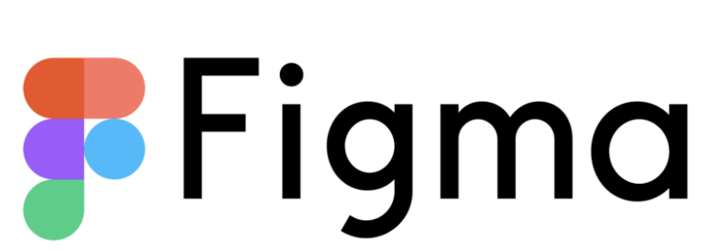
</p>

*   **Miro / UXPressia:** Empleado para la digitalización de los artefactos de Needfinding (User Personas, Journey Maps) y las sesiones de *Design-Level EventStorming*.

<p align="center">
  
  
</p>
  
**Software Development**
*   **WebStorm:** Entorno de desarrollo integrado (IDE) avanzado utilizado como herramienta principal para el desarrollo web. Ofrece soporte especializado para TypeScript y herramientas integradas de depuración que aseguran la mantenibilidad del código frontend.

<p align="center">
  
</p>

*   **Angular Framework:** Framework principal para el desarrollo de la *Web Application* de administración de HydroGuard, utilizando TypeScript.

<p align="center">
  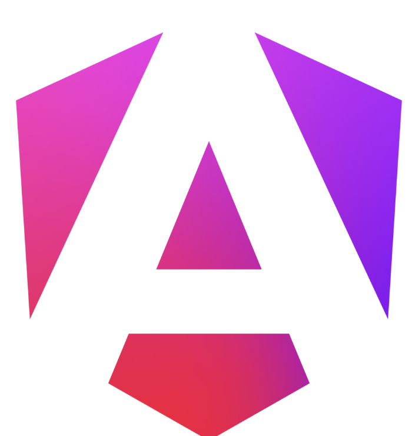
</p>

*   **Spring Boot / Flask:** Frameworks para el desarrollo de los *RESTful Web Services* y el *Edge API*, respectivamente, permitiendo el procesamiento ágil e integración de la telemetría IoT.
*   **C++ (Arduino/ESP32):** Lenguaje y entorno para la programación del *Embedded System* en el prototipo físico IoT de monitoreo de calidad del agua.
*   **VisualParadigma:** Herramienta implementada bajo *Diagram-as-Code* para la elaboración de la arquitectura de software bajo el modelo C4.

<p align="center">
  
</p>

**Source Code Management & Deployment**

*   **GitHub:** Plataforma de control de versiones y colaboración en la nube, indispensable para gestionar los repositorios del proyecto, habilitar el trabajo en equipo mediante Git y asegurar la trazabilidad del código fuente aplicando GitFlow.

<p align="center">
  
</p>

*   **Firebase / GitHub Pages:** Plataformas utilizadas para el despliegue continuo de la aplicación web (*Hosting*) y el *Landing Page*, facilitando la configuración de entornos y publicación rápida del frontend.

<p align="center">
  
</p>

### 6.1.2. Source Code Management

Para el seguimiento de las modificaciones del código fuente, el equipo utiliza **Git** como sistema de control de versiones y **GitHub** como plataforma, dentro de la organización pública <https://github.com/1ASI0572-2620-8740-IOT>. Cada producto digital cuenta con su propio repositorio:
 
* **Informe del proyecto:** <https://github.com/1ASI0572-2620-8740-IOT/report>
* **Frontend Web Application (Administrador):** <https://github.com/1ASI0572-2620-8740-IOT/hydroguard-admin-web-frontend>
* **Landing Page:** <https://github.com/1ASI0572-2620-8740-IOT/LandingPage>
 
Para la gestión de versiones, el equipo adopta **GitFlow**, el modelo de ramificación descrito por Vincent Driessen en el artículo *A successful Git branching model*. Este modelo permite establecer claramente las convenciones de ramificación que se aplican en el proyecto: cada funcionalidad se desarrolla en su propia rama, el código en integración se mantiene separado del código publicado y cada versión publicada queda identificada.
 
<p align="center">
  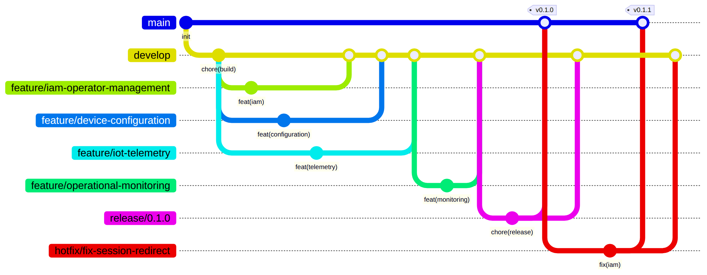
  <br><em>Modelo de ramificación GitFlow de HydroGuard (Mermaid). Los nombres de las ramas feature corresponden al Sprint 1; los commits, las ramas release y hotfix y las etiquetas de versión ilustran la convención de nombres y de integración.</em>
</p>
* **Rama principal (Main branch):** contiene el código publicado. Cada commit que llega a esta rama corresponde a una versión y se etiqueta.
  * Notación: `main`
* **Rama de desarrollo (Develop branch):** acumula las últimas funcionalidades terminadas para la siguiente versión. Funciona como entorno de integración y prueba continua.
  * Debe derivarse de: `main`
  * Notación: `develop`
* **Rama de características (Feature branch):** se utiliza para desarrollar una funcionalidad o un bounded context, de modo que el avance incompleto no afecte la rama de integración. Cada feature tiene su propia rama.
  * Debe derivarse de: `develop`
  * Debe fusionarse de vuelta a: `develop`
  * Notación: `feature/<bounded-context>-<capacidad>`, en minúsculas y en `kebab-case`. Ejemplos del Sprint 1: `feature/iam-operator-management`, `feature/device-configuration`, `feature/iot-telemetry` y `feature/operational-monitoring`.
* **Rama de lanzamiento (Release branch):** prepara una nueva versión; permite correcciones menores y ajustes finales mientras `develop` continúa recibiendo funcionalidades.
  * Debe derivarse de: `develop`
  * Debe fusionarse con: `main` y `develop`
  * Notación: `release/<MAJOR.MINOR.PATCH>`. Ejemplo: `release/0.1.0`.
* **Rama de corrección rápida (Hotfix branch):** corrige un defecto crítico detectado en la versión publicada, sin esperar al siguiente lanzamiento.
  * Debe derivarse de: `main`
  * Debe fusionarse con: `main` y `develop`
  * Notación: `hotfix/<descripcion-corta>`. Ejemplo: `hotfix/fix-session-redirect`.
La integración en `develop` y en `main` se realiza mediante *pull request*. Para ello, la compilación debe finalizar sin errores y, cuando el bounded context cuenta con verificación automatizada, los scripts `verify:bc02` o `verify:bc05` deben aprobarse. Como mejora acordada para el siguiente Sprint, cada pull request recibe la revisión de al menos otro integrante y referencia el identificador del Product Backlog que implementa.
 
**Conventional Commits:**
 
El equipo adopta **Conventional Commits** para estructurar los mensajes de commit de manera estándar y semántica, lo que facilita la comunicación y la generación automática del registro de cambios. Los mensajes se redactan en inglés con el formato `<type>(<scope>): <imperative summary>`.
 
Tipos de commit:
 
* `feat`: nuevas funcionalidades.
* `fix`: correcciones de errores.
* `docs`: cambios o mejoras en la documentación.
* `style`: cambios de formato que no afectan la ejecución.
* `refactor`: mejoras en la estructura o legibilidad del código sin cambiar su comportamiento.
* `test`: adición o modificación de pruebas y scripts de verificación.
* `build` y `ci`: compilación, dependencias e integración continua.
* `chore`: tareas de mantenimiento.
El `scope` identifica el bounded context o el componente: `iam`, `configuration`, `telemetry`, `monitoring`, `layout`, `mock-api`, `build` o `report`. Ejemplos reales del repositorio del frontend:
 
```text
feat(mock-api): add mock routes and seed datasets for operational monitoring (BC-05)
feat(monitoring): implement application use cases and query state management
test(monitoring): add automated verification script and npm script for BC-05
docs(monitoring): add testing and verification guide for BC-05 bounded context
fix(build): resolve app configuration typing and template warnings
```
 
 


### 6.1.3. Source Code Style Guide & Conventions

El equipo utiliza inglés para nombres de archivos, símbolos de programación, contratos, rutas y mensajes de commit. El español se mantiene en el contenido visible para el usuario y en la documentación dirigida a los stakeholders. Se priorizan nombres completos del lenguaje ubicuo; no se emplean abreviaciones ambiguas ni comentarios que repitan literalmente el código.

#### Convenciones comunes

- Los archivos se codifican en UTF-8, terminan con una nueva línea, eliminan espacios finales y usan dos espacios de indentación en TypeScript, HTML, CSS, JSON y Gherkin.
- La longitud recomendada es de 100 caracteres por línea. Se utilizan comillas simples en TypeScript y JavaScript, salvo que el contenido requiera otra forma.
- Cada bounded context organiza sus responsabilidades en `domain`, `application`, `infrastructure` y `presentation`. Las dependencias apuntan hacia el dominio mediante puertos; los detalles HTTP, almacenamiento y framework permanecen en infraestructura o presentación.
- Las clases, funciones y módulos tienen una sola responsabilidad. Los valores repetidos o relevantes para el dominio se extraen como constantes o tokens; se evitan números mágicos.
- Los comentarios explican decisiones, restricciones o motivos. Las reglas de negocio se expresan en código y pruebas con nombres legibles.
- Los datos sensibles, secretos y direcciones dependientes del ambiente no se incluyen en el repositorio. Se suministran mediante variables de entorno y archivos de configuración ignorados por Git.

#### TypeScript y Angular

Se siguen la guía oficial de Angular y las convenciones de Google para TypeScript, ajustadas a la arquitectura del producto:

- Los archivos usan `kebab-case` y un sufijo que expresa su rol: `monitoring-dashboard.page.ts`, `get-operational-alerts.use-case.ts`, `monitoring.repository.ts` o `monitoring.dto.ts`.
- Componentes, clases, interfaces, tipos y enumeraciones usan `PascalCase`; funciones, variables, propiedades y métodos usan `camelCase`; las constantes globales usan `UPPER_SNAKE_CASE` cuando son valores inmutables del sistema.
- Se mantiene el modo estricto de TypeScript. No se utiliza `any`; ante datos aún no validados se usa `unknown` y se realiza un estrechamiento explícito.
- Se prefieren componentes standalone, propiedades `readonly`, inyección de dependencias y composición. Los componentes de presentación delegan la obtención y transformación de datos a casos de uso y repositorios.
- Los estados asíncronos distinguen carga, datos, vacío y error. Las suscripciones o efectos deben finalizar con el ciclo de vida correspondiente.
- Los imports se agrupan en framework, dependencias externas y módulos internos. No se accede a una capa interna atravesando rutas privadas de otro bounded context.

#### HTML y CSS

El HTML utiliza elementos semánticos (`header`, `nav`, `main`, `section`, `table`, `button`) y atributos accesibles cuando el significado no puede inferirse del elemento nativo. Cada campo tiene una etiqueta asociada, cada imagen un texto alternativo apropiado y cada botón un nombre comprensible fuera de contexto. No se agregan estilos en línea.

Las clases CSS usan `kebab-case` y describen función, no apariencia circunstancial. Los colores, espacios, radios y sombras se consumen desde propiedades personalizadas. Se trabaja desde una base responsiva y se introducen puntos de quiebre solo cuando el contenido lo exige. Se evitan selectores por identificador y `!important`; cualquier excepción necesaria para adaptar un componente de Angular Material debe permanecer localizada y documentada.

#### JavaScript, JSON y API REST

Los scripts auxiliares y el mock server utilizan módulos ECMAScript (`.mjs`), `const` por defecto, `let` únicamente para reasignación y `async/await` para operaciones asíncronas. Las propiedades JSON se escriben en `lowerCamelCase`; las fechas viajan en ISO 8601 y las unidades forman parte del contrato o del nombre cuando existe ambigüedad. Las rutas REST usan sustantivos plurales en minúsculas, segmentos con guion y versionado `/api/v1`. Los códigos HTTP y el cuerpo de error mantienen un contrato uniforme y no exponen trazas internas.

#### Java/Spring y software embebido

El backend sigue Google Java Style: paquetes en minúsculas, tipos en `PascalCase`, miembros en `lowerCamelCase`, constantes en `UPPER_SNAKE_CASE` y cuatro espacios de indentación. Los sufijos `Controller`, `Service`, `Repository`, `Resource` y `Assembler` hacen explícito el rol. Los controladores traducen HTTP, los servicios coordinan casos de uso y las entidades no dependen del framework web.

En C/C++ para el dispositivo, los nombres técnicos permanecen en inglés, las constantes y pines usan `UPPER_SNAKE_CASE`, se declaran unidades y rangos, y se evita memoria dinámica innecesaria. Las operaciones de red tienen timeout y reintentos acotados. El control de válvula y las transiciones de seguridad se encapsulan, se prueban y se documentan con la razón de su comportamiento fail-safe.

#### Gherkin, pruebas y commits

Los archivos Gherkin usan nombres en `kebab-case` y las palabras clave `Feature`, `Scenario`, `Given`, `When` y `Then`. Cada escenario describe un comportamiento observable y evita detalles de implementación. Las pruebas unitarias siguen el patrón Arrange–Act–Assert; su nombre indica condición y resultado esperado.

Los commits siguen **Conventional Commits**:

```text
<type>(<scope>): <imperative summary>
```


Los tipos aceptados incluyen `feat`, `fix`, `docs`, `test`, `refactor`, `style`, `build`, `ci` y `chore`. El `scope` identifica el bounded context o componente, por ejemplo `monitoring`, `configuration`, `iam` o `report`. Ejemplos reales del desarrollo son `feat(monitoring): implement monitoring dashboard and operational alerts pages`, `test(monitoring): add bounded context verification script` y `fix(build): resolve app configuration typing and template warnings`. Antes de integrar una rama se ejecutan el formateador, la compilación y las verificaciones específicas del bounded context.

### 6.1.4. Software Deployment Configuration

**Deployment Landing Page:**
La Landing Page de HydroGuard se publica en GitHub Pages desde la rama `main` y la carpeta raíz del repositorio.

Se crea el repositorio de GitHub para alojar los archivos fuente de la Landing Page, `index.html`, `styles.css` y `script.js`.

<p align="center">
  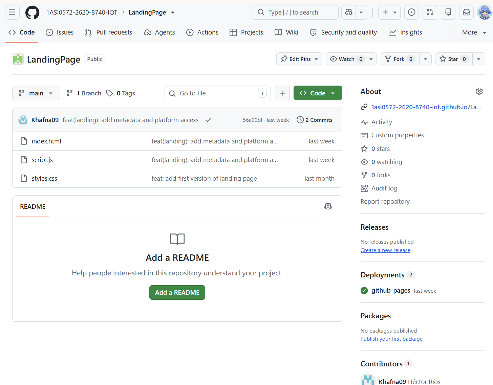
</p>
<p align="center"><em>Repositorio fuente: aquí se aloja el código; todavía no es la vista del sitio publicado.</em></p>

Se habilita GitHub Pages seleccionando la rama `main` y la carpeta raíz (`/`). La captura muestra además la URL asignada y el estado de publicación.

<p align="center">
  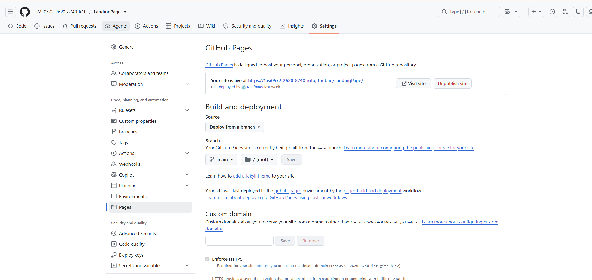
</p>
<p align="center"><em>Configuración de Pages: fuente seleccionada y enlace al sitio publicado.</em></p>

Finalmente, se comprueba el resultado abriendo [la Landing Page desplegada](https://1asi0572-2620-8740-iot.github.io/LandingPage/). Esta captura corresponde al sitio visible para los visitantes, no al repositorio ni a su configuración.

<p align="center">
  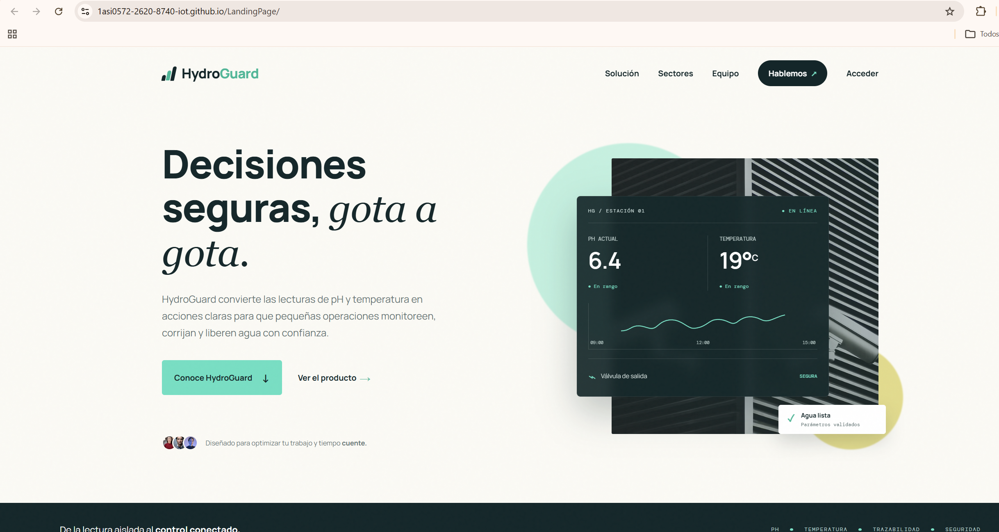
</p>
<p align="center"><em>Resultado del despliegue: Landing Page abierta desde su URL pública.</em></p>

El diagrama C4 resume este despliegue: el repositorio activa el workflow de GitHub Actions, que publica el sitio estático en GitHub Pages; los visitantes acceden mediante HTTPS.

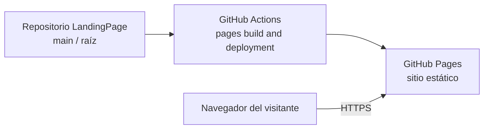
```mermaid
flowchart LR
    repo["Repositorio LandingPage<br/>main / raíz"]
    action["GitHub Actions<br/>pages build and deployment"]
    pages["GitHub Pages<br/>sitio estático"]
    browser["Navegador del visitante"]
    repo --> action --> pages
    browser -->|"HTTPS"| pages
```
## 6.2. Landing Page, Services & Applications Implementation
Esta sección detalla la ejecución técnica y colaborativa del desarrollo de HydroGuard. Se documentan las ceremonias, el diseño técnico y las evidencias de código que transforman los requisitos y modelos de arquitectura en componentes de software desplegables, estructurados de manera iterativa por *Sprints*.

### 6.2.1. Sprint 1

#### 6.2.1.1. Sprint Planning 1

En esta sesión, el equipo acordó orientar el Sprint 1 a construir el primer incremento visible de HydroGuard: publicar el *Landing Page* y desarrollar la base de la aplicación web para el Administrador. El alcance técnico se organizó en torno a los bounded contexts de acceso administrativo, configuración de dispositivos, telemetría y monitoreo operativo. La arquitectura y los contratos entre componentes se trabajaron como base para la integración progresiva; no se considera que esto demuestre por sí solo una integración funcional de extremo a extremo con el backend o la aplicación móvil.

| **Sprint #** | Sprint 1 |
|:--|:--|
| **Sprint Planning Background** | |
| Date | 2026-09-01 |
| Time | 11:00 AM |
| Location | Servidor del equipo en Discord |
| Prepared By | Santur Tello, Andrea Elizabeth |
| Attendees (to planning meeting) | Gomez Hurtado, Miguel Angel / Rodriguez Macedo, Sebastian / Santur Tello, Andrea Elizabeth / Prieto Mantari, Leonardo Fabrizzio Junior / Rios Pacheco, Hector Javier / Olivera Barzola, Eric Marlon |
| Sprint 0 Review Summary | No aplica: el Sprint 1 es el primer Sprint del proyecto. |
| Sprint 0 Retrospective Summary | No aplica: el Sprint 1 es el primer Sprint del proyecto. |
| **Sprint Goal & User Stories** | |
| Sprint 1 Goal | **Nuestro enfoque** es publicar el *Landing Page* de HydroGuard y desarrollar las principales vistas de la aplicación web del Administrador para gestionar accesos, operarios y dispositivos, y consultar telemetría e incidencias.<br><br>**Creemos que** este primer incremento permitirá presentar la solución y validar la experiencia web antes de completar la integración con los servicios reales.<br><br>**Esto se confirmará cuando** el sitio esté publicado, las vistas administrativas implementadas puedan recorrerse y el frontend compile correctamente. |
| Sprint 1 Velocity | 37 Story Points, correspondientes a las User Stories cuyos Work-items aparecen como Done en el Sprint Backlog. |
| Sum of Story Points | 47 Story Points, correspondientes a las User Stories incluidas en el Sprint Backlog y estimadas en el Product Backlog. |

#### 6.2.1.2. Aspect Leaders and Collaborators

La matriz LACX identifica quién lidera (**L**) y quién colabora (**C**) en cada aspecto transversal o funcional. El liderazgo no implica propiedad exclusiva: la persona líder mantiene la coherencia del aspecto, coordina decisiones e integra los aportes; los colaboradores revisan, implementan dependencias y aportan evidencia. La asignación se deriva de las ramas, commits y entregables realizados hasta el 3 de octubre de 2026.

| Integrante / GitHub | IAM y acceso administrativo | Configuración de dispositivos | Telemetría IoT | Monitoreo y trazabilidad | UX/UI y estándares | Arquitectura e informe |
|:--|:--:|:--:|:--:|:--:|:--:|:--:|
| Gomez Hurtado, Miguel Angel (`Miguel26112001`) | C | C | C | C | C | L |
| Rodriguez Macedo, Sebastian (`Shiftinnnnn`) | C | L | C | C | C | L |
| Santur Tello, Andrea Elizabeth (`andreli-star`) | C | C | L | C | C | C |
| Prieto Mantari, Leonardo Fabrizzio Junior (`leitojunior36`) | C | C | C | L | L | C |
| Rios Pacheco, Hector Javier (`Khafna09`) | L | C | C | C | C | C |
| Olivera Barzola, Eric Marlon (`EricMOB-afk`) | C | C | C | C | C | L |

La matriz refleja la división por bounded contexts aplicada en el frontend: Hector lideró IAM y la estructura administrativa; Sebastian, Device and Operational Configuration; Andrea, IoT Telemetry; y Leonardo, Operational Monitoring and Traceability. Miguel, Sebastian y Eric sostuvieron entregables de modelado, arquitectura y documentación. UX/UI es transversal, pero Leonardo lidera su formalización para esta entrega al convertir los patrones ya implementados en una guía verificable.

#### 6.2.1.9. Team Collaboration Insights during Sprint

Durante el Sprint 1, el equipo distribuyó el trabajo por bounded contexts y utilizó ramas de funcionalidad para mantener aislados los cambios: `feature/iam-operator-management`, `feature/device-configuration`, `feature/iot-telemetry` y `feature/operational-monitoring` en el frontend; y ramas personales o documentales para el informe. La integración se realizó sobre ramas compartidas, conservando commits pequeños y descriptivos que permiten reconstruir la evolución del producto.

En el frontend, Operational Monitoring and Traceability se desarrolló después de Device and Operational Configuration para aprovechar su estructura y lenguaje visual. Se incorporaron progresivamente modelos de dominio, puerto de repositorio, adaptador Axios, casos de uso, estado de presentación, datos mock, tablero, alertas, incidencias, trazabilidad, rutas y acceso desde la barra lateral. Esta secuencia redujo el acoplamiento y permitió verificar el bounded context de manera independiente.

Las siguientes gráficas resumen los commits alcanzados en todas las ramas locales/remotas disponibles al cierre del 3 de octubre de 2026. Las identidades duplicadas por nombre o correo se consolidaron por integrante. El conteo representa actividad versionada y no se interpreta por sí solo como medida de calidad o esfuerzo.

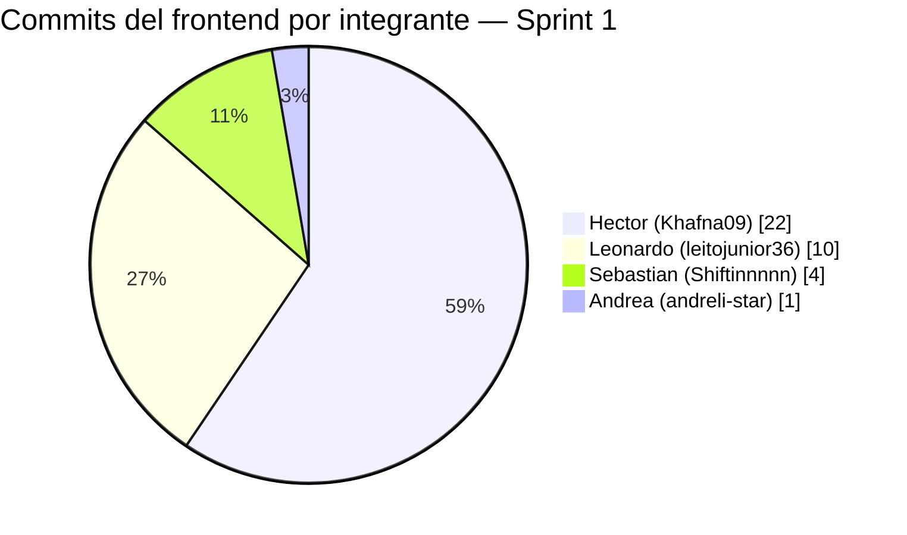
```mermaid
pie showData
    title Commits del frontend por integrante — Sprint 1
    "Hector (Khafna09)" : 22
    "Leonardo (leitojunior36)" : 10
    "Sebastian (Shiftinnnnn)" : 4
    "Andrea (andreli-star)" : 1
```

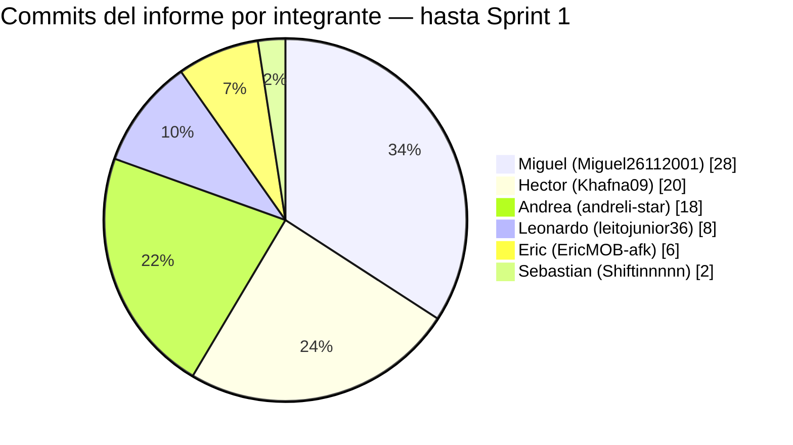
```mermaid
pie showData
    title Commits del informe por integrante — hasta Sprint 1
    "Miguel (Miguel26112001)" : 28
    "Hector (Khafna09)" : 20
    "Andrea (andreli-star)" : 18
    "Leonardo (leitojunior36)" : 8
    "Eric (EricMOB-afk)" : 6
    "Sebastian (Shiftinnnnn)" : 2
```

La evidencia muestra una colaboración complementaria: el repositorio de producto concentra a quienes implementaron los primeros bounded contexts, mientras el repositorio del informe visibiliza el trabajo de modelado y documentación de los seis integrantes. Por ello, el equipo considera ambos repositorios al evaluar participación. La actividad puede consultarse en [los commits del frontend](https://github.com/1ASI0572-2620-8740-IOT/hydroguard-admin-web-frontend/commits) y [los commits del informe](https://github.com/1ASI0572-2620-8740-IOT/report/commits).

Los principales retos de integración fueron mantener rutas y providers coherentes al agregar módulos, compartir el layout sin acoplar los dominios, alinear DTOs con contratos mock y sostener una interfaz homogénea. El equipo los afrontó mediante una arquitectura por capas, puertos de repositorio, tokens visuales compartidos, contratos versionados y verificación de compilación antes de integrar. Como mejora para el siguiente sprint, se acordó reforzar la revisión cruzada mediante pull requests, adjuntar evidencia de pruebas a cada historia, asociar commits con identificadores del Product Backlog y registrar decisiones de arquitectura cuando afecten a más de un bounded context.

En conjunto, el sprint permitió trabajar de manera paralela sin perder una experiencia unificada. La separación de responsabilidades facilitó el liderazgo distribuido, mientras que las convenciones de código, las ramas por funcionalidad y la documentación común ofrecieron puntos concretos de coordinación.

#### 6.2.1.3. Sprint Backlog 1

El Sprint Backlog 1 reúne las historias seleccionadas para el incremento web de HydroGuard y las tareas necesarias para implementarlas. Incluye el *Landing Page*, la aplicación web del Administrador y tareas transversales de desarrollo y verificación. Se consideran **29 Work-items**, con una estimación total de **118 horas**. Las 17 historias suman **47 Story Points**; las que figuran completadas representan **37 Story Points**.

**Sprint #:** Sprint 1

**Tablero de Trello:**

<p align="center">
  
</p>
<p align="center"><em>Lista Product Backlog del tablero de HydroGuard en Trello.</em></p>

**URL público del Board:** Pendiente de incorporar.

| Story Id | Story Title | Task Id | Task Title | Task Description | Estimation (Hours) | Assigned To | Status (To-do / InProcess / ToReview / Done) |
|:--|:--|:--|:--|:--|:--:|:--|:--|
| US-34 | Comprensión de la propuesta de valor | T-01 | Maquetar la sección principal del Landing Page | Presentar el problema del control manual del agua y la propuesta de valor de HydroGuard. | 3 | Por confirmar | Por confirmar |
|  |  | T-02 | Aplicar los tokens de la guía de estilo | Usar la tipografía, la paleta y los espaciados definidos en la sección 5.1 en el Landing Page. | 2 | Por confirmar | Por confirmar |
| US-35 | Explicación del funcionamiento de la solución | T-03 | Maquetar la sección de funcionamiento | Explicar las etapas de lectura, evaluación, corrección, espera y liberación. | 3 | Por confirmar | Por confirmar |
| US-36 | Segmentos y casos de uso | T-04 | Maquetar la sección de segmentos | Describir los casos de uso del segmento textil y del hidropónico. | 3 | Por confirmar | Por confirmar |
| US-37 | Solicitud de contacto o demostración | T-05 | Implementar el formulario de contacto | Formulario con validación de campos obligatorios y mensaje de confirmación. | 4 | Por confirmar | Por confirmar |
| US-38 | Acceso a la plataforma | T-06 | Enlazar el acceso con la aplicación web | El llamado a la acción dirige a la vista de inicio de sesión de la aplicación web. | 1 | Por confirmar | Por confirmar |
| US-01 | Registro de operario | T-07 | Implementar el caso de uso de alta de operario | Modelo de dominio, puerto de repositorio, adaptador Axios y caso de uso `create-operator-account`. | 3 | Rios Pacheco, Hector Javier | Done |
|  |  | T-08 | Implementar la página de alta de operario | Página `operator-create` con validaciones de formulario y retroalimentación de errores. | 3 | Rios Pacheco, Hector Javier | Done |
|  |  | T-09 | Implementar el código de primer acceso | Casos de uso y página `first-access-code` para generar, consultar y revocar el código. | 3 | Rios Pacheco, Hector Javier | Done |
| US-02 | Autenticación de usuario | T-10 | Implementar el inicio de sesión del Administrador | Página `admin-login`, caso de uso `sign-in-admin` y manejo de la sesión. | 4 | Rios Pacheco, Hector Javier | Done |
|  |  | T-11 | Proteger las rutas de la aplicación | Guard `adminAuthGuard` sobre el layout y las rutas hijas, con cierre de sesión. | 3 | Rios Pacheco, Hector Javier | Done |
| US-39 | Asignación automática de rol según el flujo de alta | T-12 | Implementar el registro de empresa | Página `administrator-register`: crea la empresa y su única cuenta Administradora. | 4 | Rios Pacheco, Hector Javier | Done |
| US-03 | Asignación de dispositivo a operario | T-13 | Implementar perfiles de operario y asignaciones | Páginas `operator-profiles`, `operator-profile-detail` y casos de uso de asignación y cierre. | 5 | Rodriguez Macedo, Sebastian | Done |
| US-04 | Supervisión de operarios y dispositivos | T-14 | Implementar el listado y el detalle de operarios | Páginas `users` y `user-detail` con estado y filtros. | 4 | Rios Pacheco, Hector Javier | Done |
|  |  | T-15 | Implementar el listado y el detalle de dispositivos | Páginas `devices` y `device-detail` con disponibilidad y asignación vigente. | 5 | Rodriguez Macedo, Sebastian | Done |
| US-05 | Asignación de segmento y perfil base al dispositivo | T-16 | Implementar grupos de trabajo y reservorios | Páginas de listado, alta y detalle de `work-groups` y `reservoirs` del segmento de la empresa. | 6 | Rodriguez Macedo, Sebastian | Done |
|  |  | T-17 | Implementar el alta de dispositivos | Página `device-create` con entorno operativo y capacidades, y vinculación exclusiva con el reservorio. | 4 | Rodriguez Macedo, Sebastian | Done |
| US-10 | Consulta de configuración de cualquier dispositivo | T-18 | Implementar la consulta de versiones de configuración | Página `configuration-versions` con la configuración vigente y su historial de versiones. | 4 | Rodriguez Macedo, Sebastian | Done |
| US-11 | Monitoreo de mediciones en tiempo real | T-19 | Implementar la vista general de telemetría | Página `telemetry-overview` con la última medición y la disponibilidad de cada dispositivo. | 5 | Santur Tello, Andrea Elizabeth | Done |
|  |  | T-20 | Simular el heartbeat en el servidor mock | Ruta `mock-api/telemetry` que calcula la disponibilidad según el intervalo de heartbeat. | 3 | Santur Tello, Andrea Elizabeth | Done |
| US-27 | Consulta del historial de cualquier dispositivo | T-21 | Implementar el historial de mediciones por dispositivo | Página `device-telemetry-detail` con paginación y ordenamiento por fecha, pH y temperatura. | 5 | Santur Tello, Andrea Elizabeth | Done |
| US-25 | Alerta por pérdida de monitoreo | T-22 | Implementar el tablero de monitoreo | Página `monitoring-dashboard` con el estado operativo por dispositivo y la pérdida de monitoreo. | 5 | Prieto Mantari, Leonardo Fabrizzio Junior | Done |
|  |  | T-23 | Implementar las alertas operativas | Página `operational-alerts` con filtros por prioridad y estado. | 4 | Prieto Mantari, Leonardo Fabrizzio Junior | Done |
| US-24 | Registro de incidente de calidad | T-24 | Implementar los incidentes de calidad | Página `quality-incidents` para registrar y consultar incidentes. | 5 | Prieto Mantari, Leonardo Fabrizzio Junior | Done |
| US-30 | Trazabilidad de tratamiento y liberación | T-25 | Implementar la trazabilidad | Página `traceability` que relaciona mediciones, ciclos de corrección y liberaciones. | 6 | Prieto Mantari, Leonardo Fabrizzio Junior | Done |
| — | Tareas transversales | T-26 | Implementar el servidor mock base | `mock-api/server.mjs` y `db.json` con los contratos `/api/v1` de IAM por empresa. | 6 | Rios Pacheco, Hector Javier | Done |
|  |  | T-27 | Implementar el layout y la guía de estilo web | Layout de administración con barra lateral y componentes compartidos de carga, vacío y error. | 6 | Prieto Mantari, Leonardo Fabrizzio Junior | Done |
|  |  | T-28 | Automatizar la verificación de los bounded contexts | Scripts `verify:bc02` y `verify:bc05`, y sus guías de pruebas en `docs/`. | 6 | Rodriguez Macedo, Sebastian | Done |
|  |  | T-29 | Documentar convenciones de código y matriz LACX | Secciones 6.1.3 y 6.2.1.2 del informe. | 3 | Prieto Mantari, Leonardo Fabrizzio Junior | Done |

# Conclusiones

## Conclusiones y recomendaciones

* **Resultados frente al Problem Statement:** El diseño de HydroGuard responde con eficacia a la problemática de las micro y pequeñas empresas textiles y pequeños productores hidropónicos, resolviendo la dependencia de mediciones manuales aisladas y registros dispersos. La arquitectura basada en Domain-Driven Design (DDD) y microservicios demostró la viabilidad de unificar la lógica operativa de ambos sectores en un núcleo común configurable, capaz de supervisar pH y temperatura, ejecutar la dosificación correctiva por ciclos, decidir automáticamente si debe continuar o detenerse y asegurar la liberación controlada del agua según normativas VMA o requerimientos agrícolas. En el prototipo académico, el LED representa la actuación mientras una persona del equipo realiza manualmente la corrección por falta de dosificadores físicos.

* **Contrastación de Assumptions frente al comportamiento real:** Las validaciones de campo ratificaron que ambos segmentos comparten el mismo flujo base (medir, corregir, esperar y liberar) y valoran la supervisión remota mediante smartphones para evitar desplazamientos continuos. Como contraste clave, se identificó que el sector textil se beneficia de la liberación automática al alcanzar valores conformes, mientras que en hidroponía los productores exigen mantener la confirmación manual final antes del riego para resguardar sus cultivos frente a contingencias.

* **Validación de Hypotheses Statements y Criterios de Éxito:** Se confirmaron las hipótesis de Lean UX (H-01 a H-04). Los perfiles configurables permiten adaptar el sistema a distintos contextos sin modificar el software base; el panel de telemetría y la máquina de estados reducen la incertidumbre y el error humano durante los intervalos de estabilización; y las políticas de válvula cerrada por defecto junto a la parada de emergencia garantizan la mitigación de vertimientos indebidos y pérdidas de producción.

* **Recomendaciones para el Roadmap de productos digitales:** Para los siguientes ciclos se recomienda priorizar la integración de los microservicios en Spring Boot con las aplicaciones web (Angular) y móviles (Flutter), afianzar la comunicación con el dispositivo IoT (ESP32 y simulador Wokwi) incorporando almacenamiento local temporal ante caídas de red, y realizar pruebas piloto en entornos operativos reales. A mediano plazo, se sugiere evaluar la incorporación modular de nuevos parámetros (como conductividad eléctrica) y herramientas de analítica histórica.


# Bibliografía

Autoridad Nacional del Agua. (s. f.). *Solicitar la autorización de vertimiento de aguas residuales tratadas a los cuerpos naturales de agua*. Plataforma Digital Única del Estado Peruano. Recuperado el 1 de septiembre de 2026, de <https://www.gob.pe/10822-solicitar-la-autorizacion-de-vertimiento-de-aguas-residuales-tratadas-a-los-cuerpos-naturales-de-agua>

Angular. (s. f.). *Style guide*. Recuperado el 3 de octubre de 2026, de <https://angular.dev/style-guide>

Bluelab. (s. f.). *Bluelab Pro Controller Wi-Fi*. Recuperado el 3 de septiembre de 2026, de <https://bluelab.com/products/bluelab-pro-controller-wi-fi>

Cucumber. (s. f.). *Gherkin reference*. Recuperado el 3 de octubre de 2026, de <https://cucumber.io/docs/gherkin/reference/>

Firebase. (s. f.). *Firebase Cloud Messaging architectural overview*. Recuperado el 6 de octubre de 2026, de <https://firebase.google.com/docs/cloud-messaging/fcm-architecture>

Firebase. (s. f.). *Your server environment and FCM*. Recuperado el 6 de octubre de 2026, de <https://firebase.google.com/docs/cloud-messaging/server-environment>

Google. (s. f.). *Google HTML/CSS Style Guide*. Recuperado el 3 de octubre de 2026, de <https://google.github.io/styleguide/htmlcssguide.html>

Google. (s. f.). *Google Java Style Guide*. Recuperado el 3 de octubre de 2026, de <https://google.github.io/styleguide/javaguide.html>

Google. (s. f.). *Google TypeScript Style Guide*. Recuperado el 3 de octubre de 2026, de <https://google.github.io/styleguide/tsguide.html>

Hach. (s. f.). *SC4500 Controller, Claros-enabled, LAN + mA output, 2 analog UPW pH/ORP sensors*. Recuperado el 3 de septiembre de 2026, de <https://uk.hach.com/controllers-analogue/sc4500-analog-controller/family?productCategoryId=68824439962>

Hanna Instruments. (s. f.). *HALO2 wireless pH meter*. Recuperado el 3 de septiembre de 2026, de <https://hannainst.com/halo2/>

Instituto Nacional de Innovación Agraria. (2024, 19 de agosto). *MIDAGRI: Más de 6,500 productores incrementan producción de hortalizas de calidad en módulos hidropónicos*. Plataforma Digital Única del Estado Peruano. <https://www.gob.pe/institucion/inia/noticias/1008212-midagri-mas-de-6-500-productores-incrementan-produccion-de-hortalizas-de-calidad-en-modulos-hidroponicos>

Ministerio de la Producción. (2024). *Reporte de producción manufacturera: Julio 2024*. Oficina General de Evaluación de Impacto y Estudios Económicos. <https://ogeiee.produce.gob.pe/index.php/en/shortcode/oee-documentos-publicaciones/boletines-industria-manufacturera/item/download/2242_f5124d16622da3a644ec5a2adc815339>

Ministerio de Trabajo y Promoción del Empleo. (s. f.). *Registro de la Micro y Pequeña Empresa (REMYPE)*. Plataforma Digital Única del Estado Peruano. Recuperado el 1 de septiembre de 2026, de <https://www.gob.pe/279-registro-de-la-micro-y-pequena-empresa->

Ministerio de Vivienda, Construcción y Saneamiento. (2019). *Decreto Supremo N.° 010-2019-VIVIENDA, Reglamento de Valores Máximos Admisibles para las descargas de aguas residuales no domésticas en el sistema de alcantarillado sanitario*. Diario Oficial El Peruano. <https://busquedas.elperuano.pe/dispositivo/NL/1748339-3>

Ocas Sifuentes, M., Vilcapoma Aquino, D., Meza Montalvo, A., Mestanza Velasco, S., & Borjas Ventura, R. (2025). *Cultivo hidropónico de hortalizas de hoja*. Instituto Nacional de Innovación Agraria. <http://hdl.handle.net/20.500.12955/2782>

Superintendencia Nacional de Servicios de Saneamiento. (2020). *Resolución de Consejo Directivo N.° 011-2020-SUNASS-CD: Norma complementaria al Reglamento de Valores Máximos Admisibles*. Plataforma Digital Única del Estado Peruano. <https://www.gob.pe/institucion/sunass/normas-legales/992245-011-2020-sunass-cd>

World Wide Web Consortium. (2024). *Web Content Accessibility Guidelines (WCAG) 2.2*. <https://www.w3.org/TR/WCAG22/>
