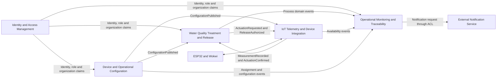

# Correcciones y guía para el diseño estratégico DDD de HydroGuard

## Propósito y criterio de revisión

Este es un documento privado de evaluación para orientar revisiones futuras; no forma parte del informe ni define por sí mismo el proyecto. Registra posibles correcciones para las secciones 4.1 a 4.1.2 a partir de `README.md`, con `propuesta IOT.docx` e `instrucciones.md` como antecedentes y criterios de contraste.

El capítulo 4.1 y sus subapartados ya cuentan con contenido e imágenes en el informe. Las indicaciones de este archivo deben interpretarse como criterios para corregir o validar lo existente, no como una orden de recrear artefactos que ya fueron elaborados. Las imágenes se mantienen sin cambios hasta recibir feedback del profesor.

Para evaluar el estado vigente, `README.md` es la fuente principal. Cualquier recomendación debe respetar la siguiente distinción entre el producto integral y las sustituciones usadas para demostrarlo académicamente:

- El producto integral contempla dosificación física y las actuaciones térmicas definidas para corregir el agua.
- El sistema evalúa automáticamente el pH y la temperatura, selecciona la estrategia y decide en cada ciclo si aplica otra dosis o si detiene el tratamiento.
- La dosificación no permanece activa de manera constante: se ejecuta durante la etapa correctiva, se detiene, espera el intervalo configurado y utiliza una nueva medición para decidir si continúa o finaliza.
- El operario configura rangos, tratamiento o sustancia, dosis o intensidad, tiempo de espera, límite de ciclos y modo de liberación.
- En el prototipo físico académico, la orden de dosificación enciende el LED correspondiente y una persona del equipo realiza manualmente la corrección y la mezcla porque no se dispone de los actuadores requeridos.
- En la simulación, la orden activa el LED o actuador visual y una persona modifica después el valor del sensor simulado para representar el efecto de la corrección.
- El dispositivo físico y el simulado deben utilizar contratos equivalentes de telemetría, configuración, comandos y confirmaciones, aunque sus capacidades físicas sean diferentes.
- HydroGuard es multiempresa: cada organización registra una única cuenta administradora y sus usuarios y recursos permanecen aislados mediante `organizationId`.
- Cada organización selecciona un único segmento durante el registro. Sus grupos y dispositivos heredan ese segmento y no lo redefinen.

Por tanto, la corrección manual es una sustitución demostrativa propia del prototipo académico, no una limitación del producto definido. El encendido del LED confirma que el sistema ordenó y mantiene en curso la etapa correctiva; solo una medición posterior permite comprobar su resultado.

## Resultado arquitectónico recomendado

La solución debe organizarse en cinco bounded contexts. Esta cantidad cubre el dominio completo sin convertir canales, tecnologías o componentes físicos en contextos independientes.

| Bounded context recomendado | Evolución del contexto actual | Clasificación | Responsabilidad principal |
|:--|:--|:--|:--|
| **Identity and Access Management** | Corrige y amplía Autenticación | Generic | Registro de organización y su único Administrador, cuentas, credenciales, roles, sesión, pertenencia organizacional y autorización general. |
| **Device and Operational Configuration** | Corrige y amplía Configuración | Supporting | Grupos, reservorios, registro y asignación de dispositivos, perfiles, rangos, estrategias correctivas, ciclos, tiempos y modos de liberación dentro de una organización. |
| **IoT Telemetry and Device Integration** | Corrige y amplía Telemetría IoT | Supporting | Identidad técnica del dispositivo, mediciones, disponibilidad, sincronización, comandos y confirmaciones de actuadores físicos o simulados. |
| **Water Quality Treatment and Release** | Sustituye el alcance central de Alertas y Control | Core | Evaluación, tratamiento correctivo automático o asistido, máquina de estados, ciclos, fallo, autorización de liberación y reglas de seguridad. |
| **Operational Monitoring and Traceability** | Conserva alertas e incorpora el contexto que falta | Supporting | Alertas, incidentes, historial, vistas de supervisión, trazabilidad, reportes y exportaciones. |

Los nombres pueden presentarse en inglés para mantener consistencia con la plantilla académica, pero debe utilizarse también una traducción estable en el Ubiquitous Language. No se deben alternar nombres diferentes para el mismo contexto entre diagramas, historias y texto.

Un bounded context define un límite lógico de modelo y lenguaje; no obliga a desplegar inmediatamente un microservicio independiente. La correspondencia con componentes desplegables debe decidirse en el diseño arquitectónico posterior según acoplamiento, operación y escala.

## Correcciones de los bounded contexts actuales

### Identity and Access Management

#### Problemas identificados

El modelo anterior limitaba este contexto a registrar un operario e iniciar sesión. La visión vigente exige además incorporar organizaciones independientes y garantizar que cada una tenga exactamente un Administrador. El registro público crea conjuntamente la empresa y su Administrador; los Operarios no se autorregistran y son creados después por dicho Administrador.

El contexto debe:

- Registrar de forma transaccional una organización y su única cuenta administradora.
- Conservar nombre o razón social, RUC, teléfono y único segmento de la organización.
- Validar la unicidad del RUC y del correo del Administrador.
- Autenticar al Administrador mediante correo y contraseña.
- Registrar, activar y desactivar cuentas de Operario dentro de la organización autenticada.
- Mantener rol, estado de cuenta, sesión y pertenencia organizacional.
- Emitir una identidad verificable que incluya `organizationId` como alcance autorizado.
- Impedir que una sesión consulte o modifique recursos de otra organización.

#### Elementos mínimos del EventStorming

- Comandos: `Registrar organización y administrador`, `Registrar operario`, `Iniciar sesión`, `Activar cuenta`, `Desactivar cuenta`.
- Eventos: `Organización registrada`, `Administrador registrado`, `Operario registrado`, `Sesión iniciada`, `Cuenta activada`, `Cuenta desactivada`.
- Reglas: cada organización tiene exactamente un Administrador; el RUC y el correo del Administrador son únicos; una cuenta inactiva no puede autenticarse; únicamente el Administrador de la organización puede registrar o administrar sus Operarios; el backend deriva `organizationId` de una sesión verificada.

### Configuración

#### Problemas identificados

El diagrama actual incluye la asignación de dispositivos, rangos de pH y temperatura y modo de liberación, pero no representa completamente el alcance del README ni de la propuesta. Faltan el perfil por segmento, el tiempo de espera, el límite absoluto de ciclos, la estrategia de corrección de pH, la dosificación o intensidad representada y el tratamiento térmico pasivo o activo.

#### Corrección requerida

Renombrar el contexto como **Device and Operational Configuration** o **Configuración de Dispositivos y Operación**. Debe poseer:

- Registro lógico del dispositivo y su tipo de entorno: físico o simulado.
- Creación de grupos, reservorios y perfiles dentro de la organización autenticada.
- Asignación vigente de un dispositivo a un operario.
- Rangos permitidos de pH y temperatura.
- Tiempo de espera entre una acción correctiva y la reevaluación.
- Límite máximo de ciclos de tratamiento.
- Modo de liberación manual o automático.
- Estrategia de corrección de pH: aumentar o reducir, sustancia o acción representada y dosificación configurada.
- Estrategia térmica: enfriamiento pasivo, enfriamiento activo u otra acción que el equipo decida demostrar.
- Herencia del único segmento definido por la organización; el grupo, el perfil y el dispositivo no seleccionan otro segmento.
- Validación de que grupos, reservorios, dispositivos, perfiles y asignaciones pertenezcan al mismo `organizationId`.

#### Elementos mínimos del EventStorming

- Comandos: `Registrar dispositivo`, `Asignar dispositivo`, `Configurar rangos`, `Configurar estrategia correctiva`, `Configurar tiempo de espera`, `Configurar límite de ciclos`, `Configurar modo de liberación`, `Publicar configuración`.
- Eventos: `Dispositivo registrado`, `Dispositivo asignado`, `Rangos configurados`, `Estrategia correctiva configurada`, `Configuración publicada`, `Configuración reemplazada`.
- Reglas: el límite inferior debe ser menor o igual al superior; el tiempo y el límite de ciclos deben ser positivos; solamente el operario asignado o el Administrador de la organización puede modificar la configuración; no se puede activar un perfil incompatible con las capacidades declaradas por el dispositivo; no se pueden relacionar recursos de organizaciones distintas.

### Telemetría IoT

#### Problemas identificados

El EventStorming actual solo muestra `Leer sensores` y `Medición del agua registrada`. Esto no cubre la autenticación técnica del dispositivo, la procedencia física o simulada, la validación, el almacenamiento temporal sin conexión, la disponibilidad, los comandos al servomotor o a los LED y la confirmación de ejecución.

#### Corrección requerida

Renombrar el contexto como **IoT Telemetry and Device Integration** o **Telemetría e Integración de Dispositivos**. Debe hacerse responsable de:

- Autenticar la identidad técnica de cada dispositivo.
- Recibir pH, temperatura, marca de tiempo, origen y número de secuencia.
- Validar estructura, unidades y límites físicos del sensor.
- Detectar mensajes duplicados sin registrar dos veces la misma medición.
- Mantener almacenamiento temporal cuando no exista conectividad.
- Informar disponibilidad mediante heartbeat o última comunicación.
- Entregar al dispositivo la configuración publicada que necesita para operar.
- Recibir solicitudes de actuación desde el core y traducirlas al hardware físico o simulado.
- Encender el LED o componente que representa aumento o reducción de pH y tratamiento térmico.
- Accionar el servomotor de la válvula cuando exista una autorización válida.
- Confirmar ejecución, rechazo o error de los comandos.
- Conservar la organización asociada a cada dispositivo y rechazar mensajes cuya identidad técnica no corresponda a ella.

La medición registrada no debe decidir si el agua es conforme. IoT Telemetry and Device Integration comprueba que el dato sea técnicamente utilizable; **Water Quality Treatment and Release** determina su significado para el proceso.

#### Elementos mínimos del EventStorming

- Comandos: `Autenticar dispositivo`, `Registrar medición`, `Sincronizar configuración`, `Ejecutar ajuste correctivo`, `Abrir válvula`, `Cerrar válvula`, `Ejecutar parada de emergencia`.
- Eventos: `Dispositivo autenticado`, `Medición registrada`, `Medición rechazada`, `Dispositivo no disponible`, `Configuración sincronizada`, `Ajuste correctivo ejecutado`, `Ajuste correctivo rechazado`, `Válvula abierta`, `Válvula cerrada`.
- Reglas: todo mensaje debe identificar al dispositivo; las mediciones repetidas deben ser idempotentes; una orden de emergencia tiene prioridad; una apertura se rechaza si no contiene o no referencia una autorización de liberación vigente.

### Alertas y Control

#### Problemas identificados

Este contexto concentra la evaluación, la corrección, los ciclos, el fallo, las alertas, la liberación y la emergencia. El problema no es la cantidad de pasos, sino que el nombre oculta el modelo que diferencia al producto: controlar un proceso de tratamiento y liberación a partir de mediciones, configuración y retroalimentación.

También mezcla dos modelos con ciclos de vida diferentes:

- El proceso de calidad cambia entre lectura, corrección, espera, reevaluación, listo, liberación y fallo.
- Una alerta cambia entre generada, comunicada, atendida y resuelta, mientras el historial y los reportes se construyen con información de varios contextos.

#### Corrección requerida

Reemplazar este límite por dos responsabilidades, sin aumentar innecesariamente la cantidad total de contextos:

1. **Water Quality Treatment and Release**, como core domain.
2. **Operational Monitoring and Traceability**, que incorpora alertas, incidentes, historial y reportes.

### Water Quality Treatment and Release

Este contexto debe poseer la máquina de estados y las decisiones del proceso. Sus responsabilidades son:

- Iniciar un proceso de tratamiento asociado a un dispositivo y una configuración vigente.
- Evaluar una medición válida contra los rangos aplicables.
- Determinar si el agua es conforme o no conforme.
- Seleccionar la estrategia de corrección configurada para cada desviación.
- Ordenar la dosificación o actuación correctiva definida para el producto y adaptar su ejecución al entorno: actuador físico, representación simulada o LED con intervención manual en el prototipo académico.
- Esperar la confirmación de actuación y el intervalo configurado.
- Solicitar o aceptar una nueva medición y reevaluar.
- Contabilizar cada ciclo de manera inequívoca.
- Comprobar si existe una variación útil y si se alcanzó el límite absoluto.
- Pasar al estado de fallo cuando corresponda y mantener la retención.
- Autorizar la liberación automática o solicitar confirmación del operario en modo manual.
- Bloquear cualquier apertura fuera del estado listo.
- Priorizar la parada de emergencia y exigir un restablecimiento explícito.
- Garantizar que configuración, medición, dispositivo y proceso pertenezcan a la misma organización.

#### Máquina de estados recomendada

`Sin iniciar -> Midiendo -> Evaluando -> Corrigiendo -> Esperando -> Reevaluando -> Listo -> Liberando -> Finalizado`

Rutas alternativas:

- `Evaluando -> Fallo` por medición inválida crítica, ausencia de configuración o condición no recuperable.
- `Reevaluando -> Corrigiendo` mientras queden ciclos y la política permita continuar.
- `Reevaluando -> Fallo` al alcanzar el límite o no producirse el cambio exigido por la regla.
- `Cualquier estado activo -> Emergencia -> Bloqueado` por parada de emergencia.
- `Bloqueado -> Sin iniciar` únicamente después de un restablecimiento autorizado y seguro.

El equipo debe decidir y documentar si una medición inválida produce fallo inmediato o solamente se descarta hasta superar un límite de tiempo. Esa decisión no debe quedar implícita.

#### Elementos mínimos del EventStorming

- Comandos: `Iniciar proceso`, `Evaluar medición`, `Aplicar estrategia correctiva`, `Confirmar actuación`, `Iniciar espera`, `Reevaluar agua`, `Confirmar liberación manual`, `Activar parada de emergencia`, `Restablecer proceso`.
- Eventos: `Proceso iniciado`, `Agua no conforme detectada`, `Agua conforme confirmada`, `Estrategia correctiva seleccionada`, `Actuación correctiva solicitada`, `Actuación correctiva confirmada`, `Tiempo de espera finalizado`, `Ciclo de tratamiento completado`, `Límite de ciclos alcanzado`, `Proceso bloqueado`, `Liberación autorizada`, `Parada de emergencia activada`, `Proceso restablecido`.
- Reglas: solamente una medición posterior al tiempo de espera puede cerrar el ciclo; una confirmación de LED indica que la orden se representó, no que el valor físico ya cambió; únicamente una nueva medición puede demostrar el resultado; la válvula permanece cerrada ante incertidumbre, fallo o emergencia.

### Operational Monitoring and Traceability

#### Razón para incorporarlo

El README contiene un epic completo de historial, reportes y trazabilidad, además de alertas e incidentes, pero el EventStorming no representa la construcción ni consulta de esa información. Este contexto es necesario porque reúne datos provenientes de Telemetría, Configuración y el proceso central sin apropiarse de sus reglas.

#### Responsabilidades

- Crear y administrar alertas operativas.
- Registrar incidentes de calidad y pérdida de monitoreo.
- Correlacionar mediciones, evaluaciones, actuaciones, ciclos, alertas y liberaciones.
- Mantener vistas de estado para operario y administrador.
- Generar reportes por dispositivo y periodo.
- Exportar reportes sin alterar los registros de origen.
- Mantener el actor, dispositivo, configuración y marcas de tiempo asociados a cada decisión.
- Integrarse con el proveedor externo de notificaciones y gestionar reintentos.
- Construir alertas, vistas, incidentes y reportes limitados a la organización autorizada.

#### Elementos mínimos del EventStorming

- Comandos: `Generar alerta`, `Marcar alerta atendida`, `Resolver alerta`, `Registrar incidente`, `Generar reporte`, `Exportar reporte`.
- Eventos: `Alerta generada`, `Notificación enviada`, `Notificación fallida`, `Alerta atendida`, `Alerta resuelta`, `Incidente registrado`, `Reporte generado`, `Reporte exportado`.
- Vistas: `Estado actual del dispositivo`, `Alertas activas`, `Historial del proceso`, `Trazabilidad de liberación`, `Resumen de dispositivos`.

## Contextos que no deben añadirse por ahora

Para conservar límites útiles y evitar sobrearquitectura, no se recomienda crear contextos independientes para:

- **Textile** e **Hydroponic**: son perfiles de operación del mismo proceso mientras no posean modelos o reglas incompatibles.
- **Dosification**: la estrategia, la dosis y la decisión de continuar o detenerse pertenecen al tratamiento; la integración del dispositivo ejecuta la dosificación física del producto o su representación mediante LED en los entornos académicos.
- **Valve Control**: la autorización es parte del core y la ejecución es parte de la integración IoT.
- **Web Application**, **Mobile Application** o **Landing Page**: son interfaces y canales.
- **Edge API**, **REST API**, **Spring Boot**, **Angular**, **ESP32** o **Wokwi**: son decisiones o componentes técnicos.
- **Notification Service**: debe modelarse como sistema externo conectado mediante un adaptador.
- **Physical Prototype** y **Simulation**: son entornos con capacidades diferentes bajo los mismos contratos del dominio.
- **Organization Management**: no se necesita mientras el alcance se limite al registro inicial de la empresa, su único Administrador y el aislamiento de recursos. Esta incorporación permanece en IAM; deberá reevaluarse si aparecen sedes, facturación, planes o administración comercial independiente.

La separación entre los segmentos deberá revisarse únicamente si las entrevistas demuestran procesos, términos o reglas contradictorias que no puedan representarse mediante perfiles.

## Correcciones necesarias en las otras secciones del README

### Registro de versiones y tabla de contenidos

#### Hallazgos

- El registro de versiones ya contiene las contribuciones de AV1 agrupadas por fecha y autor.
- Product Backlog y el capítulo IV ya existen en el cuerpo del informe.
- La tabla de contenidos todavía conserva el marcador `NOMBRE_DE_BOUNDED_CONTEXT_POR_DEFINIR` para 4.2, aunque el cuerpo ya contiene los cinco contextos tácticos.
- Debe verificarse la numeración y los enlaces internos cada vez que se modifique el capítulo de arquitectura.

#### Acciones

- Mantener el registro de cada entrega real con versión, fecha, autores y descripción verificable.
- Actualizar la tabla de contenidos después de crear las secciones, comprobando manualmente todos los enlaces.
- Sustituir el marcador de 4.2 en la tabla de contenidos por las subsecciones de los cinco bounded contexts ya desarrollados.

### Student Outcome

#### Hallazgos

La tabla ya contiene acciones y conclusiones de AV1 por integrante. En las siguientes entregas debe conservarse el carácter acumulativo y añadirse únicamente trabajo respaldado por evidencia del repositorio.

#### Acciones

- Mantener el párrafo introductorio requerido por la guía del curso.
- En `Acciones realizadas`, conservar la identificación individual y separar AV1, TB1, TB2 y entregas posteriores.
- Relacionar cada acción con el criterio específico correspondiente, evitando descripciones genéricas como “apoyó al equipo”.
- Redactar conclusiones grupales acumulativas y respaldadas por evidencias del repositorio.
- No inventar contribuciones pendientes; conservarlas como tareas hasta contar con evidencia.

### Project Report Collaboration Insights

#### Hallazgos

La sección actual solo enlaza la organización de GitHub y utiliza tiempo futuro. No explica qué decisiones, tareas o contribuciones ya realizaron los integrantes.

#### Acciones

- Sustituir la formulación futura por evidencias acumulativas de cada entrega.
- Referenciar issues, project boards, pull requests, commits o actas que demuestren planificación y colaboración.
- Explicar brevemente cómo se distribuyeron responsabilidades y cómo se revisó el trabajo.
- Mantener coherencia con las acciones declaradas en Student Outcome; ambas secciones deben basarse en la misma evidencia.
- Evitar convertir la sección en una lista exhaustiva de commits; seleccionar evidencias representativas y verificables.

### Startup Profile

#### Hallazgos

- La tabla de perfiles no incluye el código del estudiante, aunque la guía lo solicita.
- Los integrantes ya tienen descripción y fotografía, pero algunas descripciones terminan de forma incompleta o requieren corrección editorial.
- La descripción de la startup debe evitar confundir las limitaciones del prototipo académico con el alcance del producto integral.

#### Acciones

- Añadir una columna de código si continúa siendo un requisito de la entrega.
- Completar y revisar la redacción de los perfiles existentes.
- Sustituir la explicación de alcance por una formulación similar a la siguiente:

> HydroGuard se define como un producto integral que mide, decide y ejecuta dosificación física o actuación térmica mediante ciclos controlados. En el prototipo académico, la orden correctiva se representa con un LED y una persona del equipo realiza manualmente la corrección y la mezcla por falta de actuadores; en la simulación, el indicador se activa y luego se modifica el sensor para representar el efecto. En ambos casos, el sistema conserva la decisión automática de continuar o detenerse después de cada reevaluación.

### Solution Profile

#### Hallazgos

- Se presenta la corrección como una acción manual general.
- Se indica que la variación simulada es manual, pero no se explica que la activación del ajuste será automática y observable mediante LED.
- No se describe la configuración de sustancia, dosificación o modo térmico planteada en la propuesta.
- Existen errores de redacción: `por parte los operarios`, `ante caso` y `cierro de emergencia`.

#### Acciones

Reescribir el flujo con cuatro niveles claramente diferenciados:

1. **Producto integral:** ejecutar físicamente la dosificación o actuación térmica configurada.
2. **Decisión del sistema:** evaluar, seleccionar la dosis o ajuste, emitir la orden solo durante la etapa correctiva y decidir después de cada nueva medición si continúa o se detiene.
3. **Simulación:** encender el LED o actuador que representa la corrección y modificar posteriormente el valor del sensor simulado para representar su efecto.
4. **Prototipo físico académico:** encender el LED de proceso y esperar mientras una persona del equipo realiza manualmente la corrección y la mezcla que ejecutaría el actuador del producto integral.

Debe explicarse que ambos entornos siguen la misma máquina de estados y producen los mismos eventos de negocio. La diferencia queda limitada a las capacidades declaradas por el dispositivo y a la forma de ejecutar la actuación.

### Antecedentes y problemática

#### Hallazgos

El análisis 5W2H está sustentado y delimita correctamente que pH y temperatura no describen toda la calidad del agua. Sin embargo, la solución se presenta principalmente como apoyo al trabajo manual y no como automatización demostrada mediante simulación.

#### Acciones

- Mantener la descripción del proceso actual como manual, pues ese es el problema existente.
- Diferenciar el proceso actual de la solución futura.
- Incluir como objetivo la automatización del ciclo de evaluación y actuación correctiva, aunque el efecto físico se represente en la simulación.
- Añadir como restricciones del prototipo académico: ausencia de sensor de volumen y de actuadores correctivos; la dosificación física sigue perteneciendo al producto integral, mientras que la demostración usa LED e intervención manual. Mantener explícita la medición limitada a pH y temperatura.
- Evitar afirmar cumplimiento normativo completo; conservar la aclaración de que el sistema solo apoya el monitoreo de dos parámetros.

### Lean UX Problem Statement

#### Hallazgos

El enunciado ya utiliza una sola declaración para los dos segmentos y describe la dosificación correctiva por ciclos. En futuras revisiones debe evitarse reducir nuevamente la solución a orientar una intervención manual.

#### Acciones

- Mantener un único Problem Statement para todo el producto.
- Mantener en la estrategia del producto el monitoreo, la dosificación correctiva por ciclos, la reevaluación, la liberación segura y la trazabilidad, diferenciando su ejecución física de las representaciones académicas.
- Mantener como foco inicial los dos segmentos.
- Sustituir los indicadores vagos de éxito por comportamientos observables: completar configuraciones válidas, resolver desviaciones dentro del límite, atender alertas y recuperar trazabilidad de una liberación.

### Lean UX Assumptions e Hypothesis Statements

#### Hallazgos

- Los Business Outcome Assumptions no expresan métricas suficientemente medibles.
- Las filas FA-03 y FA-06 tienen una celda adicional que rompe la tabla Markdown.
- Existen once Feature Assumptions y solamente cuatro Hypothesis Statements.
- Las instrucciones exigen un Hypothesis Statement por cada Feature Assumption.
- No existe un Feature Assumption explícito sobre la actuación correctiva automática representada en la simulación.

#### Acciones

- Convertir cada Business Outcome Assumption en un resultado medible, dejando el valor objetivo como decisión del equipo cuando todavía no exista evidencia. Ejemplos de métricas: porcentaje de procesos completados, tiempo hasta detectar una desviación, porcentaje de alertas atendidas y porcentaje de incidentes reconstruibles desde el historial.
- Reparar FA-03 y FA-06 para que cada fila tenga dos columnas.
- Añadir o reformular una suposición como: “La representación automática mediante LED de cada acción correctiva permitirá demostrar el ciclo completo sin instalar dosificadores ni mecanismos térmicos reales”.
- Añadir una suposición sobre la configuración de la estrategia correctiva y sus límites.
- Elaborar una hipótesis por cada Feature Assumption o reducir y consolidar las Feature Assumptions antes de escribir las hipótesis. No deben mantenerse once supuestos y cuatro hipótesis.
- Aplicar exactamente la relación: resultado de negocio, persona, beneficio y característica.
- Actualizar el Lean UX Canvas para que coincida con el texto corregido.

### Segmentos objetivo

#### Hallazgos

Los dos segmentos están delimitados y cuentan con información estadística, pero debe explicarse que comparten el mismo sistema y que los perfiles operativos son los que cambian.

#### Acciones

- Añadir para cada segmento ejemplos de estrategia correctiva y modo de liberación sin convertirlos en valores universales.
- Mantener los rangos como configurables y no codificarlos como reglas fijas del segmento.
- Identificar qué supuestos sobre temperatura, tratamiento y liberación necesitan validación mediante entrevistas.

### Competidores

#### Hallazgos

Se cumplen las tres alternativas mínimas, pero la comparación debe evitar presentar la sustitución manual del prototipo académico como si fuera el alcance comercial del producto.

#### Acciones

- Actualizar Overview, ventaja competitiva, fortalezas y debilidades.
- Indicar que el producto integral contempla dosificación física controlada por ciclos y que únicamente el prototipo académico sustituye los actuadores correctivos por un LED y la intervención manual del equipo.
- No presentar la simulación como equivalente a un producto industrial instalado.
- Mantener fechas, monedas y fuente de cada precio cuando se actualice el análisis.

### Entrevistas y análisis

#### Hallazgos

- Ya existen seis entrevistas: tres del segmento textil y tres del segmento hidropónico, cumpliendo el mínimo previsto.
- La sección 2.2.3 ya contiene análisis por segmento y una síntesis comparativa.
- Debe comprobarse que cada evidencia conserve nombres, contexto, captura, URL y tiempos exigidos por la guía, respetando la información personal pertinente.
- La guía pide un único video editado con timings; debe verificarse si los enlaces actuales cumplen ese requisito.

#### Acciones

- Mantener como mínimo tres entrevistas válidas en cada segmento y ampliar la muestra solo si el curso lo requiere.
- Verificar nombres, apellidos, edad, distrito, captura, URL, tiempo inicial y duración.
- Incorporar preguntas sobre ocupación, experiencia, dispositivos, canales, objetivos, frustraciones y contexto organizacional. Los datos personales no pertinentes no deben pedirse solo por llenar una plantilla.
- Mantener el análisis por segmento y la síntesis transversal actualizados cuando se incorporen nuevas entrevistas.
- Separar claramente hechos observados, citas resumidas, patrones e hipótesis del equipo.
- Vincular cada característica importante de los User Personas con evidencia de entrevistas.
- Actualizar personas y mapas únicamente cuando aparezca nueva evidencia que cambie los arquetipos actuales.

### Big Picture EventStorming

#### Hallazgos

El tablero actual sirve como primer borrador, pero incorpora bounded contexts antes de completar el descubrimiento y solo usa actores, comandos y eventos. Además, omite la actuación correctiva automática representada, configuraciones completas, disponibilidad, reintentos, trazabilidad y varios casos de error.

#### Acciones

- Conservar la imagen como evidencia de una primera iteración, no como resultado definitivo.
- Actualizar el texto para decir “candidate bounded contexts” mientras no se hayan validado los canvases y el context map.
- Incorporar eventos anteriores y posteriores al flujo principal, sistemas externos, políticas, vistas, temporizadores y hot spots cuando sean relevantes.
- Incorporar el registro de la organización y su único Administrador como flujo previo, junto con el aislamiento de los recursos mediante `organizationId`.
- Añadir los caminos de actuación simulada, intervención manual del prototipo físico, liberación automática, liberación manual, fallo, emergencia y pérdida de comunicación.
- Mostrar capturas progresivas del taller, pues la guía solicita evidencia del proceso y no solo una imagen final.

### User Personas, User Task Matrix, Journey Maps y Empathy Maps

#### Hallazgos

Los artefactos están presentados como imágenes y ya cuentan con entrevistas de ambos segmentos. Debe verificarse que no mantengan tareas que describan la corrección manual como comportamiento general del producto ni omitan la actuación automática representada.

#### Acciones

- Mantener únicamente rasgos respaldados por entrevistas y señalar como hipótesis cualquier inferencia nueva que todavía no esté validada.
- En User Task Matrix, separar las tareas del operario de las decisiones automáticas del sistema. El operario configura, supervisa, confirma cuando corresponde, atiende alertas y actúa en emergencia; el sistema evalúa, solicita actuaciones y controla ciclos.
- Actualizar los Journey Maps con puntos de contacto web y móvil, espera por el efecto, alerta, intervención, liberación y consulta de trazabilidad.
- Revisar los Empathy Maps para eliminar inferencias que no puedan relacionarse con evidencia.
- Añadir una breve síntesis textual debajo de cada imagen; el argumento del informe no debe depender únicamente de texto incrustado en una imagen.

### Ubiquitous Language

#### Hallazgos

El README ya distingue los conceptos esenciales del proceso, separa `Discharge` de `Water Release` y establece **Operario** y **Administrador** como únicos roles funcionales. En futuras ediciones debe preservarse esa terminología sin introducir sinónimos ambiguos.

#### Acciones

Conservar y verificar como mínimo:

- Organization / Organización.
- Organization Registration / Registro de organización.
- Organization ID / Identificador de organización.
- Organization Segment / Segmento de la organización.
- Work Group / Grupo de trabajo.
- Reservoir / Reservorio.
- Device / Dispositivo.
- Operating Environment / Entorno de operación.
- Device Capability / Capacidad del dispositivo.
- Operational Profile / Perfil operativo.
- Operational Configuration / Configuración operativa.
- Corrective Strategy / Estrategia correctiva.
- Dosing Setting / Configuración de dosificación.
- Corrective Actuation / Actuación correctiva.
- Passive Cooling / Enfriamiento pasivo.
- Active Cooling / Enfriamiento activo.
- Process State / Estado del proceso.
- Useful Variation / Variación útil.
- Cycle Limit / Límite de ciclos.
- Release Mode / Modo de liberación.
- Release Authorization / Autorización de liberación.
- Actuation Confirmation / Confirmación de actuación.
- Emergency Stop / Parada de emergencia.
- Device Availability / Disponibilidad del dispositivo.
- Traceability Record / Registro de trazabilidad.

Mantener `Water Release` para la decisión interna de permitir el flujo y `Discharge` para la acción externa de descarga textil; en hidroponía, el destino es `Irrigation Supply`. Los únicos roles funcionales son **Operario** y **Administrador**; no reintroducir `Quality Supervisor` ni variantes que impliquen un tercer rol.

### User Stories

#### Hallazgos generales

- No existe todavía una historia que cubra el registro público y transaccional de una organización junto con su único Administrador.
- Las historias actuales asignan el segmento al dispositivo, mientras la visión vigente establece un único segmento por organización heredado por grupos, perfiles y dispositivos.
- Las consultas administrativas deben indicar que abarcan exclusivamente los recursos de la organización autenticada, no el conjunto global de empresas.
- EP-03 menciona consulta histórica, aunque esa capacidad pertenece a EP-07.
- EP-04 y US-15 ya describen la dosificación automática por ciclos y la sustitución manual exclusiva del prototipo académico; debe conservarse esa distinción.
- No se configura la sustancia, dosificación o estrategia térmica.
- No existe una historia de restablecimiento después de una parada de emergencia, aunque TS-08 lo presupone.
- EP-10 ya incluye TS-13 para ejecutar y confirmar la actuación correctiva física o representada de manera idempotente; debe mantenerse alineada con los contratos de la línea base de implementación.
- Algunas historias de interfaz repiten capacidades del dominio sin aclarar el canal.
- US-16 registra el ciclo cuando termina la espera, lo cual vuelve ambiguo cuándo comienza y qué actuación pertenece al ciclo.
- US-34 contiene el error `Escenrio`.

#### Cambios mínimos

- Añadir una historia para registrar empresa y Administrador con nombre o razón social, RUC, teléfono, segmento, nombre del Administrador, correo y contraseña; RUC y correo deben ser únicos y la creación debe ser transaccional.
- Reescribir la asignación de segmento: se selecciona una vez durante el registro de la organización y se hereda en grupos, perfiles y dispositivos.
- Incorporar `organizationId` como alcance derivado de la sesión en historias de consulta, creación, asignación y reporte; el usuario nunca lo elige para acceder a otra empresa.
- Eliminar “consulta histórica” de EP-03; conservarla en EP-07.
- Verificar que US-15 mantenga la selección y orden automática de dosificación: ejecución física en el producto, representación seguida de modificación del sensor en simulación, y LED con intervención manual en el prototipo académico.
- Modificar US-16: el ciclo comienza cuando se acepta la actuación correctiva; termina después de la espera y la reevaluación.
- Añadir una historia de configuración de estrategia correctiva que incluya sustancia o acción, dosificación o intensidad, y tratamiento térmico.
- Añadir una historia de restablecimiento autorizado después de emergencia o fallo.
- Conservar TS-13 y verificar que sus criterios cubran producto integral, simulación, prototipo académico, idempotencia, rechazo y fallo de la actuación.
- Mantener TS-07 para la válvula y no mezclarlo con los actuadores de dosificación o temperatura.
- Revisar todos los criterios Given/When/Then para que sean observables, verificables y no dependan de frases vagas como “correctamente” u “oportunamente”.
- Corregir `Escenrio` por `Escenario`.

#### Historias mínimas sugeridas

**Configuración de estrategia correctiva**

> Como operario asignado, quiero configurar la estrategia de corrección de pH y temperatura compatible con mi dispositivo, para que el sistema pueda representar o ejecutar la acción apropiada cuando detecte una desviación.

**Ejecución de actuación correctiva**

> Como operario, quiero que el sistema ordene la actuación correctiva configurada y decida, después de la espera y una nueva medición, si debe continuar o detenerse, para completar el tratamiento mediante ciclos controlados. La orden se ejecuta físicamente en el producto integral y se representa mediante LED en la simulación y el prototipo académico.

**Restablecimiento seguro**

> Como operario asignado, quiero restablecer un proceso bloqueado después de verificar la condición del dispositivo, para iniciar un nuevo proceso sin reactivar automáticamente una liberación anterior.

**Integración con actuador correctivo simulado**

> Como Developer, quiero traducir una solicitud de actuación correctiva en la señal del LED o componente simulado correspondiente y confirmar su ejecución, para demostrar el ciclo automatizado bajo el mismo contrato utilizado por el sistema.

### Impact Mapping y Product Backlog

#### Hallazgos

Impact Mapping y Product Backlog ya existen. La corrección pendiente es mantener su trazabilidad con la visión multiempresa, el registro empresa-Administrador, el aislamiento por organización y el único segmento definido por empresa.

#### Acciones

- Actualizar el Impact Map para conectar el registro de la organización y la administración aislada de sus recursos con los actores y entregables existentes.
- Relacionar esos entregables con los epics y las historias del Product Backlog.
- Mantener en el Product Backlog orden, ID, título, descripción, prioridad, estimación y epic relacionado, según el formato solicitado por el curso.
- Priorizar primero el flujo vertical demostrable: configurar, medir, evaluar, actuar, esperar, reevaluar, liberar o bloquear y registrar trazabilidad.
- Evitar priorizar únicamente por capa técnica; cada incremento debe demostrar valor observable.

### Correcciones editoriales y de consistencia

- Usar siempre `HydroGuard`, no `HidroGuard`.
- Usar `pH` y `ESP32` con escritura consistente.
- Corregir `por parte los operarios` por `por parte de los operarios`.
- Corregir `ante caso` por `en caso`.
- Corregir `cierro de emergencia` por `cierre de emergencia`.
- Usar `vía` con tilde.
- Mantener una convención única para títulos en inglés y contenido en español.
- Diferenciar `alerta`, `incidente`, `fallo` y `emergencia`; no utilizarlos como sinónimos.
- Diferenciar validación técnica de una medición y evaluación de calidad del agua.
- Evitar afirmar que un LED modifica el agua: el LED representa la activación de una actuación; el efecto se evidencia mediante una medición posterior.
- Verificar que cada referencia citada en el texto aparezca en Bibliografía y que cada entrada bibliográfica sea citada en el cuerpo.
- Revisar el enlace de REMYPE, que actualmente termina en un guion, y comprobar todos los enlaces antes de la entrega.
- Indicar fecha de consulta en precios o páginas sin fecha y no conservar cifras comerciales desactualizadas sin verificación.

## Desarrollo recomendado del capítulo 4

## 4.1 Strategic-Level Domain-Driven Design

### Objetivo de la sección

La sección debe explicar cómo el equipo pasó del conocimiento obtenido en entrevistas, Lean UX, Big Picture EventStorming, lenguaje ubicuo e historias de usuario a decisiones explícitas sobre límites del modelo. No debe limitarse a definir DDD ni presentar el diagrama final.

### Contenido que debe redactarse

1. **Contexto de la decisión:** resumir el proceso de HydroGuard y la diferencia entre sistema integral, simulación y prototipo físico.
2. **Entradas utilizadas:** propuesta, entrevistas, personas, historias, Big Picture EventStorming y Ubiquitous Language.
3. **Método:** indicar que se realizaron Design-Level EventStorming, Candidate Context Discovery, Domain Message Flows, Bounded Context Canvases y Context Mapping.
4. **Criterios de límites:** cambios de lenguaje, reglas que deben mantenerse consistentes, ritmo de cambio, propiedad de datos, dependencias y valor estratégico.
5. **Resultado resumido:** presentar los cinco contextos, señalar el core domain y explicar por qué no se separan textil e hidroponía.
6. **Naturaleza iterativa:** declarar que los límites son candidatos que se revisaron con canvases y alternativas del context map.

### Texto base sugerido

> Para diseñar la solución a nivel estratégico, el equipo partió del flujo de monitoreo, tratamiento y liberación identificado en el Big Picture EventStorming y lo contrastó con la propuesta funcional, las entrevistas y las historias de usuario. La revisión distinguió las decisiones del proceso de calidad, la configuración que las condiciona, la interacción con dispositivos físicos o simulados y la información derivada para supervisión y trazabilidad. Mediante Design-Level EventStorming, Candidate Context Discovery, Domain Storytelling y Bounded Context Canvas se evaluaron distintas fronteras antes de seleccionar cinco bounded contexts. Water Quality Treatment and Release fue clasificado como core domain porque contiene las reglas que diferencian a HydroGuard: evaluación de conformidad, selección y seguimiento de acciones correctivas, control de ciclos y autorización segura de la liberación.

### Evidencia requerida

- Tabla resumen de contextos y clasificación estratégica.
- Enlaces o imágenes de las iteraciones de trabajo.
- Explicación de decisiones descartadas.
- Referencia cruzada hacia 4.1.1, 4.1.1.1, 4.1.1.2, 4.1.1.3 y 4.1.2.

## 4.1.1 Design-Level EventStorming

### Diferencia respecto al Big Picture EventStorming

El Big Picture actual permite reconocer el recorrido general. El Design-Level EventStorming debe profundizar en las decisiones que el software implementará. No se debe presentar la misma imagen como si cubriera ambos objetivos.

### Preparación de la sesión

- Duración: entre una y dos horas, según `instrucciones.md`.
- Participantes mínimos: una persona que conozca cada segmento, responsables del prototipo o simulación, backend, aplicaciones y facilitador.
- Alcance: desde una configuración publicada y una medición recibida hasta la liberación, bloqueo o emergencia.
- Material previo: propuesta, historias, glosario, tablero Big Picture y lista de dudas.
- Leyenda visible: eventos, comandos, políticas, actores, sistemas externos, vistas o read models, agregados candidatos, temporizadores y hot spots.

### Secuencia recomendada del taller

1. Escribir primero los eventos de dominio en pasado.
2. Ordenarlos desde el registro y configuración hasta el cierre del proceso.
3. Separar los escenarios de éxito, corrección, fallo, pérdida de conexión y emergencia.
4. Añadir comandos inmediatamente antes de los eventos que producen.
5. Incorporar actores y sistemas que originan cada comando.
6. Añadir políticas entre un evento y el siguiente comando automático, por ejemplo: “cuando se registra una medición válida, evaluarla con la configuración efectiva”.
7. Añadir vistas necesarias para decidir, como configuración vigente, estado del dispositivo y ciclos consumidos.
8. Añadir temporizadores para el tiempo de espera y para detectar pérdida de monitoreo.
9. Identificar agregados candidatos solamente después de entender reglas e invariantes.
10. Marcar contradicciones y decisiones pendientes como hot spots.
11. Leer cada flujo en voz alta con los términos del lenguaje ubicuo.
12. Capturar la versión inicial, una versión intermedia y la versión consolidada.

### Flujos que deben aparecer

#### Preparación

- Operario registrado.
- Dispositivo autenticado, registrado y asignado.
- Perfil y capacidades seleccionados.
- Rangos, estrategia correctiva, tiempo de espera, límite de ciclos y modo de liberación configurados.
- Configuración publicada y sincronizada.

#### Tratamiento con resultado conforme inicial

- Medición registrada.
- Medición evaluada.
- Agua conforme confirmada.
- Liberación autorizada automáticamente o confirmada por el operario.
- Válvula abierta y resultado registrado.

#### Tratamiento correctivo simulado

- Agua no conforme detectada.
- Estrategia correctiva seleccionada.
- Actuación correctiva solicitada.
- LED o actuador simulado activado.
- Actuación confirmada.
- Tiempo de espera iniciado y finalizado.
- Nueva medición registrada.
- Agua reevaluada.
- Ciclo completado.
- Proceso repetido o agua conforme confirmada.

#### Intervención manual del prototipo físico

- Actuación no disponible físicamente.
- Intervención requerida comunicada.
- Operario confirma intervención.
- Tiempo de espera finalizado.
- Nueva medición registrada y evaluada.

#### Fallo y emergencia

- Límite de ciclos alcanzado o monitoreo perdido.
- Proceso bloqueado.
- Retención activada y válvula cerrada.
- Alerta e incidente generados.
- Parada de emergencia activada.
- Condición verificada y proceso restablecido.

### Reglas que deben quedar visibles

- Una medición técnicamente inválida no debe evaluarse como medición de calidad.
- Cada proceso conserva la versión de configuración con la que comenzó.
- La actuación se elige de acuerdo con el parámetro desviado y las capacidades del dispositivo.
- La confirmación del actuador no equivale a confirmar que el agua ya es conforme.
- La reevaluación solo se realiza después de la espera configurada.
- La válvula solo puede abrirse desde el estado listo y con autorización vigente.
- La emergencia prevalece sobre cualquier comando automático pendiente.
- El sistema debe ser idempotente ante mediciones o confirmaciones repetidas.

### Criterios de calidad de la evidencia

- Las capturas deben ser legibles y mostrar la leyenda.
- Los eventos deben estar en pasado y expresar hechos del dominio.
- Los comandos deben expresar intención y no nombres de endpoints.
- Las políticas deben explicar por qué se dispara un comando automático.
- Los sistemas externos deben distinguirse de los bounded contexts.
- Los caminos alternativos no deben superponerse hasta volver ilegible el tablero.
- Debe conservarse una lista de hot spots con responsable y decisión pendiente.

## 4.1.1.1 Candidate Context Discovery

### Técnica recomendada

Combinar **start-with-value** y **look-for-pivotal-events**, utilizando **start-with-simple** para mantener un número manejable de límites:

- Start-with-value identifica que la evaluación, el tratamiento y la liberación segura constituyen el core domain.
- Look-for-pivotal-events localiza cambios de responsabilidad y modelo.
- Start-with-simple evita crear un bounded context por epic, pantalla o componente.

### Pivotal events propuestos

| Pivotal event | Cambio que representa | Límite candidato posterior |
|:--|:--|:--|
| `Sesión iniciada` | La identidad ya fue validada; empieza una operación autorizada. | Identity and Access Management -> contexto consumidor. |
| `Configuración publicada` | Las reglas dejan de editarse y pasan a ser una versión utilizable. | Device and Operational Configuration -> proceso e IoT. |
| `Medición registrada` | El dato ya es técnicamente válido y puede adquirir significado de negocio. | IoT Telemetry and Device Integration -> Water Quality Treatment and Release. |
| `Estrategia correctiva seleccionada` | La evaluación se convierte en intención de actuación. | Decisión en el core -> ejecución IoT. |
| `Actuación correctiva confirmada` | La señal fue ejecutada; empieza la espera por el efecto. | IoT -> core. |
| `Agua conforme confirmada` | Finaliza el tratamiento y puede decidirse la liberación. | Tratamiento -> liberación dentro del mismo core. |
| `Proceso bloqueado` | El flujo normal termina y comienza la gestión de una incidencia. | Core -> Operational Monitoring and Traceability. |
| `Liberación autorizada` | Existe una decisión segura que puede ejecutar el dispositivo. | Core -> IoT. |

### Alternativas que deben documentarse

#### Alternativa A: conservar cuatro contextos

Autenticación, Configuración, Telemetría IoT y Alertas y Control.

**Ventaja:** diagrama pequeño.

**Problema:** Alertas y Control mezcla el core con alertas, incidentes, vistas y reportes; Telemetría no refleja la actuación; la trazabilidad carece de propietario.

**Decisión:** descartar.

#### Alternativa B: separar cada capacidad

Identidad, Usuarios, Dispositivos, Configuración, Telemetría, Tratamiento, Dosificación, Válvula, Alertas y Reportes.

**Ventaja:** responsabilidades muy específicas.

**Problema:** fragmentación excesiva para el alcance, demasiadas dependencias y contextos creados alrededor de componentes técnicos.

**Decisión:** descartar.

#### Alternativa C: cinco contextos

Identity and Access Management; Device and Operational Configuration; IoT Telemetry and Device Integration; Water Quality Treatment and Release; Operational Monitoring and Traceability.

**Ventaja:** aísla el core, conserva contratos claros para dispositivos y reúne capacidades analíticas relacionadas sin crear contextos por tecnología.

**Decisión:** seleccionar como diseño candidato.

### Evidencias que debe contener la sección

- Captura del timeline antes de marcar límites.
- Captura con pivotal events señalados.
- Captura de la alternativa de cuatro contextos.
- Captura de al menos una alternativa adicional.
- Captura del diseño candidato elegido.
- Tabla de criterios y justificación de la decisión.

La explicación debe dejar claro que los bounded contexts no se obtuvieron copiando los epics, sino observando reglas, lenguaje, consistencia y cambios de responsabilidad.

## 4.1.1.2 Domain Message Flows Modeling

### Propósito

Esta sección debe demostrar cómo colaboran los contextos para resolver escenarios concretos. Según la guía del curso, debe utilizarse Domain Storytelling. Los contextos y sistemas se representan como actores; los comandos, eventos y vistas como objetos de trabajo; el orden se muestra mediante números de secuencia.

Las historias deben modelarse por escenario. No se recomienda dibujar todos los caminos en una sola imagen.

Todos los mensajes y vistas de estos escenarios deben estar limitados a la organización autenticada. Los contratos públicos transportan `organizationId` cuando sea necesario para correlación y partición, pero los servicios no aceptan que el cliente lo utilice para ampliar su alcance.

### Escenario 0: incorporación de la organización

| Paso | Origen | Mensaje u objeto | Destino | Resultado esperado |
|:--:|:--|:--|:--|:--|
| 1 | Futuro Administrador | `Registrar organización y administrador` | Identity and Access Management | Se validan RUC y correo únicos. |
| 2 | Identity and Access Management | `Organización registrada` | Aplicación web | La empresa queda creada con un único segmento. |
| 3 | Identity and Access Management | `Administrador registrado` | Aplicación web | La cuenta queda asociada exclusivamente a la nueva organización. |
| 4 | Administrador | `Iniciar sesión` | Identity and Access Management | Se entrega una sesión con rol y `organizationId` autorizados. |

### Escenario 1: preparación del dispositivo

| Paso | Origen | Mensaje u objeto | Destino | Resultado esperado |
|:--:|:--|:--|:--|:--|
| 1 | Administrador | `Registrar operario` | Identity and Access Management | `Operario registrado`. |
| 2 | Administrador | `Registrar grupo, reservorio y dispositivo` | Device and Operational Configuration | Los recursos se crean en su organización y heredan su segmento. |
| 3 | Administrador | `Asignar dispositivo` | Device and Operational Configuration | `Dispositivo asignado`. |
| 4 | Operario | `Configurar operación` | Device and Operational Configuration | Configuración validada. |
| 5 | Device and Operational Configuration | `Configuración publicada` | Water Quality Treatment and Release | Versión disponible para nuevos procesos. |
| 6 | Device and Operational Configuration | `Configuración publicada` | IoT Telemetry and Device Integration | Parámetros disponibles para sincronización. |
| 7 | Dispositivo IoT | `Solicitar configuración` | IoT Telemetry and Device Integration | `Configuración sincronizada`. |

### Escenario 2: corrección automatizada simulada y liberación

| Paso | Origen | Mensaje u objeto | Destino | Resultado esperado |
|:--:|:--|:--|:--|:--|
| 1 | Dispositivo simulado | `Registrar medición` | IoT Telemetry and Device Integration | `Medición registrada`. |
| 2 | IoT Telemetry and Device Integration | `Medición registrada` | Water Quality Treatment and Release | Se evalúa con la versión vigente. |
| 3 | Water Quality Treatment and Release | `Actuación correctiva solicitada` | IoT Telemetry and Device Integration | Se activa el LED o actuador correspondiente. |
| 4 | IoT Telemetry and Device Integration | `Actuación correctiva confirmada` | Water Quality Treatment and Release | Comienza el tiempo de espera. |
| 5 | Temporizador | `Tiempo de espera finalizado` | Water Quality Treatment and Release | Se habilita la reevaluación. |
| 6 | Dispositivo simulado | Nueva medición | IoT Telemetry and Device Integration | `Medición registrada`. |
| 7 | Water Quality Treatment and Release | `Agua conforme confirmada` | Operational Monitoring and Traceability | Se actualiza estado e historial. |
| 8 | Water Quality Treatment and Release | `Liberación autorizada` | IoT Telemetry and Device Integration | Se solicita abrir la válvula. |
| 9 | IoT Telemetry and Device Integration | `Válvula abierta` | Water Quality Treatment and Release | El proceso continúa a finalización. |
| 10 | Water Quality Treatment and Release | `Proceso finalizado` | Operational Monitoring and Traceability | Se completa la trazabilidad. |

### Escenario 3: límite de ciclos o emergencia

| Paso | Origen | Mensaje u objeto | Destino | Resultado esperado |
|:--:|:--|:--|:--|:--|
| 1 | Water Quality Treatment and Release | `Límite de ciclos alcanzado` | Operational Monitoring and Traceability | Alerta crítica e incidente. |
| 2 | Water Quality Treatment and Release | `Cerrar válvula` | IoT Telemetry and Device Integration | `Válvula cerrada`. |
| 3 | Operario | `Activar parada de emergencia` | Water Quality Treatment and Release | `Parada de emergencia activada`. |
| 4 | Water Quality Treatment and Release | `Ejecutar parada de emergencia` | IoT Telemetry and Device Integration | Se interrumpen actuaciones y se confirma cierre. |
| 5 | Operational Monitoring and Traceability | `Alerta generada` | Servicio externo de notificaciones | Envío o reintento registrado. |
| 6 | Operario | `Restablecer proceso` | Water Quality Treatment and Release | Se valida seguridad antes de habilitar un nuevo proceso. |

### Escenario 4: trazabilidad y reporte

| Paso | Origen | Mensaje u objeto | Destino | Resultado esperado |
|:--:|:--|:--|:--|:--|
| 1 | Administrador | `Consultar trazabilidad` | Operational Monitoring and Traceability | Vista correlacionada del proceso. |
| 2 | Administrador | `Generar reporte` | Operational Monitoring and Traceability | `Reporte generado`. |
| 3 | Administrador | `Exportar reporte` | Operational Monitoring and Traceability | Archivo generado para el periodo autorizado. |

### Buenas prácticas de Domain Storytelling

- Una imagen por escenario relevante.
- Un actor aparece una sola vez por diagrama.
- Cada actividad se numera y utiliza un verbo del dominio.
- Los objetos de trabajo usan sustantivos del Ubiquitous Language.
- Las variantes y errores se documentan con anotaciones o en historias separadas.
- Se narra la historia en voz alta y se valida con una persona que conozca el proceso.
- Los diagramas deben mostrar colaboración de dominio, no llamadas HTTP, controladores o tablas de base de datos.

## 4.1.1.3 Bounded Context Canvases

### Proceso de elaboración

Para cada contexto debe seguirse el orden iterativo exigido por las instrucciones:

1. Context Overview Definition.
2. Business Rules Distillation and Ubiquitous Language Capture.
3. Capability Analysis.
4. Capability Layering, cuando aporte claridad.
5. Dependencies Capture.
6. Design Critique.

No basta con llenar la plantilla una vez. Deben conservarse dudas, supuestos y cambios introducidos después de revisar los mensajes y el context map.

### Canvas 1: Identity and Access Management

**Purpose:** permitir que administradores y operarios accedan únicamente a las capacidades autorizadas.

**Classification:** generic domain.

**Business rules:** una organización tiene exactamente un Administrador; RUC y correo del Administrador únicos; identidad única; cuenta activa; permisos por rol; administración de Operarios reservada al Administrador de su organización; aislamiento obligatorio por `organizationId`.

**Language:** Organization, Organization Registration, Organization ID, RUC, Organization Segment, User Account, Operator, Administrator, Role, Permission, Session, Active Account.

**Capabilities:** registrar de forma transaccional la organización y su Administrador, registrar Operarios, autenticar, autorizar, activar, desactivar y consultar identidad mínima dentro de la organización.

**Inbound:** registro público de organización y Administrador; comandos administrativos de registro de Operarios; autenticación desde las aplicaciones.

**Outbound:** `Organización registrada`, `Administrador registrado`, `Operario registrado`, `Cuenta desactivada`, credenciales o claims verificables con rol y `organizationId`.

**Dependencies:** proveedor de identidad si se adopta uno; aplicaciones como consumidoras.

**Open questions:** política de recuperación de credenciales y duración de sesión. La creación inicial del Administrador ya está resuelta mediante el registro público conjunto de la organización y su única cuenta administradora.

**Design critique:** no incluir perfil operativo, configuración del dispositivo ni historial de calidad.

### Canvas 2: Device and Operational Configuration

**Purpose:** definir quién opera cada dispositivo y con qué reglas se ejecuta el proceso.

**Classification:** supporting domain.

**Business rules:** configuración válida y versionada; compatibilidad con capacidades; permisos por asignación; rangos y valores positivos; pertenencia común a la organización; segmento heredado de la empresa.

**Language:** Work Group, Reservoir, Device, Device Assignment, Operational Profile, Configuration Version, Permitted Range, Corrective Strategy, Dosing Setting, Waiting Time, Cycle Limit, Release Mode, Device Capability, Organization Reference.

**Capabilities:** crear grupos y reservorios, registrar dispositivos, asignar Operarios, heredar el segmento de la organización, configurar y publicar reglas.

**Inbound:** identidad, rol y `organizationId` verificables; cambios solicitados por el Administrador de la organización o por el Operario asignado.

**Outbound:** `Dispositivo asignado`, `Configuración publicada`, consulta de configuración vigente.

**Dependencies:** Identity and Access Management para validar actor.

**Open questions:** límites permitidos por perfil y quién puede cambiar estrategias durante un proceso. La relación actual ya está definida: un Operario pertenece a un grupo y puede gestionar uno o varios pares reservorio-dispositivo de ese grupo; cada dispositivo tiene como máximo un responsable activo.

**Design critique:** no evaluar mediciones ni accionar hardware.

### Canvas 3: IoT Telemetry and Device Integration

**Purpose:** mantener una comunicación confiable y uniforme con dispositivos físicos y simulados.

**Classification:** supporting domain.

**Business rules:** identidad técnica válida y asociada a una organización; formato y unidades válidos; idempotencia; prioridad de emergencia; confirmación de comandos; prohibición de mezclar datos de distintas organizaciones.

**Language:** Device Identity, Physical Environment, Simulated Environment, Measurement, Heartbeat, Device Availability, Actuation Command, Actuation Confirmation, Pending Measurement.

**Capabilities:** ingerir y validar telemetría, almacenar temporalmente, informar disponibilidad, sincronizar configuración, traducir y confirmar actuaciones.

**Inbound:** configuración publicada; solicitudes de actuación y liberación; mensajes del dispositivo.

**Outbound:** mediciones registradas, disponibilidad y confirmaciones de actuación.

**Dependencies:** dispositivos ESP32 y Wokwi; Device and Operational Configuration; core de tratamiento.

**Open questions:** protocolo; frecuencia de muestreo; tamaño de buffer; expiración y reintento de comandos; comportamiento ante mensajes fuera de orden.

**Design critique:** no duplicar las reglas de conformidad ni decidir liberaciones.

### Canvas 4: Water Quality Treatment and Release

**Purpose:** llevar el agua desde una medición inicial hasta una liberación segura o un bloqueo trazable.

**Classification:** core domain.

**Business rules:** estados válidos; configuración congelada por proceso; selección de corrección; límite de ciclos; reevaluación posterior a espera; apertura solo desde listo; emergencia fail-safe; configuración, dispositivo, medición y proceso pertenecen a la misma organización.

**Language:** Water Treatment Process, Quality Assessment, Compliant Water, Non-Compliant Water, Corrective Strategy, Corrective Actuation, Treatment Cycle, Useful Variation, Reassessment, Ready State, Failure State, Release Authorization, Emergency Stop.

**Capabilities:** iniciar proceso, evaluar, decidir tratamiento, orquestar ciclos, autorizar liberación, bloquear y restablecer.

**Inbound:** configuración publicada, mediciones válidas, confirmaciones de actuación, comandos del operario y temporizadores.

**Outbound:** solicitudes de actuación, autorizaciones de liberación, cierres de emergencia y eventos del proceso.

**Dependencies:** configuración e integración IoT.

**Open questions:** definición cuantitativa de variación útil; simultaneidad de desviaciones; orden de ajustes de pH y temperatura; fallo inmediato o tolerancia ante sensor inválido; finalización después de abrir la válvula.

**Design critique:** mantener aquí las decisiones, pero no los detalles de protocolo ni la generación de archivos de reporte.

### Canvas 5: Operational Monitoring and Traceability

**Purpose:** permitir que usuarios autorizados detecten situaciones que requieren atención y reconstruyan lo ocurrido.

**Classification:** supporting domain.

**Business rules:** alertas correlacionadas con dispositivo y proceso; estados de atención; registros históricos inmutables; acceso filtrado por organización, rol y asignación; reintentos de notificación; ninguna vista o exportación combina organizaciones.

**Language:** Quality Alert, Monitoring Loss Alert, Incident, Alert Status, Process Timeline, Traceability Record, Quality Report, Report Period.

**Capabilities:** proyectar estado, generar y resolver alertas, registrar incidentes, consultar historial, generar y exportar reportes.

**Inbound:** eventos de identidad, asignación, telemetría y tratamiento.

**Outbound:** vistas de consulta, reportes y solicitudes al proveedor de notificaciones.

**Dependencies:** todos los contextos productores y el servicio externo de notificaciones.

**Open questions:** formatos de exportación; retención de datos; mecanismo de reconocimiento de alertas; recuperación si una proyección queda desactualizada.

**Design critique:** no modificar datos de origen ni volver a decidir si el agua fue conforme.

### Evidencia requerida

- Un canvas legible por contexto.
- Orden de elaboración comenzando por el core.
- Al menos una revisión del canvas del core después del Domain Message Flow.
- Lista de reglas, términos, mensajes de entrada y salida, dependencias y preguntas abiertas.
- Breve crítica que explique qué se movió hacia otro contexto y por qué.

## 4.1.2 Context Mapping

### Objetivo

El Context Map debe mostrar relaciones entre modelos, no simplemente conexiones entre servicios. Para cada relación se debe indicar dirección upstream/downstream, patrón de colaboración, contrato compartido y mecanismo de protección del modelo.

### Mapa candidato

El diagrama es una referencia inicial. La entrega debe incluir capturas de los mapas elaborados y discutidos por el equipo, con una leyenda para los patrones utilizados.

### Relaciones recomendadas

| Upstream | Downstream | Patrón recomendado | Contrato y justificación |
|:--|:--|:--|:--|
| Identity and Access Management | Device and Operational Configuration | Open Host Service + Published Language | Expone identidad, rol, estado y organización mediante un contrato estable; Configuración traduce esos datos a permisos operativos y limita los recursos a la empresa autenticada. |
| Identity and Access Management | Water Quality Treatment and Release | Open Host Service + Published Language | Permite autorizar comandos operativos y asociar cada proceso a una organización sin compartir el modelo interno de cuentas. |
| Identity and Access Management | Operational Monitoring and Traceability | Open Host Service + Published Language | Permite autorizar consultas y limitar vistas y reportes por organización sin compartir el modelo interno de cuentas. |
| Device and Operational Configuration | Water Quality Treatment and Release | Customer/Supplier + Published Language | El core necesita una configuración versionada; debe poder influir en la forma y garantías del contrato. |
| Device and Operational Configuration | IoT Telemetry and Device Integration | Customer/Supplier + Published Language | IoT sincroniza parámetros y capacidades publicados por Configuración. |
| IoT Telemetry and Device Integration | Water Quality Treatment and Release | Partnership + Published Language | El core depende de mediciones y confirmaciones; IoT depende de solicitudes de actuación. Ambos contratos deben evolucionar coordinadamente. |
| Water Quality Treatment and Release | Operational Monitoring and Traceability | Open Host Service + Published Language | El core publica hechos; Monitoreo construye alertas, vistas e historial sin consultar sus tablas. |
| IoT Telemetry and Device Integration | Operational Monitoring and Traceability | Open Host Service + Published Language | Publica disponibilidad, pérdidas y recuperaciones del dispositivo. |
| Operational Monitoring and Traceability | External Notification Service | Anti-Corruption Layer | Un adaptador traduce alertas del dominio al contrato del proveedor y evita contaminar el lenguaje interno. |

### Decisiones que deben explicarse

- No utilizar base de datos compartida entre contextos como mecanismo de integración.
- Intercambiar identificadores, comandos, eventos y vistas mediante contratos explícitos.
- Incluir `organizationId` en los contratos públicos que requieran partición o correlación, obteniéndolo siempre de una identidad o sesión verificada.
- Versionar los contratos de telemetría y configuración.
- Mantener unidades, zona horaria, identificadores de correlación y significado de estados en el Published Language.
- Asegurar idempotencia porque dispositivos y servicios pueden reenviar mensajes.
- Evitar Shared Kernel inicialmente. El glosario compartido no significa compartir clases o tablas.
- Usar Anti-Corruption Layer frente a proveedores externos o protocolos de hardware.
- Documentar por separado la relación lógica entre contextos y el transporte técnico que se decidirá en 4.1.3.

### Alternativas que debe discutir el equipo

1. **Alertas dentro del core frente a monitoreo separado:** se recomienda separarlas porque poseen otro ciclo de vida y consumen eventos de varios contextos.
2. **Configuración de dispositivos separada de configuración operativa:** se recomienda mantenerlas juntas para el alcance actual; separar solo si la gestión de activos crece de forma independiente.
3. **Tratamiento y liberación separados:** se recomienda mantenerlos juntos porque la autorización depende directamente del estado del tratamiento.
4. **Textil e hidroponía separados:** se recomienda mantener un único core basado en perfiles hasta que la investigación demuestre reglas incompatibles.
5. **Actuación dentro del core frente a IoT:** el core decide qué debe ocurrir; IoT traduce y ejecuta la señal según el entorno.

### Evidencias de la sección

- Mapa inicial.
- Al menos una alternativa con límites distintos.
- Tabla comparativa de ventajas, riesgos y dependencias.
- Mapa seleccionado con flechas U/D y patrones.
- Explicación de cada relación y del lenguaje publicado.
- Registro de decisiones y preguntas pendientes.

## Estándares técnicos y de modelado aplicables

### Límites y propiedad

- Cada concepto tiene un propietario claro.
- Un contexto no modifica directamente datos de otro.
- El mismo término puede tener modelos distintos por contexto; debe traducirse en la frontera.
- Los identificadores cruzan límites, no los objetos internos completos.
- Los reportes son proyecciones; no se convierten en fuente de verdad del proceso.
- IAM posee el registro y la identidad de la organización; los demás contextos conservan una referencia `organizationId` y son propietarios de sus propios recursos.
- El único segmento se captura durante el registro de la organización. Configuración lo consume como referencia y no permite redefinirlo por grupo, perfil o dispositivo.

### Contratos de IoT

- Incluir `message_id`, `organization_id`, `device_id`, `occurred_at`, `sequence_number`, `environment_type`, versión de contrato y unidades.
- Usar identificadores de correlación para unir medición, proceso, ciclo, comando y confirmación.
- Registrar diferencia entre tiempo de ocurrencia y tiempo de recepción.
- Definir tolerancia a duplicados, mensajes tardíos y mensajes fuera de orden.
- Definir expiración, reintento y confirmación de comandos.
- Conservar la última configuración válida cuando no pueda sincronizarse una nueva, indicando su versión.

### Seguridad y operación segura

- Aplicar autorización por organización, rol y asignación de dispositivo.
- Derivar `organizationId` de la sesión o identidad técnica verificada; nunca confiar en un valor enviado por el cliente para ampliar el alcance.
- Rechazar toda relación entre usuario, grupo, reservorio, dispositivo, configuración o proceso de organizaciones distintas.
- No confiar en un `device_id` sin autenticación técnica.
- Rechazar la apertura sin autorización de liberación.
- Hacer que la parada de emergencia tenga prioridad e idempotencia.
- Mantener la válvula cerrada ante fallo, pérdida de configuración o incertidumbre crítica.
- Registrar actor, motivo y momento del restablecimiento.

### Calidad de eventos y comandos

- Comandos en modo imperativo o infinitivo y con una intención concreta.
- Eventos en pasado y con significado de negocio.
- Evitar eventos técnicos genéricos como `Datos procesados`.
- No reutilizar un evento con significados diferentes.
- Versionar mensajes públicos y mantener compatibilidad durante una transición.
- Definir quién produce y quién consume cada mensaje.

### Coherencia entre producto integral, simulación y prototipo académico

- Utilizar los mismos nombres de comandos y eventos.
- Declarar capacidades por dispositivo.
- En el producto integral, confirmar la ejecución física de la dosificación o actuación ordenada.
- En simulación, confirmar la activación visible del indicador y modificar después el sensor para representar el efecto correctivo.
- En el prototipo físico académico, mantener el LED activo durante la corrección manual realizada por una persona del equipo.
- No confundir ejecución de una señal con resultado del tratamiento.
- Verificar el resultado únicamente con una medición posterior.

## Orden recomendado de trabajo

1. Incorporar en Ubiquitous Language la organización, su registro, `organizationId` y el segmento único de empresa.
2. Añadir al backlog el registro transaccional de empresa-Administrador y corregir las historias que asignan segmento por dispositivo.
3. Actualizar el flujo de incorporación, el canvas de IAM y las reglas de aislamiento de Configuration.
4. Propagar la frontera organizacional a los contratos de Telemetry, Treatment y Monitoring.
5. Incorporar el escenario de registro de organización en Domain Message Flows y revisar las imágenes cuando exista feedback del profesor.
6. Unificar en el Context Map la relación IoT–Treatment como `Partnership + Published Language` y documentar los claims organizacionales publicados por IAM.
7. Alinear el capítulo 4.2 con correo, registro de organización y aislamiento multiempresa cuando corresponda revisarlo con el profesor.
8. Actualizar tabla de contenidos, registro de versiones y trazabilidad entre artefactos en cada entrega.

Las secciones ya completadas no deben rehacerse sin evidencia o feedback nuevo. Las revisiones futuras deben ser puntuales y conservar los artefactos aprobados.

## Lista de verificación final

### Alcance

- [ ] El sistema admite varias organizaciones independientes y exactamente un Administrador por organización.
- [ ] El registro público crea conjuntamente la organización y su Administrador; los Operarios no se autorregistran.
- [ ] Cada organización define un solo segmento y sus grupos, perfiles y dispositivos lo heredan.
- [ ] El producto integral incluye dosificación física o actuación correctiva controlada por ciclos.
- [ ] La simulación activa el indicador y permite modificar el sensor para representar el efecto correctivo.
- [ ] El prototipo físico académico activa el LED mientras una persona del equipo realiza la corrección manual sustitutiva.
- [ ] Después de cada nueva medición, el sistema decide automáticamente si continúa dosificando o se detiene; no actúa de manera constante.
- [ ] Se documentan sustancia o acción, dosificación o intensidad, modo térmico, espera y ciclos.
- [ ] La liberación manual y automática utiliza la misma regla de seguridad.

### Requisitos y lenguaje

- [ ] `Organization`, `OrganizationId`, registro de organización y segmento organizacional tienen una definición estable.
- [ ] Las historias de consulta y administración limitan el alcance a la organización autenticada.
- [ ] Lean UX, historias, EventStorming y glosario describen el mismo alcance.
- [ ] Existe una hipótesis por cada Feature Assumption.
- [ ] Las historias cubren configuración, actuación simulada, confirmación y restablecimiento.
- [ ] Los criterios de aceptación son observables.
- [ ] Los términos alerta, incidente, fallo y emergencia tienen significados distintos.

### Investigación

- [ ] Existen entre tres y cinco entrevistas por segmento.
- [ ] Los perfiles y mapas derivan de evidencia identificable.
- [ ] La sección de análisis de entrevistas está completa.
- [ ] Los supuestos no validados están marcados como tales.

### Diseño estratégico

- [ ] IAM posee el registro y la identidad organizacional sin absorber grupos, dispositivos ni procesos.
- [ ] Configuration, Telemetry, Treatment y Monitoring conservan `organizationId` y rechazan cruces entre empresas.
- [ ] La relación IoT–Treatment utiliza un único patrón explicado de forma consistente.
- [ ] Se conservan capturas progresivas de los talleres.
- [ ] Los cinco bounded contexts tienen propósito, reglas, lenguaje y dependencias.
- [ ] Water Quality Treatment and Release está identificado como core domain.
- [ ] Los Domain Message Flows están separados por escenario.
- [ ] El Context Map incluye dirección, patrón y Published Language.
- [ ] No se crean contextos por pantalla, framework, API, dispositivo o LED.
- [ ] No existe una base de datos compartida como integración implícita entre contextos.

### Informe

- [ ] Registro de versiones actualizado.
- [ ] Student Outcome sustentado por participante y entrega.
- [ ] Perfiles del equipo completos.
- [ ] Impact Mapping y Product Backlog incorporados.
- [ ] Numeración del capítulo IV corregida.
- [ ] Tabla de contenidos comprobada.

## Fuentes metodológicas

- `instrucciones.md`, especialmente los requisitos de Strategic-Level Domain-Driven Design, Candidate Context Discovery, Domain Message Flows Modeling, Bounded Context Canvases y Context Mapping.
- `propuesta IOT.docx`, páginas 1 a 3, para el alcance de sensores, actuación, simulación, ciclos y dispositivos físicos o simulados.
- `README.md`, capítulos I a III y el Big Picture EventStorming actual.
- [EventStorming](https://www.eventstorming.com/), descripción oficial del método y sus modalidades.
- [Domain Storytelling Quick-Start Guide](https://domainstorytelling.org/quick-start-guide), notación de actores, objetos de trabajo, actividades y secuencia.
- [Domain Message Flow Modeling](https://domainstorytelling.org/articles/domain-message-flow-modeling/), aplicación de Domain Storytelling a la colaboración entre bounded contexts.
- [DDD Crew Bounded Context Canvas](https://github.com/ddd-crew/bounded-context-canvas), propósito, interfaz, dependencias y crítica del diseño de cada contexto.
- [DDD Crew Context Mapping](https://github.com/ddd-crew/context-mapping), patrones de relación y recomendación de elaborar mapas pequeños orientados a preguntas explícitas.
